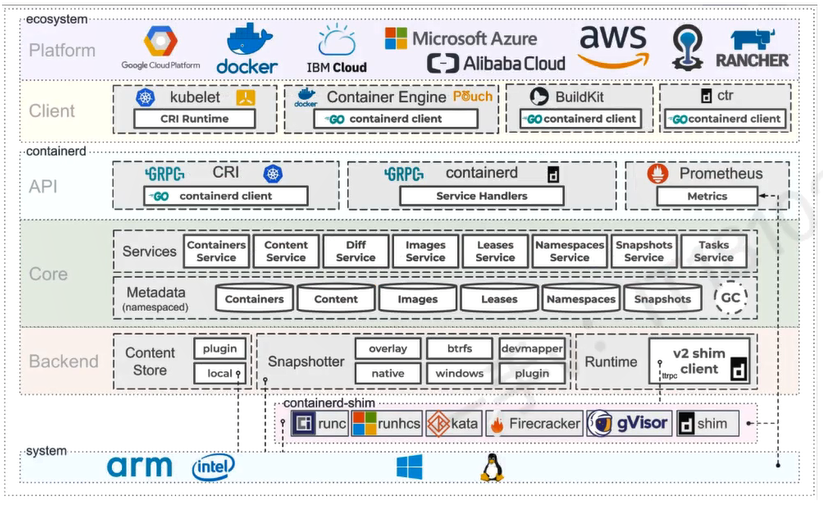
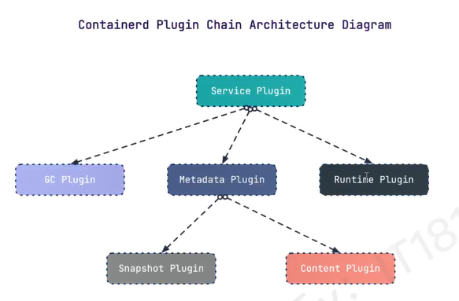
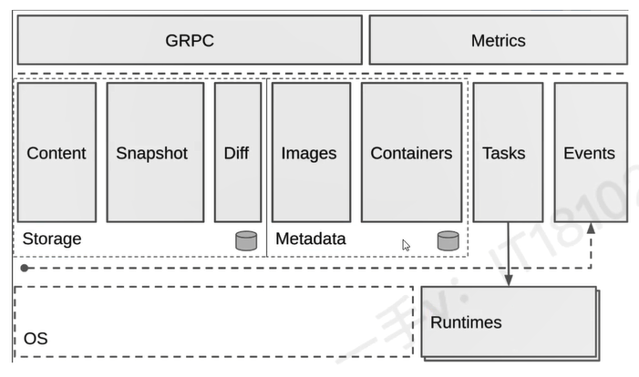

# 架构


Containerd 已经实现了大多数容器管理功能： 容器生命周期管理、容器镜像传输和管理、容器存储与网络管理等





containerd 采用CS架构

- 服务端通过 GRPC 协议提供稳定的API
- 客户端通过调用服务端的API进行操作

为了实现解耦，Containerd 将不同的职责划分给不同的组件，每个组件相当于子系统。连接不同子系统的组件被称为模块。


containerd 两大子系统为
- Bundle：在 containerd 中 Bunndle 包含了配置、元数据 、和跟文件系统数据，可以理解为容器的文件系统。而Bundle 子系统允许用户从镜像中提取和打包 Bundles

- Runtime： Runtime 子系统用来执行 Bundle ，例如创建容器

每一个子系统都由一个或多个模块协作完成（架构图中的Core部分）。每一种类型的模块都以插件的形式集成到 Containerd 中，而且插件之间是相互依赖的


## 常用插件

- Content plugin : 提供对镜像中可寻址内容的访问，所有不可变的内容都被存储在这里
- Snapshot plugin : 用来管理容器镜像文件系统的快照。镜像中每一个 layer 都会被解压成文件系统快照。类似于 Docker 系统中的 graphdriver

- Mertics : 暴露每个组件的监控指标




## 架构缩略

Containerd 被分为三个三块： Stroage 、 Metadata 和 Runtime



# Containerd安装


## YUM方式安装

获取阿里云 YUM 源
```bash
wget -O /etc/yum.repos.d/docker-ce.repo https://mirrors.aliyun.com/docker-ce/linux/centos/docker-ce.repo
```


查看YUM源中的Containerd软件


使用YUM命令安装
```bash
sudo yum -y install containerd
```


## APT方式安装

```bash
sudo apt -y install containerd
```

## 验证安装

验证服务状态
```bash
sudo systemctl list-units --type=service | grep containerd  
```
或者
```bash
what@DESKTOP-I6NTO1D:~$ systemctl status containerd
● containerd.service - containerd container runtime
     Loaded: loaded (/lib/systemd/system/containerd.service; enabled; vendor preset: enable>
     Active: active (running) since Tue 2025-04-08 11:49:19 CST; 2h 35min ago
       Docs: https://containerd.io
    Process: 880 ExecStartPre=/sbin/modprobe overlay (code=exited, status=0/SUCCESS)
   Main PID: 881 (containerd)
      Tasks: 13
     Memory: 21.0M
     CGroup: /system.slice/containerd.service
             └─881 /usr/bin/containerd
```

使用客户端进行验证
```bash
what@DESKTOP-I6NTO1D:~$ ctr version
Client:
  Version:  1.7.24
  Revision:
  Go version: go1.22.2

Server:
  Version:  1.7.24
  Revision:
  UUID: 22848a9b-0ed9-4462-9ef5-80f753cb9b3a
```

## 二进制安装

下载
```bash
wget https://github.com/containerd/containerd/releases/download/v1.7.20/cri-containerd-1.7.20-linux-amd64.tar.gz
```

解压
```bash
sudo tar xf cri-containerd-1.7.20-linux-amd64.tar.gz -C /
```
查看是否安装
```bash
# which命令是Linux和类Unix操作系统中的一个非常实用的命令，用于查找并显示给定命令的绝对路径。
what01@master:~$ which runc 
/usr/local/sbin/runc
what01@master:~$ which containerd 
/usr/local/bin/containerd

```

### 配置文件生成并修改

创建配置文件目录
```bash
mkdir /etc/containerd
```
生成配置文件(默认没有配置文件)
```bash
containerd config default > /etc/containerd/config.toml
```

修改第67行：一般是由于网络原因，需要更换地址

```bash
vi  /etc/containerd/config.toml
sandbox_image = "registry.k8s.io/pause:3.8"
```


继续修改第139行，将其中的 false 改为 true
```bash
SystemdCgroup = false
```
### 启动及开机自启动

设置开机启动并现在启动
```bash
systemctl enable --now containerd

# 如果containerd 已经启动那么/var/run/containerd/ 目录下会出现以下的文件
root@master:/home/what01# ll /var/run/containerd/
总计 0
drwx--x--x  4 root root  120 12月 23 20:50 ./
drwxr-xr-x 39 root root 1080 12月 23 20:50 ../
srw-rw----  1 root root    0 12月 23 20:50 containerd.sock=
srw-rw----  1 root root    0 12月 23 20:50 containerd.sock.ttrpc=
drwx--x--x  2 root root   40 12月 23 20:50 io.containerd.runtime.v1.linux/
drwx--x--x  2 root root   40 12月 23 20:50 io.containerd.runtime.v2.task/

```


验证其版本
```bash
root@master:/home/what01# containerd --version
containerd github.com/containerd/containerd v1.7.20 8fc6bcff51318944179630522a095cc9dbf9f353
```


# Containerd 的文件说明
将二进制文件解压，内容如下：
```bash
what@localhost:~$ tar xf cri-containerd-1.7.20-linux-amd64.tar.gz -C ./a
what@localhost:~$ cd a/
what@localhost:~/a$ ll
total 24
drwxr-xr-x 5 what what 4096 Apr 12 14:59 ./
drwxr-x--- 4 what what 4096 Apr 12 14:59 ../
-rw-r--r-- 1 what what  682 Jul 18  2024 cri-containerd.DEPRECATED.txt
drwxr-xr-x 3 what what 4096 Apr 12 14:59 etc/
drwxr-xr-x 3 what what 4096 Apr 12 14:59 opt/
drwxr-xr-x 3 what what 4096 Jul 18  2024 usr/
```

etc 目录，主要是 containerd 服务管理配置文件及 cni虚拟网卡配置文件

```bash
what@localhost:~/containerd-file$ ls etc/
cni  crictl.yaml  systemd
```

opt 目录，主要是 gce 环境中使用 containerd 配置文件及 cni 插件
```bash
what@localhost:~/containerd-file$ ls opt/
cni  containerd
what@localhost:~/containerd-file$ ls opt/containerd/
cluster
what@localhost:~/containerd-file$ ls opt/containerd/cluster/
gce  version
what@localhost:~/containerd-file$ ls opt/containerd/cluster/gce/
cloud-init  cni.template  configure.sh  env
```
usr 目录，主要是containerd 运行时文件，包含 runc

```bash
what@localhost:~/containerd-file$ ls usr/
local
what@localhost:~/containerd-file$ ls usr/local/
bin  sbin
what@localhost:~/containerd-file$ ls usr/local/bin/
containerd       containerd-shim-runc-v1  containerd-stress  critest      ctr
containerd-shim  containerd-shim-runc-v2  crictl             ctd-decoder
what@localhost:~/containerd-file$ ls usr/local/sbin/
runc
```


## containerd安装位置

查看 containerd 的 service 配置文件
```bash
cat etc/systemd/system/containerd.service
```

如下：
```yaml
# Copyright The containerd Authors.
#
# Licensed under the Apache License, Version 2.0 (the "License");
# you may not use this file except in compliance with the License.
# You may obtain a copy of the License at
#
#     http://www.apache.org/licenses/LICENSE-2.0
#
# Unless required by applicable law or agreed to in writing, software
# distributed under the License is distributed on an "AS IS" BASIS,
# WITHOUT WARRANTIES OR CONDITIONS OF ANY KIND, either express or implied.
# See the License for the specific language governing permissions and
# limitations under the License.

[Unit]
Description=containerd container runtime
Documentation=https://containerd.io
After=network.target local-fs.target dbus.service

[Service]
#uncomment to enable the experimental sbservice (sandboxed) version of containerd/cri integration
#Environment="ENABLE_CRI_SANDBOXES=sandboxed"
ExecStartPre=-/sbin/modprobe overlay
# 这个就是containerd的默认位置
ExecStart=/usr/local/bin/containerd

Type=notify
Delegate=yes
KillMode=process
Restart=always
RestartSec=5
# Having non-zero Limit*s causes performance problems due to accounting overhead
# in the kernel. We recommend using cgroups to do container-local accounting.
LimitNPROC=infinity
LimitCORE=infinity
LimitNOFILE=infinity
# Comment TasksMax if your systemd version does not supports it.
# Only systemd 226 and above support this version.
TasksMax=infinity
OOMScoreAdjust=-999

[Install]
WantedBy=multi-user.target
```

我们的执行文件，默认也在该位置
```bash
what@localhost:~/containerd-file$ ll usr/local/bin/containerd
-rwxr-xr-x 1 what what 38475680 Mar 18 01:52 usr/local/bin/containerd*
```

# Containerd配置文件解析


## 生成默认配置文件

```bash
mkdir /etc/containerd
containerd config default > /etc/containerd/config.toml
```


## 默认的配置文件
```bash
disabled_plugins = []
imports = []
oom_score = 0
plugin_dir = ""
required_plugins = []
root = "/var/lib/containerd"
state = "/run/containerd"
temp = ""
version = 2

[cgroup]
  path = ""

[debug]
  address = ""
  format = ""
  gid = 0
  level = ""
  uid = 0

[grpc]
  address = "/run/containerd/containerd.sock"
  gid = 0
  max_recv_message_size = 16777216
  max_send_message_size = 16777216
  tcp_address = ""
  tcp_tls_ca = ""
  tcp_tls_cert = ""
  tcp_tls_key = ""
  uid = 0

[metrics]
  address = ""
  grpc_histogram = false

[plugins]

  [plugins."io.containerd.gc.v1.scheduler"]
    deletion_threshold = 0
    mutation_threshold = 100
    pause_threshold = 0.02
    schedule_delay = "0s"
    startup_delay = "100ms"

  [plugins."io.containerd.grpc.v1.cri"]
    cdi_spec_dirs = ["/etc/cdi", "/var/run/cdi"]
    device_ownership_from_security_context = false
    disable_apparmor = false
    disable_cgroup = false
    disable_hugetlb_controller = true
    disable_proc_mount = false
    disable_tcp_service = true
    drain_exec_sync_io_timeout = "0s"
    enable_cdi = false
    enable_selinux = false
    enable_tls_streaming = false
    enable_unprivileged_icmp = false
    enable_unprivileged_ports = false
    ignore_deprecation_warnings = []
    ignore_image_defined_volumes = false
    image_pull_progress_timeout = "5m0s"
    image_pull_with_sync_fs = false
    max_concurrent_downloads = 3
    max_container_log_line_size = 16384
    netns_mounts_under_state_dir = false
    restrict_oom_score_adj = false
    sandbox_image = "registry.k8s.io/pause:3.8"
    selinux_category_range = 1024
    stats_collect_period = 10
    stream_idle_timeout = "4h0m0s"
    stream_server_address = "127.0.0.1"
    stream_server_port = "0"
    systemd_cgroup = false
    tolerate_missing_hugetlb_controller = true
    unset_seccomp_profile = ""

    [plugins."io.containerd.grpc.v1.cri".cni]
      bin_dir = "/opt/cni/bin"
      conf_dir = "/etc/cni/net.d"
      conf_template = ""
      ip_pref = ""
      max_conf_num = 1
      setup_serially = false

    [plugins."io.containerd.grpc.v1.cri".containerd]
      default_runtime_name = "runc"
      disable_snapshot_annotations = true
      discard_unpacked_layers = false
      ignore_blockio_not_enabled_errors = false
      ignore_rdt_not_enabled_errors = false
      no_pivot = false
      snapshotter = "overlayfs"

      [plugins."io.containerd.grpc.v1.cri".containerd.default_runtime]
        base_runtime_spec = ""
        cni_conf_dir = ""
        cni_max_conf_num = 0
        container_annotations = []
        pod_annotations = []
        privileged_without_host_devices = false
        privileged_without_host_devices_all_devices_allowed = false
        runtime_engine = ""
        runtime_path = ""
        runtime_root = ""
        runtime_type = ""
        sandbox_mode = ""
        snapshotter = ""

        [plugins."io.containerd.grpc.v1.cri".containerd.default_runtime.options]

      [plugins."io.containerd.grpc.v1.cri".containerd.runtimes]

        [plugins."io.containerd.grpc.v1.cri".containerd.runtimes.runc]
          base_runtime_spec = ""
          cni_conf_dir = ""
          cni_max_conf_num = 0
          container_annotations = []
          pod_annotations = []
          privileged_without_host_devices = false
          privileged_without_host_devices_all_devices_allowed = false
          runtime_engine = ""
          runtime_path = ""
          runtime_root = ""
          runtime_type = "io.containerd.runc.v2"
          sandbox_mode = "podsandbox"
          snapshotter = ""

          [plugins."io.containerd.grpc.v1.cri".containerd.runtimes.runc.options]
            BinaryName = ""
            CriuImagePath = ""
            CriuPath = ""
            CriuWorkPath = ""
            IoGid = 0
            IoUid = 0
            NoNewKeyring = false
            NoPivotRoot = false
            Root = ""
            ShimCgroup = ""
            SystemdCgroup = false

      [plugins."io.containerd.grpc.v1.cri".containerd.untrusted_workload_runtime]
        base_runtime_spec = ""
        cni_conf_dir = ""
        cni_max_conf_num = 0
        container_annotations = []
        pod_annotations = []
        privileged_without_host_devices = false
        privileged_without_host_devices_all_devices_allowed = false
        runtime_engine = ""
        runtime_path = ""
        runtime_root = ""
        runtime_type = ""
        sandbox_mode = ""
        snapshotter = ""

        [plugins."io.containerd.grpc.v1.cri".containerd.untrusted_workload_runtime.options]

    [plugins."io.containerd.grpc.v1.cri".image_decryption]
      key_model = "node"

    [plugins."io.containerd.grpc.v1.cri".registry]
      config_path = ""

      [plugins."io.containerd.grpc.v1.cri".registry.auths]

      [plugins."io.containerd.grpc.v1.cri".registry.configs]

      [plugins."io.containerd.grpc.v1.cri".registry.headers]

      [plugins."io.containerd.grpc.v1.cri".registry.mirrors]

    [plugins."io.containerd.grpc.v1.cri".x509_key_pair_streaming]
      tls_cert_file = ""
      tls_key_file = ""

  [plugins."io.containerd.internal.v1.opt"]
    path = "/opt/containerd"

  [plugins."io.containerd.internal.v1.restart"]
    interval = "10s"

  [plugins."io.containerd.internal.v1.tracing"]

  [plugins."io.containerd.metadata.v1.bolt"]
    content_sharing_policy = "shared"

  [plugins."io.containerd.monitor.v1.cgroups"]
    no_prometheus = false

  [plugins."io.containerd.nri.v1.nri"]
    disable = true
    disable_connections = false
    plugin_config_path = "/etc/nri/conf.d"
    plugin_path = "/opt/nri/plugins"
    plugin_registration_timeout = "5s"
    plugin_request_timeout = "2s"
    socket_path = "/var/run/nri/nri.sock"

  [plugins."io.containerd.runtime.v1.linux"]
    no_shim = false
    runtime = "runc"
    runtime_root = ""
    shim = "containerd-shim"
    shim_debug = false

  [plugins."io.containerd.runtime.v2.task"]
    platforms = ["linux/amd64"]
    sched_core = false

  [plugins."io.containerd.service.v1.diff-service"]
    default = ["walking"]
    sync_fs = false

  [plugins."io.containerd.service.v1.tasks-service"]
    blockio_config_file = ""
    rdt_config_file = ""

  [plugins."io.containerd.snapshotter.v1.aufs"]
    root_path = ""

  [plugins."io.containerd.snapshotter.v1.blockfile"]
    fs_type = ""
    mount_options = []
    root_path = ""
    scratch_file = ""

  [plugins."io.containerd.snapshotter.v1.btrfs"]
    root_path = ""

  [plugins."io.containerd.snapshotter.v1.devmapper"]
    async_remove = false
    base_image_size = ""
    discard_blocks = false
    fs_options = ""
    fs_type = ""
    pool_name = ""
    root_path = ""

  [plugins."io.containerd.snapshotter.v1.native"]
    root_path = ""

  [plugins."io.containerd.snapshotter.v1.overlayfs"]
    mount_options = []
    root_path = ""
    sync_remove = false
    upperdir_label = false

  [plugins."io.containerd.snapshotter.v1.zfs"]
    root_path = ""

  [plugins."io.containerd.tracing.processor.v1.otlp"]

  [plugins."io.containerd.transfer.v1.local"]
    config_path = ""
    max_concurrent_downloads = 3
    max_concurrent_uploaded_layers = 3

    [[plugins."io.containerd.transfer.v1.local".unpack_config]]
      differ = ""
      platform = "linux/amd64"
      snapshotter = "overlayfs"

[proxy_plugins]

[stream_processors]

  [stream_processors."io.containerd.ocicrypt.decoder.v1.tar"]
    accepts = ["application/vnd.oci.image.layer.v1.tar+encrypted"]
    args = ["--decryption-keys-path", "/etc/containerd/ocicrypt/keys"]
    env = ["OCICRYPT_KEYPROVIDER_CONFIG=/etc/containerd/ocicrypt/ocicrypt_keyprovider.conf"]
    path = "ctd-decoder"
    returns = "application/vnd.oci.image.layer.v1.tar"

  [stream_processors."io.containerd.ocicrypt.decoder.v1.tar.gzip"]
    accepts = ["application/vnd.oci.image.layer.v1.tar+gzip+encrypted"]
    args = ["--decryption-keys-path", "/etc/containerd/ocicrypt/keys"]
    env = ["OCICRYPT_KEYPROVIDER_CONFIG=/etc/containerd/ocicrypt/ocicrypt_keyprovider.conf"]
    path = "ctd-decoder"
    returns = "application/vnd.oci.image.layer.v1.tar+gzip"

[timeouts]
  "io.containerd.timeout.bolt.open" = "0s"
  "io.containerd.timeout.metrics.shimstats" = "2s"
  "io.containerd.timeout.shim.cleanup" = "5s"
  "io.containerd.timeout.shim.load" = "5s"
  "io.containerd.timeout.shim.shutdown" = "3s"
  "io.containerd.timeout.task.state" = "2s"

[ttrpc]
  address = ""
  gid = 0
  uid = 0
```

## 配置文件解析


### 全局配置

```toml
root = "/var/lib/containerd"
state = "/run/containerd"
```
- `root` : 指定 Containerd 存储数据的根目录，镜像、快照等数据都会存放在这里
- `state` : 指定 Containerd 存储运行时状态信息的目录


### 日志配置（[debug] 和 [metrics]）

```toml
[debug]
  address = "/run/containerd/debug.sock"
  level = "info"

[metrics]
  address = "127.0.0.1:1338"
  grpc_histogram = false
```

- [debug]：
  - address：指定调试服务的监听地址。
  - level：设定日志的级别，可选择的值有 debug、info、warn、error 等。

- [metrics]：
  - address：指定 metrics 服务的监听地址。(Metrics 服务指的是用于收集、存储、分析和展示系统或应用程序相关指标数据的服务)
  - grpc_histogram：决定是否启用 gRPC 直方图。

### CRI 插件配置（[plugins."io.containerd.grpc.v1.cri"]）
```toml
[plugins."io.containerd.grpc.v1.cri"]
  sandbox_image = "registry.k8s.io/pause:3.8"
  [plugins."io.containerd.grpc.v1.cri".containerd]
    default_runtime_name = "runc"
    [plugins."io.containerd.grpc.v1.cri".containerd.runtimes]
      [plugins."io.containerd.grpc.v1.cri".containerd.runtimes.runc]
        runtime_type = "io.containerd.runc.v2"
```

- sandbox_image：指定 Pod 沙箱容器所使用的镜像。
- default_runtime_name：设定默认的容器运行时，通常是 runc。
- runtime_type：指定运行时的类型。

### 镜像仓库配置（[plugins."io.containerd.grpc.v1.cri".registry]）

```toml
[plugins."io.containerd.grpc.v1.cri".registry]
  [plugins."io.containerd.grpc.v1.cri".registry.mirrors]
    [plugins."io.containerd.grpc.v1.cri".registry.mirrors."docker.io"]
      endpoint = ["https://registry-1.docker.io"]
```

- [plugins."io.containerd.grpc.v1.cri".registry.mirrors]：用于配置镜像仓库的镜像源。你可以为不同的镜像仓库指定不同的镜像源地址，这样在拉取镜像时，Containerd 会先从镜像源地址尝试拉取。

### 存储配置（[plugins."io.containerd.snapshotter.v1.overlayfs"]）
```toml
[plugins."io.containerd.snapshotter.v1.overlayfs"]
  root_path = ""
  upperdir = ""
  workdir = ""
```
- root_path：指定 overlayfs 快照存储的根目录。
- upperdir 和 workdir：分别指定 overlayfs 的上层目录和工作目录。

### 配置文件的使用与生效
在修改完配置文件之后，你需要重启 Containerd 服务，使新的配置生效：
```bash
sudo systemctl restart containerd
```


设置开机自启动
```bash
sudo systemctl enable containerd
```
查看版本
```bash
what@DESKTOP-I6NTO1D:~$ ctr version
Client:
  Version:  1.7.24
  Revision:
  Go version: go1.22.2

Server:
  Version:  1.7.24
  Revision:
  UUID: 22848a9b-0ed9-4462-9ef5-80f753cb9b3a
```

# 安装 runc

从 github 下载 amd64 的安装包
```bash
wget https://github.com/opencontainers/runc/releases/download/v1.3.0-rc.2/runc.amd64
```

安装 runc
```bash
mv runc.amd64 /usr/sbin/runc
```
添加可执行权限

```bash
chmod +x /usr/sbin/runc
```

使用 runc 验证是否安装成功
```bash
runc -v
```

## containerd 与 runc 连接

# 镜像管理

- docker 使用 docker images 管理镜像
- 单机 containerd 使用 ctr images 管理镜像。containerd本身的 CLI
- k8s 中的 containerd 使用 crictl images 命令管理镜像， kubernetes 社区专用的 CLI工具


## 查看帮助
```bash
what@DESKTOP-I6NTO1D:~$ ctr images --help
NAME:
   ctr images - Manage images

USAGE:
   ctr images command [command options] [arguments...]

COMMANDS:
   check                    Check existing images to ensure all content is available locally
   export                   Export images
   import                   Import images
   list, ls                 List images known to containerd
   mount                    Mount an image to a target path
   unmount                  Unmount the image from the target
   pull                     Pull an image from a remote
   push                     Push an image to a remote
   prune                    Remove unused images
   delete, del, remove, rm  Remove one or more images by reference
   tag                      Tag an image
   label                    Set and clear labels for an image
   convert                  Convert an image
   usage                    Display usage of snapshots for a given image ref

OPTIONS:
   --help, -h  show help
```


## 查看镜像
```bash
# 方式1
what@DESKTOP-I6NTO1D:~$ ctr images ls
REF TYPE DIGEST SIZE PLATFORMS LABELS

# 方式2
what@DESKTOP-I6NTO1D:~$ ctr image ls
REF TYPE DIGEST SIZE PLATFORMS LABELS

# 方式3
what@DESKTOP-I6NTO1D:~$ ctr i ls
REF TYPE DIGEST SIZE PLATFORMS LABELS

# 方式4
what@DESKTOP-I6NTO1D:~$ ctr i list
REF TYPE DIGEST SIZE PLATFORMS LABELS
```

## 下载镜像

containerd 支持 oci 标准的镜像，所以可以直接使用 docker 官方或 dockerfile 构建的镜像
```bash
ctr images pull <镜像仓库地址>/<镜像名称>:<标签>
```

示例：从 Docker Hub 拉取 nginx:latest 镜像。
```bash
ctr images pull docker.io/library/nginx:latest
```

## 推送镜像

```bash
ctr images push <镜像仓库地址>/<镜像名称>:<标签>
```
示例：将本地的 nginx:latest 镜像推送到私有镜像仓库。
```bash
ctr images push myregistry.example.com/nginx:latest
```

## 删除本地镜像
```bash
ctr images rm <镜像名称>:<标签>
```
示例：删除本地的 nginx:latest 镜像。
```bash
ctr images rm docker.io/library/nginx:latest
```
## 查看镜像详细信息
```bash
ctr images info <镜像名称>:<标签>
```
示例：查看 nginx:latest 镜像的详细信息。
```bash
ctr images info docker.io/library/nginx:latest
```

## 导出镜像
```bash
ctr images export <文件名>.tar <镜像名称>:<标签>
```
示例：将 nginx:latest 镜像导出为 nginx.tar 文件。
```bash
ctr images export nginx.tar docker.io/library/nginx:latest
```

## 导入镜像
```bash
ctr images import <文件名>.tar
```
示例：从 nginx.tar 文件导入镜像。
```bash
ctr images import nginx.tar
```

## 为镜像打新标签

```bash
ctr images tag <旧镜像名称>:<旧标签> <新镜像名称>:<新标签>
```

假设你有一个名为 docker.io/library/nginx:latest 的镜像，现在要将其重命名为 myregistry.example.com/my-nginx:v1，可以执行以下命令：

```bash
ctr images tag docker.io/library/nginx:latest myregistry.example.com/my-nginx:v1
```

## 挂载镜像

这里是想知道镜像包含什么内容

```bash
ctr images mount  docker.io/library/nginx:latest /mnt
```

# 容器管理
```bash
root@DESKTOP-I6NTO1D:/home/what# ctr c --help
NAME:
   ctr containers - Manage containers

USAGE:
   ctr containers command [command options] [arguments...]

COMMANDS:
   create                   Create container
   delete, del, remove, rm  Delete one or more existing containers
   info                     Get info about a container
   list, ls                 List containers
   label                    Set and clear labels for a container
   checkpoint               Checkpoint a container
   restore                  Restore a container from checkpoint

OPTIONS:
   --help, -h  show help
```

## 创建静态容器

```bash
ctr containers create [选项] <镜像名称> <容器名称> [命令] [参数...]
# 或简写：
ctr c create [选项] <镜像名称> <容器名称> [命令] [参数...]
```


使用 `ctr containers create` 命令创建容器后，容器并没有处于运行状态，只是一个静态的容器，只包含了所需的资源及配置的数据结构。 例如： namespace 、 rootfs 和容器的配置都已经初始化成功了，只是用户进程（例如nginx）还没有启动，还需要使用 `ctr tasks` 命令才能获取一个动态容器


示例
```bash
ctr c create docker.io/library/nginx:latest nginx1
```


## 创建动态容器

`ctr run` 是 `containerd` 中 `ctr` 工具的一个常用命令，它结合了创建容器和启动任务的操作，能够快速地从指定镜像创建并运行一个容器。

```bash
ctr run [flags] <image> <container-id> [command] [args...]
```
- `[flags]` ：是可选的命令行标志，用于指定各种配置选项。
- `<image>` ：要使用的容器镜像的引用，例如 docker.io/library/nginx:latest。
- `<container-id>` ：为新容器指定的唯一标识符。
- `[command]` ：在容器启动后要执行的命令，可选参数。
- `[args...]` ：传递给命令的参数，可选参数。


将静态容器启动为动态容器

```bash
ctr task start -d nginx1
```

直接运行一个动态容器
```bash
sudo ctr run -d --net-host docker.io/library/nginx:alpine nginx3
```
说明
- -d 代表后台运行
- --net-host 代表使用主机网络


## 查看容器

```bash
root@DESKTOP-I6NTO1D:/home/what# ctr c ls
CONTAINER    IMAGE    RUNTIME
```

## 查看任务

```bash
root@DESKTOP-I6NTO1D:/home/what# ctr task ls
TASK    PID    STATUS
```

## 查看容器信息
```bash
ctr c info nginx1
```

## 进入正在运行的容器

```bash
sudo ctr task exec \
    --exec-id 1 \    # 指定唯一的执行会话 ID
    nginx2 \         # 容器名称
    /bin/sh          # 要执行的命令（此处启动 Shell）
```

## 暂停容器
```bash
ctr tasks pause nginx3
```
查看容器状态
```bash
what@DESKTOP-I6NTO1D:~$ ctr tasks ls
TASK      PID     STATUS
nginx1    1139    RUNNING
nginx2    1307    RUNNING
nginx3    2065    PAUSED
```

## 恢复容器
```bash
ctr tasks resume nginx3
```
查看容器状态
```bash
what@DESKTOP-I6NTO1D:~$ ctr tasks ls
TASK      PID     STATUS
nginx1    1139    RUNNING
nginx2    1307    RUNNING
nginx3    2065    RUNNING
```


## 停止容器
```bash
ctr tasks kill   nginx3
```

查看容器状态
```bash
what@DESKTOP-I6NTO1D:~$ ctr tasks ls
TASK      PID     STATUS
nginx1    1139    RUNNING
nginx2    1307    RUNNING
nginx3    2065    STOPPED
```

## 删除容器


```bash
ctr tasks delete nginx1
```
必须先停止 tasks 或删除 task ，在删除容器


# Namespace 管理

 
## 查看

查看所有命名空间

```bash
what@DESKTOP-I6NTO1D:~/harbor-i/harbor$ ctr namespace ls
NAME    LABELS
default
```
查看命名空间下的镜像
```bash
ctr -n default i ls
```


## 创建
```bash
ctr namespace create aaa
```
查看
```bash
what@DESKTOP-I6NTO1D:~/harbor-i/harbor$ ctr namespace ls
NAME    LABELS
aaa
default
```


## 删除

```bash
ctr namespace rm  aaa
```
rm - remove
删除的前提是，该 namespace 中没有任何相关数据

## 指定namespace 创建容器

```bash
sudo ctr -n aaa run -d --net-host docker.io/library/nginx:alpine nginx1
```

# Containerd network 管理


## CNI 配置文件
```json
{
    // CNI 版本号，这里指定使用的是 1.0.0 版本
    "cniVersion": "1.0.0",
    // 该网络配置的名称，用于标识这个特定的网络配置
    "name": "containerd-net",
    // 插件列表，定义了要使用的 CNI 插件及其配置
    "plugins": [{
            // 第一个插件的类型为 bridge，即使用桥接网络模式
            "type": "bridge",
            // 桥接设备的名称，这里使用 cni0 作为桥接设备
            "bridge": "cni0",
            // 是否将该桥接设备作为网关，设置为 true 表示将其作为网关
            "isGateway": true,
            // 是否启用 IP 伪装（NAT）功能，设置为 true 表示启用
            "ipMasq": true,
            // 是否开启混杂模式，设置为 true 表示开启
            "promiscMode": true,
            // IP 地址管理相关配置
            "ipam": {
                // IP 地址管理的类型，这里使用 host-local 方式
                "type": "host-local",
                // 可用的 IP 地址范围列表
                "ranges": [
                    [{
                            // 第一个 IPv4 子网范围，这里使用 10.88.0.0/16 网段
                            "subnet": "10.88.0.0/16"
                    }],
                    [{
                            // 第一个 IPv6 子网范围，这里使用 2001:4860:4860::/64 网段
                            "subnet": "2001:4860:4860::/64"
                    }]
                ],
                // 路由规则列表
                "routes": [
                    {
                        // 第一个路由规则，将所有 IPv4 流量（0.0.0.0/0）转发到默认网关
                        "dst": "0.0.0.0/0"
                    },
                    {
                        // 第二个路由规则，将所有 IPv6 流量（::/0）转发到默认网关
                        "dst": "::/0"
                    }
                ]
            }
        },
        {
            // 第二个插件的类型为 portmap，用于实现端口映射功能
            "type": "portmap",
            // 该插件支持的功能，这里设置为支持端口映射
            "capabilities": {
                "portMappings": true
            }
        }
    ]
}
```


## 使用插件和脚本创建cni网桥

下载 cni 源码
<https://github.com/containernetworking>

下载插件
<https://github.com/containernetworking/plugins>


首先解压
```bash
tar xf xxxx-cni
tar xf xxxx-cni-plugins
```

随后将 创建移动到 `cni-plugins` 目录（没有创建即可）

```bash
cd cni/scripts

sudo CNI_PATH=/home/what/cni-plugins ./priv-net-run.sh  echo "hello world"
```

配置文件,将 `/etc/cni/net.d/10-containerd-net.conflist` 复制一份 ,后缀名修改为 `conf`
```bash
what@DESKTOP-I6NTO1D:/etc/cni/net.d$ ll
total 16
drwxr-xr-x 2 root root 4096 Apr 29 08:53 ./
drwxr-xr-x 3 root root 4096 Mar 18 01:53 ../
-rw-r--r-- 1 root root  604 Apr 29 08:53 10-containerd-net.conf
-rw-r--r-- 1 root root  604 Mar 18 01:53 10-containerd-net.conflist
```

随后使用 ip a s 命令查看网络,可以看到新增的 cni0 设备

```bash
3: cni0: <NO-CARRIER,BROADCAST,MULTICAST,PROMISC,UP> mtu 1500 qdisc noqueue state DOWN group default qlen 1000
    link/ether f6:36:5b:01:ea:d8 brd ff:ff:ff:ff:ff:ff
    inet 10.88.0.1/16 brd 10.88.255.255 scope global cni0
       valid_lft forever preferred_lft forever
    inet6 2001:4860:4860::1/64 scope global
       valid_lft forever preferred_lft forever
    inet6 fe80::f436:5bff:fe01:ead8/64 scope link
       valid_lft forever preferred_lft forever
```

然后使用 ip r s 命令查看路由，可以看到新增的路由
```bash
default via 172.21.176.1 dev eth0 proto kernel
10.88.0.0/16 dev cni0 proto kernel scope link src 10.88.0.1 linkdown 
172.21.176.0/20 dev eth0 proto kernel scope link src 172.21.183.250
```
## 为容器配置网络功能