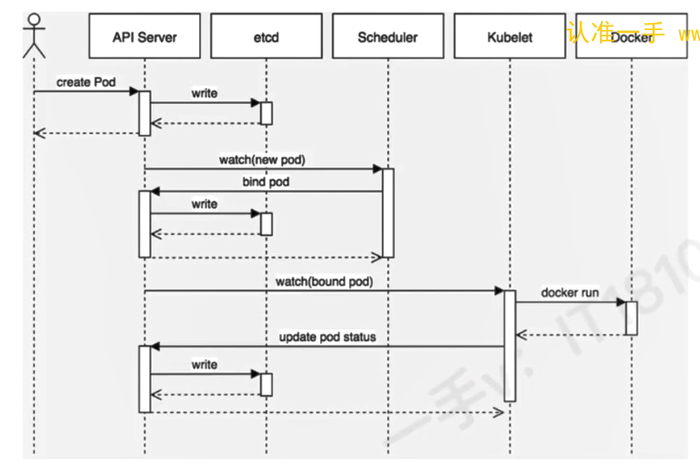
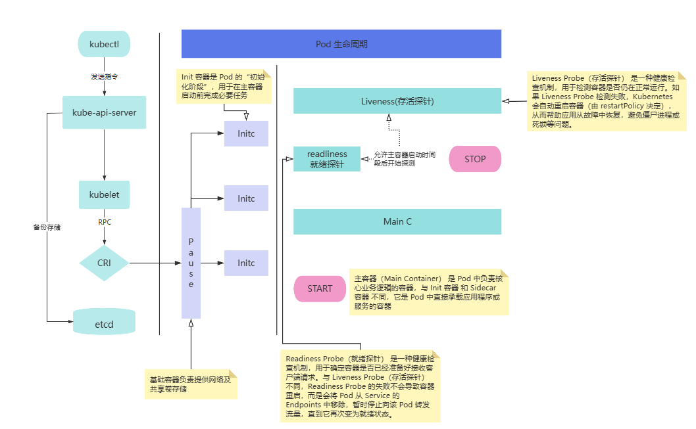
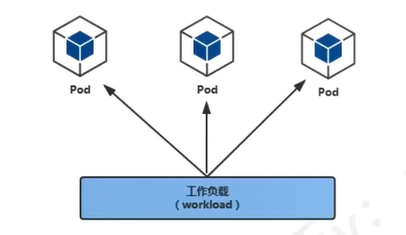

# kubernetes 核心概念


## Pod


Pod 是可以在Kubernetes 中创建和管理的、最小的可部署的计算单元

Pod 其中包含着一组（一个或多个）容器；这些容器共享存储、网络平以及怎样运行这些容器的声明。

Pod 就像一台物理服务器一样，包含一个或多个应用容器，这些容器中运行着用户应用程序。

`Pod[ Container[应用程序，应用程序]，Container[应用程序，应用程序]]`

## Controller


Controller 是在 Kubernetes 中用于管理和运行 Pod 的对象。

在 Kubernetes 中，控制器通过监控集群的公共状态，并致力于将当前状态转变为期望状态。

一个控制器至少追踪一种类型的 Kubernetes 资源，这些对象有一个代表期望状态的 spec 字段，该控制器负责确保其当前状态接近期望状态。

不同类型的控制器所实现的控制方式不一样，例如：

- **deployment： 部署无状态应用**
  - 部署无状态应用：认为 pod 都一样，没有顺序要求，不用考虑在哪个node运行，随意进行扩展和伸缩
  - 管理Pod和ReplicaSet
  - 部署、滚动升级等
  - 典型应用： web服务、分部署服务等

- **Statefult： 部署有状态应用**
  - 有状态应用：每个Pod都独立运行，保持Pod启动顺序和唯一性，有唯一的网络标识符，持久存储、有序，比如mysql主从，主机名称固定，而且扩容以及升级等操作也是按照顺序进行的操作


- **DaemonSet： 部署守护进程**
  - DaemonSet 保证在每个Node 上都运行一个容器副本，常用来部署一些集群的日志、监控或者其他系统管理的应用，新加入的Node也同样运行在一个node里面
- **job： 一次性任务**
  - job负责批量处理短暂的一次性任务，它保证批处理任务的一个或多个pod成功结束
- **Cronjob**： 周期性定时任务


## Label

label 是附着到 object（例如pod） 上的键值对。 可以在创建 object 的时候指定，也可以在 object 创建后随时指定。 Label 的值对于系统并没有意义，只是对用户有意义。

一个 Label 是 key=value 的键值对， key 和 value 均由用户自行指定。

Label 可以附加到各种资源对象上，例如 Node 、 Pod 、Service 、RC 等， 一个资源对象可以定义任意数量的资源对象。 同一个 label 也可以被添加到任意数量的资源对象上去。

### 常用的 Label 标签：

- 版本标签：
  - "release": "stable" ,"release": "canary"
- 环境标签
  - "environment": "dev" ,"environment": "production" 
- 架构标签
  - "tier": "frontend" , "tier": "backend" , "tier": "middleware"
- 分区标签
  - "partition": "customerA" ,"partition": "customerB" 
- 质量管控标签
  - "track": "daily", "track": "weekly"


### Label语法及字符集


Label key 的组成：
- 不得超过 63 个字符
- 可以使用前缀，使用 / 分隔，前缀必须是DNS子域，不得超过 253个字符，系统中自动化组件必须指定前缀， `kubernetes.io/` 由kubernetes保留
- 起始必须是字母或数字、中间可以有连字符、下划线和 点


Label Value的组成
- 不超过63个字符
- 起始必须是字母或数字、中间可以有连字符、下划线和 点


### Label Selector

通过 label Selector 客户端/用户 可以指定一个 object 集合，通过 label selector 对 Object的集合进行操作


label-selector有量中类型
- equality-based(基于等式): 可以使用 `=` , `==` , `!=` 操作符，可以使用逗号分割多个表达式
- set-based（基于集合）： 可以使用 in 、 notin 、 ! 操作符，另外可以没有操作符直接写出某个 label 的 key ，表示过滤某个 key 的 object 而不管该 key 的 value 是何值， ! 表示没有该 label 的object


## Service

在 Kubernetes（K8s）中，​​Service（服务）​​ 是一种抽象层，用于定义一组 Pod 的逻辑集合以及访问它们的策略。它为动态变化的 Pod 提供稳定的访问入口，解决了 Pod IP 不固定、直接暴露 Pod 风险高等问题，是微服务架构中实现服务发现和负载均衡的核心组件。

Service 的核心是一组 iptables 或 ipvs 规划。

### Service 组件在哪里运行

**Service 是 Kubernetes 的抽象资源​**
- Service 是一个 KubernetesAPI 对象(kind: Service),存储在 etcd 中
- Service 由 kube-apiserver 管理，定义撸如何访问一组 pod


**Service 的代理机制（kube-proxy）​**

- kube-proxy， 是运行在每个 Node 上的守护进程，负责实现 Service 的负载均衡和流量转发
- 它监听 Kubernetes API ，当Service 或 pod 发生变化时， 动态更新节点上的 iptables/ipvs 规则


## Endpoints

在 Kubernetes 中，​​Endpoints​​ 是一个核心资源对象，用于存储 ​​Service 对应的后端 Pod 的 IP 和端口列表​​。它的主要作用是让 Service 知道应该将流量转发到哪些 Pod，从而实现服务发现和负载均衡。

###  Endpoints 的作用​

1. 存储Service的后端Pod列表
   - 当 Service 通过 selector 匹配到 Pod 时，Kubernetes 会自动创建一个对应的 ​​Endpoints​​ 对象，记录这些 Pod 的 IP 和端口。
   
     ```bash
     kubectl get endpoints nginx-service

     NAME             ENDPOINTS                     AGE
     nginx-service    10.244.1.2:80,10.244.2.3:80   5m
     ```
    - 如果 pod 发生变化（如新增、删除、重启） Endpoints 会自动更新，确保Service指向正确的 pod
2. 实现服务发现
   - 其他 pod 或外部客户端，访问后端 pod ，而无需关心 pod 的具体 IP，（Endpoints 会动态维护 pod 列表）
 
 3. 负载均衡基础
    - kube-proxy 根据 Endpoints 中的 pod 列表，在节点上配置 iptables/ipvs 实现流量分发


- Service 通过标签选择器（Label Selector）关联一组 Pod，并自动生成对应的 Endpoints 对象，记录后端 Pod 的 IP 和端口。
- 当 Pod 变化时，Endpoints 会动态更新。


### 工作流程
1. 用户创建一个 Service，并指定 selector（如 app=nginx）。
2. Kubernetes 自动创建对应的 Endpoints 对象，填充匹配的 Pod IP 和端口。
3. kube-proxy 监听 Endpoints 变化，并在节点上配置 iptables/ipvs 规则，实现负载均衡。
4. 客户端访问 Service 的 ClusterIP，流量被转发到 Endpoints 中的 Pod。

## DNS


为 kubernetes 集群内资源对象的访问提供域名解析，这样可以实现通过DNS名称，而非IP地址来访问服务：
- 实现集群内 Service 名称解析
- 实现集群内Pod内Container中应用访问互联网提供域名解析


# Kubernetes 核心概念之间的关系

## Pod与Controller

pod 是通过 Controller 实现应用的运维，比如伸缩、滚动升级等待。pod 和 controller 通过 label 标签建立关系。


master 节点 中存在 ReplicationController(副本控制器-已过时被Deployment 替代)，每个Pod都存在标签，通过标签选择器，副本控制器就可以对pod进行管理和控制


## Pod与Service

service 是为了防止 pod 失联，提供的服务发现服务，类似于微服务的注册中心。定义一组 pod 的访问策略。可以为一组具有相同功能的容器应用提供一个统一的入口地址，并将请求负载分发到后端的各个应用上。

Service 通过 Selector 来管控对应的 pod。 根据 label 和 selector 建立关联，通过 service 实现 pod 的负载均衡。


```bash
# 查看service
what@DESKTOP-I6NTO1D:~$ kubectl get service
NAME         TYPE        CLUSTER-IP   EXTERNAL-IP   PORT(S)   AGE
kubernetes   ClusterIP   10.96.0.1    <none>        443/TCP   16d


# 查看service
what@DESKTOP-I6NTO1D:~$ kubectl describe svc  kubernetes
Name:                     kubernetes
Namespace:                default
Labels:                   component=apiserver
                          provider=kubernetes
Annotations:              <none>
Selector:                 <none>
Type:                     ClusterIP
IP Family Policy:         SingleStack
IP Families:              IPv4
IP:                       10.96.0.1
IPs:                      10.96.0.1
Port:                     https  443/TCP
TargetPort:               6443/TCP
Endpoints:                192.168.65.3:6443
Session Affinity:         None
Internal Traffic Policy:  Cluster
Events:                   <none>


# 查看endpoints
what@DESKTOP-I6NTO1D:~$ kubectl get endpoints
NAME         ENDPOINTS           AGE
kubernetes   192.168.65.3:6443   16d
```

## Service与DNS

通过DNS实现对Service的名称解析，以此达到访问后端Pod 的目的

```bash
what@DESKTOP-I6NTO1D:~$ kubectl get endpoints -n kube-system
NAME                 ENDPOINTS                                            AGE
docker.io-hostpath   <none>                                               17d
kube-dns             10.1.0.50:53,10.1.0.51:53,10.1.0.50:53 + 3 more...   17d
```


# 基于Kubernetes 集群容器化应用的微服务


# Pod

## 工作负载

工作负载（workload）是在 kubernetes 集群中运行的应用程序，无论你的工作负载是单一服务还是多个同一工作的服务构成，在 kubernetes 中都可以使用 pod 来运行它


workloads 分为 pod 与 controllers
- pod 通过控制器实现应用的运行，如何伸缩，升级等
- controllers 在集群中管理 pod
- pod 与 控制器 之间通过 label-selector 相关联，是唯一的关联方式


## Pod 介绍


### Pod定义

- Pod(豌豆荚) 是 kubernetes 集群管理（创建、部署）与调度的最小计算单元，表示处于运行状态的一组容器
- 一个 Pod 可以封装一个或多个容器（主容器或sidecar边车容器）
- 一个pod内的多个容器之间共享部分命名空间，例如 net namespace 、 UTS Namespace 及存储资源
- 用户 pod 默认会被调度运行在 node 节点（不运行在 master 节点，但是也有例外情况）
- pod 内的 IP 不是固定的，集群外不能直接访问 pod


### Pod分类

- **静态Pod** ： 也称之为 `无控制器管理的自主式pod` , 直接由特定节点上的 kubectl 守护进程管理，不需要 API 服务器看到它们，尽管大多 pod 都是有 控制平面 管理的，对于 静态的 pod 而言， kubectl 直接监控每个 pod ，并在失效时重启

### Pod查看

```bash
# 不指定 namesapce，默认是名为 default 的 namespace
kubectl get pod

kubectl get pods

# 指定命名空间
kubectl get pod -n kube-system
```

### YAML格式查看

```bash
kubectl explain namespace

kubectl explain pod
kubectl explain pod.spec
kubectl explain pod.spec.containers
```

## Pod的基础操作

### 创建一个名为 pod-nginx的pod
```bash
kubectl run nginx1 --image=nginx:1.15-alpine
```

### 验证
```bash
kubectl get pods
NAME     READY   STATUS    RESTARTS   AGE
nginx1   1/1     Running   0          4h
```

### YAML创建pod

```yaml
apiVersion: v1
kind: Pod
metadata:
  name: pod-stress
spec:
  containers:
    - name: c1
      image: polinux/stress
      command: ["stress"]
      args: ["--vm", "1" ,"--vm-bytes","150m" ,"--vm-hang","1"]

# polinux/stress 这个镜像用于压力测试
```

创建pod
```bash
kubectl apply -f pod1.yaml
```


### 查看pod描述
```bash
kubectl describe pod pod-stress -n default


Events:
  Type     Reason     Age                   From               Message
  ----     ------     ----                  ----               -------
  Normal   Scheduled  6m36s                 default-scheduler  Successfully assigned default/pod-stress to docker-desktop
  Warning  Failed     6m21s                 kubelet            Failed to pull image "polinux/stress": Error response from daemon: Get "https://registry-1.docker.io/v2/": context deadline exceeded
  Warning  Failed     6m21s                 kubelet            Error: ErrImagePull
  Normal   BackOff    6m20s                 kubelet            Back-off pulling image "polinux/stress"
  Warning  Failed     6m20s                 kubelet            Error: ImagePullBackOff
  Normal   Pulling    6m8s (x2 over 6m36s)  kubelet            Pulling image "polinux/stress"
  Normal   Pulled     5m57s                 kubelet            Successfully pulled image "polinux/stress" in 11.823s (11.823s including waiting). Image size: 9744175 bytes.
  Normal   Created    5m56s                 kubelet            Created container: c1
  Normal   Started    5m56s                 kubelet            Started container c1
```
### 删除pod


#### 单个pod删除


方法一
```bash
kubectl delete pod pod-stress
```


方法二
```bash
kubectl delete -f pod1.yaml
```

#### 删除多个pod

方法一： 后接多个pod名称
```bash
kubectl delete pod pod_name_1 pod_name_2 pod_name_3
```
方法二： 通过awk截取要删除的pod 名称，然后管道给 xargs
```bash
kubectl get pods | awk 'NR>1 {print $1}' | xargs kubectl delete pod
```
方法三：如果要删除的pod都在同一个非default的命名空间，可以直接删除命名空间
```bash
kubectl delete ns xxx
```

### 镜像拉取策略

由 imagePullPolicy 参数控制
- Always ： 不管本地有没有镜像，都要从仓库中下载
- Never ：只使用本地镜像
- IfNotPresent : 如果本地存在就直接使用，不存在才从仓库下载

默认的策略
- 当镜像版本标签是 latest ，默认策略就是 Always
- 如果指定特定版本，默认拉取策略就是 IfNotPresent


### pod 资源限制

```yaml
apiVersion: v1
kind: Pod
metadata:
  name: pod3
spec:
  restartPolicy: OnFailure  # 可选 Always / OnFailure / Never
  containers:
    - name: c1
      image: polinux/stress
      # 优先使用本地镜像
      imagePullPolicy: IfNotPresent
      resources:
        limits:
          memory: "200Mi"
        requests:
          memory: "100Mi"
      command: ["stress"]
      # 产生一个进程分配好 300M内存，1秒后释放
      args: ["--vm", "1" ,"--vm-bytes","300m" ,"--vm-hang","1"]

# polinux/stress 这个镜像用于压力测试
```
查看 pod
```bash
kubectl get pods
NAME   READY   STATUS      RESTARTS      AGE
pod2   1/1     Running     0             2m50s
pod3   0/1     OOMKilled   5 (84s ago)   2m47s
```
发现 pod3 为 OOMKilled 状态


重启策略如下
- Always（默认）：无论容器以何种状态退出，都会自动重启。适用于 Deployment、ReplicaSet 等控制器管理的 Pod。
- OnFailure：仅当容器以非 0 状态码退出（即异常退出）时才重启。常用于 Job 等一次性任务。
- Never：无论容器如何退出，都不会自动重启。
### pod执行命令

kubectl exec pod名称 -c 容器名 -- 命令
- `-c 容器名` 为可选项，如果pod 中只有一个容器则不用指定
- 如果1个pod中多个容器不指定则为第一个

```bash
what@DESKTOP-I6NTO1D:~$ kubectl exec pod4 -c c1 -- touch /111
what@DESKTOP-I6NTO1D:~$ kubectl exec pod4 -c c1 -- ls /111
/111
```


### 和容器交互操作

与 docker exec 一致

```bash
what@DESKTOP-I6NTO1D:~$ kubectl exec -it  pod4 -c c1 -- /bin/bash
bash-5.0# ls
111    dev    home   media  opt    root   sbin   sys    usr
bin    etc    lib    mnt    proc   run    srv    tmp    var
bash-5.0#
```


## Pod调度




1. 通过 `kubectl` 命令应用资源清单文件(yaml)，向 `api Server` 发送一个 `create pod` 请求
   
2. api server 接收到 `create pod` 请求后，生成一个包含创建信息资源清单文件
3. api server 将资源清单文件信息写入 etcd 数据库
4. Schedule 启动后会一直 watch Api Server 获取 podSpec.NodeName 为空的 pod，即判断 pod.spec.Node == null. 如果未 null，表示这个 pod 请求时新的，需要创建，因此首先进行调度计算（1. 过滤不满足条件的，2.选择优先级高的）,找到合适的 node ，然后将信息在 etcd 数据库中更新分配结果 pod。spec.Node = NodeA,即设置一个具体的节点
5. kubectl 通过 watch etcd 数据库， 发现有新的 Node 出现，如果Node与所在的节点编号相同，则说明这个pod 是 Scheduler 分配给自己的，则调用 node 中的 container runtime 创建 container ，并将创建后的结果返回到 api server 用于更新 etcd 数据库中的状态

### 调度约束方法

我们为了实现容器主机资源平衡，可以使用约束把pod调度到指定的pod节点上

- nodeName 用于将pod调度到指定的node上
- nodeSelecter 用于将pod调度到匹配的Label的node上


### nodeName

- `Kubernetes` ​​会跳过**默认的调度器（kube-scheduler）**​​，直接将这个 `Pod` 调度到你指定的节点上。
- 如果指定的节点存在且资源足够， `Pod` 将被调度并运行在该节点上；
- 如果指定的节点不存在、不可用或资源不足， `Pod` 将一直处于 `Pending` 状态，并在事件中记录错误信息。


```yaml
apiVersion: v1
kind: Pod
metadata:
  name: my-pod
spec:
  nodeName: node-01  # 指定 Pod 运行在名为 node-01 的节点上
  containers:
  - name: my-container
    image: nginx:latest
```

### nodeSelector

使用命令为节点添加标签

```bash
kubectl label nodes <node-name> <label-key>=<label-value>
```


你可以通过以下命令查看节点的标签：
```bash
kubectl get nodes --show-labels

NAME      STATUS   ROLES    AGE   VERSION   LABELS
node-01   Ready    <none>   10d   v1.22.0   ...,disktype=ssd,...
node-02   Ready    <none>   10d   v1.22.0   ...,disktype=hdd,...
```

删除标签
```bash
kubectl label nodes <node-name> <label-key>-
```

在 Pod 配置中使用 nodeSelector

```yaml
apiVersion: v1
kind: Pod
metadata:
  name: nginx-pod
spec:
  nodeSelector:
    disktype: ssd  # 只调度到带有 disktype=ssd 标签的节点上
  containers:
  - name: nginx
    image: nginx:latest
```


**nodeSelector 的工作原理**

1. ​​匹配标签​​：
   - 当你创建一个带有 nodeSelector 的 Pod 时，Kubernetes 会检查集群中所有节点的标签；
   - 只有那些​​标签完全匹配​​ nodeSelector 中定义的键值对的节点，才会被视为“可行节点”。

2. ​​调度行为​​：
   - 如果找到了匹配的节点，Pod 会被调度到其中一个节点上运行；
   - 如果没有找到匹配的节点，Pod 会保持 Pending 状态，Kubernetes 会在事件中提示调度失败的原因（如“No nodes match the given node selector”）。

## Pod的生命周期


1. 通过 kubectl 发送指令，并将 yaml 内容存储到 etcd 中
2. Scheduler 会根据资源需求、节点名、节点标签等信息，挑选一个合适的 node
3. kubelet 接收到调度指令启动 Pod
4. kubectl 会通过 CRI 接口启动，基础容器(pause提供网络、存储、命名空间)，然后调用初始化容器(init c提供主容器初始化前的操作，如下载配置等)
5. init 容器退出后，会继续启动主容器（main c，多容器并行启动（默认）或按照配置启动），并分配CPU和内存资源、并挂载卷
6. k8s 开始定期执行存活探针 liveness
7. 主容器通过 就绪探针-readiness 后，pod 的ready状态  变为 true。同时service会将pod 的ip 加入 Endpoints 列表，开始转发流量
   


### 容器启动


1. 主容器启动后，有一个 post start 的操作（启动后的触发型操作，或者叫钩子）
2. post strat 后就开始检查健康状态
   1. 第一个健康状态检查是存活状态检查(liveness)，用来检查主容器存活状态的
   2. 第二个健康状态检查是准备就绪检查(readinness),用来检查主容器是否启动就绪


### 容器终止

1. 可以在容器前设置 pre stop 操作
2. 当出现特殊情况不能正常销毁pod时，大概等30秒会强制终止
3. 终止容器后可能会重启容器


### 回顾容器重启策略
- Always（默认）：无论容器以何种状态退出，都会自动重启。适用于 Deployment、ReplicaSet 等控制器管理的 Pod。
- OnFailures：仅当容器以非 0 状态码退出（即异常退出）时才重启。常用于 Job 等一次性任务。
- Never：无论容器如何退出，都不会自动重启。

## HealthCheck健康检查


### Health Check 方式


- Liveness Probe - 存活探针
  - 指示容器是否运行
  - 如果探活失败，kubelet会杀死容器，并根据容器重启策略决定未来
  - 如果容器不提供存活探针，则状态为 `Success`
- readliness Probe - 就绪探针
  - 指示程序是否准备好提供服务
  - 如果就绪探测失败，端点控制器，则将从 Pod 匹配的所有服务的端点列表中删除该 Pod 的 IP 地址
  - 延迟初始化前的默认地址为 Failure
  - 如果容器不提供就绪探针，则默认为 `Success`
  - 检查后不健康，则将容器设置为 Notready ，如果使用Service，流量不会转发给此种状态的pod
- starup Prob - 启动探针
  - 指示容器中的应用是否已经启动
  - 如果提供了启动探针，则其他所有探针都会被禁用到该探针成功。
  - 如果启动探针失败，kubelet 会杀死该容器，并按照重启策略决定其未来
  - 如果容器 没有提供启动一天安贞


### HTTP Get

向容器内指定端口和路径发送 HTTP GET 请求，通过响应状态码判断健康状态（2xx/3xx 表示成功）

```yaml
livenessProbe:
  httpGet:
    path: /healthz
    port: 8080
    httpHeaders:
    - name: Custom-Header
      value: Awesome
```

### TCP Socket

尝试与容器指定端口建立 TCP 连接，能建立则视为健康
```yaml
readinessProbe:
  tcpSocket:
    port: 8080
```

### Exec

在容器内执行指定命令，命令返回值为 0 表示健康

```yaml
livenessProbe:
  exec:
    command:
    - cat
    - /tmp/healthy
```
使用 `cat` 查看 `/tmp/healthy` 文件内容


### 整体配置示例(以HTTP为例)
```yaml
spec:
  containers:
    - name: liveness
      image: liveness:latest
      # 每隔3秒向容器探测，是否正常
      startupProbe:
        httpGet:
          port: 8080
          path: /stared
          httpHeaders:
            - name: Custom-Header
              value: Awesome
```

## post-start

- 在容器启动后立即执行​​（早于 livenessProbe 和业务逻辑）。
- ​​同步阻塞​​：Kubernetes 会等待 postStart 钩子执行完成，才认为容器已“就绪”（但注意：它​​不保证​​在容器进程启动​​之前​​执行）。
  
- ​​典型用途​​：
  - 初始化配置文件或环境变量。
  - 注册服务到发现系统（如 Consul、Etcd）。
  - 发送启动通知（如日志、监控系统）。
  - 预热缓存或连接池。
  
```yaml


# 声明使用的Kubernetes API版本和资源类型
apiVersion: apps/v1
# 指定这是一个资源
kind: Deployment
# Deployment资源的元数据
metadata:
  # Deployment的名称，用于标识和引用
  name: myapp
# Deployment的规格说明
spec:
  # 指定要运行的Pod副本数量
  replicas: 1
  # 用于选择哪些Pod应该被该Deployment管理
  selector:
    # 使用标签选择器来匹配Pod
    matchLabels:
      # 定义一个标签，其键为app，值为myapp
      app: myapp
  # Pod模板，用于创建新的Pod实例
  template:
    # Pod的元数据
    metadata:
      # Pod的标签，用于组织和选择Pod
      labels:
        # 定义一个标签，其键为app，值为myapp，与上面的选择器匹配
        app: myapp
    # Pod的规格说明
    spec:
      # Pod中容器的列表
      containers:
        # 定义一个容器
        - name: myapp  # 容器的名称，用于标识和引用
          # 容器使用的镜像，格式为[仓库名]:[标签]
          image: myapp:latest  # 这里假设是本地构建的镜像或者已经推送到私有仓库的镜像
          # 镜像拉取策略
          imagePullPolicy: IfNotPresent  # 如果镜像已经存在于节点上，则不尝试从远程仓库拉取

          # 容器暴露的端口列表
          ports:
            # 定义一个端口
            - containerPort: 8080  # 容器内部监听的端口号
          lifecycle:
            postStart:
              httpGet:
                path: /notify
                port: 8080
```

## pre-sop
preStop 钩子在容器​​被终止前​​触发，用于执行一些​​优雅关闭（Graceful Shutdown）​​的操作，确保应用在强制终止前完成必要的清理工作。例如：

- 关闭数据库连接池。
- 发送服务下线通知（如从注册中心注销）。
- 完成正在处理的请求。
- 保存临时状态或日志。

## Pod故障排除


- Pending - 悬决
  - Pod已被 kubernetes 接收，但一个或多个容器尚未创建或运行。此阶段包括 Pod 被调度的时间和通过网络下载镜像的时间
- Running - 运行
  - pod 已经绑定到一个节点，并且创建了所有容器，至少有一个容器正在运行中，或正在启动/重新启动
- completed - 完成
  - Pod中所有容器都已经完成并且终止，且不会重新启动
- Filed - 失败
  - Pod 中的所有容器都已经失败，且至少有一个容器在故障中终止，也就是说，容器要么以非零状态退出，要么被系统终止
- Unknow - 未知
  - 由于某种原因 apiserver 无法获得 Pod 的状态，通常是由于 master 与 Pod 所在主机 kubelet 通信时出错
- CrashLoopBackoff
  - 多见于 CMD 语句错误或者找不到 Container 入口语句导致的快速退出，可以使用 `kubectl logs` 查看日志进行排错

**查看pod状态**
```bash
what@DESKTOP-I6NTO1D:~$ kubectl get pods
NAME   READY   STATUS    RESTARTS   AGE
pod2   1/1     Running   0          5d23h
pod4   2/2     Running   0          5d21h
what@DESKTOP-I6NTO1D:~$ kubectl get pods  -n default
NAME   READY   STATUS    RESTARTS   AGE
pod2   1/1     Running   0          5d23h
pod4   2/2     Running   0          5d21h
```


**查看pod详细信息**
```bash
kubectl decrile pod pod名
```


**查看pod内容器日志**
```bash
kubectl logs pod名 -c 容器名
```

**在容器内执行命令**
```bash
kubectl exec pod名 -c 容器名 -- command命令 [args...]

kubectl exec pod2 -c c1 -- ls /
```

# Pod控制器Controller

Controller 用于控制 Pod
参考: https://kubernetes.io/zh/docs/concepts/workloads/controllers/


控制器主要分为：

- Deployments ： 部署无状态应用，控制 pod 升级/回退
- ReplicaSet : 副本集，控制 pod 扩容,缩减
- ReplicationController： 相当于 ReplicaSet 的老版本，建议使用  Deployments + ReplicaSet 代替 RC
- StatefulSets ： 部署有状态应用，结合 Service 、 存储等实现对有状态应用的部署
- DaemonSet ： 守护进程集运行在所有集群节点（包括master），比如使用 filebeat 、 node_exporter
- jobs ： 一次性
- cronjob ： 周期性


## Deployment


### Replicaset控制器的功能

- 支持新的基于集合的selector（之前的rc没有这种功能）
- 通过改变pod的副本数量实现扩缩容
  
### Deployment控制器的功能


- Deployment 集成了上线部署、滚动升级、创建副本、回滚等功能
- Deployment 里面包含了 Replicaset

### Deployment 用于部署无状态应用

无状态应用特点

- 所有pod无差别
- 所有pod中的容器运行着同样的image
- pod可以运行在任何节点上
- pod无启动顺序之分
- 随意pod数量扩缩容
- 例如一个简单的web程序


### 创建Deployment类型应用


YAML 文件 `deployment-nginx.yaml`
```yaml
apiVersion: apps/v1
kind: Deployment
metadata:
  name: nginx-deployment        # Deployment名称
  labels:
    app: nginx
spec:
  replicas: 1                   # 希望运行的 Pod 副本数量
  selector:
    matchLabels:
      app: nginx                # 用于选择它管理的 Pod 的标签
  template:
    metadata:
      labels:
        app: nginx              # Pod 的标签，必须与 selector.matchLabels 匹配
     # Pod的规格说明
    spec:
      containers:
      - name: nginx-container
        image: nginx:latest     # 使用的容器镜像
        ports:
        - containerPort: 80     # 容器暴露的端口
```


使用 yaml 文件创建 deployment 

```bash
$ kubectl apply -f deployment-nginx.yaml
deployment.apps/nginx-deployment created
```


验证
```bash
kubectl get deployment
NAME               READY   UP-TO-DATE   AVAILABLE   AGE
myapp              1/1     1            1           23h
nginx-deployment   0/3     3            0           11m

kubectl get deployment.apps
NAME               READY   UP-TO-DATE   AVAILABLE   AGE
myapp              1/1     1            1           24h
nginx-deployment   0/1     1            0           36s
```


删除
```bash
kubectl delete  -f deployment-nginx.yaml
deployment.apps "nginx-deployment" deleted
```


### Deployment管理的pod名称

Kubernetes 中由 ​​Deployment​​ 管理的 Pod 名称通常由以下几部分组成：

```bash
nginx-deployment-84c5b8588f-cm7jw
<deployment-name>-<pod-template-hash>-<random-suffix>
```

- ​​`nginx-deployment`​​ → Deployment 的名称。
  - 这是创建 Deployment 时指定的名称
  - Kubernetes 会用这个名称作为前缀，标识这些 Pod 属于哪个 Deployment。
- ​`​84c5b8588f`​​ → Pod 模板的哈希值（pod-template-hash）。
  - 如果 Deployment 的 spec.template 发生变更（如修改了容器镜像、环境变量等），哈希值会变化，从而触发滚动更新（创建新的 Pod，逐步替换旧的 Pod）。
  - 哈希值基于 spec.template 的字段（如容器镜像、命令、环境变量等）生成，确保相同配置的 Pod 模板具有相同的哈希值。
- `​​cm7jw`​​ → 随机生成的唯一后缀。
  - 在同一个 Deployment 的滚动更新过程中，可能会同时存在多个版本的 Pod（新旧 Pod 并存）。随机后缀确保每个 Pod 的名称唯一，避免冲突。
  


