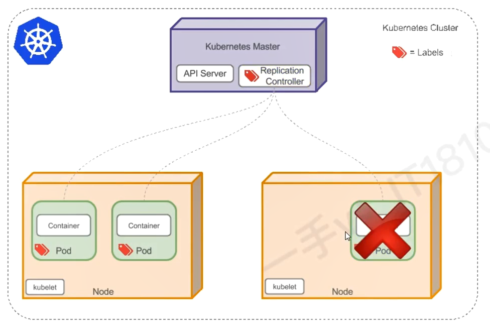
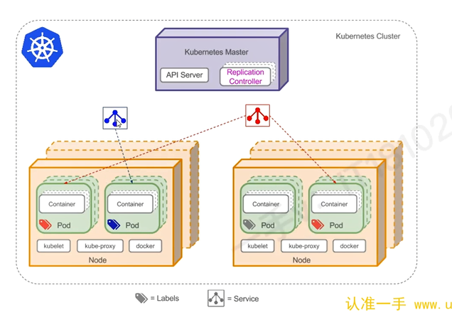
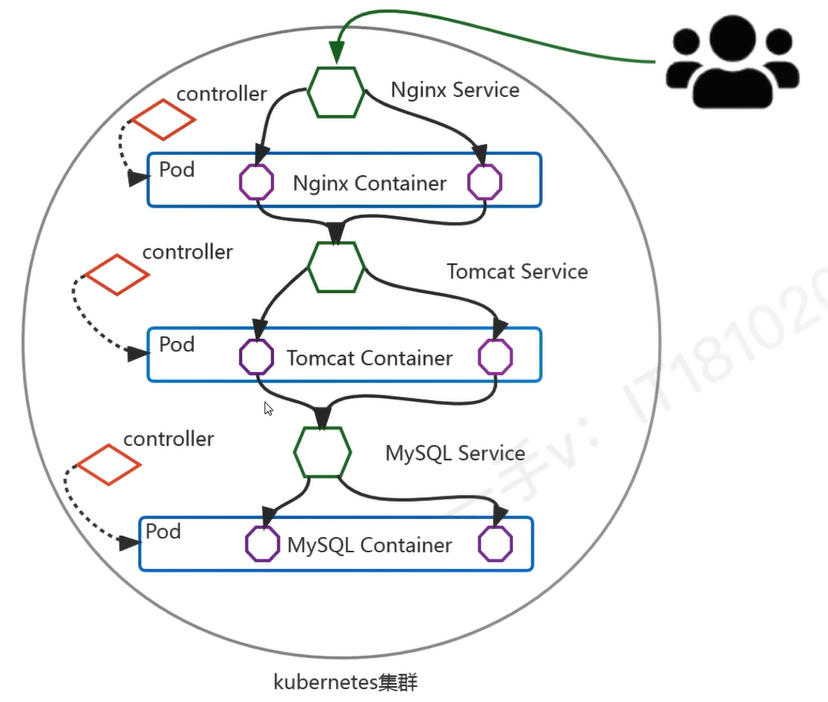
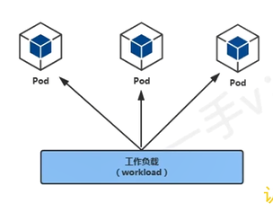

# kubernetes 核心概念


## Pod


Pod 是可以在Kubernetes 中创建和管理的、最小的可部署的计算单元

Pod 其中包含着一组（一个或多个）容器；这些容器共享存储、网络平以及怎样运行这些容器的声明。

Pod 就像一台物理服务器一样，包含一个或多个应用容器，这些容器中运行着用户应用程序。

`Pod[ Container[应用程序，应用程序]，Container[应用程序，应用程序]]`

## Controller


Controller 是在 Kubernetes 中用于管理和运行 Pod 的对象。

在 Kubernetes 中，控制器通过监控集群的公共状态，并致力于将当前状态转变为期望状态。

一个控制器至少追踪一种类型的 Kubernetes 资源，这些对象有一个代表期望状态的 spec 字段，该控制器负责确保其当前状态接近期望状态。

不同类型的控制器所实现的控制方式不一样，例如：

- **deployment： 部署无状态应用**
  - 部署无状态应用：认为 pod 都一样，没有顺序要求，不用考虑在哪个node运行，随意进行扩展和伸缩
  - 管理Pod和ReplicaSet
  - 部署、滚动升级等
  - 典型应用： web服务、分部署服务等

- **Statefult： 部署有状态应用**
  - 有状态应用：每个Pod都独立运行，保持Pod启动顺序和唯一性，有唯一的网络标识符，持久存储、有序，比如mysql主从，主机名称固定，而且扩容以及升级等操作也是按照顺序进行的操作


- **DaemonSet： 部署守护进程**
  - DaemonSet 保证在每个Node 上都运行一个容器副本，常用来部署一些集群的日志、监控或者其他系统管理的应用，新加入的Node也同样运行在一个node里面
- **job： 一次性任务**
  - job负责批量处理短暂的一次性任务，它保证批处理任务的一个或多个pod成功结束
- **Cronjob**： 周期性定时任务


## Label

label 是附着到 object（例如pod） 上的键值对。 可以在创建 object 的时候指定，也可以在 object 创建后随时指定。 Label 的值对于系统并没有意义，只是对用户有意义。

一个 Label 是 key=value 的键值对， key 和 value 均由用户自行指定。

Label 可以附加到各种资源对象上，例如 Node 、 Pod 、Service 、RC 等， 一个资源对象可以定义任意数量的资源对象。 同一个 label 也可以被添加到任意数量的资源对象上去。

### 常用的 Label 标签：

- 版本标签：
  - "release": "stable" ,"release": "canary"
- 环境标签
  - "environment": "dev" ,"environment": "production" 
- 架构标签
  - "tier": "frontend" , "tier": "backend" , "tier": "middleware"
- 分区标签
  - "partition": "customerA" ,"partition": "customerB" 
- 质量管控标签
  - "track": "daily", "track": "weekly"


### Label语法及字符集


Label key 的组成：
- 不得超过 63 个字符
- 可以使用前缀，使用 / 分隔，前缀必须是DNS子域，不得超过 253个字符，系统中自动化组件必须指定前缀， `kubernetes.io/` 由kubernetes保留
- 起始必须是字母或数字、中间可以有连字符、下划线和 点


Label Value的组成
- 不超过63个字符
- 起始必须是字母或数字、中间可以有连字符、下划线和 点


### Label Selector

通过 label Selector 客户端/用户 可以指定一个 object 集合，通过 label selector 对 Object的集合进行操作


label-selector有量中类型
- equality-based(基于等式): 可以使用 `=` , `==` , `!=` 操作符，可以使用逗号分割多个表达式
- set-based（基于集合）： 可以使用 in 、 notin 、 ! 操作符，另外可以没有操作符直接写出某个 label 的 key ，表示过滤某个 key 的 object 而不管该 key 的 value 是何值， ! 表示没有该 label 的object


## Service

在 Kubernetes（K8s）中，​​Service（服务）​​ 是一种抽象层，用于定义一组 Pod 的逻辑集合以及访问它们的策略。它为动态变化的 Pod 提供稳定的访问入口，解决了 Pod IP 不固定、直接暴露 Pod 风险高等问题，是微服务架构中实现服务发现和负载均衡的核心组件。

Service 的核心是一组 iptables 或 ipvs 规划。

### Service 组件在哪里运行

**Service 是 Kubernetes 的抽象资源​**
- Service 是一个 KubernetesAPI 对象(kind: Service),存储在 etcd 中
- Service 由 kube-apiserver 管理，定义撸如何访问一组 pod


**Service 的代理机制（kube-proxy）​**

- kube-proxy， 是运行在每个 Node 上的守护进程，负责实现 Service 的负载均衡和流量转发
- 它监听 Kubernetes API ，当Service 或 pod 发生变化时， 动态更新节点上的 iptables/ipvs 规则


## Endpoints

在 Kubernetes 中，​​Endpoints​​ 是一个核心资源对象，用于存储 ​​Service 对应的后端 Pod 的 IP 和端口列表​​。它的主要作用是让 Service 知道应该将流量转发到哪些 Pod，从而实现服务发现和负载均衡。

###  Endpoints 的作用​

1. 存储Service的后端Pod列表
   - 当 Service 通过 selector 匹配到 Pod 时，Kubernetes 会自动创建一个对应的 ​​Endpoints​​ 对象，记录这些 Pod 的 IP 和端口。
   
     ```bash
     kubectl get endpoints nginx-service

     NAME             ENDPOINTS                     AGE
     nginx-service    10.244.1.2:80,10.244.2.3:80   5m
     ```
    - 如果 pod 发生变化（如新增、删除、重启） Endpoints 会自动更新，确保Service指向正确的 pod
2. 实现服务发现
   - 其他 pod 或外部客户端，访问后端 pod ，而无需关心 pod 的具体 IP，（Endpoints 会动态维护 pod 列表）
 
 3. 负载均衡基础
    - kube-proxy 根据 Endpoints 中的 pod 列表，在节点上配置 iptables/ipvs 实现流量分发


- Service 通过标签选择器（Label Selector）关联一组 Pod，并自动生成对应的 Endpoints 对象，记录后端 Pod 的 IP 和端口。
- 当 Pod 变化时，Endpoints 会动态更新。


### 工作流程
1. 用户创建一个 Service，并指定 selector（如 app=nginx）。
2. Kubernetes 自动创建对应的 Endpoints 对象，填充匹配的 Pod IP 和端口。
3. kube-proxy 监听 Endpoints 变化，并在节点上配置 iptables/ipvs 规则，实现负载均衡。
4. 客户端访问 Service 的 ClusterIP，流量被转发到 Endpoints 中的 Pod。

## DNS


为 kubernetes 集群内资源对象的访问提供域名解析，这样可以实现通过DNS名称，而非IP地址来访问服务：
- 实现集群内 Service 名称解析
- 实现集群内Pod内Container中应用访问互联网提供域名解析


# Kubernetes 核心概念之间的关系

## Pod与Controller

pod 是通过 Controller 实现应用的运维，比如伸缩、滚动升级等待。pod 和 controller 通过 label 标签建立关系。




master 节点 中存在 ReplicationController(副本控制器-已过时被Deployment 替代)，每个Pod都存在标签，通过标签选择器，副本控制器就可以对pod进行管理和控制


## Pod与Service

service 是为了防止 pod 失联，提供的服务发现服务，类似于微服务的注册中心。定义一组 pod 的访问策略。可以为一组具有相同功能的容器应用提供一个统一的入口地址，并将请求负载分发到后端的各个应用上。

Service 通过 Selector 来管控对应的 pod。 根据 label 和 selector 建立关联，通过 service 实现 pod 的负载均衡。





```bash
# 查看service
what@DESKTOP-I6NTO1D:~$ kubectl get service
NAME         TYPE        CLUSTER-IP   EXTERNAL-IP   PORT(S)   AGE
kubernetes   ClusterIP   10.96.0.1    <none>        443/TCP   16d


# 查看service
what@DESKTOP-I6NTO1D:~$ kubectl describe svc  kubernetes
Name:                     kubernetes
Namespace:                default
Labels:                   component=apiserver
                          provider=kubernetes
Annotations:              <none>
Selector:                 <none>
Type:                     ClusterIP
IP Family Policy:         SingleStack
IP Families:              IPv4
IP:                       10.96.0.1
IPs:                      10.96.0.1
Port:                     https  443/TCP
TargetPort:               6443/TCP
Endpoints:                192.168.65.3:6443
Session Affinity:         None
Internal Traffic Policy:  Cluster
Events:                   <none>


# 查看endpoints
what@DESKTOP-I6NTO1D:~$ kubectl get endpoints
NAME         ENDPOINTS           AGE
kubernetes   192.168.65.3:6443   16d
```

## Service与DNS

通过DNS实现对Service的名称解析，以此达到访问后端Pod 的目的

```bash
what@DESKTOP-I6NTO1D:~$ kubectl get endpoints -n kube-system
NAME                 ENDPOINTS                                            AGE
docker.io-hostpath   <none>                                               17d
kube-dns             10.1.0.50:53,10.1.0.51:53,10.1.0.50:53 + 3 more...   17d
```


# 基于Kubernetes 集群容器化应用的微服务



# Pod

## 工作负载

工作负载（workload）是在 kubernetes 集群中运行的应用程序，无论你的工作负载是单一服务还是多个同一工作的服务构成，在 kubernetes 中都可以使用 pod 来运行它


workloads 分为 pod 与 controllers
- pod 通过控制器实现应用的运行，如何伸缩，升级等
- controllers 在集群中管理 pod
- pod 与 控制器 之间通过 label-selector 相关联，是唯一的关联方式





## Pod 介绍


### Pod定义

- Pod(豌豆荚) 是 kubernetes 集群管理（创建、部署）与调度的最小计算单元，表示处于运行状态的一组容器
- 一个 Pod 可以封装一个或多个容器（主容器或sidecar边车容器）
- 一个pod内的多个容器之间共享部分命名空间，例如 net namespace 、 UTS Namespace 及存储资源
- 用户 pod 默认会被调度运行在 node 节点（不运行在 master 节点，但是也有例外情况）
- pod 内的 IP 不是固定的，集群外不能直接访问 pod


### Pod分类

- **静态Pod** ： 也称之为 `无控制器管理的自主式pod` , 直接由特定节点上的 kubectl 守护进程管理，不需要 API 服务器看到它们，尽管大多 pod 都是有 控制平面 管理的，对于 静态的 pod 而言， kubectl 直接监控每个 pod ，并在失效时重启

### Pod查看

```bash
# 不指定 namesapce，默认是名为 default 的 namespace
kubectl get pod

kubectl get pods

# 指定命名空间
kubectl get pod -n kube-system
```

### YAML格式查看

```bash
kubectl explain namespace

kubectl explain pod
kubectl explain pod.spec
kubectl explain pod.spec.containers
```
## Pod的创建与验证

### 创建一个名为 pod-nginx的pod


## Pod调度

## Pod的生命周期


