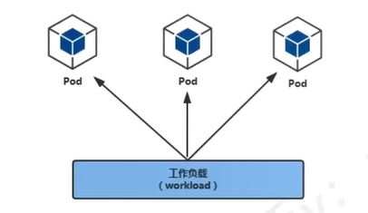

# Pod控制器Controller

Controller 用于控制 Pod
参考: https://kubernetes.io/zh/docs/concepts/workloads/controllers/


控制器主要分为：

- Deployments ： 部署无状态应用，控制 pod 升级/回退
- ReplicaSet : 副本集，控制 pod 扩容,缩减
- ReplicationController： 相当于 ReplicaSet 的老版本，建议使用  Deployments + ReplicaSet 代替 RC
  
- StatefulSets ： 部署有状态应用，结合 Service 、 存储等实现对有状态应用的部署
  
- DaemonSet ： 守护进程集运行在所有集群节点（包括master），比如使用 filebeat 、 node_exporter
- jobs ： 一次性
- cronjob ： 周期性


# Deployment


## Replicaset控制器的功能

- 支持新的基于集合的selector（之前的rc没有这种功能）
- 通过改变pod的副本数量实现扩缩容
  
## Deployment控制器的功能


- Deployment 集成了上线部署、滚动升级、创建副本、回滚等功能
- Deployment 里面包含了 Replicaset

## Deployment 用于部署无状态应用

无状态应用特点

- 所有pod无差别
- 所有pod中的容器运行着同样的image
- pod可以运行在任何节点上
- pod无启动顺序之分
- 随意pod数量扩缩容
- 例如一个简单的web程序


## 创建Deployment类型应用


YAML 文件 `deployment-nginx.yaml`
```yaml
apiVersion: apps/v1
kind: Deployment
metadata:
  name: nginx-deployment         Deployment名称
  labels:
    app: nginx
spec:
  replicas: 1                    希望运行的 Pod 副本数量
  selector:
    matchLabels:
      app: nginx                 用于选择它管理的 Pod 的标签
  template:
    metadata:
      labels:
        app: nginx               Pod 的标签，必须与 selector.matchLabels 匹配
      Pod的规格说明
    spec:
      containers:
      - name: nginx-container
        image: nginx:latest      使用的容器镜像
        ports:
        - containerPort: 80      容器暴露的端口
```


使用 yaml 文件创建 deployment 

```bash
$ kubectl apply -f deployment-nginx.yaml
deployment.apps/nginx-deployment created
```


验证
```bash
kubectl get deployment
NAME               READY   UP-TO-DATE   AVAILABLE   AGE
myapp              1/1     1            1           23h
nginx-deployment   0/3     3            0           11m

kubectl get deployment.apps
NAME               READY   UP-TO-DATE   AVAILABLE   AGE
myapp              1/1     1            1           24h
nginx-deployment   0/1     1            0           36s
```


删除
```bash
kubectl delete  -f deployment-nginx.yaml
deployment.apps "nginx-deployment" deleted
```


## Deployment管理的pod名称

Kubernetes 中由 ​​Deployment​​ 管理的 Pod 名称通常由以下几部分组成：

```bash
nginx-deployment-84c5b8588f-cm7jw
<deployment-name>-<pod-template-hash>-<random-suffix>
```

- ​​`nginx-deployment`​​ → Deployment 的名称。
  - 这是创建 Deployment 时指定的名称
  - Kubernetes 会用这个名称作为前缀，标识这些 Pod 属于哪个 Deployment。
- ​`​84c5b8588f`​​ → Pod 模板的哈希值（pod-template-hash）。
  - 如果 Deployment 的 spec.template 发生变更（如修改了容器镜像、环境变量等），哈希值会变化，从而触发滚动更新（创建新的 Pod，逐步替换旧的 Pod）。
  - 哈希值基于 spec.template 的字段（如容器镜像、命令、环境变量等）生成，确保相同配置的 Pod 模板具有相同的哈希值。
- `​​cm7jw`​​ → 随机生成的唯一后缀。
  - 在同一个 Deployment 的滚动更新过程中，可能会同时存在多个版本的 Pod（新旧 Pod 并存）。随机后缀确保每个 Pod 的名称唯一，避免冲突。
  

## 访问Deployment


查看pod 的IP地址
```bash
$ kubectl get pods -o wide -n default
NAME   READY   STATUS    RESTARTS   AGE   IP          NODE             NOMINATED NODE   READINESS GATES
pod2   1/1     Running   0          9s    10.1.0.69   docker-desktop   <none>           <none>
```
pod 运行在 `docker-desktop` 节点，ip 为  `10.1.0.69`

查看集群节点网卡

```bash
ifconfig tunl0 | head -2
```

在真实的集群环境中可以看到集群节点ip 都属于 `10.1.0.0/16` 这个大网段内的子网
结果就是任意集群节点都可以访问此 Deployment 中的 pod，但在集群外是不能访问的
```bash
curl 10.1.0.69
```

## 删除Deployment中的pod

删除 pod 后 deployment 会自动拉起一个新的 pod ，节点 IP 都可能会变化

所以IP对于pod而言是变化的，所以需要一个固定的 endpoint 给到用户，就是 service


## pod版本升级

升级前验证 nginx 版本
```bash
 kubectl describe pods nginx-deployment-84c5b8588f-rbrnl | grep nginx
```


指定pod内的容器升级
```bash
what@DESKTOP-I6NTO1D:~$ kubectl set image deployment nginx-deployment nginx-container=nginx:1.16-alpine --record


Flag --record has been deprecated, --record will be removed in the future
deployment.apps/nginx-deployment image updated
```

**容器名如何查看**
- `kubectl describe pod pods`
- `kubectl edit deployment deployment名称` 
- `kubectl get  deployment deployment名称 -o yaml`

验证升级结果

```bash
kubectl get pods
```
可以发现后面的id会有变化


## pod版本回退


查看版本历史信息
```bash
$ kubectl rollout history deployment nginx-deployment

deployment.apps/nginx-deployment
REVISION  CHANGE-CAUSE
1         <none>
2         kubectl set image deployment nginx-deployment nginx-container=nginx:latest --record=true
```

查看要回退的版本信息
```bash
what@DESKTOP-I6NTO1D:~$ kubectl rollout history deployment nginx-deployment --revision=1

deployment.apps/nginx-deployment with revision #1
Pod Template:
  Labels:       app=nginx
        pod-template-hash=7cd46f48cf
  Containers:
   nginx-container:
    Image:      nginx:1.15-alpine    表明版本信息
    Port:       80/TCP              
    Host Port:  0/TCP
    Environment:        <none>
    Mounts:     <none>
  Volumes:      <none>
  Node-Selectors:       <none>
  Tolerations:  <none>

```

执行回退
```bash
$ kubectl rollout undo deployment nginx-deployment --to-revision=1
deployment.apps/nginx-deployment rolled back
```

验证
```bash
what@DESKTOP-I6NTO1D:~$ kubectl rollout history  deployment nginx-deployment
deployment.apps/nginx-deployment
REVISION  CHANGE-CAUSE
2         kubectl set image deployment nginx-deployment nginx-container=nginx:latest --record=true

 会发现 REVISION 改变了
3         <none>
```
继续验证,发现pod的名称也改变了
```bash
what@DESKTOP-I6NTO1D:~$ kubectl get pods
NAME                                READY   STATUS    RESTARTS   AGE
nginx-deployment-7cd46f48cf-zw8lh   1/1     Running   0          2m25s
pod2                                1/1     Running   0          3d23h
```
继续验证,发现nginx的版本回退到了 1.15 版本
```bash
 方式一
what@DESKTOP-I6NTO1D:~$ kubectl describe pod nginx-deployment-7cd46f48cf-zw8lh | grep Image
    Image:          nginx:1.15-alpine
    Image ID:       docker-pullable://nginx@sha256:57a226fb6ab6823027c0704a9346a890ffb0cacde06bc19bbc234c8720673555

 方式二
what@DESKTOP-I6NTO1D:~$ kubectl exec nginx-deployment-7cd46f48cf-zw8lh -- nginx -v
nginx version: nginx/1.15.12
```

## 副本扩容/裁剪

扩容为2个副本
```bash
what@DESKTOP-I6NTO1D:~$ kubectl scale deployment nginx-deployment --replicas=2

deployment.apps/nginx-deployment scaled
```


查看
```bash
what@DESKTOP-I6NTO1D:~$ kubectl get pods -o wide
NAME                                READY   STATUS    RESTARTS   AGE    IP          NODE             NOMINATED NODE   READINESS GATES
nginx-deployment-7cd46f48cf-6r6cn   1/1     Running   0          22s    10.1.0.77   docker-desktop   <none>           <none>
nginx-deployment-7cd46f48cf-zw8lh   1/1     Running   0          175m   10.1.0.76   docker-desktop   <none>           <none>
pod2                                1/1     Running   0          4d2h   10.1.0.69   docker-desktop   <none>           <none>
```
注意副本数量是可以大于 node 节点数量的


裁剪为1个副本
```bash
what@DESKTOP-I6NTO1D:~$ kubectl scale deployment nginx-deployment --replicas=1

deployment.apps/nginx-deployment scaled
```

查看
```bash
what@DESKTOP-I6NTO1D:~$ kubectl get pods -o wide
NAME                                READY   STATUS    RESTARTS   AGE    IP          NODE             NOMINATED NODE   READINESS GATES
nginx-deployment-7cd46f48cf-zw8lh   1/1     Running   0          4h1m   10.1.0.76   docker-desktop   <none>           <none>
pod2                                1/1     Running   0          4d3h   10.1.0.69   docker-desktop   <none>           <none>
```

## 多副本滚动更新


先扩容多个副本

```bash
kubectl scale deployment nginx-deployment --replicas=4
```
验证
```bash
what@DESKTOP-I6NTO1D:~$ kubectl get pods
NAME                                READY   STATUS    RESTARTS   AGE
nginx-deployment-7cd46f48cf-6r44j   1/1     Running   0          7s
nginx-deployment-7cd46f48cf-kjspf   1/1     Running   0          7s
nginx-deployment-7cd46f48cf-m749c   1/1     Running   0          7s
nginx-deployment-7cd46f48cf-zw8lh   1/1     Running   0          5h28m
```

滚动更新
```bash
what@DESKTOP-I6NTO1D:~$ kubectl set image deployment nginx-deployment nginx-container=nginx:
latest --record
Flag --record has been deprecated, --record will be removed in the future


deployment.apps/nginx-deployment image updated
```

验证
```bash
what@DESKTOP-I6NTO1D:~$ kubectl rollout status deployment nginx-deployment
deployment "nginx-deployment" successfully rolled out
```


## 删除deployment
```bash
kubectl delete deployment nginx-deployment

deployment.apps "nginx-deployment" deleted
```
使用该命令也会将里面的pod一并删除

## k8s滚动升级

### 滚动升级原理
> - 逐步替换： kubernetes 不会一次性删除所有 pod ，而是先创建新的 pod ， 等新 pod 运行正常后，在逐步替换旧的 pod
> - 零停机： 由于新旧 pod 会同时运行一段时间，因此服务不会中断
> 自动回滚： 如果新版本 pod 启动失败，或者健康检查通不过， kubernetes 会自动停止升级，并回滚到上一个稳定版本


### 如何执行滚动升级

1. 直接修改 deployment 中的 yaml 并应用，kubernetes 会自动检测到变更，并且触发滚动升级
2. 使用 kubectl set image 直接更新镜像，也会触发滚动升级


###  查看滚动升级状态

```bash
 查看 Deployment 的升级状态
kubectl rollout status deployment nginx-deployment

 查看 Deployment 的历史版本
kubectl rollout history deployment nginx-deployment

 查看某个特定版本（如第 1 版）的详细信息
kubectl rollout history deployment nginx-deployment --revision=1
```
### 回滚滚动升级​

```bash
 回滚到上一个稳定版本
kubectl rollout undo deployment nginx-deployment

 回滚到指定版本（如第 1 版）
kubectl rollout undo deployment nginx-deployment --to-revision=1
```

### 滚动升级的配置选项​

```yaml
apiVersion: apps/v1
kind: Deployment
metadata:
  name: nginx-deployment
spec:
  replicas: 3
  strategy:
    type: RollingUpdate   默认就是 RollingUpdate
    rollingUpdate:
      maxSurge: 1         允许超出副本数的最大 Pod 数量（可以是百分比，如 25%）
      maxUnavailable: 0   升级期间允许不可用的 Pod 数量（0 表示必须保持所有 Pod 可用）
  template:
    spec:
      containers:
      - name: nginx
        image: nginx:1.16.1   新镜像版本
```

- ​​maxSurge​​：控制升级期间可以临时创建的 Pod 数量（默认 25%）。
- ​​maxUnavailable​​：控制升级期间允许不可用的 Pod 数量（默认 25%，设为 0 可确保服务始终可用）。

### 滚动升级的适用场景​
✅ ​​适用于​​：
- 无状态应用（如 Web 服务、API 服务）。
- 需要高可用性的服务。
- 需要零停机的场景。
❌ ​​不适用于​​：

- 有状态应用（如数据库），可能需要使用 ​​蓝绿部署​​ 或 ​​金丝雀发布​​。
- 需要严格控制流量切换的场景（如金融系统）。


# Replicaset

在 kubernetes 中， ReplicaSet(副本集) 是一个用于确保指定数量的Pod副本始终在运行的工作负载资源。它是 Kubernetes 用于管理Pod副本的核心组件之一，通常由更高级别的控制器如Deployment，间接使用，但也可以直接创建和使用


## ReplicaSet的作用

1. 确保Pod副本数量
   
   ReplicaSet 会持续监控集群中运行的Pod，确保始终有指定数量的Pod‘副本在运行，如果哪个pod副本被删除，ReplicaSet 会自动创建一个新的来代替它

2. 基于标签选择器管理 Pod
   ReplicaSet 使用​​标签选择器（Label Selector）​​来确定它管理的 Pod。只要 Pod 的标签匹配 ReplicaSet 的选择器，它就会将这些 Pod 视为自己管理的对象。


## ReplicatSet的组成


- metadata： 资源的元数据、比如名称、命名空间等
- spec： 期望的状态
  - replicas： 希望运行的Pod副本数量
  - selector： 用于选择它管理的Pod的标签选择器
  - template： 用于创建新的Pod的Pod模板


## replicaSet的工作原理

1. 用户创建一个 ReplicaSet 执行期望运行的 Pod数量
2. ReplicaSet 根据 template 创建指定数量的 Pod
3. ReplicaSet 持续监控这些 Pod 的状态
   1. 如果某个Pod被删除或者异常退出 ReplicaSet 会自动创建一个新的 Pod 来维持Pod副本数量
   2. 如果Pod数量超过预期，ReplicaSet 会删除多余的 Pod
   

## ReplicaSet 与 Deployment 的关系

- Deployment 是一个更高级别的控制器，它通过管理一个或多个 ReplicaSet 来实现复杂的功能，如滚动更新和回滚
- 当创建一个 Deployment 时， kubernetes 会自动创建一个对应的 ReplicaSet ，由该 replicaSet 管理Pod副本

- 通常不建议直接使用 ReplicaSet ，而是通过 Deployment 来间接管理 Pod ，因为 Deployment 提供了更强大的功能（如版本控制、滚动更新等）


## ReplicaSet的使用场景

需要手动管理一组特定的 Pod 副本，不需要滚动更新等高级功能

## ReplicaSet Yaml示例

```bash
apiVersion: apps/v1
kind: ReplicaSet
metadata:
  name: my-replicaset
  labels:
    app: my-app
spec:
  replicas: 3
  selector:
    matchLabels:
      app: my-app
  template:
    metadata:
      labels:
        app: my-app
    spec:
      containers:
      - name: nginx
        image: nginx:1.14.2
        ports:
        - containerPort: 80
```

验证

```bash
kubectl get rs
```

# DaemonSet

DaemonSet（守护进程集） 是一种确保在集群中的每个节点(或特定节点)上运行的一个Pod副本的工作负载资源。它通常用于部署在那些需要在每个节点上运行的系统级守护进程或者服务，如日志收集器、监控代理、网络插件等


## DaemonSet的作用

1. 在每个节点上运行一个Pod副本
   - 当在集群中添加新的节点时， DaemonSet 会自动在该新节点上启动一个对应的pod
   - 当删除某个节点时，DamonSet 会自动删除该节点上的Pod

2. 确保服务在特定的节点上运行
   如日志收集工具(Fluentd)、监控代理（如 Node Exporter）、网络插件（如 Calico、Flannel）等。

## DaemonSet特点


1. 与节点绑定
   
   DaemonSet 管理的Pod是与节点绑定的，而不是像Deployment那样管理一组无状态的副本

2. 自动管理Pod的生命周期
    当集群中的节点增加或减少时，DaemonSet会自动调整Pod的数量，确保一个节点上只有一个对应的Pod(除非配置了特殊的选择器)

3. 适合运行节点级别的服务
   
   如日志收集、网络管理、监控、等，这些服务通常需要运行在每一个节点上


## DaemonSet的组成


一个 DaemonSet 的定义通常包含以下关键部分：

- ​​metadata​​：资源的元数据，比如名称、命名空间等。
- ​​spec​​：期望的状态，包括：
  - selector：用于选择它管理的 Pod 的标签选择器。
  - template：用于创建新 Pod 的 Pod 模板（包含容器的定义等）。
  - （可选）nodeSelector 或 affinity：用于控制 Pod 调度到哪些特定节点上。


## DaemonSet的使用场景

1. 日志收集
   
   比如使用 Fluentd 或 Filebeat 在每个节点上收集日志，并发到中央日志存储（ES）

2. 监控管理
   
   比如使用 Node Export 在每个节点上收集系统指标，并发送给 Prometheus 进行监控

3. 网络插件
   
   比如 Calico 、 Flannel 等 CNI 插件，通常以 DaemonSet 的形式部署，以在每个节点上运行网络代理

4. 存储插件

   比如 CSI（Container Storage Interface）驱动程序，可能需要在每个节点上运行一个守护进程来管理存储卷。


5. 安全代理
   
   比如安全扫描工具或防火墙代理，可能需要在每个节点上运行以提供节点级别的安全防护。

## DaemonSet的更新策略

与 Deployment 类似，DaemonSet 也支持更新策略，用于控制 Pod 的更新行为。更新策略在 spec.updateStrategy 中定义，常用的策略包括：

- ​​OnDelete​​（默认策略）
  
  当你更新 DaemonSet 的模板（比如修改容器镜像）时，DaemonSet 不会自动更新现有的 Pod。只有当你手动删除旧的 Pod 后，DaemonSet 才会根据新的模板创建新的 Pod。

- RollingUpdate​​

  当你更新 DaemonSet 的模板时，DaemonSet 会逐步替换旧的 Pod，一次更新一个节点上的 Pod，直到所有 Pod 都更新完成。这种方式可以实现无缝更新，避免服务中断。


```yaml
spec:
  updateStrategy:
    type: RollingUpdate
```


## 示例


```yaml
apiVersion: apps/v1
kind: DaemonSet
metadata:
  name: daemonset-nginx
spec:
  selector:
    matchLabels:
      app: nginx-ds
  template:
    metadata:
      labels:
        app: nginx-ds
    spec:

       容忍声明
       污点的作用
       1. 防止普通Pod调度到特定节点
       2. 保留专用节点给特定的服务使用
       3. 实现节点的隔离和维护管理
      tolerations:
         能容忍的污点key
        - key: node-role.kubernetes.io/master
           污点效果
           NoSchedule - 不容忍的Pod不会被调度到该节点
           PreferNoSchedule - 尽量不调度到该节点(软限制)
           NoExecute - 不容忍的Pod不会被调度，已运行的会被驱逐
          effect: NoSchedule
      containers:
        - name: nginx
          image: nginx:latest
          imagePullPolicy: IfNotPresent
          resources:
            limits:
              memory: 100Mi
            requests:
              memory: 100Mi
```


## 管理节点污点


**添加节点**
```bash
kubectl taint nodes <节点名> <key>=<value>:<effect>

 示例：
kubectl taint nodes node1 gpu=true:NoSchedule
```


**删除污点**
```bash
kubectl taint nodes <节点名> <key>:[<effect>]-

 示例：
kubectl taint nodes node1 gpu:NoSchedule-
kubectl taint nodes node1 grp-  删除该key的所有污点
```
**查看所有节点的污点信息（简洁格式）**


```bash
kubectl get nodes -o custom-columns=NAME:.metadata.name,TAINTS:.spec.taints

NAME       TAINTS
node-1     [{"key":"node-role.kubernetes.io/master","effect":"NoSchedule"}]
node-2     <none>   none 表示该节点是干净的，不排斥任何pod
node-3     [{"key":"dedicated","value":"high-mem","effect":"NoSchedule"}]
```


**查看特定节点的污点详情**
```bash
kubectl describe node <节点名称> | grep Taints

Taints:             node-role.kubernetes.io/master:NoSchedule
```


## 污点的实际应用

**专用GPU节点**
1. 给 GPU 节点添加污点
   ```bash
   kubectl taint nodes gpu-node1 accelerator=gpu:NoSchedule
   ```
2. 在 pod/Daemon 中配置容忍
   ```yaml
    容忍/匹配
   tolerations:
   - key: "accelerator"
      完全匹配
     operator: "Equal"
      指定key的值
     value: "gpu"
      如果 Pod 没有显式声明容忍（toleration）这个污点，Kubernetes 将​​不会调度​​新的 Pod 到该节点上。
     effect: "NoSchedule"
   ```
   - 没有容忍的Pod永远不会被调度到这个GPU节点
   - 已运行的非GPU Pod不受影响(如果它们之前就被调度到这里)


**维护节点**

1. 设置维护模式污点：
   ```bash
   kubectl taint nodes node-1 maintenance=true:NoExecute
   ```
2. 需要保持运行的Pod添加容忍：
   ```yaml
   tolerations:
   - key: "maintenance"
    ​​只要节点上的污点的 key 与 Pod 中定义的 key 匹配，无论 value 是什么，Pod 都可以容忍该污点。​
     operator: "Exists"
     effect: "NoExecute"
     tolerationSeconds: 3600   1小时后被驱逐
   ```
   - 新Pod不会被调度到这个节点
   - 已有Pod会被立即驱逐，除非它们能容忍这个污点
   - 即使能容忍，也最多只能再运行3600秒(1小时)


## DaemonSet与Deployment的对比


- Pod 数量
  - DaemonSet ：每个节点运行一个Pod(或者指定节点)
  - Deployment ： 指定数量的 Pod 副本， 与节点无关
- 使用场景
  - DaemonSet ：节点级别的服务，如日志收集，监控代理
  - Deployment ： 应用级别的服务，如 Web 服务， API服务等
- 自动扩缩容
  - DaemonSet ： 根据节点数量自动调整 Pod 数量
  - Deployment ： 手动或者HPA 调整
- 是否支持滚动更新
  - DaemonSet ： 支持但是更新策略与Deployment不同
  - Deployment ： 支持多种策略更新
- 是否适合无状态应用
  - DaemonSet ： 不适合
  - Deployment ： 适合


# StatefulSet

在 Kubernetes 中， StatefulSet(有状态集) 是一种用于管理有状态应用的工作负载资源。它是为了那些需要 **稳定网络标识** 、 **持久化存储** 、 及**有序部署** 、**扩展**、**删除** 特性的应用设计，比如数据库（Mysql、MongoDB）、分布式存储系统（etcd / ZooKeeper）等


## StatefulSet的作用

1. **为每个Pod提供稳定的网络标识**（通过headless实现）
   SatefulSet 中每个 Pod 都有唯一的、可预测
   的名称（如：web-0、web-1），并且这些名称在 Pod 重启或重新调度后保持不变。
2. **为每个 Pod 提供稳定的持久化存储**（通过PV、PVC、storageclass实现）
   Stateful 通过 PersistentVolume(PV) 和 PersistenVolumeClaim(PVC) 为每个Pod绑定独立的存储，即使 Pod 被重新调度到其它节点，其数据也能够保留
3. **支持有序部署和扩展**
   SatefulSet 会展昭顺序逐个撞见、扩展或删除（从0 到 N-1），而不是像Deployment 那样并发操作。这种有序性对有状态应用非常重要，比如数据库集群中的主从关系需要顺序初始化
4. **支持有序删除和缩减**
   当需要缩减 SatefulSet 的副本数量时， Stateful 会从最大序号的Pod开始删除（从N-1 到 0）以确保集群的稳定性和数据一致性。


## Stateful的参数

- ​​metadata​ ​：资源的元数据，比如名称、命名空间等。
- ​​spec​ ​：期望的状态，包括：
  - replicas ：希望运行的 Pod 副本数量。
  - selector ：用于选择它管理的 Pod 的标签选择器。
  - template ：用于创建新 Pod 的 Pod 模板（包含容器的定义等）。
  - volumeClaimTemplates ：用于为每个 Pod 动态创建 PersistentVolumeClaim（PVC）的模板。


## StatefulSet使用场景


StatefulSet 通常用于部署那些需要 **稳定网络标识** 和 **持久化存储** ，以下是使用场景：


1. 数据库集群
   - 比如 MySQL 、 PostgreSQL 、 MongoDB 、 等数据库，通常需要稳定的网络标识和持久化存储
   - 数据库节点之间可能需要固定的地址进行通信， StatefulSet 提供的稳定的网络标识可以满足这种需求
   
2. 分布式存储系统
   - 比如 etcd 、 ZooKeeper 、Consul 等分布式协调服务，通常需要稳定的网络标识和有序的部署
   - 这些服务通常是集群化的，节点之间需要通过固定的地址进行通信，并且需要持久化来保存集群状态
   
3. 消息队列
   - 比如 Kafka 、 RabbitMQ 等消息队列系统，通常需要稳定的网络标识和持久化存储
   - 消息队列的节点可能需要通过固定的地址进行通信，并且需要持久化存储来保存集群状态


## StatefulSet示例

```yaml
apiVersion: apps/v1
 标识
kind: StatefulSet
metadata:
  name: web
spec:
  serviceName: "nginx"
  replicas: 3
  selector:
    matchLabels:
      app: nginx
  template:
    metadata:
      labels:
        app: nginx
    spec:
      containers:
      - name: nginx
        image: nginx:latest
        ports:
        - containerPort: 80
         定义容器挂载的存储卷
        volumeMounts:
         -  将名为 "www" 的存储卷挂载到容器内的路径 /usr/share/nginx/html
           这是 Nginx 默认的网页文件存放目录
        - name: www
          mountPath: /usr/share/nginx/html

   定义存储卷声明模板，用于为每个 Pod 动态创建 PersistentVolumeClaim (PVC)
   StatefulSet 会为每个 Pod（web-0, web-1, web-2）创建一个对应的 PVC
  volumeClaimTemplates:
   存储卷声明的元数据
  - metadata:
       存储卷声明的名称为 "www"
      name: www
    spec:
       定义访问模式为 "ReadWriteOnce" (RWO)
       表示该存储卷只能被单个节点以读写方式挂载
      accessModes: [ "ReadWriteOnce" ]
      resources:
        requests:
          storage: 1Gi
```


## StatefulSet的网络标识和DNS

StatefulSet 会为每个 Pod 分配一个稳定的 DNS 名称，格式为：
```bash
<pod-name>.<service-name>.<namespace>.svc.cluster.local
```
例如：如果 StatefulSet 的名称是 web ， Service 的名称是 nginx ，那么第一个 Pod 的 DNS名称就是：

```bash
<pod-name>.<service-name>.<namespace>.svc.cluster.local
web-0.nginx.default.svc.cluster.local
```
这种稳定的DNS名称对于有状态的应用非常重要，比如数据库集群节点需要通过固定的地址进行通信。


## StatefulSet 的存储


StatefulSet 使用 columeClaimTemplates 为每个 pod 动态创建 PVC 并绑定 PV，即使 Pod 被重新调度到其他节点，其存储数据也能保留。


> StatefulSet 的存储是与 Pod 绑定的，而不是与节点绑定
> 如果Pod被重新调度到其他节点，它会使用原来的 PVC 和 PV ，数据不会丢失
   
## StatefulSet 的优缺点


- 优点
  1. 提供稳定的网络标识和存储，适合有状态应用
  2. 支持有序 部署、扩展、删除 确保集群的稳定性
  3. 动态管理了PVC，简化了持久化存储的管理

- 缺点
  1. 相对于 Deployment StatefulSet 的配置更复杂
  2. 扩展和删除的速度较慢，因为需要按照顺序删除


## 应用滚动更新

它按照与 Pod 终止相同的顺序(从大到小)进行，每次更新1个Pod


StatefulSet 可以使用 partition 参数实现金丝雀发布。
```bash
kubectl patch sts web -p '{"spec":{"updateStrategy":{"partition": 2}}}'
```
- 如果 partition 设置为 N，那么只有序号大于 N 的 Pod 会在更新时被替换。
- 序号小于等于 N 的 Pod 将保持不变，除非你手动删除它们或调整 partition 值。


随后通过更换容器来对pod 进行更新
```bash
kubectl set image sts/web nginx=nginx:latest
```


更新后查询
```bash
kubectl get pods -o custom-columns=Name:metadata.Name,Image:spec.containers[0].image
```


# job


在 Kubernetes（k8s）中，​​Job 控制器​​ 是一种用于管理**​​一次性任务**​​（即运行完成后就不再重复执行的任务）的资源控制器。它确保指定数量的 Pod 成功地完成它们的任务，是 Kubernetes 中用于**批处理任务**的重要组件。

## Job控制器的作用

- 管理一次性任务：
  
  Job用于运行一个或多个Pod，直到这些 Pod 成功完成任务（即容器正常退出，退出码为0）

- 确保任务完成：
  
  如果因为 Pod 失败而退出，Job 控制器会根据配置的重试策略重新创建 Pod 知道达到成功的次数

- 不重复执行：
  
  与Deployment 等控制器不同， Job 不会持续运行或自动重启任务，它只关心任务是否成功完成


## Job核心概念

- 完成次数： 指定 job 需要成功完成多少个 pod（默认1）
- 并行度： 同时指定多少个 pod 来完成任务（默认1）
- 成功条件： pod的容器正产退出 exit code 0 即视为成功


## job使用场景


- 批处理任务： 数据分析、日志处理等
- 一次性计算任务： 模型推理、报表生成、机器学习训练等
- 测试与开发： 数据库迁移、测试脚本运行、临时环境部署等
- 集群初始化任务： 配置文件初始化、密钥分发、初始数据导入等
- CI/CD流水线任务 ：
- 清理任务： 清理临时文件、过期日志、无用资源等


## Job 的 YAML 示例


```yaml
apiVersion: batch/v1
kind: Job
metadata:
  name: hello-job
spec:
  completions: 1       # 需要成功完成的 Pod 数量
  parallelism: 1       # 同时运行的 Pod 数量
  template:
    spec:
      containers:
      - name: hello
        image: busybox
        command: ["echo", "Hello Kubernetes"]
      restartPolicy: Never  # Job 的 Pod 不应该重启，因为它是“一次性”的
```


查看 job 状态

```bash
kubectl get jobs
```

查看
