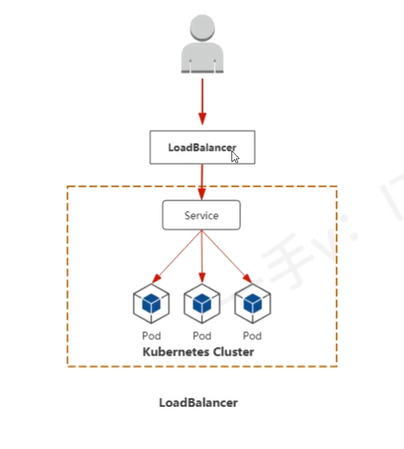

# 服务暴露

## ClusterIp集群内部服务

kubenetes 默认的服务类型，为 Pod 提供集群内的虚拟 IP 地址，仅在集群内部可访问。

**特点：**

- 自动分配集群内部IP，如 10.96.0.0/12 网段
- 无法从集群外部访问
- 用于集群内部微服务间的通信
**示例**
```yaml
apiVersion: v1
kind: Service
metadata:
  name: my-internal-service
spec:
  type: ClusterIP  # 默认类型，可省略
  selector:
    app: my-app
  ports:
    - protocol: TCP
      port: 80          # 服务在集群内部暴露的端口（集群内其他组件通过此端口访问服务）。
      targetPort: 8080  # 后端 Pod 上应用实际监听的端口（流量将被转发至此）。
```


## NodePort集群外部访问
在每个Node节点上开放固定端口（默认范围30000 ~ 32767），通过 NodeIp:NodePort 从集群外部访问服务

**特点**
- 基于 ClusterIP 实现，自动创建 ClusterIP
- 端口必须唯一，不支持动态分配
- 适合测试环境和小规模服务暴露

示例：

```yaml
apiVersion: v1
kind: Service
metadata:
  name: my-nodeport-service
spec:
  type: NodePort
  selector:
    app: my-app
  ports:
    - protocol: TCP
      port: 80        # 服务端口（ClusterIP端口）
      targetPort: 8080  # Pod端口
      nodePort: 30080   # 节点端口（可选，不指定则自动分配）
```

## ExternalIP外部IP访问

通过节点的物理IP地址暴露服务，需要手动配置外部IP（如公有云或物理公网IP）

**特点**
- 需要确保 ExternalIP 可路由到集群节点
- 请求直接转发到服务，无需NAT
- 适合混合云或物理集群

示例
```yaml
apiVersion: v1
kind: Service
metadata:
  name: my-external-service
spec:
  selector:
    app: my-app
  ports:
    - protocol: TCP
      port: 80
      targetPort: 8080
  externalIPs:
    - 203.0.113.10  # 节点的外部IP地址
```


## HostPort容器直接映射到节点
将Pod端口直接映射到Node节点所在的端口，通过 NodeIP：NodePort访问

**特点**：
- 不使用 Service 直接通过节点IP暴露Pod
- 同一端口在同一节点上只能被一个Pod使用
- 适合需要直接访问节点网络的场景，如监控、日志收集等


**示例**
```yaml
apiVersion: v1
kind: Pod
metadata:
  name: my-pod
spec:
  containers:
  - name: my-container
    image: nginx
    ports:
    - containerPort: 80
      hostPort: 8080  # 直接映射到节点的8080端口
```


## 对比


| 类型         | 访问范围         | 实现方式                 | 端口范围       | 适用场景                     |
|--------------|------------------|--------------------------|----------------|------------------------------|
| **ClusterIP** | 集群内部         | 虚拟IP，负载均衡         | 任意（如80）   | 内部微服务通信               |
| **NodePort**  | 集群外部         | 节点固定端口 + ClusterIP | 30000-32767    | 测试环境、小规模暴露服务     |
| **ExternalIP**| 集群外部         | 节点物理IP + Service     | 任意           | 混合云、物理机集群           |
| **HostPort**  | 节点级别外部访问 | Pod直接映射到节点        | 任意           | 特殊网络需求（如节点监控）   |


## 总结

- **优先使用ClusterIP**：微服务间通信的首选方式。
- **NodePort适合快速暴露服务**：无需额外负载均衡器，适合开发和测试。
- **ExternalIP依赖网络环境**：需确保外部IP可路由。
- **HostPort谨慎使用**：可能导致端口冲突，仅用于特殊场景。

理解这些概念有助于设计合理的Kubernetes网络架构，实现服务间的高效通信和外部访问。


# Service的作用

使用 kubernetes 集群运行工作负载时，由于 Pod 经常处于用后即焚的状态， Pod 经常被重新生成，因此Pod 对应的地址也会经常变化，导致无法直接访问 Pod 提供的服务。 kubernetes 使用 service 来解决这一问题。 即在 Pod 前面使用 Service 对 Pod 进行代理，无论 Pod 怎样变化，只要有 Label ，就可以让 Service 联系上 Pod。 把 Pod Ip 地址 添加到 Service 对应的端点列表（Endpoints） 实现对PodIP跟踪，进而实现通过 Service 访问 Pod 目的。


- 通过 Service 为 Pod 客户端提供访问 Pod 的方法
- 通过标签动态感知 Pod IP 地址变化等
- 防止 Pod 失联
- 定义 Pod 访问策略
- 通过 label-selector 相关联
- 通过 Service 实现 Pod 的负载均衡 （TCP/UDP 4层）
- 底层实现由 kube-proxy 通过 userspace 、 iptables 、 ipvs 三种代理模式


# kube-proxy的三种代理模式


- kubernetes 集群中有三层网络
  - 一类是真实的，例如 Node Network ， Pod Network 提供真实IP地址
  - 一类是虚拟的， 例如 Cluster Network 、 Service Network，不会出现在接口上，仅会出现在 Service 中

- kube-proxy 始终监控（watch） kube-apiserver 上关于Service相关的资源变动状态，一旦获取相关信息， kube-proxy 都要把相关信息转换为当前节点上能够实现Service资源调度的规则，进而实现访问Service就能够获取Pod所提供的服务

- kube-proxy 三种代理模式， UserSpace 模式 、 iptables 模式、 ipvs模式


## UserSpace 模式

UserSpace 是 kube-proxy 最早的实现模式，基于用户空间进程完成流量转发，目前已被弃用（K8s v1.20 后完全移除）。

### 工作原理


**流量路径**

1. kube-proxy 会为每个 Service 随机监听一个端口 proxy-port ，并增加一条 iptables 规则。
2. 客户端请求，先通过 iptables 规则重定向到 用户空间的 kube-proxy 进程（就是发送到 proxy-port），再由 kube-proxy 根据负载均衡算法（如轮询）转发到后端 pod
3. 响应流量原路返回（先到 kube-proxy，再经 iptables 回传给客户端）
```
客户端 → 内核 iptables（重定向） → 用户空间 kube-proxy 进程 → 后端 Pod
后端 Pod 响应 → kube-proxy 进程 → 内核 iptables → 客户端
```


**核心逻辑**

kube-proxy 进程持续监听 API Server ，同步 Service 和 Endpoint 变化，并动态调整 iptables 规则 和自身的转发策略


### 特点

**优点**
1. 兼容性强，不依赖特定内核功能，支持老旧 Linux 发行版
2. 用户空间实现负载均衡算法
3. 调试简单，流量在用户空间可见，可以通过 netstat 等工具直接监控


**缺点**
1. 性能极差，每次转发需经过用户空间和内核空间的两次切换，延迟高，吞吐量低
2. 单点风险， kube-proxy 进程崩溃会导致 节点上的 service 失效
3. 资源消耗高， 用户空间进程处理大量连接时占用 CPU/内存较高

## iptables 模式

iptables 模式是 Kubernetes v1.8 后的默认模式（替代 UserSpace），基于 Linux 内核的 iptables 规则实现负载均衡，直接在内核空间处理流量。


### 工作原理

1. kube-proxy 监听 API Server 中 Service 和 Endpoint 的变化，动态生成 iptables 规则（存储在内核中）
2. 客户端请求直接通过内核的iptables规则匹配并转发到后端pod，无需经过用户空间

```
客户端 → 内核 iptables 规则（直接转发） → 后端 Pod
后端 Pod 响应 → 内核 iptables 规则 → 客户端
```


### 特点


**优点**
1. 完全是基于内核空间的iptables转发，避免用户空间切换开销
2. 部署简单，大多数 Linux 都支持 iptables ，无需额外配置

**缺点**
1. 规则匹配效率低， uptables 规则是 线性匹配（类似链表），当 Service 数量庞大时（数千个），规则匹配延迟会显著增加
2. 功能有限： 不支持高级的负载均衡算法（如加权轮询，最少连接等），也不支持会话保持（需要额外配置）
3. 故障恢复慢： 当后端 pod 故障时，需要依赖 kube-proxy 重新生成 iptables 规则，恢复延迟较高


## IPVS 模式
IPVS（IP Virtual Server）是 Linux 内核的负载均衡模块，专为大规模服务设计。Kubernetes v1.8 引入 IPVS 模式作为 iptables 的高性能替代方案，需手动启用。


### IPVS模式的核心机制

IPVS模式下 kube-proxy 会
1. 通过 ipvsadm 配置 IPVS 规则
   - 根据 Service 创建 虚拟服务(Virtual Service), 对应 ClusterIp 和 端口
   - 根号有 Endpoints 创建 真实服务器（Real Server），对应后端 Pod 的 Id 和端口
   - 配置负载均衡算法（如轮询、最少连接数）
2. IPVS 直接在内核层转发流量
   - 客户请求到达节点后，IPVS 直接将流量转发至后端 Pod（基于IPVS规则），无需经过用户空间


### 工作原理


**流量路径**

1. kube-proxy 启动时会检查并加载 ip_vs 模块，然后根据 Service 和 Endpoint 创建 IPVS 虚拟服务器（Virtual Server 对应 Service 的 Cluster IP） 和后端真实服务器（Real Server 对应的 Pod IP）; 客户端请求直接由 IPVS 在内核空间转发到后端 Pod

```
客户端 → 内核 IPVS 规则（直接转发） → 后端 Pod
后端 Pod 响应 → 内核 IPVS 规则 → 客户端
```


### 特点


**优点**
1. 性能最优，内核级转发，哈希表查询，支持百万并发连接，接近于硬件负载均衡，
2. 支持大规模集群： 规则查询效率高，适合数千个甚至数万个 Service 的场景
3. 功能丰富： 支持多种负载均衡算法和会话保持
4. 故障恢复快： 内置健康检查，后端 Pod 故障可快速移除


**缺点**
1. 依赖内核模块： 需要Linux 启动 ip_vs 模块，通常需要手动加载
2. 配置复杂： 需要提前安装 ipset 和 ipvsadm工具， 且需要内核支持


### IPVS模式下 iptables 的使用场景

尽管 IPVS 负责主要的负载均衡，但以下场景仍然依赖iptables

1. 网络策略层（Network Policy）
   - 功能： 控制 Pod 间的流量访问规则（如允许、拒绝特定 Pod 通信）
   - 实现： 完全依赖 iptables 规则，与 IPVS 无关
   - 示例: 此策略会生成 iptables规则，限制只有带 role=frontend 标签的 Pod 能访问 role=db 的 Pod。
    ```yaml
    apiVersion: networking.k8s.io/v1
    kind: NetworkPolicy
    spec:
      podSelector:
        matchLabels:
          role: db
      ingress:
        - from:
            - podSelector:
                matchLabels:
                  role: frontend
    ```

2. SNAT（源地址转换）
   - 功能： 当 Pod 访问集群外部服务时，将源 IP 从 Pod IP 转换为 Node IP，确保响应能正确返回。

   - 实现： 通过 iptables 的 POSTROUTING 链实现，示例规则：
     ```bash
      -A POSTROUTING ! -d 10.0.0.0/16 -m comment --comment "kubernetes postrouting rules" -j MASQUERADE
     ```
     此规则会将所有发往集群外部（非 10.0.0.0/16）的流量进行 SNAT。


3. 特殊流量的转发规则
   - 功能： 处理 IPVS 未覆盖的边缘场景（如 HostPort 、NodePort、ExternalIP 等）。
   - 实现： 通过 iptables 规则将流量导向 IPVS 或直接转发，示例规则：
     ```bash
     # NodePort 流量先通过 iptables 转发到 ClusterIP
    -A KUBE-NODEPORTS -p tcp -m comment --comment "Kubernetes service nodeports; NOTE: this must be the last rule in this chain" -m tcp --dport 30080 -j KUBE-SVC-ABCDEFG
     ```

4. 健康检查与探针
   - 功能：kubelet 的健康检查（如 livenessProbe、readinessProbe）可能依赖 iptables 规则进行流量拦截和转发。
   - 实现：通过 iptables 规则将探针请求导向目标 Pod。


### IPVS 与 iptables 的协作流程

1. 集群内部流量
   ```
   客户端 -> IPVS规则（直接转发至Pod， 无需iptables）
   ```

2. 集群外部流量（NodePort -> Pod）
   ```
   客户端 -> iptables规则（NodePort -> ClusterIp） -> IPVS规则 -> Pod
   ```
   
3. pod 访问外部服务
   ```
   Pod -> iptables规则（SNAT转换源IP） -> 网络 -> 外部服务
   ```

### 验证IPVS 与 iptables 
```bash
# 查看 IPVS 规则（负载均衡）
sudo ipvsadm -L -n

# 查看 iptables 规则（网络策略、SNAT 等）
sudo iptables-save | grep -E "KUBE|calico"  # 或其他 CNI 插件相关规则
```

### IPVS维护的ipset集合

| 设置名称 | 成员 | 用法 |
|----------|------|-----|
| **KUBE-CLUSTER-IP** | 所有ClusterIP服务的IP+端口 | 当`masquerade-all=true`或指定`clusterCIDR`时，对发往Service ClusterIP的流量进行SNAT（源地址转换），确保返回流量能正确路由回客户端。 |
| **KUBE-LOOP-BACK** | 所有服务IP+端口+IP（源IP） | 解决**数据包循环**问题。当Pod访问自己提供的Service时，避免流量绕出集群再返回，直接在集群内部环路转发。 |
| **KUBE-EXTERNAL-IP** | 服务ExternalIP+端口 | 对发往Service ExternalIP的流量进行SNAT，将源IP伪装为节点IP，确保响应流量能正确返回。 |
| **KUBE-LOAD-BALANCER** | LoadBalancer类型服务的入口IP+端口 | 对发往LoadBalancer服务的流量进行SNAT，将源IP伪装为节点IP，适用于`externalTrafficPolicy=Cluster`的场景。 |
| **KUBE-LOAD-BALANCER-LOCAL** | LoadBalancer类型服务的入口IP+端口（仅`externalTrafficPolicy=local`） | 对发往`externalTrafficPolicy=local`的LoadBalancer服务的流量进行DNAT（目的地址转换），直接转发到本地节点的Endpoint，保留客户端源IP。 |
| **KUBE-LOAD-BALANCER-FW** | LoadBalancer类型服务的入口IP+端口（仅配置了`loadBalancerSourceRanges`） | 根据`loadBalancerSourceRanges`定义的源IP CIDR范围，丢弃不符合条件的流量，实现访问控制。 |
| **KUBE-LOAD-BALANCER-SOURCE-CIDR** | LoadBalancer类型服务的入口IP+端口+源CIDR | 允许来自`loadBalancerSourceRanges`指定CIDR范围的流量访问LoadBalancer服务，与`KUBE-LOAD-BALANCER-FW`配合实现黑白名单。 |
| **KUBE-NODE-PORT-TCP** | NodePort类型服务的TCP端口 | 对发往NodePort（TCP）的流量进行SNAT，将源IP伪装为节点IP，适用于`externalTrafficPolicy=Cluster`的场景。 |
| **KUBE-NODE-PORT-LOCAL-TCP** | NodePort类型服务的TCP端口（仅`externalTrafficPolicy=local`） | 对发往`externalTrafficPolicy=local`的NodePort（TCP）流量进行DNAT，直接转发到本地节点的Endpoint，保留客户端源IP。 |
| **KUBE-NODE-PORT-UDP** | NodePort类型服务的UDP端口 | 功能同`KUBE-NODE-PORT-TCP`，但针对UDP协议。 |
| **KUBE-NODE-PORT-LOCAL-UDP** | NodePort类型服务的UDP端口（仅`externalTrafficPolicy=local`） | 功能同`KUBE-NODE-PORT-LOCAL-TCP`，但针对UDP协议。 |


## 三种模式对比


| **对比维度**         | **UserSpace 模式**                | **iptables 模式**                  | **IPVS 模式**                      |
|----------------------|-----------------------------------|-----------------------------------|-----------------------------------|
| **工作空间**         | 用户空间（kube-proxy 进程）       | 内核空间（iptables 规则）          | 内核空间（IPVS 模块）              |
| **转发性能**         | 最低（两次上下文切换）            | 中（线性规则匹配）                | 最高（哈希表查询）                |
| **负载均衡算法**     | 基础（轮询）                      | 有限（随机、轮询）                | 丰富（RR、WRR、LC、SH 等）        |
| **规则查询效率**     | 低（用户空间处理）                | 中（线性遍历）                    | 高（O(1) 哈希查询）               |
| **大规模支持**       | 差（性能瓶颈明显）                | 一般（数千 Service 可能卡顿）      | 优（数万 Service 无压力）          |
| **故障恢复速度**     | 慢（依赖进程重启）                | 中（依赖 kube-proxy 更新规则）    | 快（内置健康检查）                |
| **依赖组件**         | iptables（仅重定向）              | iptables、ipset                   | ip_vs 内核模块、ipset、ipvsadm    |
| **适用场景**         | 遗留环境、调试                    | 中小规模集群（默认选择）          | 大规模集群、高性能需求            |
| **K8s 支持状态**     | 已弃用（v1.20+ 移除）             | 稳定（默认模式）                  | 稳定（推荐大规模场景）            |
| **典型延迟（请求）** | 数百微秒（甚至毫秒级）            | 数十微秒                          | 数微秒                            |


## 查看当前使用的模式

```bash
# 获取 kube-proxy Pod 名称
kubectl get pods -n kube-system | grep kube-proxy

# 查看日志（替换 POD_NAME）
kubectl logs -n kube-system POD_NAME | grep "Using"
```


# Service类型 

- ClusterIP
  - 默认，分配一个集群内部可以访问的虚拟IP
- NodePort
  - 在每个Node上分配一个端口作为外部访问入口
  - nodePort端口范围 30000 ~ 32767
- LoadBalancer
  - 工作在特定的 Cloud Provider 上。例如 Google Cloud 、AWS 、Open Stack
- ExternalName
  - 表示把集群外部的服务引入到集群内部来，即实现了集群内部Pod和集群外部的服务进行通信

## Service 参数

- port ：访问Service使用的端口
- targetPort ： Pod中容器端口
- nodePort  ： 通过Node实现外网用户访问k8s集群内Service（30000 ~ 32767）


# Service创建

## ClusterIp类型

ClusterIP根据是否生成ClusterIp又可分为两类


- 普通Service，被分配一个集群内部可访问的固定虚拟IP（Cluster IP）， 实现集群内部的访问
- HeadlessService，不会分配 ClusterIP也不通过 kube-proxy 做反向代理和负载均衡，而是通过DNS和稳定的网络ID来访问。DNS 会将headless Service 的后端直接解析为 Pod Ip 列表


### 生成Service


使用命令行生成Service
```bash
kubectl expose deployment <deployment-name> --type=ClusterIP --target-port=80 --port=80
```
使用yaml文件生成Service(示例)
```bash
kubectl apply -f xxx.service
```

Service 的 yaml 配置文件
```yaml
apiVersion: v1        # 指定 Kubernetes API 版本，这里是核心 API 组的 v1 版本
kind: Service         # 指定这是一个 Service 对象
metadata:
  name: nginx-deployment-service         # Service 的名称
spec:
  type: ClusterIP      # Service 的类型，NodePort 类型允许从集群外部访问 Service
  ports:
    - port: 80      # Service 暴露在集群内部的端口
      targetPort: 80 # 流量将被转发到的后端 Pod 的端口
  selector:           # 用于选择哪些 Pod 将被这个 Service 暴露
    app: nginx-deployment        # 标签选择器，匹配具有 app=myapp 标签的 Pod
```


查看关联关系
```bash
root@master:~/.kube# kubectl get pods  -o wide 
NAME                               READY   STATUS    RESTARTS   AGE   IP               NODE     NOMINATED NODE   READINESS GATES
nginx-deployment-9957b6647-5v2nl   1/1     Running   0          32m   10.244.140.69    node02   <none>           <none>
nginx-deployment-9957b6647-j5c45   1/1     Running   0          32m   10.244.196.130   node01   <none>           <none>
```

然后继续查看 Service
```bash
root@master:~/.kube# kubectl get service  -o wide 
NAME                       TYPE        CLUSTER-IP      EXTERNAL-IP   PORT(S)   AGE     SELECTOR
kubernetes                 ClusterIP   10.96.0.1       <none>        443/TCP   2d17h   <none>
nginx-deployment-service   ClusterIP   10.98.182.100   <none>        80/TCP    33m     app=nginx-deployment


root@master:~/.kube# kubectl describe service nginx-deployment-service
Name:                     nginx-deployment-service
Namespace:                default
# 服务自身的标签，用于分类和选择资源
Labels:                   <none>
# 附加元数据，通常用于控制器或工具读取配置
Annotations:              <none>
# 标签选择器，用于匹配后端Pod
Selector:                 app=nginx-deployment
# 服务类型，ClusterIP表示仅在集群内部可访问
Type:                     ClusterIP
# IP地址族策略，SingleStack表示仅使用单一IP地址族
IP Family Policy:         SingleStack
IP Families:              IPv4
# 集群内部分配给Service的虚拟IP地址
IP:                       10.98.182.100
# 服务的IP地址列表（单IP时与IP字段相同）
IPs:                      10.98.182.100
# 服务对外暴露的端口
Port:                     <unset>  80/TCP
# 后端Pod接收流量的端口
TargetPort:               80/TCP
# 当前后端Pod的实际IP和端口列表
Endpoints:                10.244.196.130:80,10.244.140.69:80
# 会话亲和性策略，None表示不保证同一客户端请求到同一Pod
Session Affinity:         None
# 内部流量策略，Cluster表示允许集群内所有节点访问
Internal Traffic Policy:  Cluster
# 与该Service相关的事件记录
Events:                   <none>
```
可以看到 `nginx-deployment-service`  对应的  `Endpoints` 中包含 `pod` 的 `IP`


### 访问测试验证Service是否生效
```bash
# 访问 Service 的 CLUSTER-IP
root@master:~/.kube# curl http://10.98.182.100
<!DOCTYPE html>
xxxxxxxxx
</html>


# 访问 Pod 的 ClusterIP ，同样是该 Service 的 Endpoints
root@master:~/.kube# curl http://10.244.196.130
<!DOCTYPE html>
xxxxxxxxx
</html>

root@master:~/.kube# curl http://10.244.140.69
<!DOCTYPE html>
xxxxxxxxx
</html>
```

### 验证负载均衡

进入两个 pod 分别将其 html 页面内容修改为 `web1` 、 `web2`
```bash
# 进入容器
kubectl exec -it  nginx-deployment-9957b6647-5v2nl -- /bin/sh

# 修改路径如下
# /usr/share/nginx/html/index.html
echo "web1" > index.html
```

随后使用 Service Ip 访问服务

```bash
root@master:~/.kube# curl http://10.98.182.100
web2
root@master:~/.kube# curl http://10.98.182.100
web1
root@master:~/.kube# curl http://10.98.182.100
web2
root@master:~/.kube# curl http://10.98.182.100
web1


root@master:~/.kube# while true;
 do  curl http://10.98.182.100; 
 sleep 1; 
 done; 

web1
web2
web1
web1
web2
web2
web2
web2
web2
web2
```
## Headless 类型

```yaml
apiVersion: v1        # 指定 Kubernetes API 版本，这里是核心 API 组的 v1 版本
kind: Service         # 指定这是一个 Service 对象
metadata:
  name: nginx-deployment-service         # Service 的名称
spec:
  type: ClusterIP      # 集群内部访问的 Service 类型
  clusterIP: None      # None 无头服务（不分配 ClusterIP，直接访问 Pod）
  ports:
    - port: 80      # Service 暴露在集群内部的端口
      targetPort: 80 # 流量将被转发到的后端 Pod 的端口
#      nodePort: 30007 # 在每个节点上暴露的静态端口，用于从集群外部访问 Service
  selector:           # 用于选择哪些 Pod 将被这个 Service 暴露
    app: nginx-deployment        # 标签选择器，匹配具有 app=myapp 标签的 Pod
```

使用 pod 的 ip 进行访问
```bash
root@master:~/.kube# curl http://10.244.196.133
web1
root@master:~/.kube# curl http://10.244.140.72
web2
```


## NodePort 类型

service yaml 文件

```yaml
apiVersion: v1        # 指定 Kubernetes API 版本，这里是核心 API 组的 v1 版本
kind: Service         # 指定这是一个 Service 对象
metadata:
  name: nginx-deployment-service         # Service 的名称
spec:
  type: NodePort      # Service 的类型，NodePort 类型允许从集群外部访问 Service
  ports:
    - port: 80      # Service 暴露在集群内部的端口
      targetPort: 80 # 流量将被转发到的后端 Pod 的端口
      nodePort: 30007 # 在每个节点上暴露的静态端口，用于从集群外部访问 Service
  selector:           # 用于选择哪些 Pod 将被这个 Service 暴露
    app: nginx-deployment        # 标签选择器，匹配具有 app=myapp 标签的 Pod
```

尝试访问
```bash
# 主节点
root@master:~/.kube# while true
> do 
> curl http://192.168.4.101:30007/
> sleep 1
> done;
web2
web2
web1
web1

# 从节点
root@master:~/.kube# while true; do  curl http://192.168.4.102:30007/; sleep 1; done;
web1
web1
web2
web2
web1

# 从节点
root@master:~/.kube# while true; do  curl http://192.168.4.103:30007/; sleep 1; done;
web1
web1
web2
web1
web2
```
发现访问任意节点都有负载均衡效果


## LoadBalancer





# Service 的 DNS 解析

DNS 服务监视 kubernetes API ，为每一个 Service 创建 DNS 记录用户域名解析。

其 headless 需要使用域名来解决访问问题

DNS 记录格式为
```bash
<service-name>.<namespace-name>.svc.cluster.local.
```

## 通过 kubernetes 的 DNS pod 解析 Service 域名

首先需要找到 DNS pod 的地址

```bash
root@master:~/.kube# kubectl get pods -n kube-system -o wide
NAME                                       READY   STATUS    RESTARTS       AGE    IP              NODE     NOMINATED NODE   READINESS GATES
。。。
coredns-6f6b679f8f-64n7l                   1/1     Running   0              4d1h   10.244.140.67   node02   <none>           <none>
coredns-6f6b679f8f-xgxjc                   1/1     Running   0              4d1h   10.244.140.66   node02   <none>           <none>
。。。
```

随后使用 dig 命令解析域名
```bash
root@master:~/.kube# dig -t A  nginx-deployment-service.default.svc.cluster.local. @10.244.140.67

; <<>> DiG 9.18.30-0ubuntu0.22.04.2-Ubuntu <<>> -t A nginx-deployment-service.default.svc.cluster.local. @10.244.140.67
;; global options: +cmd
;; Got answer:
;; WARNING: .local is reserved for Multicast DNS
;; You are currently testing what happens when an mDNS query is leaked to DNS
;; ->>HEADER<<- opcode: QUERY, status: NOERROR, id: 14272
;; flags: qr aa rd; QUERY: 1, ANSWER: 2, AUTHORITY: 0, ADDITIONAL: 1
;; WARNING: recursion requested but not available

;; OPT PSEUDOSECTION:
; EDNS: version: 0, flags:; udp: 1232
; COOKIE: 2b8e6d05e7e63888 (echoed)
;; QUESTION SECTION:
;nginx-deployment-service.default.svc.cluster.local. IN A

;; ANSWER SECTION:
nginx-deployment-service.default.svc.cluster.local. 30 IN A 10.244.140.72
nginx-deployment-service.default.svc.cluster.local. 30 IN A 10.244.196.133

;; Query time: 0 msec
;; SERVER: 10.244.140.67#53(10.244.140.67) (UDP)
;; WHEN: Tue Jul 29 17:15:05 CST 2025
;; MSG SIZE  rcvd: 223
```


