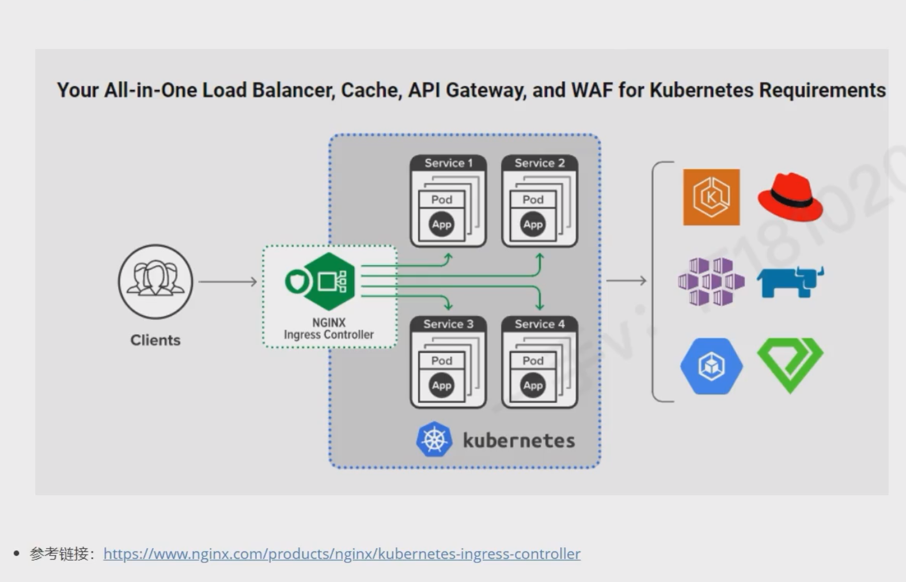

# Ingress控制器作用

Ingress Controller 可以为 kubernetes 集群外用户访问 Kubernetes 集群内部 pod 提供代理服务


- **HTTP/HTTPS路由**
  - 允许外部 HTTP/HTTPS 请求根据预定义的路由规则访问集群内部的服务，可基于主机名、URL
- **反向代理** ：Ingress 控制器通常充当反向代理，将外部服务路由到集群内部的服务。
   
- **域名管理：** 将多个服务绑定到同一域名的不同路径或者绑定多个域名
- **SSL/TSL：** 在 Ingress 层处理 HTTPS 证书，内部服务使用 HTTP 通信，简化配置
- **负载均衡**： 配合 Ingress 控制器实现请求的负载均衡
- **路径重写、请求限流等高级功能** 依赖具体 Ingress 控制器控制

 # Ingress的组成


 Ingress 功能实现的两个核心组件

 1. **Ingress 资源** ： Kubernetes API对象，定义路由规则（YAML配置）
 2. **Ingress 控制器** : 实际执行路由规则的组件（如Nginx，Traefix），需要单独部署，负责监听 Ingress 资源变化,并生成对应的负载均衡配置


# 工作流程

- 用户创建 Ingress 资源， 定义： 域名/路径 -> Service 的路由规则
- Ingress 控制器 监听 Ingress 资源，将规则转换为自身配置，如 Nginx 配置
- 外部请求通过 Ingress IP/域名 进入，控制器根据规则转发到目标 Service


# Ingress 控制器种类

## Kubernetes Ingress Controller

- 链接： <https://github.com/nginx/kubernetes-ingress>
- Kubernetes 的官方控制器。它基于 Nginx Web 服务器并补充了一组用于实现额外功能的 Lua 插件
- 由于Nginx 十分流行，它对于 K8S 工程师来说可能是最简单和直接的选择


## Nginx Ingress Controller

- <https://github.com/kubernetes/ingress-nginx>
- 这是 Nginx 公司开发的产品，它也有一个基于 Nginx Plus 的商业版。 Nginx 的控制器具有很高的稳定性，持续的向后兼容性，且没有第三方插件
- 由于消除了 Lua 代码，和官方控制器相比，它保证了较高的速度，单页因此受到了更大的限制。相较之下，它的付费版本有更广泛的附加功能，如实时指标、JWT验证、主动健康检查等
- Nginx Ingress 最重要的优势是对 TCP/UDP 流量的全面支持，最主要的缺点是缺乏流量的分配功能

适用场景：
- 大多数通用场景，尤其是需要成熟稳定解决方案的生产环境。
- 需要灵活配置 HTTP 路由和高级功能（如限流、重写）的场景。


## Traefik

- <http://github.com/containous/traefik>
- 支持功能
  - 云原生设计-支持连续更新配置 - 不重新启动
  - 支持多种负载均衡算法
  - WebUI，可以查看路由规则和流量状态
  - 指标导出
  - 对各种服务的支持协议
  - REST API
  - Canary 版本等（金丝雀部署）
  
-  支持开箱即用的Lets Encrypt ，但它的主要缺点是，就是为了提高控制器的高可用必须连接 Key-value Store

适用场景：
- 微服务架构，服务频繁变更，需要自动适配的场景。
- 希望简化配置管理，减少运维操作的环境。
## HAProxy 

特点
- 基于 HAProxy 以高性能、低时延主城，适合高并发场景
- TCP优化： 对长连接和高吞吐的场景支持更好，性能优于 Nginx 某些场景
- 软配置更新（无流量损失）
- 基于DNS的服务发现和通过API进行动态配置
- HAProxy 原生配置参数可通过 Config Map 深度定制
- 支持大量负载均衡算法

适用场景

- 对性能要求极高的生产场景，如金融、电商等高并发场景
- 需要优化 TCP 连接服务的场景，如：游戏服务器、实时通信等

## Istio Ingress Gateway

特点：
- 服务网格集成：作为 Istio 服务网格的入口组件，与服务间通信（mTLS、流量治理）深度整合。
- 高级流量控制：支持灰度发布（金丝雀 / 蓝绿部署）、流量镜像、熔断、重试等精细化策略。
- 统一可观测性：与 Istio 遥测系统集成，提供全链路监控、追踪和日志。
适用场景：
- 已采用 Istio 服务网格的复杂微服务架构。
- 需要高级流量治理（如灰度发布、细粒度权限控制）的场景。
注意：
- 部署和维护复杂度较高，适合大规模、高复杂度的集群。

# Kubernetes Ingress Controller

## Nginx Ingress Controller 位置




## Nginx Ingress Controller 部署

<https://github.com/kubernetes/ingress-nginx>


将部署文件 <https://raw.githubusercontent.com/kubernetes/ingress-nginx/refs/heads/main/deploy/static/provider/baremetal/deploy.yaml> 下载至本地，随后将其中的 Service 从 NodePort 类型改为 LoadBalancer 类型，注意： 需要负载均衡器的支持。如: MetaILB 


```yaml
apiVersion: v1
kind: Service
metadata:
  labels:
    app.kubernetes.io/component: controller
    app.kubernetes.io/instance: ingress-nginx
    app.kubernetes.io/name: ingress-nginx
    app.kubernetes.io/part-of: ingress-nginx
    app.kubernetes.io/version: 1.13.0
  name: ingress-nginx-controller
  namespace: ingress-nginx
spec:
  ipFamilies:
  - IPv4
  ipFamilyPolicy: SingleStack
  ports:
  - appProtocol: http
    name: http
    port: 80
    protocol: TCP
    targetPort: http
  - appProtocol: https
    name: https
    port: 443
    protocol: TCP
    targetPort: https
  selector:
    app.kubernetes.io/component: controller
    app.kubernetes.io/instance: ingress-nginx
    app.kubernetes.io/name: ingress-nginx
  # 注意
  type: NodePort
```

安装完成后会多出,可按照如下方式查看：
```bash
# ingress-nginx 命名空间
root@master:/home/what01# kubectl get ns 
NAME              STATUS   AGE
default           Active   11d
ingress-nginx     Active   4h22m
kube-node-lease   Active   11d
kube-public       Active   11d
kube-system       Active   11d
metallb-system    Active   5d3h

# 名为 nginx 的 IngressClass
root@master:/home/what01# kubectl get IngressClass 
NAME    CONTROLLER             PARAMETERS   AGE
nginx   k8s.io/ingress-nginx   <none>       4h34m

# ingress-nginx-controller pod
root@master:/home/what01# kubectl get pods -n ingress-nginx
NAME                                        READY   STATUS    RESTARTS   AGE
ingress-nginx-controller-58b548dbd9-hb69g   1/1     Running   0          4h23m

# 两个 Service，并且 ingress-nginx-controller  Service 会被 MetaILB 分配一个 ExternalIP 作为外部访问的地址
root@master:/home/what01# kubectl get svc -n ingress-nginx
NAME                                 TYPE           CLUSTER-IP       EXTERNAL-IP    PORT(S)                      AGE
ingress-nginx-controller             LoadBalancer   10.109.123.138   192.168.4.10   80:31429/TCP,443:30418/TCP   4h24m
ingress-nginx-controller-admission   ClusterIP      10.104.220.171   <none>         443/TCP                      4h24m
```

## 使用Nginx Ingress 部署 Ingress


### http测试

部署 deploymeng 、 service 、 ingress 来验证，反向代理是否成功

```yaml
# Deployment
apiVersion: apps/v1
kind: Deployment
metadata:
  name: nginx-deployment        # Deployment名称
  namespace: ingress-nginx
  labels:
    app: nginx-deployment
spec:
  replicas: 2                   # 希望运行的 Pod 副本数量
  selector:
    matchLabels:
      app: nginx-deployment                # 用于选择它管理的 Pod 的标签
  template:
    metadata:
      labels:
        app: nginx-deployment              # Pod 的标签，必须与 selector.matchLabels 匹配
      # Pod的规格说明
    spec:
      containers:
        - name: nginx-container
          #          image: nginx:latest     # 使用的容器镜像
          image: nginx:1.15-alpine
          ports:
            - containerPort: 80     # 容器暴露的端口
---
# Service
apiVersion: v1        # 指定 Kubernetes API 版本，这里是核心 API 组的 v1 版本
kind: Service         # 指定这是一个 Service 对象
metadata:
  name: nginx-service         # Service 的名称
  namespace: ingress-nginx
spec:
  type: ClusterIP      # Service 的类型，NodePort 类型允许从集群外部访问 Service
  ports:
    - port: 80      # Service 暴露在集群内部的端口
      targetPort: 80 # 流量将被转发到的后端 Pod 的端口
  #      nodePort: 30007 # 在每个节点上暴露的静态端口，用于从集群外部访问 Service
  selector:           # 用于选择哪些 Pod 将被这个 Service 暴露
    app: nginx-deployment        # 标签选择器，匹配具有 app=myapp 标签的 Pod
---
apiVersion: apps/v1
kind: Deployment
metadata:
  name: nginx-deployment2        # Deployment名称
  namespace: ingress-nginx
  labels:
    app: nginx-deployment2
spec:
  replicas: 2                   # 希望运行的 Pod 副本数量
  selector:
    matchLabels:
      app: nginx-deployment2                # 用于选择它管理的 Pod 的标签
  template:
    metadata:
      labels:
        app: nginx-deployment2              # Pod 的标签，必须与 selector.matchLabels 匹配
      # Pod的规格说明
    spec:
      containers:
        - name: nginx-container
          image: nginx:1.15-alpine
          ports:
            - containerPort: 80     # 容器暴露的端口
---
apiVersion: v1        # 指定 Kubernetes API 版本，这里是核心 API 组的 v1 版本
kind: Service         # 指定这是一个 Service 对象
metadata:
  name: nginx-service2         # Service 的名称
  namespace: ingress-nginx
spec:
  type: ClusterIP      # Service 的类型，NodePort 类型允许从集群外部访问 Service
  ports:
    - port: 80      # Service 暴露在集群内部的端口
      targetPort: 80 # 流量将被转发到的后端 Pod 的端口
  selector:           # 用于选择哪些 Pod 将被这个 Service 暴露
    app: nginx-deployment2        # 标签选择器，匹配具有 app=myapp 标签的 Pod

---
# 重点
# Ingress 配置
apiVersion: networking.k8s.io/v1
kind: Ingress
metadata:
  name: ingress
  namespace: ingress-nginx
  # 注解（annotations）用于配置额外的 Ingress 控制器特定选项
  annotations:
    ingressclass.kubernetes.io/is-default-class: "true"
    # 重写请求路径
    nginx.ingress.kubernetes.io/rewrite-target: /$2
    # 可选：配置 Ingress 控制器特定参数（如 SSL 重定向、缓存等）
    # nginx.ingress.kubernetes.io/ssl-redirect: "true"  # 强制 HTTP 跳转 HTTPS
spec:
  ingressClassName: nginx
  rules:
    - host: my-nginx-test.com
      http:
        paths:
        # 匹配第一个 Service
          - backend:
              service:
                name: nginx-service # 对应 Service 的名称
                port:
                  number: 80
             # 路径匹配类型：Prefix 表示前缀匹配，即匹配以指定路径开头的所有请求
            pathType: Prefix
            # 匹配的路径，这里 "/" 表示匹配所有路径
            path: "/"
          # 匹配第而二个 Service
          - backend:
              service:
                name: nginx-service2
                port:
                  number: 80
            # 控制器自定义规则
            pathType: ImplementationSpecific  # 需配合正则使用
            path: /b(/|$)(.*)
```


查看 Ingress ， 可以看到 /a 和 /b 路径被转发到了 两个 Service 中
```bash
root@master:/home/what01# kubectl describe  ingress  -n ingress-nginx 
Name:             ingress
Labels:           <none>
Namespace:        ingress-nginx
Address:          192.168.4.102
Ingress Class:    nginx
Default backend:  <default>
Rules:
  Host               Path  Backends
  ----               ----  --------
  my-nginx-test.com  
                     /a            nginx-service:80 (10.244.196.154:80,10.244.140.91:80)
                     /b(/|$)(.*)   nginx-service2:80 (10.244.196.155:80,10.244.140.92:80)
Annotations:         ingressclass.kubernetes.io/is-default-class: true
                     nginx.ingress.kubernetes.io/rewrite-target: /$2
Events:
  Type    Reason  Age                From                      Message
  ----    ------  ----               ----                      -------
  Normal  Sync    34m (x4 over 50m)  nginx-ingress-controller  Scheduled for sync
```


### https

1. 首先创建证书
   ```bash
   # 生成 2048 位 RSA 私钥（无密码保护）
   openssl genrsa -out nginx.key 2048

   # 生成证书
   openssl req -new -x509 -key nginx.key -out nginx.pem -days 365
   # 执行后会提示输入证书信息（国家、组织、域名等），其中 Common Name 需填写证书对应的域名（如 example.com 或 *.example.com 通配符）。
   ```

2. 将证书创建为 secret
   ```bash
   kubectl create secret tls nginx-tls-secret --cert=nginx.pem --key=nginx.key -n ingress-nginx
   ```
3. 最后在 ingress 中添加 tls 配置
   ```yaml
    apiVersion: networking.k8s.io/v1
    kind: Ingress
    metadata:
      name: ingress
      namespace: ingress-nginx
      annotations:
        ingressclass.kubernetes.io/is-default-class: "true"
        nginx.ingress.kubernetes.io/rewrite-target: /$2
    spec:
      ingressClassName: nginx
      tls:  # 配置 HTTPS 证书
        - hosts:
            - my-nginx-test.com
          secretName: nginx-tls-secret  # 存储证书的 Secret 名称（需提前创建）
      rules:
        - host: my-nginx-test.com
          http:
            paths:
              - backend:
                  service:
                    name: nginx-service
                    port:
                      number: 80
                pathType: Prefix
                path: "/a"
              - backend:
                  service:
                    name: nginx-service2
                    port:
                      number: 80
                pathType: ImplementationSpecific  # 需配合正则使用
                path: /b(/|$)(.*)
   ```
4. 查看 ingress 发现，增加了tls 记录
    ```bash
    root@master:/home/what01/ingress-https# kubectl describe  ingress  -n ingress-nginx 
    Name:             ingress
    Labels:           <none>
    Namespace:        ingress-nginx
    Address:          192.168.4.102
    Ingress Class:    nginx
    Default backend:  <default>
    TLS:
      nginx-tls-secret terminates my-nginx-test.com
    Rules:
      Host               Path  Backends
      ----               ----  --------
      my-nginx-test.com  
                        /a            nginx-service:80 (10.244.196.154:80,10.244.140.91:80)
                        /b(/|$)(.*)   nginx-service2:80 (10.244.196.155:80,10.244.140.92:80)
    Annotations:         ingressclass.kubernetes.io/is-default-class: true
                        nginx.ingress.kubernetes.io/rewrite-target: /$2
    Events:
      Type    Reason  Age                 From                      Message
      ----    ------  ----                ----                      -------
      Normal  Sync    10m (x7 over 101m)  nginx-ingress-controller  Scheduled for sync

    ```


# pathType 类型介绍


在 Kubernetes Ingress 资源中，`pathType` 是用于定义路径匹配规则的核心字段，它决定了 Ingress 控制器如何解析和匹配请求的 URL 路径。Kubernetes 官方定义了三种标准的 `pathType` 类型，以及一种控制器自定义的类型，具体如下：


### 1. `pathType: Exact`（精确匹配）
- **特点**：严格匹配 URL 路径，要求请求路径与定义的 `path` 完全一致（包括末尾的斜杠）。
- **示例**：
  - 定义 `path: /a` 时，仅匹配请求 `/a`，不匹配 `/a/`、`/a/b` 或 `/A`（大小写敏感）。
  - 定义 `path: /a/` 时，仅匹配请求 `/a/`，不匹配 `/a` 或 `/a/b`。
- **适用场景**：需要精确匹配特定路径的场景（如静态资源路径、特定 API 端点）。


### 2. `pathType: Prefix`（前缀匹配）
- **特点**：匹配以定义的 `path` 为前缀的所有路径，遵循 Kubernetes 官方的前缀匹配规则：
  - 前缀匹配基于「路径段」（以 `/` 分隔的部分），而非简单的字符串前缀。
  - 自动忽略路径末尾的斜杠（`/`），即 `/a` 和 `/a/` 视为相同的前缀。
- **示例**：
  - 定义 `path: /a` 时，匹配 `/a`、`/a/`、`/a/b`、`/a/b/c` 等，但不匹配 `/aa` 或 `/ab`（避免字符串部分匹配）。
  - 定义 `path: /a/b` 时，匹配 `/a/b`、`/a/b/`、`/a/b/c`，但不匹配 `/a/bb`。
- **限制**：不支持正则表达式，`path` 必须是简单的路径字符串（如 `/a`、`/api/v1`）。
- **适用场景**：需要匹配某个路径下所有子路径的场景（如某个服务的所有 API 接口）。


### 3. `pathType: ImplementationSpecific`（控制器自定义匹配）
- **特点**：路径匹配规则完全由所使用的 Ingress 控制器（如 Nginx、Traefik 等）自行定义，不遵循 Kubernetes 官方标准。
- **典型用途**：
  - 支持正则表达式匹配（如 `/a/(\d+)/b` 匹配 `/a/123/b`）。
  - 实现更复杂的匹配逻辑（如基于路径中的参数、通配符等）。
- **示例**（Nginx Ingress）：
  ```yaml
  path: /a(/|$)(.*)  # 正则匹配 /a、/a/、/a/xxx 等
  pathType: ImplementationSpecific
  ```
- **注意**：不同控制器的实现差异较大，配置可能不兼容（如 Nginx 的正则语法与 Traefik 不同）。


### 4. 隐式的 `Default` 类型（默认后端匹配）
- **特点**：当 `path` 为空字符串（`path: ""`）时，`pathType` 默认为 `Default`，表示匹配所有未被其他路径规则匹配的请求（即「默认后端」）。
- **示例**：
  ```yaml
  paths:
  - path: ""  # 匹配所有未被其他规则匹配的请求
    pathType: Default
    backend:
      service:
        name: default-service
  ```
- **用途**：设置全局默认的后端服务（如 404 页面、默认站点）。


### 匹配优先级
当多个路径规则可能匹配同一个请求时，Ingress 控制器按以下优先级匹配：
1. `Exact`（精确匹配）优先级最高。
2. `Prefix`（前缀匹配）次之。
3. `ImplementationSpecific`（控制器自定义）的优先级由控制器自行定义，通常介于 `Exact` 和 `Prefix` 之间或与 `Prefix` 同级。
4. `Default`（默认匹配）优先级最低，仅在无其他匹配规则时生效。


### 总结
| `pathType`               | 匹配规则             | 支持正则   | 跨控制器兼容性 | 典型场景                   |
| ------------------------ | -------------------- | ---------- | -------------- | -------------------------- |
| `Exact`                  | 完全精确匹配         | 否         | 高             | 特定 API 端点、静态资源    |
| `Prefix`                 | 官方标准前缀匹配     | 否         | 高             | 某路径下的所有子路径       |
| `ImplementationSpecific` | 控制器自定义规则     | 是（部分） | 低             | 复杂正则匹配、特殊路径处理 |
| `Default`                | 未匹配请求的默认规则 | 否         | 高             | 全局默认后端               |

选择 `pathType` 时，需根据匹配需求、跨控制器兼容性等因素综合考虑。优先使用 `Exact` 和 `Prefix`（兼容性好），仅在需要复杂匹配时使用 `ImplementationSpecific`。


# 使用 ingress+nodeport（多种服务类型） 暴露服务


在实际的场景中一个后端服务很可能对应着多个 Service ，来应对多种环境的访问。


```yaml

# Deployment
apiVersion: apps/v1
kind: Deployment
metadata:
  name: nginx-node-port        # Deployment名称
  namespace: default
  labels:
    app: nginx-node-port
spec:
  replicas: 2                   # 希望运行的 Pod 副本数量
  selector:
    matchLabels:
      app: nginx-node-port               # 用于选择它管理的 Pod 的标签
  template:
    metadata:
      labels:
        app: nginx-node-port              # Pod 的标签，必须与 selector.matchLabels 匹配
      # Pod的规格说明
    spec:
      containers:
        - name: nginx-container
          #          image: nginx:latest     # 使用的容器镜像
          image: nginx:1.15-alpine
          ports:
            - containerPort: 80     # 容器暴露的端口


---
apiVersion: v1        # 指定 Kubernetes API 版本，这里是核心 API 组的 v1 版本
kind: Service         # 指定这是一个 Service 对象
metadata:
  name: nginx-service         # Service 的名称
  namespace: default
spec:
  type: NodePort      # Service 的类型，NodePort 类型允许从集群外部访问 Service
  ports:
    - port: 80      # Service 暴露在集群内部的端口
      targetPort: 80 # 流量将被转发到的后端 Pod 的端口
      nodePort: 30007 # 在每个节点上暴露的静态端口，用于从集群外部访问 Service
  selector:           # 用于选择哪些 Pod 将被这个 Service 暴露
    app: nginx-node-port        # 标签选择器，匹配具有 app=myapp 标签的 Pod
---
apiVersion: networking.k8s.io/v1
kind: Ingress
metadata:
  name: ingress
  namespace: default
  annotations:
    ingressclass.kubernetes.io/is-default-class: "true"
spec:
  ingressClassName: nginx
  rules:
    - host: my-nginx-test.com
      http:
        paths:
          - backend:
              service:
                name: nginx-service
                port:
                  number: 80
            pathType: Prefix
            path: /

```

