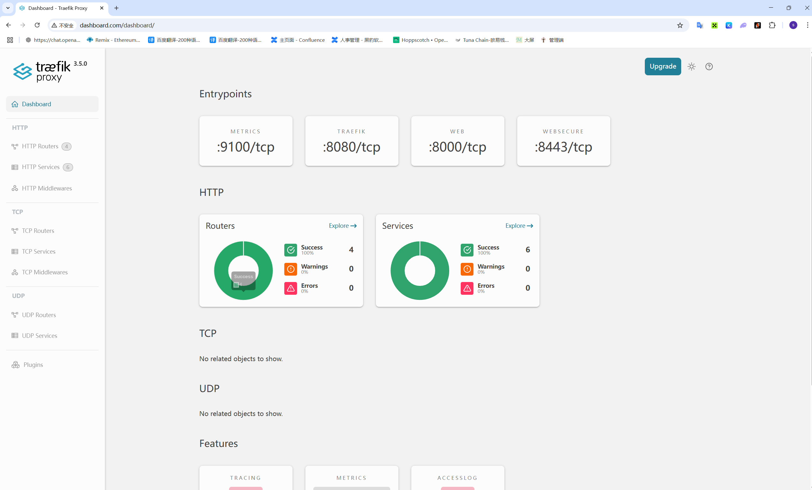
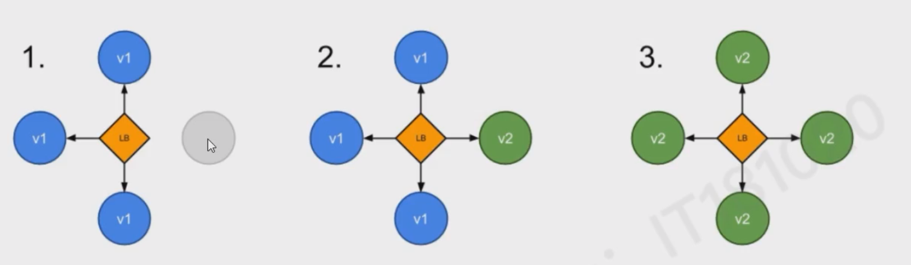
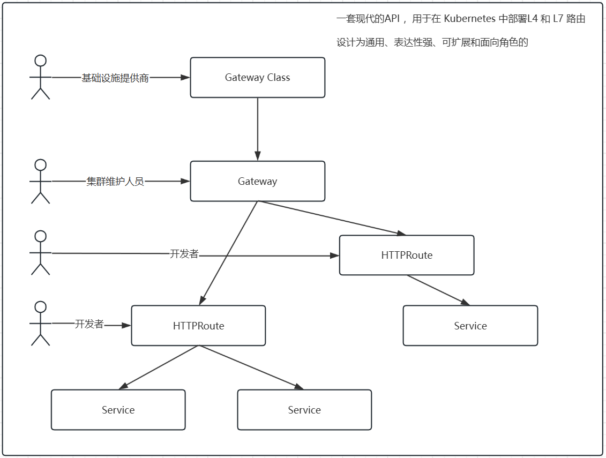

# Traefik  

 Traefik 是一款开源的反向代理与负载均衡工具，由法国公司 Containous（后被 Docker 母公司 Mirantis 收购）开发，专为云原生环境设计，尤其适用于 Docker、Kubernetes 等容器化平台。它的核心特点是自动发现服务和动态配置，能极大简化微服务架构中的流量管理。


# Traefik  特性

- 自动服务发现
  
  无需手动配置后端服务地址，Traefik 可自动检测容器平台（如 Docker、Kubernetes）、云服务（如 AWS、GCP）或传统服务注册中心（如 Consul、etcd）中的服务实例，动态更新路由规则。

- 原生支持容器与云平台
  
  与 Docker、Kubernetes、Docker Compose 等无缝集成，例如在 Kubernetes 中，可通过 Ingress 资源定义路由，Traefik 会自动监听并应用配置。

- 动态配置与热重载
  
  配置变更时无需重启服务，支持通过文件、API 或服务发现机制实时更新路由、中间件、证书等，适合频繁迭代的微服务场景。

- 内置监控与可视化
  
  提供自带的 Dashboard（默认路径 /dashboard），可直观查看路由状态、服务健康度、请求 metrics 等，也支持集成 Prometheus、Grafana 等工具。
- 自动 HTTPS
  
  与 Let's Encrypt 深度集成，可自动申请、续期 SSL 证书，简化 HTTPS 配置流程（只需在路由规则中启用 tls 选项）。

- 丰富的中间件
  
  支持多种内置中间件，如重定向、路径改写、速率限制、IP 白名单、Basic Auth 认证等，可灵活处理请求流转。

- 其它
  - 快
  - 无需安装其它依赖，通过Go语言编写的单一可执行文件
  - 后端断路器
  - 轮询 、 rebalancer 负载均衡
  - 前后台支持 SSL
  - 支持 WebSocket
  - 支持 HTTP/2
  - 网络错误重试
  - 高可用集群模式

# traefik 与 nginx ingress 对比


# traefik 核心组件


- Entrypoints(入口点)： 定义接收请求的端口（如HTTP的80端口、443端口），是流量进入 Traefik 的入口
- Provides（提供者）： 负责从外部源（如Docker、Kubernetes、文件）获取服务信息和配置，是 Traefik 实现自动发现的关键
- Routers（路由器）： 根据规则（如域名、路径、headers）将请求从 Entrypoint 转发到对应的服务，并可关联中间件、TLS配置
- Middlewares(中间件): 在请求转发前后对流量进行处理（如添加 headers 、 压缩、认证），可被多个路由器服用
- Service（服务）： 定义后端服务的地址（如容器IP：端口），支持负载均衡（轮询、权重等策略）和健康检查


请求会首先连接到 Entrypoints ，然耨分析这些请求是否与定义的 rules 匹配，如果匹配则会通过一系列的 middlewares ，再到对应的 Service 上


# 典型使用场景

1. 微服务架构的流量路由： 在 kubernetes 中， 为不同服务分配域名或路径，自动处理服务扩缩容后的路由更新
2. 多环境统一入口： 通过 Traefik 为开发 、 测试 、生产 环境提供统一入口点，简化域名管理
3. HTTPS 自动化： 无需手动管理证书，通过 Let's Encrypt 自动配置所有服务的 HTTPS。
4. API 网关： 利用中间件实现认证、限流、监控等功能，作为微服务的统一入口网关


# 安装 traefik

先安装 Helm <https://helm.sh/docs/intro/install/>

```bash
$ curl -fsSL -o get_helm.sh https://raw.githubusercontent.com/helm/helm/main/scripts/get-helm-3
$ chmod 700 get_helm.sh
$ ./get_helm.sh
```

使用 helm 安装 traefik
```bash
helm repo add traefik https://traefik.github.io/charts
helm repo update
```


创建配置文件
```yaml
# values.yaml
ingressRoute:
  dashboard:
    enabled: true
    matchRule: Host(`dashboard.com`)
    entryPoints:
      - web
providers:
  kubernetesGateway:
    enabled: true
gateway:
  namespacePolicy: All
```
配置文件说明
1. 将端口 80 和 443 映射到 Web 和 websecure 入口点
2. 使用特定主机名规则启用仪表板
3. 启用 Kubernetes 网关 API 提供程序
4. 允许网关公开来自所有命名空间的 HTTPRoutes

Install Traefik:  安装 Traefik：
```bash
helm install traefik traefik/traefik -f values.yaml --wait
```

也可以使用 Helm 的 CLI 参数来进行安装
```bash
helm install traefik traefik/traefik --wait \
  --set ingressRoute.dashboard.enabled=true \
  --set ingressRoute.dashboard.matchRule='Host(`dashboard.com`)' \
  --set ingressRoute.dashboard.entryPoints={web} \
  --set providers.kubernetesGateway.enabled=true \
  --set gateway.namespacePolicy=All
```

在启用网关 API 提供程序的情况下安装 Traefik 时，它会自动创建一个名为 traefik 的默认 GatewayClass,可通过以下命令查看
```bash
kubectl describe GatewayClass traefik
```

## 查看仪表台

根据新创建的 service 来设置访问主机的 host

```host
192.168.4.10 dashboard.com
```

然后进行访问




# traefik 配置

使用 helm 查看 traefik 配置
```bash
helm show values traefik/traefik
```
traefik 


# 使用traefik路由访问方式

在Kubernetes中使用Traefik时，CRD IngressRoute、Gateway API和原生Ingress是三种常见的路由访问方式。


## Deployment+Service 示例
以下均使用该Deployment与Service

```yaml
# whoami.yaml
apiVersion: apps/v1
kind: Deployment
metadata:
  name: whoami
spec:
  replicas: 2
  selector:
    matchLabels:
      app: whoami
  template:
    metadata:
      labels:
        app: whoami
    spec:
      containers:
        - name: whoami
          image: traefik/whoami
          ports:
            - containerPort: 80


---
# whoami-service.yaml
apiVersion: v1
kind: Service
metadata:
  name: whoami
spec:
  ports:
    - port: 80
  selector:
    app: whoami
```


## 原生 Ingress(kubernetes标准资源)


- 所属类型： Kubernetes 原生资源，由 Ingress Controller 实现（通常是个各种ingress class 实现，此处是 Traefik实现）。
- 核心功能
  - 仅支持 HTTP/HTTPS 协议，功能较为基础，适合简单的路由需求， 如基于域名和路径的转发
  - 依赖注解（Annotations）扩展功能(如TLS证书、重定向)，但是 扩展性有限，语法复杂
- 示例
  ```yaml
  apiVersion: networking.k8s.io/v1  
  kind: Ingress  
  metadata:  
    name: simple-ingress  
    annotations:  
      kubernetes.io/ingress.class: traefik  
      traefik.ingress.kubernetes.io/router.tls: "true"  
  spec:  
    tls:  
      - secretName: tls-secret  
    rules:  
      - host: example.com  
        http:  
          paths:  
            - path: /  
              pathType: Prefix  
              backend:  
                service:  
                  name: example-service  
                  port:  
                    number: 80
  ```

## CRD IngressRoute(Traefik自定义资源)
- 所属类型： Traefik 的扩展资源（非 Kubernetes 原生），需要先安装 CRD（使用 Helm 图表时默认启用 KubernetesCRD 提供程序，因此我们不需要在值文件中设置它。）
- 核心功能：
  - 支持 HTTP/HTTPS 、 TCP、UDP 协议，可配置更复杂的路由规则(如请求头、方法、客户端IP的匹配)
  - 通过 entryPoints 定义入口端口(如：web:80  、 wensecure:443) ，支持中间件（如认证、限流、重定向）
  - 语法更简洁，转为 Traefik 优化，适合需要更高级功能的场景（如多协议代理、复杂流量控制）
- 示例
  ```yaml
  apiVersion: traefik.io/v1alpha1
  kind: IngressRoute
  metadata:
    name: whoami
  spec:
    entryPoints:
      - web
    routes:
      - match: Host(`whoami.com`)
        kind: Rule
        services:
          - name: whoami
            port: 80
  ```


## Gateway API(kuberbetes原生标准)

- 所属类型： Kubernetes 原生资源（属于API扩展），需要配合控制器使用
- 核心功能
  - 支持 HTTP/HTTPS 、 TCP 、 TLS 、 gRPC 等多种协议，设计更通用，适合云原生多协议场景
  - 通过 GatewayClass 解耦 控制器与资源，支持跨命名空间管理，可扩展性强
  - 路由规则与网关分析，便于复用和治理（如统一管理多个服务的入口规则）
- 示例
  ```yaml
  apiVersion: gateway.networking.k8s.io/v1
  kind: HTTPRoute
  metadata:
    name: whoami
  spec:
    parentRefs:
      - name: traefik-gateway
    hostnames:
      - "whoami.com"
    rules:
      - matches:
          - path:
              type: PathPrefix
              value: /
        backendRefs:
          - name: whoami
            port: 80
  ```


## 对比

| **维度**     | **CRD IngressRoute**           | **Gateway API**                | **原生Ingress**          |
| ------------ | ------------------------------ | ------------------------------ | ------------------------ |
| **协议支持** | HTTP/HTTPS、TCP/UDP            | HTTP/HTTPS、TCP、TLS、gRPC     | 仅HTTP/HTTPS             |
| **扩展性**   | 高（支持中间件、复杂匹配规则） | 高（协议无关，可扩展多控制器） | 低（依赖注解，功能有限） |
| **适用场景** | 需多协议、复杂路由的微服务场景 | 云原生多协议、统一治理场景     | 简单HTTP/HTTPS服务       |
| **学习成本** | 低（专为Traefik设计）          | 中（需理解Gateway API概念）    | 低（Kubernetes原生）     |

**选择建议**：  
- 若需快速搭建简单HTTP服务，用**原生Ingress**。  
- 若需支持多协议（如TCP/gRPC）或复杂流量控制，用**CRD IngressRoute**或**Gateway API**。  
- 若追求云原生标准化、未来可能扩展多协议，优先选择**Gateway API**。

# 配置路由规则


1. Ingress Controller：Traefik 作为 Ingress Controller，监听 K8s API Server，实时同步Ingress或IngressRoute资源的配置，生成对应的路由规则。
2. 路由规则： 定义外部请求如何被转发到集群内服务的规则，包括请求的主机名、路径 、 headers 、方法等匹配条件，以及转发目标 服务/端口等
3. 中间件（middleware）: 可选地功能组件、 用于路由规则的增强（路径重写、重定向、认证、限流等）


# Traefik 暴露HTTP服务


## 公开你的第一个 HTTP 服务

首先，创建部署和服务: 
```yaml
apiVersion: apps/v1
kind: Deployment
metadata:
  name: whoami
  namespace: default
spec:
  replicas: 2
  selector:
    matchLabels:
      app: whoami
  template:
    metadata:
      labels:
        app: whoami
    spec:
      containers:
      - name: whoami
        image: traefik/whoami
        ports:
        - containerPort: 80
---
apiVersion: v1
kind: Service
metadata:
  name: whoami
  namespace: default
spec:
  selector:
    app: whoami
  ports:
  - port: 80
```


**使用网关 API**
```yaml
apiVersion: gateway.networking.k8s.io/v1
kind: HTTPRoute
metadata:
  name: whoami
  namespace: default
spec:
  # 父引用，指定该路由关联的网关
  parentRefs:
  - name: traefik-gateway  # 关联的网关名称，这里是 Traefik 自动创建的网关
  # 主机名列表，该路由匹配的域名
  hostnames:
  - "whoami.com"  # 当请求的主机名为该值时，应用此路由规则
  # 路由规则列表，定义请求的匹配条件和对应的后端服务
  rules:
  - matches:  # 匹配条件，定义哪些请求会被该规则处理
    - path:    # 路径匹配配置
        type: PathPrefix  # 匹配类型，PathPrefix 表示前缀匹配
        value: /          # 匹配的路径前缀，这里匹配所有路径
    # 后端引用，指定匹配规则的请求要转发到的后端服务
    backendRefs:
    - name: whoami  # 后端服务的名称
      port: 80      # 后端服务的端口号
```


**使用 IngressRoute**
```yaml
apiVersion: traefik.io/v1alpha1
# 资源类型，这里是 Traefik 特有的 IngressRoute 资源
kind: IngressRoute
metadata:
  name: whoami
  namespace: default
spec:
  # 入口点配置，指定该路由规则适用的 Traefik 入口点
  entryPoints:
    - web  # 关联到名为 "web" 的入口点（通常对应 HTTP 80 端口）
  # 路由规则列表，定义请求的匹配条件和转发目标
  routes:
  - match: Host(`whoami.com`)  # 匹配条件：当请求的主机头为 whoami.com 时触发
    kind: Rule  # 规则类型，固定为 Rule
    services:  # 匹配后要转发到的后端服务
    - name: whoami  # 后端服务的名称（Kubernetes Service 名称）
      port: 80      # 后端服务的端口号（对应 Service 暴露的端口）
```


## 配置HTTP路由规则-七层代理

### 基于 Host 主机名匹配

根据 Host 头路由到不同的服务，适用于多域名共享入口

```yaml
apiVersion: traefik.containo.us/v1alpha1
kind: IngressRoute
metadata:
  name: host-based-route
spec:
  entryPoints:  # 入口点（如80端口、443端口）
    - web
  routes:
    - match: Host(`example.com`)  # 匹配Host为example.com的请求
      kind: Rule
      services:
        - name: example-service  # 转发到集群内的example-service
          port: 80
    - match: Host(`api.example.com`)  # 匹配Host为api.example.com的请求
      kind: Rule
      services:
        - name: api-service
          port: 8080
```
### 基于路径的匹配


根据 URl 路径匹配，适合同一域名下不同路径对应不同服务的场景。支持**精确匹配**、**前缀匹配**等
```yaml
routes:
  - match: Host(`example.com`) && PathPrefix(`/blog`)  # 匹配example.com/blog/*
    kind: Rule
    services:
      - name: blog-service
        port: 80
  - match: Host(`example.com`) && Path(`/about`)  # 精确匹配example.com/about
    kind: Rule
    services:
      - name: about-service
        port: 80
```
- **PathPrefix(`/blog`)** : 匹配所有以  `/blog` 开头的路径，如 /blog 、 /blog/123
- **Path(`/about`)**: 仅精确匹配/about，不匹配/about/或/about?param=1。

### 基于方法匹配
根据 HTTP 请求方法（如 GET、POST、PUT）匹配，适用于限制特定方法的访问。
```yaml
routes:
  - match: Host(`api.example.com`) && Method(`POST`) && Path(`/users`)
    kind: Rule
    services:
      - name: user-service  # 仅POST /users请求转发到user-service
        port: 8080
```

### 基于请求头（Headers）或查询参数（Query）匹配


根据请求头（如Authorization、User-Agent）或 URL 查询参数（如?version=v2）匹配，适用于灰度发布、权限控制等场景。

```yaml
routes:
  # 匹配带有Header X-Version: v2的请求
  - match: Host(`api.example.com`) && Headers(`X-Version`, `v2`)
    kind: Rule
    services:
      - name: api-v2-service
        port: 8080
  # 匹配查询参数?env=test的请求
  - match: Host(`app.example.com`) && Query(`env`, `test`)
    kind: Rule
    services:
      - name: app-test-service
        port: 80
```


## 启用TLS

创建自签名证书
```bash
openssl req -x509 -nodes -days 365 -newkey rsa:2048 \
  -keyout tls.key -out tls.crt \
  -subj "/CN=whoami.com"
```
在 Kubernetes 中创建 TLS 密钥：
```bash
kubectl create secret tls whoami-tls --cert=tls.crt --key=tls.key
```
重新部署 traefik 
```yaml
# 安全上下文配置 - 控制容器的权限和访问控制
securityContext:
  # 添加必要的Linux capabilities
  capabilities:
    add:
      - NET_BIND_SERVICE  # 允许绑定到特权端口(<1024)，对于80/443端口是必需的
  runAsNonRoot: false     # 不强制要求以非root用户运行(Traefik需要root权限绑定低端口)
  runAsUser: 0            # 运行用户ID为0(root用户)
  runAsGroup: 0           # 运行用户组ID为0(root组)

# 网络端口和入口点配置
# 入口点是Traefik监听传入流量的网络端点
ports:
  # 定义名为'web'的HTTP入口点
  web:
    port: 80              # 监听80端口(HTTP标准端口)
    # 配置HTTP到HTTPS的自动重定向
    redirections:
      entryPoint:
        to: websecure     # 重定向目标为websecure入口点
        scheme: https     # 使用HTTPS协议
        permanent: true   # 使用301永久重定向

  # 定义名为'websecure'的HTTPS入口点
  websecure:
    port: 443             # 监听443端口(HTTPS标准端口)
  # 定义
  custom-tcp: # 这是此端口的标识符，可自定义，如 my-tcp-app
    port: 8888 # 监听的端口号
    expose:  # 将这里改为字典结构
      enabled: true  # 使用 enabled 键来控制是否暴露

# API和仪表盘配置
api:
  dashboard: true         # 启用Traefik仪表盘(Web UI)
  insecure: false         # 禁用不安全访问(不允许通过HTTP访问仪表盘)


# 仪表盘的IngressRoute配置
ingressRoute:
  dashboard:
    enabled: true                  # 启用仪表盘的路由规则
    matchRule: Host(`dashboard.com`) # 匹配访问域名dashboard.com的请求
    entryPoints:
      - websecure                  # 仅允许通过HTTPS入口点访问
    middlewares:
      - name: dashboard-auth       # 应用名为dashboard-auth的中间件(身份验证)


# 额外的Kubernetes对象定义
extraObjects:
  # 定义基本认证所需的密钥
  - apiVersion: v1
    kind: Secret
    metadata:
      name: dashboard-auth-secret  # 密钥名称，需与中间件配置对应
    type: kubernetes.io/basic-auth # 基本认证类型的密钥
    stringData:
      username: admin              # 用户名(实际环境中应修改)
      password: "P@ssw0rd"         # 密码(实际环境中必须修改为强密码)
  
  # 定义基本认证中间件
  - apiVersion: traefik.io/v1alpha1
    kind: Middleware
    metadata:
      name: dashboard-auth         # 中间件名称，需与路由配置对应
    spec:
      basicAuth:
        secret: dashboard-auth-secret # 引用上面定义的密钥


# IngressClass配置
ingressClass:
  enabled: false                  # 禁用IngressClass，因为我们将使用Gateway API


# 提供者配置 - 告诉Traefik在哪里查找路由配置
providers:
  kubernetesIngress:
     enabled: false               # 禁用Kubernetes Ingress提供者
  kubernetesGateway:
     enabled: true                # 启用Kubernetes Gateway API提供者


# Gateway监听器配置
gateway:
  listeners:
    # HTTP监听器，与web入口点匹配
    web:
      port: 80                    # 监听80端口
      protocol: HTTP              # 使用HTTP协议
      namespacePolicy:
        from: All                 # 允许所有命名空间的路由规则

    # HTTPS监听器，与websecure入口点匹配
    websecure:
      port: 443                   # 监听443端口
      protocol: HTTPS             # 使用HTTPS协议(TLS在Traefik内部终止)
      namespacePolicy:
        from: All                 # 允许所有命名空间的路由规则
      mode: Terminate             # TLS终止模式(Traefik负责解密)
      certificateRefs:            # TLS证书引用
        - kind: Secret
          name: local-selfsigned-tls # 引用之前创建的TLS密钥
          group: ""
    # 新增的 TCP 监听器
    tcp:
      port: 8888
      protocol: TCP
      namespacePolicy:
        from: All

# 可观测性配置
logs:
  general:
    level: INFO                   # 日志级别为INFO(生产环境常用级别)
  # 访问日志配置
  access:
    enabled: true                 # 启用访问日志，默认输出到标准输出
    # 有关格式、过滤和输出选项的详细信息，请参阅访问日志文档
    # https://doc.traefik.io/traefik/observability/access-logs/


# 指标配置
metrics:
  prometheus:
    enabled: true                 # 启用Prometheus指标收集
```
安装
```bash
helm install traefik traefik/traefik \
  --namespace traefik \
  --values values.yaml

# helm 操作命令 实例名称 镜像/资源名 指定命名空间 指定配置文件
```
更新
```bash
helm upgrade traefik traefik/traefik   --namespace traefik   --values values.yaml
```

### 使用Gateway(HTTPRoute)实现TLS

```yaml
apiVersion: apps/v1
kind: Deployment
metadata:
  name: whoami
  namespace: traefik
spec:
  replicas: 2
  selector:
    matchLabels:
      app: whoami
  template:
    metadata:
      labels:
        app: whoami
    spec:
      containers:
        - name: whoami
          image: traefik/whoami
          ports:
            - containerPort: 80
---
apiVersion: v1
kind: Service
metadata:
  name: whoami
  namespace: traefik
spec:
  selector:
    app: whoami
  ports:
    - port: 80
---
# Gateway
apiVersion: gateway.networking.k8s.io/v1
kind: HTTPRoute
metadata:
  name: whoami
  namespace: traefik
spec:
  # 父引用，指定该路由关联的网关
  parentRefs:
    - name: traefik-gateway  # 关联的网关名称，这里是 Traefik 自动创建的网关
      sectionName: websecure # The HTTPS listener
  # 主机名列表，该路由匹配的域名
  hostnames:
    - "whoami.com"  # 当请求的主机名为该值时，应用此路由规则
  # 路由规则列表，定义请求的匹配条件和对应的后端服务
  rules:
    - matches:  # 匹配条件，定义哪些请求会被该规则处理
        - path:    # 路径匹配配置
            type: PathPrefix  # 匹配类型，PathPrefix 表示前缀匹配
            value: /          # 匹配的路径前缀，这里匹配所有路径
      # 后端引用，指定匹配规则的请求要转发到的后端服务
      backendRefs:
        - name: whoami  # 后端服务的名称
          port: 80      # 后端服务的端口号
```
如果没有配置网关的跨命名空间访问，则需要将 deployment 、 Service 、HTTProute 设置在网关所在的命名空间内 

### 使用IngressRoute实现TLS
```yaml
apiVersion: traefik.io/v1alpha1
kind: IngressRoute
metadata:
  name: whoami
  namespace: default
spec:
  entryPoints:
    - websecure  # Changed from 'web' to 'websecure'
  routes:
    - match: Host(`whoami.com`) && Path(`/api`)
      kind: Rule
      services:
        - name: whoami-api
          port: 80
    - match: Host(`whoami.com`)
      kind: Rule
      services:
        - name: whoami
          port: 80
  tls:
    secretName: whoami-tls  # Added TLS configuration
```

## 配置TCP路由规则-四层代理

whoaimitcp 示例

```yaml

apiVersion: apps/v1
kind: Deployment
metadata:
  name: whoamitcp
  namespace: default
spec:
  selector:
    matchLabels:
      app: whoamitcp

  template:
    metadata:
      labels:
        app: whoamitcp
    spec:
      containers:
        - name: whoami
          image: traefik/whoamitcp
          args:
            - --port=:3000
          ports:
            - containerPort: 3000

---
apiVersion: v1
kind: Service
metadata:
  name: whoamitcp
  namespace: default
spec:
  selector:
    app: whoamitcp
  ports:
    - port: 3000
---
apiVersion: traefik.io/v1alpha1
kind: IngressRouteTCP
metadata:
  name: ingressroutetcp-whoamitcp
  namespace: default
spec:
  entryPoints:
    - web2
  routes:
    - match: HostSNI(`*`)
      priority: 10
      services:
        - name: whoamitcp
          port: 3000
```

mysql 配置示例

```yaml
apiVersion: v1
kind: Service
metadata:
  name: mysql-test
  namespace: default
spec:
  ports:
    - port: 3306
      name: mysql
  clusterIP: None
  selector:
    app: mysql-dump
---

apiVersion: apps/v1
kind: StatefulSet
metadata:
  name: db
  namespace: default
spec:
  selector:
    matchLabels:
      app: mysql-dump
  serviceName: mysql-test
  template:
    metadata:
      labels:
        app: mysql-dump
    spec:
      containers:
        - name: mysql
          image: mysql:5.7
          env:
            - name: MYSQL_ROOT_PASSWORD
              value: abc123
          ports:
            - containerPort: 3306
          volumeMounts:
            - mountPath: "/var/lib/mysql"
              name: mysql-data
      volumes:
        - name: mysql-data
          hostPath:
            path: /opt/mysqldata

---
apiVersion: traefik.io/v1alpha1
kind: IngressRouteTCP
metadata:
  name: ingresstcp-mysql-tcp
  namespace: default

spec:
  entryPoints:
    - web2
  routes:
    - match: HostSNI(`*`)
      priority: 10
      services:
        - name: mysql-test
          port: 3306
```


在traefik 中暴露的端口配置(只包含暴露部分)
```yaml
# 网络端口和入口点
ports:
  web2:
    port: 20000    
    protocol: TCP  
    expose:  
      default: true 
    exposedPort: 20000   # 指定在集群外部访问时使用的端口号 

## Gateway Listeners
gateway:
  listeners:
    # 新增的 TCP 监听器
    web2:
      port: 20000
      protocol: TCP  
      namespacePolicy:  # 表示允许来自集群中所有命名空间的 TCP 路由规则关联到这个监听器，即任何命名空间的TCPRoute资源都可以使用该监听器转发流量。
        from: All 
```

## 配置UDP路由规则-四层代理

配置 traefik 增加 UDP 暴露端点
```yaml
ports:
  myudp:
    expose:
      default: true
    port: 20001
    exposedPort: 20001
    protocol: UDP

gateway:
  listeners:
    myudp:
      namespacePolicy:
        from: All
      port: 20001
      protocol: UDP
```

配置 deployment 、 service 和 IngressRouteUDP

```yaml
apiVersion: apps/v1
kind: Deployment
metadata:
  name: whoamiudp
  labels:
    app: traefiklabs
    name: whoamiudp
spec:
  replicas: 1
  selector:
    matchLabels:
      app: traefiklabs
      name: whoamiudp
  template:
    metadata:
      name: whoamiudp
      labels:
        app: traefiklabs
        name: whoamiudp
    spec:
      containers:
        - name: whoamiudp
          image: traefik/whoamiudp:latest
          imagePullPolicy: IfNotPresent
          ports:
            - containerPort: 8080
              protocol: UDP
      restartPolicy: Always
---
apiVersion: v1
kind: Service
metadata:
  name: whoamiudp-svc
  namespace: default
spec:
  selector:
    app: traefiklabs
    name: whoamiudp
  ports:
    - port: 8080
      protocol: UDP
```

```yaml
apiVersion: traefik.io/v1alpha1
kind: IngressRouteUDP
metadata:
  name: ingressrouteudpfoo
  namespace: default
spec:
  entryPoints:
    - myudp  # The entry point where Traefik listens for incoming traffic.
  routes:
    - services:
        - name: whoamiudp-svc # The name of the Kubernetes Service to route to.
          port: 8080
#          weight: 10
#          nativeLB: true # Enables native load balancing between pods.
```

# 中间件


HTTPS 安全中间件
```yaml
# 定义 Traefik 中间件，使用 traefik.io/v1alpha1 API 版本
apiVersion: traefik.io/v1alpha1
kind: Middleware
metadata:
  name: secure-headers  # 中间件名称，用于路由引用
  namespace: default    # 命名空间，需与引用它的路由在同一命名空间

spec:
  headers:  # 配置 HTTP 头相关的安全策略
    # 启用 X-Frame-Options: DENY 头
    # 作用：阻止页面被嵌入到 iframe/frame 中，防御点击劫持攻击
    frameDeny: true

    # 启用 HTTP 到 HTTPS 的自动重定向
    # 作用：强制所有请求使用加密通道传输，防止明文数据泄露
    sslRedirect: true

    # 启用 X-XSS-Protection: 1; mode=block 头
    # 作用：激活浏览器内置的 XSS 过滤器，检测到攻击时直接阻止页面加载
    browserXssFilter: true

    # 启用 X-Content-Type-Options: nosniff 头
    # 作用：禁止浏览器自动推断文件类型（MIME 嗅探），防止恶意文件伪装
    contentTypeNosniff: true

    # HSTS 相关配置（HTTP 严格传输安全）
    # 作用：强制浏览器后续仅使用 HTTPS 访问，防止降级攻击
    
    # 让 HSTS 策略应用到所有子域名
    stsIncludeSubdomains: true
    
    # 允许将域名加入浏览器的 HSTS 预加载列表
    # 注：需主动提交到浏览器厂商的预加载列表才会生效
    stsPreload: true
    
    # 设置 HSTS 策略的有效期（单位：秒）
    # 31536000 秒 = 365 天，表示一年内浏览器都会遵循此策略
    stsSeconds: 31536000
```

IP 白名单
```yaml
apiVersion: traefik.io/v1alpha1
kind: Middleware
metadata:
  name: ip-allowlist
  namespace: default
spec:
  ipAllowList:
    sourceRange:
      - 127.0.0.1/32    # 本地环回地址
      - 10.0.0.0/8      # 一般是集群地址
      - 10.244.0.0/16   # 一般是集群地址
      - 192.168.0.0/16  # 局域网地址范围 192.168.0.0 到 192.168.255.255
```

IngressRoute 应用中间件  

```yaml
apiVersion: traefik.io/v1alpha1
kind: IngressRoute
metadata:
  name: whoami
  namespace: default
spec:
  entryPoints:
    - websecure  # Changed from 'web' to 'websecure'
  routes:
    - match: Host(`whoami2.com`)
      kind: Rule
      services:
        - name: whoami
          port: 80
      middlewares: # Middleware Definition
        - name: ip-allowlist
  tls:
    secretName: whoami-tls  # Added TLS configuration
```

Gateway 应用中间件
```yaml
apiVersion: gateway.networking.k8s.io/v1
kind: HTTPRoute
metadata:
  name: whoami
  namespace: default
spec:
  parentRefs:
  - name: traefik-gateway
    sectionName: websecure
  hostnames:
  - "whoami.docker.localhost"
  rules:
  
  - matches:
    - path:
        type: PathPrefix
        value: /
    filters:
    - type: ExtensionRef 
      extensionRef: # IP AllowList Middleware Definition
        group: traefik.io
        kind: Middleware
        name: ip-allowlist
    backendRefs:
    - name: whoami
      port: 80
```

# 负载均衡

实现方式

1. 部署两个 deployment v1 、v2
2. 部署两个 service 对应 v1 、 v2
3. 部署 Ingressroute 在后端服务配置项中填入 v1 、v2
4. 当访问时会自动的对 v1 、v2 进行负载均衡访问


Deployment

```yaml
apiVersion: apps/v1
kind: Deployment
metadata:
  name: whoami-v1
  namespace: default
spec:
  replicas: 1
  selector:
    matchLabels:
      app: v1
  template:
    metadata:
      labels:
        app: v1
    spec:
      containers:
        - name: whoami
          image: traefik/whoami
          ports:
            - containerPort: 80

---

apiVersion: apps/v1
kind: Deployment
metadata:
  name: whoami-v2
  namespace: default
spec:
  replicas: 1
  selector:
    matchLabels:
      app: v2
  template:
    metadata:
      labels:
        app: v2
    spec:
      containers:
        - name: whoami
          image: traefik/whoami
          ports:
            - containerPort: 80
```


Service
```yaml
apiVersion: v1
kind: Service
metadata:
  name: whoami-v1-svc
  namespace: default
spec:
  selector:
    app: v1
  ports:
    - port: 80
---
apiVersion: v1
kind: Service
metadata:
  name: whoami-v2-svc
  namespace: default
spec:
  selector:
    app: v2
  ports:
    - port: 80
```

IngressRoute
```yaml
apiVersion: traefik.io/v1alpha1
kind: IngressRoute
metadata:
  name: whoami-lb
  namespace: default
spec:
  # 指定端点
  entryPoints:
    - websecure  # Changed from 'web' to 'websecure'
  routes:
    - match: Host(`whoami.com`)
      kind: Rule
      # 添加多个Service
      services:
        - name: whoami-v1-svc
          port: 80
        - name: whoami-v2-svc
          port: 80
      middlewares: # Middleware Definition
        - name: ip-allowlist
  tls:
    secretName: whoami-tls  # Added TLS configuration
```

# 灰度发布/金丝雀发布


基于负载均衡之上实现

灰度发布也称之为金丝雀发布，让一本即将上线的服务发布到线上，观察是否达到要求，主要通过权重轮训的方式实现




1. 继续使用上面的 Deployment 和 Service 删除 IngressRoute
2. 创建 TraefikService
3. 创建 IngressRoute 引用 上面创建的 TraefikService


TraefikService
```yaml
# 配置 TraefikService 实现权重轮询
apiVersion: traefik.io/v1alpha1
kind: TraefikService
metadata:
  name: wrr
  namespace: default
spec:
  weighted:
    services:
      - name: whoami-v1-svc   # 引用第一个服务
        kind: Service         # 可选默认就是Service
        weight: 3             # 权重为3
        port: 80
      - name: whoami-v2-svc   # 引用第二个服务
        weight: 1             # 权重为1
        port: 80
#    sticky:
#      cookie:           # 可选：启用会话粘性
#        name: STICKYSESSION
#        secure: true
```
IngressRoute
```yaml
apiVersion: traefik.io/v1alpha1
kind: IngressRoute
metadata:
  name: whoami-wrr
  namespace: default
spec:
  entryPoints:
    - websecure  # Changed from 'web' to 'websecure'
  routes:
    - match: Host(`whoami.com`)
      kind: Rule
      services:
        - name: wrr
          kind: TraefikService

#      middlewares: # Middleware Definition
#        - name: ip-allowlist
  tls:
    secretName: whoami-tls  # Added TLS configuration
```

# 流量复制


基于负载均衡之上实现

流量复制，也被称之为镜像服务指将请求的流量按照规则复制一份发送给其它服务，并且忽略这部分请求的响应，这个功能在做一些压测或者问题复现时比较有用

## 指定流量来自于自己的 Service 对象

TraefikService
```yaml
apiVersion: traefik.io/v1alpha1
kind: TraefikService
metadata:
  name: mirror
  namespace: default
spec:
  mirroring:
    name: whoami-v1-svc  # 发送100% 的请求到  v1
    port: 80
    mirrors:
      - name: whoami-v2-svc   # 复制 20% 的流量到 v2
        port: 80
        percent: 20
```

IngressRoute
```yaml
apiVersion: traefik.io/v1alpha1
kind: IngressRoute
metadata:
  name: whoami-mirror
  namespace: default
spec:
  entryPoints:
    - websecure  # Changed from 'web' to 'websecure'
  routes:
    - match: Host(`whoami.com`)
      kind: Rule
      services:
        - name: mirror
          kind: TraefikService

  tls:
    secretName: whoami-tls  # Added TLS configuration
```


## 通过 TraefikService 导入流量

```yaml
apiVersion: traefik.io/v1alpha1
kind: TraefikService
metadata:
  name: mirror
  namespace: default
spec:
  mirroring:
    name: mirror              # 从名称为 mirror 的 TraefikService 导入流量
    kind: TraefikService
    mirrors:
      - name: whoami-v2-svc   # 复制 20% 的流量到 v2
        port: 80
        percent: 20

```


# Kubernetes Gateway API


Kubernetes Gateway API 是一套标准化的 API 资源集合，旨在替代并增强传统的 Ingress 资源，在很多场景下 Ingress 控制器都需要通过定义 annotations 或者 crd 来进行功能扩展，这对于使用标准和支持是非常不利的， Gateway API 旨在通过可扩展的面向角色的接口来增强服务网格。





## 核心定位与价值

Gateway API 的核心是通过标准化的API定义，实现跨厂商、跨集群的一致流量管理。它解决了传统 Ingress 资源在复杂场景下的局限性。例如： 多团队共享 网关、细粒度权限控制，多种流量类型支持等。

核心价值体现在三点

1. 角色分离： 将网关管理、路由配置、流量策略的职责分拆给不同角色，符合企业级协作模式
2. 标准化： 定义统一的 API 规范，避免不同的 IngressController 厂商自定义注解碎片化问题
3. 功能扩展： 原生支持 HTTP/HTTPS 、 TCP/UDP 等多种流量类型，以及重定向、重试、流量分割等高级策略

## 核心API组件


- GatewayClass 
  - 定义网关的模板，指定使用哪个厂商的网关控制器，如 Nginx 、Traefik
  - 由集群管理员管理

- Gateway
  - 基于 GatewayClass 创建的具体网关实例，代表集群中的一个物理或逻辑网关，如负载均衡器
  - 由集群管理员管理
- HTTPRoute/TCPRoute/UDPRoute
  - 定义流量路由规则，将 gateway 接收的流量转发到后端服务
  - 由 开发者/运维工程师 维护
  

## 组件协作流程

角色协作流程

  1. 集群管理员创建 GatewayClass ,指定网关控制器类型
  2. 集群管理员基于 GatewayClass 创建 Gateway ，分配 IP 和 端口，暴露网关服务
  3. 应用开发者创建 Route ，关联到指定的 Gateway ，并配置路由规则（路径匹配、域名匹配等） 将流量转发到自己的 Service

详细流程如下

1. 客户端向某 域名发出请求
2. DNS 将域名 解析为 Gateway 网关地址
3. 反向代理在监听器上接收请求，并使用 HOST Header 来匹配 Route
4. (可选) 反向代理可以根据 HTTPRoute 的匹配规则进行路由
5. (可选) 反向代理可以根据 HTTPRoute 的过滤规则修改请求，即添加或删除 headers
6. 最后反向代理根据 HTTPRoute的 forwardTo 规则，将请求转发给集群中的一个或者多个Service对象

## 关键特性

1. 多团队共享： 
   - 通过 Gateway 的命名空间隔离和 Route 的关联机制，多个团队可以共享一个网关实例，且互不干扰
2. 细粒度权限控制
   - 借助 Kubernetes RBAC 权限，可为集群管理员和应用开发者分配不同权限
3. 高级流量策略
   - 原生支持流量权重分配（用于灰度发布）、重定向、重试、会话亲和性等策略，无需依赖自定义注解
4. 多流量类型支持
   - 除了 HTTP/HTTPS 、 还原生支持  TCP/UDP 流量，满足数据库、消息队列等非 HTTP 服务的暴露需求


## 与 Ingress 对比

- 资源模型
  - Ingress： 单一 Ingress 资源
  - GatewayAPI : 拆分 GatewayClass 、 Gateway 、 Route
- 角色分工
  - Ingress： 无明确角色划分
  - GatewayAPI： 集群管理员 、 开发者分离
- 功能扩展性
  - Ingress： 依赖厂商自定义注解，碎片化严重
  - Gateway API： 标准化API，原生支持高级功能

- 多流量支持
  - Ingress： 主要支持 HTTP/HTTPS 、TCP/UDP 需扩展
  - GatewayAPI： 原生支持 HTTP/HTTPS/TCP/UDP


## 为Kubernetes 安装 gateway crd

安装 Traefik 的 GatewayClass 、 Gateway / HTTPRoute /TCP Route 等 CRD

添加 Traefik Helm 存储库：
```bash
helm repo add traefik https://traefik.github.io/charts
helm repo update
```

使用 values.yaml 安装 traefik
```bash
helm install traefik traefik/traefik -f values.yaml --wait
```


## 基于


