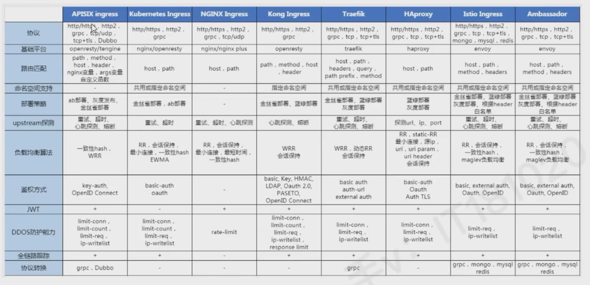

# Traefik  

 Traefik 是一款开源的反向代理与负载均衡工具，由法国公司 Containous（后被 Docker 母公司 Mirantis 收购）开发，专为云原生环境设计，尤其适用于 Docker、Kubernetes 等容器化平台。它的核心特点是自动发现服务和动态配置，能极大简化微服务架构中的流量管理。


# Traefik  特性

- 自动服务发现
  
  无需手动配置后端服务地址，Traefik 可自动检测容器平台（如 Docker、Kubernetes）、云服务（如 AWS、GCP）或传统服务注册中心（如 Consul、etcd）中的服务实例，动态更新路由规则。

- 原生支持容器与云平台
  
  与 Docker、Kubernetes、Docker Compose 等无缝集成，例如在 Kubernetes 中，可通过 Ingress 资源定义路由，Traefik 会自动监听并应用配置。

- 动态配置与热重载
  
  配置变更时无需重启服务，支持通过文件、API 或服务发现机制实时更新路由、中间件、证书等，适合频繁迭代的微服务场景。

- 内置监控与可视化
  
  提供自带的 Dashboard（默认路径 /dashboard），可直观查看路由状态、服务健康度、请求 metrics 等，也支持集成 Prometheus、Grafana 等工具。
- 自动 HTTPS
  
  与 Let's Encrypt 深度集成，可自动申请、续期 SSL 证书，简化 HTTPS 配置流程（只需在路由规则中启用 tls 选项）。

- 丰富的中间件
  
  支持多种内置中间件，如重定向、路径改写、速率限制、IP 白名单、Basic Auth 认证等，可灵活处理请求流转。

- 其它
  - 快
  - 无需安装其它依赖，通过Go语言编写的单一可执行文件
  - 后端断路器
  - 轮询 、 rebalancer 负载均衡
  - 前后台支持 SSL
  - 支持 WebSocket
  - 支持 HTTP/2
  - 网络错误重试
  - 高可用集群模式

# traefik 与 nginx ingress 对比




# traefik 核心组件


- Entrypoints(入口点)： 定义接收请求的端口（如HTTP的80端口、443端口），是流量进入 Traefik 的入口
- Provides（提供者）： 负责从外部源（如Docker、Kubernetes、文件）获取服务信息和配置，是 Traefik 实现自动发现的关键
- Routers（路由器）： 根据规则（如域名、路径、headers）将请求从 Entrypoint 转发到对应的服务，并可关联中间件、TLS配置
- Middlewares(中间件): 在请求转发前后对流量进行处理（如添加 headers 、 压缩、认证），可被多个路由器服用
- Service（服务）： 定义后端服务的地址（如容器IP：端口），支持负载均衡（轮询、权重等策略）和健康检查


请求会首先连接到 Entrypoints ，然耨分析这些请求是否与定义的 rules 匹配，如果匹配则会通过一系列的 middlewares ，再到对应的 Service 上


# 典型使用场景

1. 微服务架构的流量路由： 在 kubernetes 中， 为不同服务分配域名或路径，自动处理服务扩缩容后的路由更新
2. 多环境统一入口： 通过 Traefik 为开发 、 测试 、生产 环境提供统一入口点，简化域名管理
3. HTTPS 自动化： 无需手动管理证书，通过 Let's Encrypt 自动配置所有服务的 HTTPS。
4. API 网关： 利用中间件实现认证、限流、监控等功能，作为微服务的统一入口网关


# 安装 traefik

先安装 Helm <https://helm.sh/docs/intro/install/>

```bash
$ curl -fsSL -o get_helm.sh https://raw.githubusercontent.com/helm/helm/main/scripts/get-helm-3
$ chmod 700 get_helm.sh
$ ./get_helm.sh
```

使用 helm 安装 traefik
```bash
helm repo add traefik https://traefik.github.io/charts
helm repo update
```


创建配置文件
```yaml
# values.yaml
ingressRoute:
  dashboard:
    enabled: true
    matchRule: Host(`dashboard.com`)
    entryPoints:
      - web
providers:
  kubernetesGateway:
    enabled: true
gateway:
  namespacePolicy: All
```
配置文件说明
1. 将端口 80 和 443 映射到 Web 和 websecure 入口点
2. 使用特定主机名规则启用仪表板
3. 启用 Kubernetes 网关 API 提供程序
4. 允许网关公开来自所有命名空间的 HTTPRoutes

Install Traefik:  安装 Traefik：
```bash
helm install traefik traefik/traefik -f values.yaml --wait
```

也可以使用 Helm 的 CLI 参数来进行安装
```bash
helm install traefik traefik/traefik --wait \
  --set ingressRoute.dashboard.enabled=true \
  --set ingressRoute.dashboard.matchRule='Host(`dashboard.com`)' \
  --set ingressRoute.dashboard.entryPoints={web} \
  --set providers.kubernetesGateway.enabled=true \
  --set gateway.namespacePolicy=All
```

在启用网关 API 提供程序的情况下安装 Traefik 时，它会自动创建一个名为 traefik 的默认 GatewayClass,可通过以下命令查看
```bash
kubectl describe GatewayClass traefik
```

## 查看仪表台

根据新创建的 service 来设置访问主机的 host

```host
192.168.4.10 dashboard.com
```

然后进行访问


# 使用traefik路由访问方式

在Kubernetes中使用Traefik时，CRD IngressRoute、Gateway API和原生Ingress是三种常见的路由访问方式。


## Deployment+Service 示例
以下均使用该Deployment与Service

```yaml
# whoami.yaml
apiVersion: apps/v1
kind: Deployment
metadata:
  name: whoami
spec:
  replicas: 2
  selector:
    matchLabels:
      app: whoami
  template:
    metadata:
      labels:
        app: whoami
    spec:
      containers:
        - name: whoami
          image: traefik/whoami
          ports:
            - containerPort: 80


---
# whoami-service.yaml
apiVersion: v1
kind: Service
metadata:
  name: whoami
spec:
  ports:
    - port: 80
  selector:
    app: whoami
```


## 原生 Ingress(kubernetes标准资源)


- 所属类型： Kubernetes 原生资源，由 Ingress Controller 实现（通常是个各种ingress class 实现，此处是 Traefik实现）。
- 核心功能
  - 仅支持 HTTP/HTTPS 协议，功能较为基础，适合简单的路由需求， 如基于域名和路径的转发
  - 依赖注解（Annotations）扩展功能(如TLS证书、重定向)，但是 扩展性有限，语法复杂
- 示例
  ```yaml
  apiVersion: networking.k8s.io/v1  
  kind: Ingress  
  metadata:  
    name: simple-ingress  
    annotations:  
      kubernetes.io/ingress.class: traefik  
      traefik.ingress.kubernetes.io/router.tls: "true"  
  spec:  
    tls:  
      - secretName: tls-secret  
    rules:  
      - host: example.com  
        http:  
          paths:  
            - path: /  
              pathType: Prefix  
              backend:  
                service:  
                  name: example-service  
                  port:  
                    number: 80
  ```

## CRD IngressRoute(Traefik自定义资源)
- 所属类型： Traefik 的扩展资源（非 Kubernetes 原生），需要先安装 CRD（使用 Helm 图表时默认启用 KubernetesCRD 提供程序，因此我们不需要在值文件中设置它。）
- 核心功能：
  - 支持 HTTP/HTTPS 、 TCP、UDP 协议，可配置更复杂的路由规则(如请求头、方法、客户端IP的匹配)
  - 通过 entryPoints 定义入口端口(如：web:80  、 wensecure:443) ，支持中间件（如认证、限流、重定向）
  - 语法更简洁，转为 Traefik 优化，适合需要更高级功能的场景（如多协议代理、复杂流量控制）
- 示例
  ```yaml
  apiVersion: traefik.io/v1alpha1
  kind: IngressRoute
  metadata:
    name: whoami
  spec:
    entryPoints:
      - web
    routes:
      - match: Host(`whoami.com`)
        kind: Rule
        services:
          - name: whoami
            port: 80
  ```


## Gateway API(kuberbetes原生标准)

- 所属类型： Kubernetes 原生资源（属于API扩展），需要配合控制器使用
- 核心功能
  - 支持 HTTP/HTTPS 、 TCP 、 TLS 、 gRPC 等多种协议，设计更通用，适合云原生多协议场景
  - 通过 GatewayClass 解耦 控制器与资源，支持跨命名空间管理，可扩展性强
  - 路由规则与网关分析，便于复用和治理（如统一管理多个服务的入口规则）
- 示例
  ```yaml
  apiVersion: gateway.networking.k8s.io/v1
  kind: HTTPRoute
  metadata:
    name: whoami
  spec:
    parentRefs:
      - name: traefik-gateway
    hostnames:
      - "whoami.com"
    rules:
      - matches:
          - path:
              type: PathPrefix
              value: /
        backendRefs:
          - name: whoami
            port: 80
  ```


## 对比

| **维度**     | **CRD IngressRoute**           | **Gateway API**                | **原生Ingress**          |
| ------------ | ------------------------------ | ------------------------------ | ------------------------ |
| **协议支持** | HTTP/HTTPS、TCP/UDP            | HTTP/HTTPS、TCP、TLS、gRPC     | 仅HTTP/HTTPS             |
| **扩展性**   | 高（支持中间件、复杂匹配规则） | 高（协议无关，可扩展多控制器） | 低（依赖注解，功能有限） |
| **适用场景** | 需多协议、复杂路由的微服务场景 | 云原生多协议、统一治理场景     | 简单HTTP/HTTPS服务       |
| **学习成本** | 低（专为Traefik设计）          | 中（需理解Gateway API概念）    | 低（Kubernetes原生）     |

**选择建议**：  
- 若需快速搭建简单HTTP服务，用**原生Ingress**。  
- 若需支持多协议（如TCP/gRPC）或复杂流量控制，用**CRD IngressRoute**或**Gateway API**。  
- 若追求云原生标准化、未来可能扩展多协议，优先选择**Gateway API**。

# 配置路由规则


1. Ingress Controller：Traefik 作为 Ingress Controller，监听 K8s API Server，实时同步Ingress或IngressRoute资源的配置，生成对应的路由规则。
2. 路由规则： 定义外部请求如何被转发到集群内服务的规则，包括请求的主机名、路径 、 headers 、方法等匹配条件，以及转发目标 服务/端口等
3. 中间件（middleware）: 可选地功能组件、 用于路由规则的增强（路径重写、重定向、认证、限流等）


# Traefik 暴露HTTP服务


## 公开你的第一个 HTTP 服务

首先，创建部署和服务: 
```yaml
apiVersion: apps/v1
kind: Deployment
metadata:
  name: whoami
  namespace: default
spec:
  replicas: 2
  selector:
    matchLabels:
      app: whoami
  template:
    metadata:
      labels:
        app: whoami
    spec:
      containers:
      - name: whoami
        image: traefik/whoami
        ports:
        - containerPort: 80
---
apiVersion: v1
kind: Service
metadata:
  name: whoami
  namespace: default
spec:
  selector:
    app: whoami
  ports:
  - port: 80
```


**使用网关 API**
```yaml
apiVersion: gateway.networking.k8s.io/v1
kind: HTTPRoute
metadata:
  name: whoami
  namespace: default
spec:
  # 父引用，指定该路由关联的网关
  parentRefs:
  - name: traefik-gateway  # 关联的网关名称，这里是 Traefik 自动创建的网关
  # 主机名列表，该路由匹配的域名
  hostnames:
  - "whoami.com"  # 当请求的主机名为该值时，应用此路由规则
  # 路由规则列表，定义请求的匹配条件和对应的后端服务
  rules:
  - matches:  # 匹配条件，定义哪些请求会被该规则处理
    - path:    # 路径匹配配置
        type: PathPrefix  # 匹配类型，PathPrefix 表示前缀匹配
        value: /          # 匹配的路径前缀，这里匹配所有路径
    # 后端引用，指定匹配规则的请求要转发到的后端服务
    backendRefs:
    - name: whoami  # 后端服务的名称
      port: 80      # 后端服务的端口号
```


**使用 IngressRoute**
```yaml
apiVersion: traefik.io/v1alpha1
# 资源类型，这里是 Traefik 特有的 IngressRoute 资源
kind: IngressRoute
metadata:
  name: whoami
  namespace: default
spec:
  # 入口点配置，指定该路由规则适用的 Traefik 入口点
  entryPoints:
    - web  # 关联到名为 "web" 的入口点（通常对应 HTTP 80 端口）
  # 路由规则列表，定义请求的匹配条件和转发目标
  routes:
  - match: Host(`whoami.com`)  # 匹配条件：当请求的主机头为 whoami.com 时触发
    kind: Rule  # 规则类型，固定为 Rule
    services:  # 匹配后要转发到的后端服务
    - name: whoami  # 后端服务的名称（Kubernetes Service 名称）
      port: 80      # 后端服务的端口号（对应 Service 暴露的端口）
```


## 配置HTTP路由规则-七层代理

### 基于 Host 主机名匹配

根据 Host 头路由到不同的服务，适用于多域名共享入口

```yaml
apiVersion: traefik.containo.us/v1alpha1
kind: IngressRoute
metadata:
  name: host-based-route
spec:
  entryPoints:  # 入口点（如80端口、443端口）
    - web
  routes:
    - match: Host(`example.com`)  # 匹配Host为example.com的请求
      kind: Rule
      services:
        - name: example-service  # 转发到集群内的example-service
          port: 80
    - match: Host(`api.example.com`)  # 匹配Host为api.example.com的请求
      kind: Rule
      services:
        - name: api-service
          port: 8080
```
### 基于路径的匹配


根据 URl 路径匹配，适合同一域名下不同路径对应不同服务的场景。支持**精确匹配**、**前缀匹配**等
```yaml
routes:
  - match: Host(`example.com`) && PathPrefix(`/blog`)  # 匹配example.com/blog/*
    kind: Rule
    services:
      - name: blog-service
        port: 80
  - match: Host(`example.com`) && Path(`/about`)  # 精确匹配example.com/about
    kind: Rule
    services:
      - name: about-service
        port: 80
```
- **PathPrefix(`/blog`)** : 匹配所有以  `/blog` 开头的路径，如 /blog 、 /blog/123
- **Path(`/about`)**: 仅精确匹配/about，不匹配/about/或/about?param=1。

### 基于方法匹配
根据 HTTP 请求方法（如 GET、POST、PUT）匹配，适用于限制特定方法的访问。
```yaml
routes:
  - match: Host(`api.example.com`) && Method(`POST`) && Path(`/users`)
    kind: Rule
    services:
      - name: user-service  # 仅POST /users请求转发到user-service
        port: 8080
```

### 基于请求头（Headers）或查询参数（Query）匹配


根据请求头（如Authorization、User-Agent）或 URL 查询参数（如?version=v2）匹配，适用于灰度发布、权限控制等场景。

```yaml
routes:
  # 匹配带有Header X-Version: v2的请求
  - match: Host(`api.example.com`) && Headers(`X-Version`, `v2`)
    kind: Rule
    services:
      - name: api-v2-service
        port: 8080
  # 匹配查询参数?env=test的请求
  - match: Host(`app.example.com`) && Query(`env`, `test`)
    kind: Rule
    services:
      - name: app-test-service
        port: 80
```


### 路由增强中间件


## 配置HTTPS路由规则-七层代理


## 配置TCP路由规则-四层代理

## 配置UDP路由规则-四层代理


