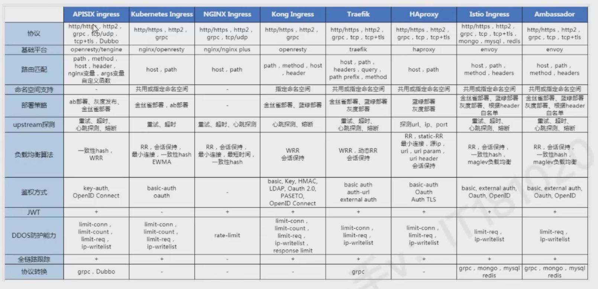
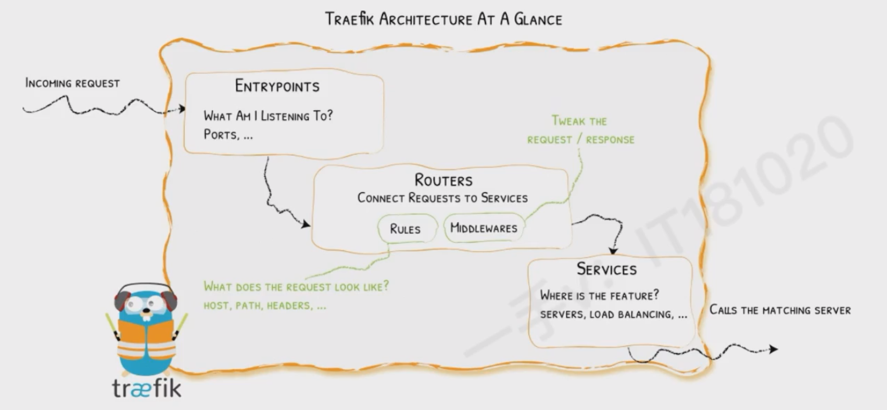

# Traefik  

 Traefik 是一款开源的反向代理与负载均衡工具，由法国公司 Containous（后被 Docker 母公司 Mirantis 收购）开发，专为云原生环境设计，尤其适用于 Docker、Kubernetes 等容器化平台。它的核心特点是自动发现服务和动态配置，能极大简化微服务架构中的流量管理。

# Traefik  特性

- 自动服务发现
  
  无需手动配置后端服务地址，Traefik 可自动检测容器平台（如 Docker、Kubernetes）、云服务（如 AWS、GCP）或传统服务注册中心（如 Consul、etcd）中的服务实例，动态更新路由规则。

- 原生支持容器与云平台
  
  与 Docker、Kubernetes、Docker Compose 等无缝集成，例如在 Kubernetes 中，可通过 Ingress 资源定义路由，Traefik 会自动监听并应用配置。

- 动态配置与热重载
  
  配置变更时无需重启服务，支持通过文件、API 或服务发现机制实时更新路由、中间件、证书等，适合频繁迭代的微服务场景。

- 内置监控与可视化
  
  提供自带的 Dashboard（默认路径 /dashboard），可直观查看路由状态、服务健康度、请求 metrics 等，也支持集成 Prometheus、Grafana 等工具。
- 自动 HTTPS
  
  与 Let's Encrypt 深度集成，可自动申请、续期 SSL 证书，简化 HTTPS 配置流程（只需在路由规则中启用 tls 选项）。

- 丰富的中间件
  
  支持多种内置中间件，如重定向、路径改写、速率限制、IP 白名单、Basic Auth 认证等，可灵活处理请求流转。

- 其它
  - 快
  - 无需安装其它依赖，通过Go语言编写的单一可执行文件
  - 后端断路器
  - 轮询 、 rebalancer 负载均衡
  - 前后台支持 SSL
  - 支持 WebSocket
  - 支持 HTTP/2
  - 网络错误重试
  - 高可用集群模式

# traefik 与 nginx ingress 对比

# traefik 核心组件

- Entrypoints(入口点)： 定义接收请求的端口（如HTTP的80端口、443端口），是流量进入 Traefik 的入口
- Provides（提供者）： 负责从外部源（如Docker、Kubernetes、文件）获取服务信息和配置，是 Traefik 实现自动发现的关键
- Routers（路由器）： 根据规则（如域名、路径、headers）将请求从 Entrypoint 转发到对应的服务，并可关联中间件、TLS配置
- Service（服务）： 定义后端服务的地址（如容器IP：端口），支持负载均衡（轮询、权重等策略）和健康检查
- Middlewares(中间件): 在请求转发前后对流量进行处理（如添加 headers 、 压缩、认证），可被多个路由器服用

# 典型使用场景

1. 微服务架构的流量路由： 在 kubernetes 中， 为不同服务分配域名或路径，自动处理服务扩缩容后的路由更新
2. 多环境统一入口： 通过 Traefik 为开发 、 测试 、生产 环境提供统一入口点，简化域名管理
3. HTTPS 自动化： 无需手动管理证书，通过 Let's Encrypt 自动配置所有服务的 HTTPS。
4. API 网关： 利用中间件实现认证、限流、监控等功能，作为微服务的统一入口网关

