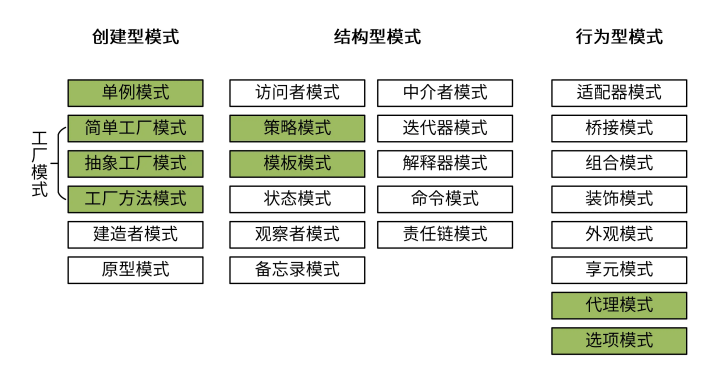

# 设计模式




# 创建型模式


## 单例模式

### 饿汉模式

饿汉方式指全局的单例实例在包被加载时创建
```go
package singleton

type singleton struct {
}

var ins *singleton = &singleton{}

func GetInsOr() *singleton {
    return ins
}
```

### 懒汉模式


线程不安全的

```go
package singleton

type singleton struct {
}

var ins *singleton

func GetInsOr() *singleton {
    if ins == nil {
        ins = &singleton{}
    }
    return ins
}
```

线程安全的: 双重检查方式
```go
import "sync"
type singleton struct {
}
var ins *singleton
var mu sync.Mutex
func GetIns() *singleton {
    if ins == nil {
        mu.Lock()
        if ins == nil {
            ins = &singleton{}
        }
        mu.Unlock()
    }
    return ins
}
```

## 工厂模式


### 简单工厂模式

简单工厂模式是最常用、最简单的。它就是一个接受一些参数，然后
返回 Person 实例的函数：

```go
type Person struct {
    Name string
    Age int
}
func (p Person) Greet() {
    fmt.Printf("Hi! My name is %s", p.Name)
}

func NewPerson(name string, age int) *Person {
    return &Person{
        Name: name,
        Age: age,
    }
}
```

### 抽象工厂模式

抽象工厂模式，它和简单工厂模式的唯一区别，就是它返回的是接口而不是结构
体。


```go
type Person interface {
    Greet()
}

type person struct {
    name string
    age int
}
func (p person) Greet() {
    fmt.Printf("Hi! My name is %s", p.name)
}
// Here, NewPerson returns an interface, and not the person struct itself
func NewPerson(name string, age int) Person {
    return person{
        name: name,
        age: age,
    }
}
```


### 工厂方法模式

在工厂方法模式中，依赖工厂接口，我们可以通过实现工厂接口来创建多种工厂，将对象创建从由一个对象负责所有具体类的实例化，变成由一群子类来负责对具体类的实例化，从而将过程解耦。


```go
type Person struct {
    name string
    age int
}

func NewPersonFactory(age int) func(name string) Person {
    return func(name string) Person {
        return Person{
            name: name,
            age: age,
        }
    }
}
```

# 结构型模式


## 策略模式
策略模式（Strategy Pattern）定义一组算法，将每个算法都封装起来，并且使它们之间可以互换。

```go
package strategy

// 策略模式
// 定义一个策略类
type IStrategy interface {
    do(int, int) int
}
// 策略实现：加
type add struct{}
func (*add) do(a, b int) int {
    return a + b
}
// 策略实现：减
type reduce struct{}
func (*reduce) do(a, b int) int {
    return a - b
}
// 具体策略的执行者
type Operator struct {
    strategy IStrategy
}
// 设置策略
func (operator *Operator) setStrategy(strategy IStrategy) {
    operator.strategy = strategy
}
// 调用策略中的方法
func (operator *Operator) calculate(a, b int) int {
    return operator.strategy.do(a, b)
}
```


## 模版模式


模版模式 (Template Pattern) 定义一个操作中算法的骨架，而将一些步骤延迟到子类中。

这种方法让子类在不改变一个算法结构的情况下，就能重新定义该算法的某些特定步骤。


```go
package template
import "fmt"
type Cooker interface {
    fire()
    cooke()
    outfire()
}
// 类似于一个抽象类
type CookMenu struct {
}

func (CookMenu) fire() {
    fmt.Println("开火")
}
// 做菜，交给具体的子类实现
func (CookMenu) cooke() {
}

func (CookMenu) outfire() {
    fmt.Println("关火")
}
// 封装具体步骤
func doCook(cook Cooker) {
    cook.fire()
    cook.cooke()
    cook.outfire()
}

type XiHongShi struct {
    CookMenu
}

func (*XiHongShi) cooke() {
    fmt.Println("做西红柿")
}

type ChaoJiDan struct {
    CookMenu
}

func (ChaoJiDan) cooke() {
    fmt.Println("做炒鸡蛋")
}
```
测试用例
```go
func TestTemplate(t *testing.T) {

    // 做西红柿
    xihongshi := &XiHongShi{}
    doCook(xihongshi)
    fmt.Println("\n=====> 做另外一道菜")

    // 做炒鸡蛋
    chaojidan := &ChaoJiDan{}
    doCook(chaojidan)
}
```

# 行为型模式


然后，让我们来看最后一个类别，行为型模式（Behavioral Patterns），它的特点是关注**对象之间的通信**。这一类别的设计模式中，我们会讲到代理模式和选项模式。


## 代理模式

代理模式 (Proxy Pattern)，可以为另一个对象提供一个替身或者占位符，以控制对这个对象的访问。

```go
package proxy
import "fmt"

type Seller interface {
    sell(name string)
}
// 火车站
type Station struct {
    stock int //库存
}

func (station *Station) sell(name string) {
    if station.stock > 0 {
        station.stock--
        fmt.Printf("代理点中：%s买了一张票,剩余：%d \n", name, station.stock)
    } else {
        fmt.Println("票已售空")
    }
}
// 火车代理点
type StationProxy struct {
    station *Station // 持有一个火车站对象
}

func (proxy *StationProxy) sell(name string) {
    if proxy.station.stock > 0 {
        proxy.station.stock--
        fmt.Printf("代理点中：%s买了一张票,剩余：%d \n", name, proxy.station.stock)
    } else {
        fmt.Println("票已售空")
    }
}
```

## 选项模式

模式（Options Pattern）也是 Go 项目开发中经常使用到的模式，例如，grpc/grpc go 的NewServer函数，uber-go/zap 包的New函数都用到了选项模式。使用选项模式，我们可以创建一个带有默认值的 struct 变量，并选择性地修改其中一些参数的值。


在 Python 语言中，创建一个对象时，可以给参数设置默认值，这样在不传入任何参数时，可以返回携带默认值的对象，并在需要时修改对象的属性。这种特性可以大大简化开发者创建一个对象的成本，尤其是在对象拥有众多属性时。

而在 Go 语言中，因为不支持给参数设置默认值，为了既能够创建带默认值的实例，又能够创建自定义参数的实例，不少开发者会通过以下两种方法来实现：

第一种方法，我们要分别开发两个用来创建实例的函数，一个可以创建带默认值的实例，一个可以定制化创建实例。


```go
package options
import (
    "time"
)

const (
    defaultTimeout = 10
    defaultCaching = false
)
type Connection struct {
    addr string
    cache bool
    timeout time.Duration
}
// NewConnect creates a connection.
func NewConnect(addr string) (*Connection, error) {
    return &Connection{
        addr: addr,
        cache: defaultCaching,
        timeout: defaultTimeout,
    }, nil
}
// NewConnectWithOptions creates a connection with options.
func NewConnectWithOptions(addr string, cache bool, timeout time.Duration) (*C Connection){

    return &Connection{
        addr: addr,
        cache: cache,
        timeout: timeout,
    }, nil
}
```

另外一种方法相对优雅些。我们需要创建一个带默认值的选项，并用该选项创建实例：

```go
package options

import (
    "time"
)

const (
    defaultTimeout = 10
    defaultCaching = false
)

type Connection struct {
    addr string
    cache bool
    timeout time.Duration
}

type ConnectionOptions struct {
    Caching bool
    Timeout time.Duration
}

func NewDefaultOptions() *ConnectionOptions {
    return &ConnectionOptions{
        Caching: defaultCaching,
        Timeout: defaultTimeout,
    }
}

// NewConnect creates a connection with options.
func NewConnect(addr string, opts *ConnectionOptions) (*Connection, error) {
    return &Connection{
        addr: addr,
        cache: opts.Caching,
        timeout: opts.Timeout,
    }, nil
}
```
使用选项模式来创建实例:

```go
package options
import (
"time"
)
type Connection struct {
    addr string
    cache bool
    timeout time.Duration
}
const (
    defaultTimeout = 10
    defaultCaching = false
)
type options struct {
    timeout time.Duration
    caching bool
}
// Option overrides behavior of Connect.
type Option interface {
    apply(*options)
}
type optionFunc func(*options)

func (f optionFunc) apply(o *options) {
    f(o)
}

func WithTimeout(t time.Duration) Option {
    return optionFunc(func(o *options) {
    o.  timeout = t
    })
}

func WithCaching(cache bool) Option {
    return optionFunc(func(o *options) {
        o.caching = cache
    })
}

// Connect creates a connection.
func NewConnect(addr string, opts ...Option) (*Connection, error) {
    options := options{
        timeout: defaultTimeout,
        caching: defaultCaching,
    }
    for _, o := range opts {
        o.apply(&options)
    }
    return &Connection{
        addr: addr,
        cache: options.caching,
        timeout: options.timeout,
    }, nil
}
```

我们可以通过 `optionFunc` 和 `apply` 来设置属性值，这样当增加属性值时，只需要增加 `Withxxx` 方法，即可，不用修改原方法。所以这种方式只适用于，参数较多，且面临较多修改，并需要提供稳定版本的情况下适用，。