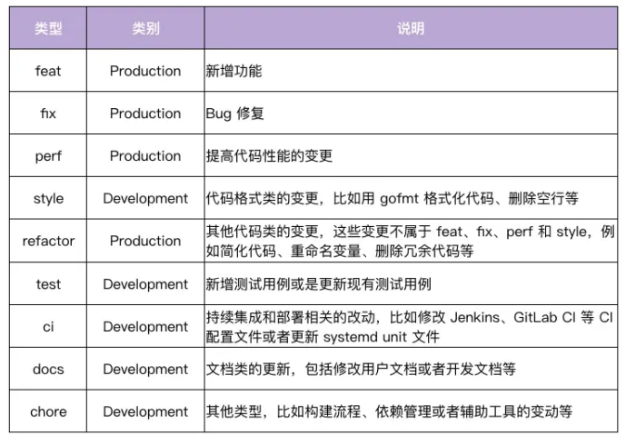

# 非编码类规范

## 开源规范

首先要说明的是，只有开源项目才会用到开源协议，如果你的项目不准备开源，就用不到
开源协议。但先了解一下总是没错的，以后总能用得上。
业界有上百种开源协议，每种开源协议的要求不一样，有的协议对使用条件要求比较苛
刻，有的则相对比较宽松。我们没必要全都记住，只需要知道经常使用的 6 种开源协议，
也就是 GPL、MPL、LGPL、Apache、BSD 和 MIT 就可以了。


那具体如何选择适合自己的开源协议呢？你可以参考乌克兰程序员 Paul Bagwell 画的这张图：


1. 第一，开源项目，应该有一个高的单元覆盖率。这样，一方面可以确保第三方开发者在开发完代码之后，能够很方便地对整个项目做详细的单元测试，另一方面也能保证提交代码的质量。
   
1. 第二，要确保整个代码库和提交记录中，不能出现内部 IP、内部域名、密码、密钥这类信息。否则，就会造成敏感信息外漏，可能会对我们的内部业务造成安全隐患。

1. 第三，当我们的开源项目被别的开发者提交 pull request、issue、评论时，要及时处理，一方面可以确保项目不断被更新，另一方面也可以激发其他开发者贡献代码的积极性。
   
2. 第四，好的开源项目，应该能够持续地更新功能，修复 Bug。对于一些已经结项、不维护的开源项目，需要及时地对项目进行归档，并在项目描述中加以说明。

## 文档规范

### README 规范
README 文档是项目的门面，它是开发者学习项目时第一个阅读的文档，会放在项目的根
目录下。因为它主要是用来介绍项目的功能、安装、部署和使用的，所以它是可以规范化
的。
下面，我们直接通过一个 README 模板，来看一下 README 规范中的内容：
```html
# 项目名称
<!-- 写一段简短的话描述项目 -->

## 功能特性
<!-- 描述该项目的核心功能点 -->

## 软件架构(可选)
<!-- 可以描述下项目的架构 -->


## 快速开始

### 依赖检查
<!-- 描述该项目的依赖，比如依赖的包、工具或者其他任何依赖项 -->

### 构建
<!-- 描述如何构建该项目 -->

### 运行
<!-- 描述如何运行该项目 -->

## 使用指南
<!-- 描述如何使用该项目 -->

## 如何贡献
<!-- 告诉其他开发者如果给该项目贡献源码 -->

## 社区(可选)
<!-- 如果有需要可以介绍一些社区相关的内容 -->

## 关于作者
<!-- 这里写上项目作者 -->

## 谁在用(可选)
<!-- 可以列出使用本项目的其他有影响力的项目，算是给项目打个广告吧 -->

## 许可证
<!-- 这里链接上该项目的开源许可证 -->
```
### 项目文档规范

项目文档包括一切需要文档化的内容，它们通常集中放在 /docs 目录下。当我们在创建团队的项目文档时，通常会预先规划并创建好一些目录，用来存放不同的文档。因此，在开始 Go 项目开发之前，我们也要制定一个软件文档规范。好的文档规范有 2 个优点：易读和可以快速定位文档。

不同项目有不同的文档需求，在制定文档规范时，你可以考虑包含两类文档。为了方便全球开发者和用户使用，开发文档和用户文档，可以预先规划好英文和中文 2 个版本。为了加深你的理解，这里我们来看下实战项目的文档目录结构：


- 开发文档：用来说明该项目的开发流程，比如如何搭建开发环境、构建二进制文件、测试、部署等。

- 用户文档：软件的使用文档，对象一般是软件的使用者，内容可根据需要添加。比如，可以包括 API 文档、SDK 文档、安装文档、功能介绍文档、最佳实践、操作指南、常见问题等。

```
docs
│── devel
│ ├── en-US/                # 英文版文档，可以根据需要组织文件结构
│ └── zh-CN                 # 中文版文档，可以根据需要组织文件结构
│ └── development.md        # 开发手册，可以说明如何编译、构建、运行项目
├── guide                   # 用户文档
│ ├── en-US/                # 英文版文档，可以根据需要组织文件结构
│ └── zh-CN                 # 中文版文档，可以根据需要组织文件结构
│ ├── api/                  # API文档
│ ├── best-practice         # 最佳实践，存放一些比较重要的实践文章
│ │ └── authorization.md
│ ├── faq                   # 常见问题
│ │ ├── iam-apiserver
│ │ └── installation
│ ├── installation          # 安装文档
│ │ └── installation.md
│ ├── introduction/         # 产品介绍文档
│ ├── operation-guide       # 操作指南，里面可以根据RESTful资源再划分为更细的
│ │ ├── policy.md
│ │ ├── secret.md
│ │ └── user.md
│ ├── quickstart            # 快速入门
│ │ └── quickstart.md
│ ├── README.md             # 用户文档入口文件
│ └── sdk                   # SDK文档
│ └── golang.md
└── images                  # 图片存放目录
└── 部署架构v1.png
```

### API 接口文档规范


一个规范的 API 接口文档，通常需要包含:
1. 一个完整的 API 接口介绍文档 - API 接口使用文档中需要包含接口描述、请求方法、请求参数、输出参数和请求示例。
2. API 接口变更历史文档
3. 通用说明
4. 数据结构说明
5. 错误码描述和 API 接口使用文档。


以Markdown 为例接口文档拆分为以下几个 Markdown 文件，并存放在目录 docs/guide/zh-CN/api中：


- `README.md` ：API 接口介绍文档，会分类介绍 IAM 支持的 API 接口，并会存放相关 API 接口文档的链接，方便开发者查看。

- `CHANGELOG.md` ：API 接口文档变更历史，方便进行历史回溯，也可以使调用者决定是否进行功能更新和版本更新。

- `generic.md` ：用来说明通用的请求参数、返回参数、认证方法和请求方法等。
  
- `struct.md` ：用来列出接口文档中使用的数据结构。这些数据结构可能被多个 API 接口使用，会在 `user.md`、`secret.md`、`policy.md` 文件中被引用。

- `user.md` 、 `secret.md` 、 `policy.md` ：API 接口文档，相同 REST 资源的接口会存放在一个文件中，以 REST 资源名命名文档名。

- `error_code.md` ：错误码描述，通过程序自动生成。

这里我拿 user.md 接口文档为例，和你解释下接口文档是如何写的。user.md 文件记录
了用户相关的接口，每个接口按顺序排列，包含如下 5 部分。

- **接口描述**：描述接口实现了什么功能。
- **请求方法**：接口的请求方法，格式为 HTTP 方法 请求路径，例如 POST /v1/users。在 通用说明中的请求方法部分，会说明接口的请求协议和请求地址。
  
- **输入参数**：接口的输入字段，它又分为 Header 参数、Query 参数、Body 参数、Path参数。每个字段通过：`参数名称`、`必选`、`类型` 和 `描述` 4 个属性来描述。如果参数有限制或者默认值，可以在描述部分注明。
  
- **输出参数**：接口的返回字段，每个字段通过 `参数名称`、`类型` 和 `描述` 3 个属性来描述。
  
- **请求示例**：一个真实的 API 接口请求和返回示例


## 版本规范

在做 Go 项目开发时，我建议你把所有组件都加入版本机制。原因主要有两个：
- 一是通过版本号，我们可以很明确地知道组件是哪个版本，从而定位到该组件的功能和代码，方便我们定位问题。
- 二是发布组件时携带版本号，可以让使用者知道目前的项目进度，以及使用版本和上一个版本的功能差别等。


目前业界主流的版本规范是语义化版本规范，也是 IAM 系统采用的版本规范。

### 那什么是语义化版本规范呢？


语义化版本规范（SemVer，Semantic Versioning）是 GitHub 起草的一个具有指导意义的、统一的版本号表示规范。它规定了版本号的表示、增加和比较方式，以及不同版本号代表的含义。

在这套规范下，版本号及其更新方式包含了相邻版本间的底层代码和修改内容的信息。语义化版本格式为：*主版本号.次版本号.修订号（X.Y.Z）*，其中 X、Y 和 Z 为非负的整数，且禁止在数字前方补零。

版本号可按以下规则递增：

- 主版本号（MAJOR）：当做了不兼容的 API 修改。
  
- 次版本号（MINOR）：当做了向下兼容的功能性新增及修改。这里有个不成文的约定需要你注意，偶数为稳定版本，奇数为开发版本。
  
- 修订号（PATCH）：当做了向下兼容的问题修正。

例如，v1.2.3 是一个语义化版本号，版本号中每个数字的具体含义见下图：


你可能还看过这么一种版本号：*v1.2.3-alpha*。这其实是把先行版本号（Pre-release）和版本编译元数据，作为延伸加到了主版本号.次版本号.修订号的后面，格式为 X.Y.Z[-先行版本号][+版本编译元数据]，如下图所示：


先行版本号意味着，该版本不稳定，可能存在兼容性问题，格式为：X.Y.Z-[一连串以句点分隔的标识符] ，比如下面这几个例子：
```
1.0.0-alpha
1.0.0-alpha.1
1.0.0-0.3.7
1.0.0-x.7.z.92
```
编译版本号，一般是编译器在编译过程中自动生成的，我们只定义其格式，并不进行人为控制。下面是一些编译版本号的示例：
```
1.0.0-alpha+001
1.0.0+20130313144700
1.0.0-beta+exp.sha.5114f85
```

### 如何确定版本号？
- 第一，在实际开发的时候，我建议你使用 0.1.0 作为第一个开发版本号，并在后续的每次发行时递增次版本号。
  
- 第二，当我们的版本是一个稳定的版本，并且第一次对外发布时，版本号可以定为 1.0.0。
- 
- 第三，当我们严格按照 Angular commit message 规范提交代码时，版本号可以这么来确定：
    - fix 类型的 commit 可以将修订号 +1。
    - feat 类型的 commit 可以将次版本号 +1。
    - 带有 BREAKING CHANGE 的 commit 可以将主版本号 +1。


## Commit规范


使用git查找日志:
基于这些 Commit Message 进行过滤查找，比如只查找某个版本新增的功能：
```bash
git log --oneline --grep "^feat|^fix|^perf"。
```


```

<type>([optional scope]): <description>
// 空行
[optional body]
// 空行
[optional footer(s)]
```
示例


Header 部分只有一行，包括三个字段：type（必选）、scope（可选）和 subject（必选）。


**type**


有这么多 type，我们该如何确定一个 commit 所属的 type 呢？这里我们可以通过下面这张图来确定


**scope**

scope 是用来说明 commit 的影响范围的，它必须是名词。显然，不同项目会有不同的scope。在项目初期，我们可以设置一些粒度比较大的 scope，比如可以按组件名或者功能来设置 scope；后续，如果项目有变动或者有新功能，我们可以再用追加的方式添加新的 scope。

**subject**


subject 是 commit 的简短描述，必须以动词开头、使用现在时。比如，我们可以用change，却不能用 changed 或 changes，而且这个动词的第一个字母必须是小写。通过这个动词，我们可以明确地知道 commit 所执行的操作。此外我们还要注意，subject 的结尾不能加英文句号。

**Body**

Body 部分可以分成多行，而且格式也比较自由。不过，和 Header 里的一样，它也要以动词开头，使用现在时。此外，它还必须要包括修改的动机，以及和跟上一版本相比的改动点。

**Footer**


### 提交频率

一种情况是，只要我对项目进行了修改，一通过测试就立即 commit。比如修复完一个 bug、开发完一个小功能，或者开发完一个完整的功能，测试通过后就提交。

另一种情况是，我们规定一个时间，定期提交。这里我建议代码下班前固定提交一次，并且要确保本地未提交的代码，延期不超过 1 天。这样，如果本地代码丢失，可以尽可能减少丢失的代码量。


按照上面 2 种方式提交代码，你可能会觉得代码 commit 比较多，看起来比较随意。或者说，我们想等开发完一个完整的功能之后，放在一个 commit 中一起提交。这时候，我们可以在最后合并代码或者提交 Pull Request 前，执行 git rebase -i 合并之前的所有commit。


那么如何合并 commit 呢？接下来，我来详细说说。


### 合并提交

合并提交，就是将多个 commit 合并为一个 commit 提交。这里，我建议你把新的commit 合并到主干时，只保留 2~3 个 commit 记录。那具体怎么做呢？


在 Git 中，我们主要使用 git rebase 命令来合并。git rebase 也是我们日后开发需要经常使用的一个命令，所以我们一定要掌握好它的使用方法

**git rebase 命令介绍**


> git rebase 的最大作用是它可以重写历史。

我们通常会通过 git rebase -i <commit ID>使用 git rebase 命令，-i 参数表示交互（interactive），该命令会进入到一个交互界面中，其实就是 Vim 编辑器。在该界面中，我们可以对里面的 commit 做一些操作，交互界面如图所示：


### 合并提交操作示例

使用小乌龟


## 工作流

### 集中式工作流


我们先来看看集中式工作流，它是最简单的一种开发方式。集中式工作流的工作模式如下图所示：


所有人在同一 分支上协作


适合用在团队人数少、开发不频繁、不需要同时维护多个版本的小项目中


### 功能分支工作流

功能分支工作流基于集中式工作流演进而来。在开发新功能时，基于 master 分支新建一个功能分支，在功能分支上进行开发，而不是直接在本地的 master 分支开发，开发完成之后合并到 master 分支，如下图所示：


相较于集中式工作流，这种工作流让不同功能在不同的分支进行开发，只在最后一步合并到 master 分支，不仅可以避免不同功能之间的相互影响，还可以使提交历史看起来更加简洁。

还有，在合并到 master 分支时，需要提交 PR（pull request），而不是直接将代码merge 到 master 分支。PR 流程不仅可以把分支代码提供给团队其他开发人员进行CR（Code Review），还可以在 PR 页面讨论代码。通过 CR ，我们可以确保合并到master 的代码是健壮的；通过 PR 页面的讨论，可以使开发者充分参与到代码的讨论中，

有助于提高代码的质量，并且提供了一个代码变更的历史回顾途径。


那么，功能分支工作流具体的开发流程是什么呢？我们一起来看下。

1. 基于 master 分支新建一个功能分支，功能分支可以取一些有意义的名字，便于理解，

    例如 feature/rate-limiting。
    ```bash
    $ git checkout -b feature/rate-limiting
    ```
1. 在功能分支上进行代码开发，开发完成后 commit 到功能分支。
   
    ```bash
    $ git add limit.go
    $ git commit -m "add rate limiting"
    ```
1. 将本地功能分支代码 push 到远程仓库。
   ```bash
   $ git push origin feature/rate-limiting
   ```
1. 在远程仓库上创建 PR（例如：GitHub）。
   
   

    点击 Compare & pull request 后会进入 PR 页面，在该页面中可以根据需要填写评论，最后点击 Create pull request 提交 PR。


1. 代码管理员收到 PR 后，可以 CR 代码，CR 通过后，再点击 Merge pull request 将PR 合并到 master，如下图所示。

### Git Flow 工作流 - todo


Git Flow 工作流是一个非常成熟的方案，也是非开源项目中最常用到的工作流。它定义了一个围绕项目发布的严格分支模型，通过为代码开发、发布和维护分配独立的分支来让项目的迭代流程更加顺畅，比较适合大型的项目或者迭代速度快的项目。接下来，我会通过介绍 Git Flow 的 5 种分支和工作流程，来给你讲解 GIt Flow 是如何工作的。


#### Git Flow 的 5 种分支

Git Flow 中定义了 5 种分支，分别是 `master`、`feature` 、`release` 和 `hotfix`。其中， `master`  和 `develop` 为常驻分支，其他为非常驻分支，不同的研发阶段会用到不同的分支。这 5 种分支的详细介绍见下表：


## 发布规范


# 开发规范

1. 目录结构
2. 模块拆分

## 目录规范

**规范要求**

- 命名清晰：目录命名要清晰、简洁，不要太长，也不要太短，目录名要能清晰地表达出该目录实现的功能，并且目录名最好用单数。一方面是因为单数足以说明这个目录的功能，另一方面可以统一规范，避免单复混用的情况。
  
- 功能明确：一个目录所要实现的功能应该是明确的、并且在整个项目目录中具有很高的辨识度。也就是说，当需要新增一个功能时，我们能够非常清楚地知道把这个功能放在哪个目录下。
  
- 全面性：目录结构应该尽可能全面地包含研发过程中需要的功能，例如文档、脚本、源码管理、API 实现、工具、第三方包、测试、编译产物等。
  
- 可预测性：项目规模一定是从小到大的，所以一个好的目录结构应该能够在项目变大时，仍然保持之前的目录结构。
  
- 可扩展性：每个目录下存放了同类的功能，在项目变大时，这些目录应该可以存放更多同类功能。

### 平铺式目录结构


一个 Go 项目可以是一个应用，也可以是一个代码框架 / 库，当项目是代码框架 / 库时，比较适合采用平铺式目录结构。


平铺方式就是在项目的根目录下存放项目的代码，整个目录结构看起来更像是一层的，这种方式在很多框架 / 库中存在，使用这种方式的好处是引用路径长度明显减少，

比如： 
github.com/marmotedu/log/pkg/options，
可缩短为
github.com/marmotedu/log/options。


例如 log 包 github.com/golang/glog 就是平铺式的，目录如下：

```bash
$ ls glog/
glog_file.go glog.go glog_test.go LICENSE README
```


接下来，我们来学习结构化目录结构，它比较适合 Go 应用，也比较复杂。

### 结构化目录结构

一个 Go 项目包含 3 大部分：`Go 应用` 、`项目管理` 、 `文档` 。所以，我们的项目目录也可以分为这 3 大类。同时，Go 应用又贯穿开发阶段、测试阶段和部署阶段，相应的应用类的目录，又可以按开发流程分为更小的子类。当然了，这些是我建议的目录，Go项目目录中还有一些不建议的目录。所以整体来看，我们的目录结构可以按下图所示的方式来分类：


## 模块拆分


### 按层拆分

最典型的是 MVC 架构中的模块拆分方式。在 MVC 架构中，我们将服务中的不同组件按访问顺序，拆分成了 Model、View 和 Controller 三层。


### 按功能拆分

在 Go 项目中我建议你使用的是按功能拆分的方法，这也是 Go 项目中最常见的拆分方法。

比如，一个订单系统，我们可以根据不同功能将其拆分成用户（user）、订单（order）和计费（billing）3 个模块，每一个模块提供独立的功能，功能更单一


## 代码规范


go 静态代码检查工具： golangci-lint
## 代码质量

### 单元测试


如果我们要对函数 A 进行测试，并且 A 中的所有代码均能够在单元测试环境下按预期被执行，那么函数 A 的代码块就是可测试的。我们来看下一般的单元测试环境有什么特点：


- 可能无法连接数据库。
- 可能无法访问第三方服务。

如果函数 A 依赖数据库连接、第三方服务，那么在单元测试环境下执行单元测试就会失败，函数就没法测试，函数是不可测的。

解决方法也很简单：将依赖的数据库、第三方服务等抽象成接口，在被测代码中调用接口的方法，在测试时传入 mock 类型，从而将数据库、第三方服务等依赖从具体的被测函数中解耦出去：

```go
package post

import "google.golang.org/grpc"

type Post struct {
    Name string
    Address string
}
func ListPosts(client *grpc.ClientConn) ([]*Post, error) {
    return client.ListPosts()
}
```

这段代码中的 ListPosts 函数是不可测试的。因为 ListPosts 函数中调用了client.ListPosts()方法，该方法依赖于一个 gRPC 连接。而我们在做单元测试时，可能因为没有配置 gRPC 服务的地址、网络隔离等原因，导致没法建立 gRPC 连接，从而导致 ListPosts 函数执行失败。

下面，我们把这段代码改成可测试的，如下：

```go

package main
type Post struct {
    Name string
    Address string
}
type Service interface {
    ListPosts() ([]*Post, error)
}

func ListPosts(svc Service) ([]*Post, error) {
    return svc.ListPosts()
}
```
上面代码中，ListPosts 函数入参为 Service 接口类型，只要我们传入一个实现了 Service接口类型的实例，ListPosts 函数即可成功运行。因此，我们可以在单元测试中可以实现一个不依赖任何第三方服务的 fake 实例，并传给 ListPosts。上述可测代码的单元测试代码

如下：
```go
package main
import "testing"
type fakeService struct {
}

func NewFakeService() Service {
    return &fakeService{}
}
func (s *fakeService) ListPosts() ([]*Post, error) {
    posts := make([]*Post, 0)
    posts = append(posts, &Post{
        Name: "colin",
        Address: "Shenzhen",
    })
    posts = append(posts, &Post{
        Name: "alex",
        Address: "Beijing",
    })
    return posts, nil
}

func TestListPosts(t *testing.T) {
    fake := NewFakeService()
    if _, err := ListPosts(fake); err != nil {
        t.Fatal("list posts failed")
    }
}
```

当我们的代码可测之后，就可以借助一些工具来 Mock 需要的接口了。常用的 Mock 工具，有这么几个：


- golang/mock，是官方提供的 Mock 框架。它实现了基于 interface 的 Mock 功能，能够与 Golang 内置的 testing 包做很好的集成，是最常用的 Mock 工具。golang/mock 提供了 mockgen 工具用来生成 interface 对应的 Mock 源文件。

- sqlmock，可以用来模拟数据库连接。数据库是项目中比较常见的依赖，在遇到数据库依赖时都可以用它。


- httpmock，可以用来 Mock HTTP 请求。


- bouk/monkey，猴子补丁，能够通过替换函数指针的方式来修改任意函数的实现。如果 golang/mock、sqlmock 和 httpmock 这几种方法都不能满足我们的需求，我们可以尝试通过猴子补丁的方式来 Mock 依赖。可以这么说，猴子补丁提供了单元测试Mock 依赖的最终解决方案。

接下来，我们再一起看看如何提高我们的单元测试覆盖率。

- 使用 gotests 工具自动生成单元测试代码，减少编写单元测试用例的工作量，将你从重复的劳动中解放出来。

- 定期检查单元测试覆盖率。你可以通过以下方法来检查：
```bash
# 运行当前目录下的所有测试，并启用竞态条件检测、测试覆盖率分析，并将覆盖率数据输出到coverage.out文件，同时设置测试的超时时间和以详细模式运行。
go test -race -cover -coverprofile=./coverage.out -timeout=10m -short -v ./

# 读取和分析coverage.out文件中的覆盖率数据，并以函数为单位显示每个函数的代码覆盖率。
go tool cover -func ./coverage.out
```
### 变成哲学


## 接口规范

## 日志规范
## 错误码规范