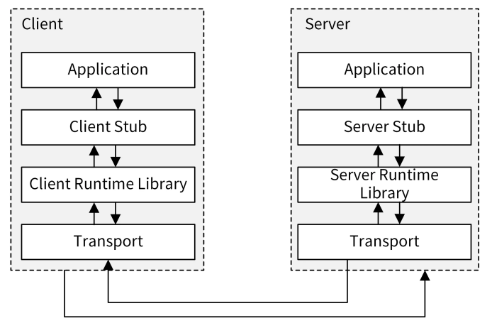
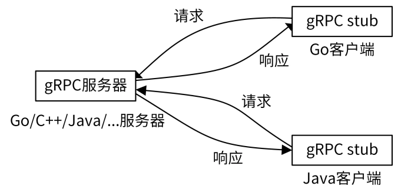

# RPC API

根据维基百科的定义，RPC（Remote Procedure Call），即远程过程调用，是一个计算机通信协议。该协议允许运行于一台计算机的程序调用另一台计算机的子程序，而程序员不用额外地为这个交互作用编程。

RPC 的调用过程如下图所示：



RPC 调用具体流程如下：

1. Client 通过本地调用，调用 Client Stub。
   
2. Client Stub 将参数打包（也叫 Marshalling）成一个消息，然后发送这个消息。
   
3. Client 所在的 OS 将消息发送给 Server。
   
4. Server 端接收到消息后，将消息传递给 Server Stub。
   
5. Server Stub 将消息解包（也叫 Unmarshalling）得到参数。Server Stub 调用服务端的子程序（函数），处理完后，将最终结果按照相反的步骤返回给 Client。


这里需要注意，Stub 负责调用参数和返回值的流化（serialization）、参数的打包和解包，以及网络层的通信。Client 端一般叫 Stub，Server 端一般叫 Skeleton。

目前，业界有很多优秀的 RPC 协议，例如腾讯的 Tars、阿里的 Dubbo、微博的Motan、Facebook 的 Thrift、RPCX，等等。但使用最多的还是gRPC，这也是本专栏所采用的 RPC 框架，所以接下来我会重点介绍 gRPC 框架。


## gRPC 介绍

gRPC 是由 Google 开发的高性能、开源、跨多种编程语言的通用 RPC 框架，基于 HTTP2.0 协议开发，默认采用 Protocol Buffers 数据序列化协议。gRPC 具有如下特性：

支持多种语言，例如 Go、Java、C、C++、C#、Node.js、PHP、Python、Ruby 等。

基于 IDL（Interface Definition Language）文件定义服务，通过 proto3 工具生成指定语言的数据结构、服务端接口以及客户端 Stub。通过这种方式，也可以将服务端和客户端解耦，使客户端和服务端可以并行开发。通信协议基于标准的 HTTP/2 设计，支持双向流、消息头压缩、单 TCP 的多路复用、服务端推送等特性。

支持 Protobuf 和 JSON 序列化数据格式。Protobuf 是一种语言无关的高性能序列化框架，可以减少网络传输流量，提高通信效率。




像很多其他的 RPC 服务一样，gRPC 也是通过 IDL 语言，预先定义好接口（接口的名字、传入参数和返回参数等）。在服务端，gRPC 服务实现我们所定义的接口。在客户端，gRPC 存根提供了跟服务端相同的方法。

gRPC API 接口通常使用的数据传输格式是 Protocol Buffers。

## Protocol Buffers 介绍


Protocol Buffers（ProtocolBuffer/ protobuf）是 Google 开发的一套对数据结构进行序列化的方法，可用作（数据）通信协议、数据存储格式等，也是一种更加灵活、高效的数据格式，与 XML、JSON 类似。它的传输性能非常好，所以常被用在一些对数据传输性能要求比较高的系统中，作为数据传输格式。Protocol Buffers 的主要特性有下面这几个：

- 更快的数据传输速度：protobuf 在传输时，会将数据序列化为二进制数据，和 XML、JSON 的文本传输格式相比，这可以节省大量的 IO 操作，从而提高数据传输速度。

- 跨平台多语言：protobuf 自带的编译工具 protoc 可以基于 protobuf 定义文件，编译出不同语言的客户端或者服务端，供程序直接调用，因此可以满足多语言需求的场景。具有非常好的扩展性和兼容性，可以更新已有的数据结构，而不破坏和影响原有的程序。
  
- 基于 IDL 文件定义服务，通过 proto3 工具生成指定语言的数据结构、服务端和客户端接口。


在 gRPC 的框架中，Protocol Buffers 主要有三个作用。

1. 可以用来定义数据结构。举个例子，下面的代码定义了一个 SecretInfo 数据结构：
   ```go
    // SecretInfo contains secret details.
    message SecretInfo {
        string name = 1;
        string secret_id = 2;
        string username = 3;
        string secret_key = 4;
        int64 expires = 5;
        string description = 6;
        string created_at = 7;
        string updated_at = 8;
    }
   ```
1. 可以用来定义服务接口。下面的代码定义了一个 Cache 服务，服务包含了ListSecrets 和 ListPolicies 两个 API 接口。
   
   ```go
   // Cache implements a cache rpc service.
    service Cache{
        rpc ListSecrets(ListSecretsRequest) returns (ListSecretsResponse) {}
        rpc ListPolicies(ListPoliciesRequest) returns (ListPoliciesResponse) {}
    }
   ```

1. 可以通过 protobuf 序列化和反序列化，提升传输效率。


## gRPC


## 安全传输


**认证**

1. 使用SSL/TLS 认证方式(HTTP2)
2. 基于 Token 的认证方式（基于安全连接）
3. 不采用任何措施的连接，这是不安全的连接（默认采用http1）
4. 自定义的身份认证


TLS 协议主要解决如下的三个安全问题：

1. 保密：基于密码学实现
2. 完整性：基于 HMAC 校验机制
3. 认证：双方认证，双方都可以配备证书，防止身份被冒充


**证书**

- key: 服务器上的私钥文件，用于对数据加密、解密

- crt：由CA 签名后的证书，或者是开发者自签名的证书，包含证书持有人的信息，持有人的公钥，以及签署者的签名信息
  
- csr：证书签名请求文件，用于提交给证书颁发机构(CA)对证书签名

- pem：基于Base64编码的证书格式，扩展名包括 pem 、crt 、cer


### SSL/TSL认证

1. 安装 openssl 
   
    官网: https://www.openssl.org/source/

    便捷安装包：https://slproweb.com/products/Win32OpenSSL.html

    安装后配置到环境变量

1. 生成证书
   
   生成自签名证书，作为CA
    ```bash
    # 1. 生成 server.key 并将生成的私钥写入
    openssl genrsa -out server.key 2048

    #2. 生成证书 全部回车即可，可以不填
    openssl req -new -x509 -key server.key -out server.crt -days 36500
    ...填入国家、省份等各种信息

    #3. 生成 csr
    openssl req -new -key server.key -out server.csr
    ```

    使用上面生成的证书，作为CA 签发下面的 test 证书
    ```bash
    # 生成私钥
    openssl genpkey -algorithm RSA -out test.key
    

    # 使用私钥与 openssl.cfg 配置生成  证书请求文件test.csr
    openssl req -new -nodes -key test.key -out test.csr -days 3650 -subj "/C=cn/OU=myorg/O=mycomp/CN=myname" -config ./openssl.cfg -extensions v3_req
    

    # 这个命令使用 OpenSSL 来根据证书签名请求（CSR）test.csr 签发一个新的证书 test.pem。
    # 证书的有效期被设置为 365 天。它使用 server.crt 作为 CA 证书，server.key 作为 CA 的私钥来签名新证书。
    # 如果尚未存在序列号文件，-CAcreateserial 选项将创建一个新的序列号文件（通常名为 serial 或 serial.txt），
    # 用于跟踪已签发的证书序列号。
    openssl x509 -req -days 365 -in test.csr -out test.pem -CA server.crt -CAkey server.key -CAcreateserial -extfile ./openssl.cfg -extensions v3_ca
    ```
