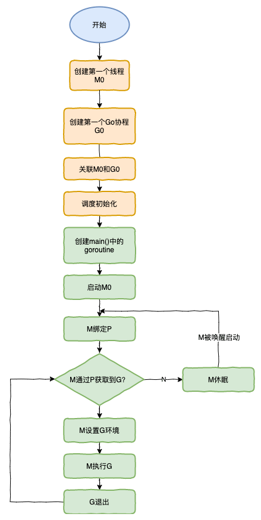

# 函数


<!-- ## 栈帧-todo -->

## 逃逸分析

**逃逸分析定义：**

> 当函数局部变量的声明周期，超过栈帧的声明周期，编译器会把该局部变量由栈分配修改为堆分配，即变量从栈上逃逸到堆上。


在实际中，只要代码逻辑允许，编译器总是倾向于把变量分配在栈上，这比分配在堆上更高效。所以编译器倾向于让变量不逃逸。

## 闭包

**闭包：**
> 在某个函数内部定义了另一个函数，内层函数使用了外层函数的局部变量，并且内层函数被外层函数作为返回值返回。


<!-- ## Function Value -todo -->


## defer

`Go` 语言的 `defer` 按照先入后出 - FILO(First In Last Out)的顺序调用所有注册的函数。


## panic

# 方法

## 组合式继承


# goroutine

## GM模型-todo

## GMP模型


- 全局队列（Global Queue）：存放等待运行的 G。
- 每个 P 维护一个本地队列
- 当一个 G 被创建出来或者变为可执行状态时，优先放到 P 的本地队列中，否则放到全局队列
- 当一个 G 在 M中执行结束后， 调度器 会从P队列中把新的 G 取出交给 M 执行，如果此时 P队列为空， M 会优先尝试从全局队列中寻找 G 来执行，如果全局队列为空，它会随机挑选一个 P 从它的队列中拿走一半G 放到自己的队列中执行

## P 与 M 的数量问题
1. P 的数量：
   
    由启动时环境变量 `$GOMAXPROCS` 或者是由 `runtime` 的方法 `GOMAXPROCS()` 决定。这意味着在程序执行的任意时刻都只有 `$GOMAXPROCS` 个 `goroutine` 在同时运行。
1. M 的数量:
   - go 语言本身的限制：go 程序启动时，会设置 M 的最大数量，默认 10000. 但是内核很难支持这么多的线程数，所以这个限制可以忽略。
   - runtime/debug 中的 SetMaxThreads 函数，设置 M 的最大数量
   - 一个 M 阻塞了，会创建新的 M。
  
M 与 P 的数量没有绝对关系，一个 M 阻塞，P 就会去创建或者切换另一个 M，所以，即使 P 的默认数量是 1，也有可能会创建很多个 M 出来。


## P 和 M 何时会被创建

1. P 何时创建：在确定了 P 的最大数量 n 后，运行时系统会根据这个数量创建 n 个 P。

2. M 何时创建：没有足够的 M 来关联 P 并运行其中的可运行的 G。比如所有的 M 此时都阻塞住了，而 P 中还有很多就绪任务，就会去寻找空闲的 M，而没有空闲的，就会去创建新的 M。

## 调度器的设计策略

核心策略就是 **复用线程**，避免频繁的创建、销毁线程。

对于线程的复用则是通过以下的子策略

1. work stealing 机制 - 工作窃取
   
   当本线程无可运行的 `G` 时，尝试从其他线程绑定的 `P` 偷取 `G`，而不是销毁本线程

1. hand off 机制 - 移交机制
   
   当本线程因为 `G` 进行系统调用阻塞时，线程释放绑定的 `P` ，将其移交给其它空闲线程执行

**调度器的其它特点**

**利用并行**： `GOMAXPROCS` 设置 `P` 的数量，最多有 `GOMAXPROCS` 个线程分布在多个 `CPU` 上同时运行。 `GOMAXPROCS` 也限制了并发的程度，比如 `GOMAXPROCS = 核数/2`，则最多利用了一半的 `CPU` 核进行并行。

**抢占**: 在 `coroutine-协程` 中要等待一个协程主动让出 `CPU` 才执行下一个协程，在 `Go` 中，一个 `goroutine` 最多占用 `CPU` `10ms`，防止其他 `goroutine` 被饿死，这就是 `goroutine` 不同于 `coroutine` 的一个地方。

**全局 G 队列**：在新的调度器中依然有全局 `G` 队列，但功能已经被弱化了，当 `M` 执行 `work stealing` 从其他 `P` 偷不到 `G` 时，它可以从全局 `G` 队列获取 `G`


## go func () 执行流程


1. 通过 `go` 关键字创建 `goroutine` 并执行
2. 被创建出来的 `goroutine` 优先被放入本地 `P队列` 如果 `P队列` 已满(256) ，那么放到 `全局G队列`
3. `gorouotine` 只能运行在 `M` 中
   1. 在大多数情况下， `M` 和 `P` 之间保持 `1:1` 的关系，即一个M绑定一个 `P` 。
   2. 如 `M` 阻塞时，这种关系可能会暂时打破，直到 `M` 重新获得一个 `P` 。
   3. 当 `P` 为空时，就会向其它 `MP` 组合中偷取一些可执行的 `G` 来执行
4. `M` 对 `P` 的调度是一个循环过程
5. 如果 `G` 发生 `syscall` 或者因为其他原因阻塞，则会创建一个 `M` (或者从 `M` 的休眠队列中取出一个) ，接管阻塞的 `G` 所在的 `P`
   1. 当这个 `M`  系统调用结束后，会尝试获取一个空闲的 `P` 执行，并将 当前的 `G` 放入该`P`，
   2. 如果获取不到，就会将 `M` 变为休眠状态，并加入休眠的 `M` 容器中 , 这个 `G` 则会放入全局队列中。
6. 当 `M` 调用 `G` 结束后,会销毁 `G` 


## 调度器的生命周期


**M0** ：`M0` 是启动程序后的编号为 `0` 的主线程，它的实例会保存在全局变量 `runtime.M0` 中。 `M0` 的主要职责是执行初始化操作并启动第一个 `goroutine（g0`） 。在初始化完成后， `M0` 的行为与其他普通的 M` （机器）相同，参与 `goroutine` 的调度和执行。

**`M0`的特点**
- 不在堆上分配内存，生命周期贯穿整个程序
- 负责程序启动时的初始化工作，如设置运行时环境 、 创建第一个 goroutine 等
- 在初始化完成后， `M0` 会和起亚 `M` 一样从 `P` 的本地队列 或 全局队列 中获取 `goroutine` 并执行
  


**G0**： `G0` 是每次启动一个 `M` 都会创建的第一个 `goroutine` ，但它不指向任何可执行的函数， `G0` 的主要职责在于调度， 它在 `goroutine` 调度的过程中充当了一个桥梁的角色，帮助在不同的 `goroutine` 之间，切换上下文

**`G0`的特点**： 

- 每个 `M` 都会有自己的 `G0` , 用于调度或者在系统调用时使用其栈空间
- `G0` 不参与实际的业务执行，它的栈主要用于保存 goroutine 的上下文信息，以便在 goroutine 切换时能够恢复执行
- 在 goroutine 执行系统调用（syscall）,或者发生阻塞时， 会使用 `G0` 的栈空间
  


我们来跟踪一段代码
```go
package main

import "fmt"

func main() {
    fmt.Println("Hello world")
}
```


1. `runtime` 创建最初的线程 `M0` 和 `goroutine g0`，并把 `2` 者关联。

2. 调度器初始化：初始化 `M0` 、 `栈` 、垃圾回收，以及创建和初始化由 `GOMAXPROCS` 个 `P` 构成的 `P` 列表。

3. 示例代码中的 `main` 函数是 `main.main`， `runtime` 中也有 `1` 个 `main` 函数 —— `runtime.main`，代码经过编译后，`runtime.main` 会调用 `main.main`，程序启动时会为 `runtime.main` 创建 `goroutine` ，称它为 `main goroutine` 吧，然后把 `main goroutine` 加入到 `P` 的本地队列。

4. 启动 `M0` ， `M0` 已经绑定了 `P`，会从 `P` 的本地队列获取 `G`，获取到 `main goroutine`。
5. `G` 拥有栈，`M` 根据 `G` 中的栈信息和调度信息设置运行环境
6. `M` 运行 `G`
7. `G` 退出，再次回到 `M` 获取可运行的 `G` ，这样重复下去，直到 `main.main` 退出，`runtime.main` 执行 `Defer` 和 `Panic` 处理，或调用 `runtime.Goexit` 退出程序。


## 可视化 GMP 编程

### go tool trace

trace 记录了运行时的信息，能提供可视化的 Web 页面。

简单测试代码：main 函数创建 trace，trace 会运行在单独的 goroutine 中，然后 main 打印”Hello World” 退出。
> trace.go
```go
package main

import (
    "os"
    "fmt"
    "runtime/trace"
)

func main() {

    //创建trace文件
    f, err := os.Create("trace.out")
    if err != nil {
        panic(err)
    }

    defer f.Close()

    //启动trace goroutine
    err = trace.Start(f)
    if err != nil {
        panic(err)
    }
    defer trace.Stop()

    //main
    fmt.Println("Hello World")
}
```
运行程序
```bash
go run trace.go 
Hello World
```
会得到一个 `trace.out` 文件，然后我们可以用一个工具打开，来分析这个文件。
```bash
go tool trace trace.out 
2020/02/23 10:44:11 Parsing trace...
2020/02/23 10:44:11 Splitting trace...
2020/02/23 10:44:11 Opening browser. Trace viewer is listening on http://127.0.0.1:33479
```
我们可以通过浏览器打开 http://127.0.0.1:33479 网址，点击 view trace 能够看见可视化的调度流程。

点击 

进入


**G 信息**

点击 Goroutines 那一行可视化的数据条，我们会看到一些详细的信息。


> 一共有两个G在程序中，一个是特殊的G0，是每个M必须有的一个初始化的G，这个我们不必讨论。
注意：可以点击数据条的不同位置观看 goroutine 的生命周期

**M 信息**

点击 Threads 那一行可视化的数据条，我们会看到一些详细的信息。


> 一共有两个 M 在程序中，一个是特殊的 M0，用于初始化使用，这个我们不必讨论。


**P 信息**


其它场景
<https://learnku.com/articles/41728>
# 同步

# 堆


