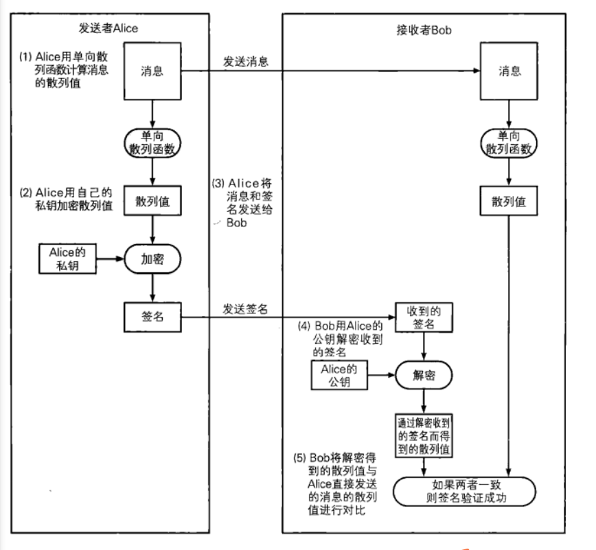

# 数字签名

数字签名（digital signat.ure）它解决的是消息到底是谁发出的。相当于现实世界中的盖章、签字功能。使用数字签名可以识别篡改、伪装、防止否认。

# 数字签名是如何解决问题的

我们假设Alice使用的密钥是一个只有Alice自己才知道的私钥。当Alice发送消息时，她用私钥生成一个“签名"。相对地，接收者Bob则使用一个和Alice不同的密钥对签名进行验证。使用Bob的密钥无法根据消息生成签名，但是用Bob的密钥却可以对Alice所计算的签名进行验证，也就是说可以知道这个签名是否是通过Alice的密钥计算出来的。

这样就解决了识别篡改、伪装和防止否认问题

# 签名的验证和生成

在数字签名技术中出现了两种行为

1. 生成消息签名的行为
2. 验证消息签名的行为

**生成消息签名**这个行为是由消息发送者来完成的，生成签名就是根据消息内容计算数字签名的值，这个行为意味着 - 我认可该消息的内容。

**验证消息签名**这个行为一般是由消息的接受者来完成的，也可以由第三方进行验证。

在数字签名中，对生成签名和验证签名的密钥进行了区分。**签名密钥只能由签名的人持有，而验证签名的密钥则人人都可以持有。**

非对称加密也有同样的特点，只是使用方式稍有不同。

|              |         私钥         |            公钥            |
| ------------ | :------------------: | :------------------------: |
| 非对称加密   |   接收者解密时使用   |      发送者加密时使用      |
| 数字签名     | 签名者生成签名时使用 |    验证者验证签名时使用    |
| 谁持有秘钥？ |       个人持有       | 只要需要，任何人都可以持有 |

# 非对称加密和数字签名

非对称加密包括一个由公钥和私钥组成的密钥对，其中公钥用于加密，私钥用于解密。


数字签名中也同样会使用公钥和私钥组成的密钥对，不过这两个密钥的用法和非对称加密是相反的，即用私钥加密相当于生成签名，而用公钥解密则相当于验证签名。


使用私钥进行签名，公钥进行验证的好处是，任何人都可以对签名进行验证。


# 数字签名的方法

数字签名一般是下面两种方法

1. 对消息体进行签名
2. 对消息的散列值进行签名

对整个消息签名非常耗时，这是因为非对称加密相对于对称加密比较慢，所以我们先对整个消息进行散列，随后对散列值进行签名即可。



1. alice利用散列函数，计算消息的散列值
2. alice使用私钥将消息的散列值签名
3. alice将签名和消息发送给bob
4. bob使用alice的公钥，对签名进行解密，得到消息的散列值，同时对收到的消息进行散列得到散列值，两者对比即可验证消息是否由alice发出，是否被篡改

# 通过RSA实现数字签名

生成数字签名

```go
func SignatureRSA(data []byte) ([]byte, error) {

	//1. 从密钥文件中读取密钥内容
	fp, err := os.Open("private.pem")
	if err != nil {
		return nil, errors.New("打开私钥文件 - private.pem 失败！！！")
	}
	//2. 读取文件内容
	fileInfo, _ := fp.Stat()
	all := make([]byte, fileInfo.Size())

	_, err = fp.Read(all)

	if err != nil {
		return nil, errors.New("读取文件内容失败！！！")
	}
	//fmt.Println("文件内容：", string(all))

	//3. 关闭文件
	defer fp.Close()

	//4. 将数据解析成pem格式的数据块
	block, _ := pem.Decode(all)

	//5. 解析pem数据块，得到私钥
	priv_key, err := x509.ParsePKCS1PrivateKey(block.Bytes)

	//6. 将数据通过哈希生成摘要
	myHash := sha256.New()
	myHash.Write(data)
	result := myHash.Sum(nil)

	//7. 对散列值生成签名
	mySignature, err := rsa.SignPKCS1v15(rand.Reader, priv_key, crypto.SHA256, result)

	if err != nil {
		return nil, errors.New("生成签名失败！！！")
	}
	fmt.Println("签名：",string( mySignature))
	return mySignature, nil
}

func VerifyRSA(data []byte, src []byte) error {
	//1. 从密钥中读取生成的密钥内容
	fp, err := os.Open("public.pem")
	if err != nil {
		return errors.New("打开公钥文件 - public.pem失败")
	}

	//2. 读文件内容
	fileInfo, _ := fp.Stat()
	all := make([]byte, fileInfo.Size())

	num, err := fp.Read(all)

	if err != nil {
		return errors.New("读取文件内容失败")
	}

	fmt.Println("文件大小：", num)

	//3. 关闭文件
	defer fp.Close()

	//4. 将公钥数据解析为pem格式的数据块
	block, _ := pem.Decode(all)

	//5. 将公钥从pem数据块中提取出来
	pubInterface, err := x509.ParsePKIXPublicKey(block.Bytes)

	if err != nil {
		return errors.New("解析公钥失败！！！")
	}

	//6. 公钥接口转换为公钥对象
	pubKey := pubInterface.(*rsa.PublicKey)

	// 7. 将数据通过哈希函数生成信息摘要
	myHash := sha256.New()
	myHash.Write(data)
	result := myHash.Sum(nil)

	// 7. 数据认证
	err = rsa.VerifyPKCS1v15(pubKey, crypto.SHA256, result, src)
	if err != nil {
		return err
	}
	fmt.Println("数字签名验证成功, 恭喜o(*￣︶￣*)o恭喜")
	return nil
}

func RSASignTest() {
	data := []byte("渡远荆门外，来从楚国游。山随平野尽，江入大荒流。月下飞天境，云生结海楼。仍怜故乡水，万里送行舟。")

	ciphertext, err := SignatureRSA(data)

	if err != nil {

		fmt.Println("签名失败")
		return
	}

	err = VerifyRSA(data, ciphertext)
	if err != nil {
		fmt.Println("验证签名失败")
		return
	}
}

```

# 通过椭圆曲线实现数字签名

椭圆曲线在go中对应的包: import "crypto/elliptic"
使用椭圆曲线在go中进行数字签名: import "crypto/ecdsa"
美国FIPS186-2标准, 推荐使用5个素域上的椭圆曲线, 这5个素数模分别是:

> **P192 = 2^192^ - 2^64^ - 1**
>
> P224 = 2^224^ - 2^96^ + 1
>
> P256 = 2^256^ - 2^224^  + 2^192^ - 2^96^ -1
>
> P384 = 2^384^ - 2^128^  - 2^96^ + 2^32^ -1
>
> P512 = 2^512^ - 1

```go
func SignatureEcc(data []byte) ([]byte, []byte, error) {

	//1. 从密钥文件中读取密钥内容
	fp, err := os.Open("ecc_private.pem")
	if err != nil {
		return nil, nil, errors.New("打开私钥文件 - private.pem 失败！！！")
	}
	//2. 读取文件内容
	fileInfo, _ := fp.Stat()
	all := make([]byte, fileInfo.Size())

	_, err = fp.Read(all)

	if err != nil {
		return nil, nil, errors.New("读取文件内容失败！！！")
	}
	//fmt.Println("文件内容：", string(all))

	//3. 关闭文件
	defer fp.Close()

	//4. 将数据解析成pem格式的数据块
	block, _ := pem.Decode(all)

	//5. 解析pem数据块，得到私钥
	priv_key, err := x509.ParseECPrivateKey(block.Bytes)

	//6. 将数据通过哈希生成摘要
	myHash := sha256.New()
	myHash.Write(data)
	hashCode := myHash.Sum(nil)

	//7. 对散列值生成签名
	r, s, err := ecdsa.Sign(rand.Reader, priv_key, hashCode)

	rText, err := r.MarshalText()
	sText, err := s.MarshalText()

	return rText, sText, nil
}

func VerifyEcc(plainText, rText, sText []byte) (bool, error) {
	//1. 从密钥中读取生成的密钥内容
	fp, err := os.Open("ecc_public.pem")
	if err != nil {
		return false, errors.New("打开公钥文件 - public.pem失败")
	}

	//2. 读文件内容
	fileInfo, _ := fp.Stat()
	all := make([]byte, fileInfo.Size())

	num, err := fp.Read(all)

	if err != nil {
		return false, errors.New("读取文件内容失败")
	}

	fmt.Println("文件大小：", num)

	//3. 关闭文件
	defer fp.Close()

	//4. 将公钥数据解析为pem格式的数据块
	block, _ := pem.Decode(all)

	//5. 将公钥从pem数据块中提取出来
	pubInterface, err := x509.ParsePKIXPublicKey(block.Bytes)

	if err != nil {
		return false, errors.New("解析公钥失败！！！")
	}

	//6. 公钥接口转换为公钥对象
	pubKey := pubInterface.(*ecdsa.PublicKey)
	hashText := sha256.Sum256(plainText)

	var r, s big.Int
	// unmarshal
	err = r.UnmarshalText(rText)
	if err != nil {
	}
	err = s.UnmarshalText(sText)
	if err != nil {
	}
	// verify
	ok := ecdsa.Verify(pubKey, hashText[:], &r, &s)
	return ok, nil

}

func EccSignTest() {
	plainText := []byte("12345")
	r, s, _ := SignatureEcc(plainText)

	result ,_:=VerifyEcc(plainText, r, s)
	fmt.Println(result)
}

```

# 数字签名无法解决的问题


数字签名无法解决，公钥被拦截的问题。也就是说我们必须要有一个可信任的保存公钥的中间人。
