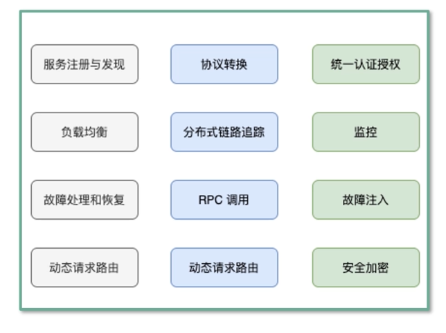
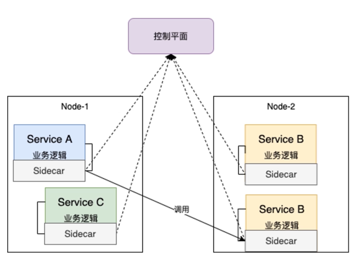
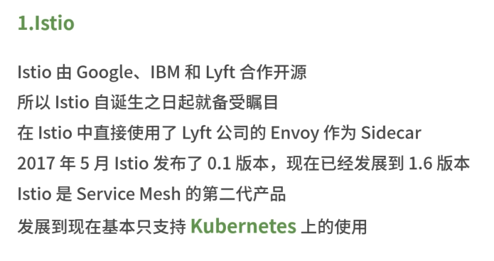
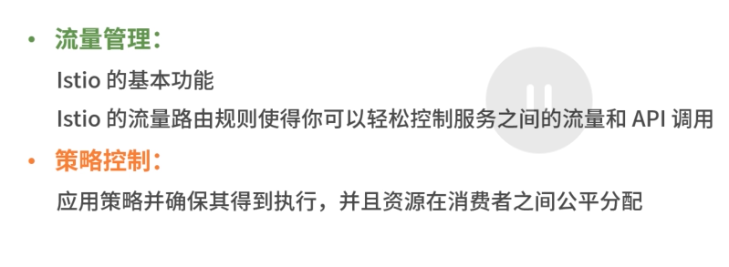
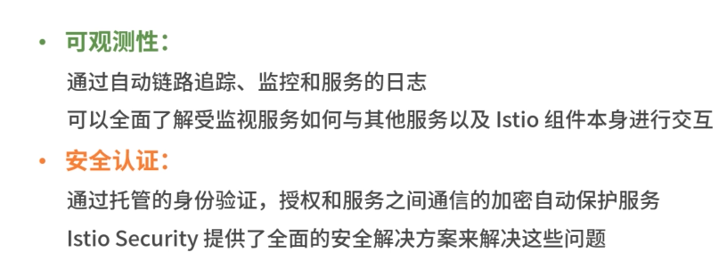
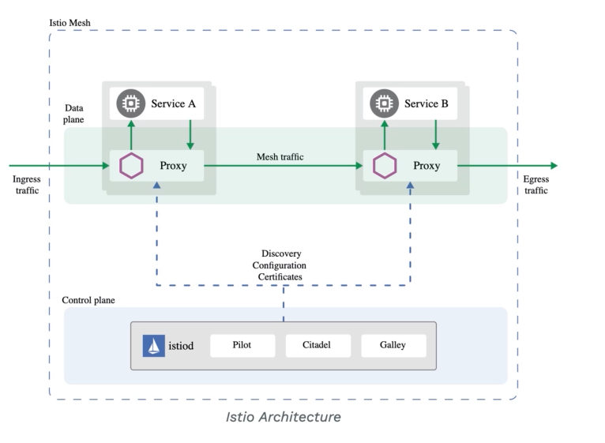

# 微服务演进

## 单体服务

浏览器 -> 服务器 -> 数据库

尽管是模块化逻辑，但最终还是打包并部署为单体应用，可靠性很低，敏捷开发和部署的思路无法完成。

## SOA-面向服务的架构模式

浏览器 -> 多个服务 -> 多个数据库

- 单一职责： 一个服务只需要做好一件事
  
- 尽可能早地创建原型： 尽早提供API，建立服务契约，至于实现和完善可以慢慢做

- 可移植性比效率更重要： 服务间的轻量级交互协议在效率和可移植性二者间，首要依然考虑兼容性和移植性

## 微服务

**特点**

- 原子服务

- 独立进程

- 隔离部署

- 去中心化服务治理(两个服务之间直连，进行负载均衡)、(服务发现)

**缺点**

1. 基础设施的建设，管理的，复杂度高
2. 微服务是分布式系统，由此会带来固有的复杂性。开发者不得不使用 RPC 或者消息传递，来实现进程间通讯。此外还需要处理代码来解决消息传递中的速度过慢，或者不可用等问题
3. 分区的数据库架构，同时更新多个业务主体的事务很普遍。由于需要同时更新多个数据库，这对开发者提出了更高的要求（分布式事务）
4. 测试一个基于微服务架构的应用也是很复杂的任务
5. 模块间的依赖，应用的升级很可能波及多个服务模块的修改
6. 对运维基础设施的挑战比较大
   

## 实现思路

### 组件服务化

- kit：一个微服务的基础库(框架)
- service: 业务代码+kit 依赖 + 第三方依赖组成的业务微服务
- RPC + Message Queue : 轻量级通讯

### 按照业务组织服务

服务所提供的能力和业务功能相对应。

举例：

大前端(移动/web) -> 网关 -> 业务服务 -> 平台服务 -> 基础设施

开发团队对软件在生产环境的运行负全部责任。

### 基础设施自动化

自动化测试、自动化部署

- CICD: Gitlib 、Gitlib Hooks 、 Kubernetes
- Testing: 测试环境 、 单元测试 、API自动化测试
- 在线运行时： Kubernetes 、 以及一些列 Prometheus 、 ELK 、 Conrtol Panel
  
### 可用性&兼容性设计

1. 隔离
    定义：微服务中的隔离策略主要用于避免单个服务的故障或性能问题影响到整个系统。通过隔离，可以局部化问题，维护系统的稳定性和可靠性。

    常见策略：

    - 动静隔离：将系统的动态内容和静态内容分开处理。动态内容需要实时计算或检索，而静- 态内容（如图片、音视频、CSS、JS文件等）则可直接从文件系统中获取。
    - 读写隔离：将读操作和写操作分离到不同的服务或实例中处理，通常通过CQRS（命令查询- 职责分离）模式实现。
    - 核心隔离：按照服务的核心程度进行分级，优先保障核心业务的稳定运行。
    - 热点隔离：针对高频访问的数据进行隔离，减少对后端存储服务的访问压力。
    - 用户隔离：按照不同的分组形成不同的服务实例，确保某个服务实例的故障不会影响到全- 部用户。
    - 进程隔离：每个进程拥有独立的地址空间，提供操作系统级别的保护。
    - 线程隔离：将不同请求分类发送给不同的线程池，避免单个服务故障影响其他服务。
    - 集群隔离：将某些服务单独部署成集群，或进行分组集群管理。
    - 机房隔离：在不同机房或数据中心部署和运行服务，实现物理层面的隔离。
2. 超时控制
3. 
    定义：微服务中的超时控制用于处理请求响应时间过长的情况，避免用户等待过久或系统资源耗尽。

    实现方式：

    设定请求超时时间，如请求超时、连接超时、读超时、写超时等。
    当请求超过设定的超时时间时，快速返回错误响应，释放系统资源。
    传递超时时间给下游服务，确保整个请求链路的超时控制。
4. 负载保护
    定义：负载保护机制用于防止服务节点在高负载情况下过载甚至崩溃，确保系统的稳定性和可用性。

    常见机制：

    - 流控：设置节点的并发请求数，当达到阈值时拒绝新增请求。
    - 熔断：当服务节点发生异常时，立即断开节点的请求，避免请求继续发送到异常节点上。
    - 降级：在服务器压力剧增时，对一些服务和页面进行降级处理，释放资源以保证核心业务的正常运行。
  
5. 限流
    定义：通过对并发/请求进行限速来保护系统，防止系统过载。

    限流算法：

    - QPS限流：限制每秒的请求数。
    - 令牌桶算法：系统按恒定速率往桶里加入令牌，请求来临时需要拿走一个令牌，否则阻塞或拒绝服务。
    - 漏桶算法：请求以恒定速率进入漏桶，桶满时请求溢出被丢弃。
    实现方式：

    在服务端进行限流计算，防止系统过载。
    为不同的业务客户端提供不同的限流策略。
5. 降级
    定义：在服务器压力剧增时，对一些服务和页面进行策略性的不处理或用简单方式处理，以释放资源保证核心业务的正常运行。

    实现方式：

    对非核心接口和数据请求进行降级处理。
    返回一个友好的提示信息给客户端。
    降级为只读缓存、只更新缓存或打日志而不写数据库等。
6. 重试
    定义：在微服务请求失败时，根据一定的策略重新发起请求。

    实现方式：

    设定重试次数和重试间隔。
    对可重试的错误类型进行区分，避免不必要的重试。
    在重试过程中进行限流和熔断控制，防止系统过载。
7. 负载均衡
    定义：将请求均衡地分发到多个服务节点上，以达到均衡负载的目的。

    常见算法：

    轮询：将请求依次分发到不同的服务节点上。
    加权轮询：给不同的服务节点分配不同的权重，按比例分发请求。
    最少连接数：将请求发送到当前连接数最少的服务节点上。
    最短响应时间：将请求发送到响应时间最短的服务节点上。
    实现方式：

    通过服务网关实现请求的路由和负载均衡。
    选择合适的负载均衡算法进行服务节点的选择。

这些概念和机制共同构成了微服务架构中的高可用性和可靠性保障体系，确保了系统在面对各种挑战时能够稳定运行并快速响应。

# 微服务设计

## BFF层

 BFF层在软件开发中指的是Backend for Frontend（服务于前端的后端），它是一种架构模式，用于构建前端与后端之间的中间层。以下是BFF层在软件开发中的详细解释：

 - 轻量级交互：协议精简、聚合(避免前端为获得部分数据向多个服务请求)
 - 差异服务：针对终端定制API
 - 动态升级：原有系统兼容升级，更新服务而非协议
 - 沟通效率提升：协作模式演进为，移动业务 + 网关小组

BFF 可以认为是一种适配服务，将后端的微服务面向前端进行适配。这样只需要保证暴露统一的API即可

与BFF 相对应的概念是，面向资源，即针对某个数据表的接口。

**缺点**

- 单个模块，也会导致后续业务集成复杂度高
- 很多横跨切面的逻辑，比如安全认证、日志监控、限流熔断等，随着时间的推移代码会变得越来越复杂
- 严重的代码缺陷或流量洪峰可能导致集群宕机

**解决方式**

1. 按照业务场景，拆分多个 BFF、例如移动端、WEB端、管理端等
2. 将横跨切面的逻辑抽取，放置到 API Geteway 层

## APIGeteway

横跨切面的功能（路由、认证、限流、安全），将其全部放入 gateway 层与BFF层解耦。这样各线业务团队，可以独立开发和交付各自的微服务。

## 微服务划分

1. 按照业务职能划分
   
   由公司内部不同部门提供的职能：例如客户服务部门提供客户服务的职能，财务部门提供财务相关的职能

2. 按照DDD划分 - 解决问题/某类业务场景
   
   限界上下文是DDD中用来划分不同业务边界的元素，这里业务边界的含义是 “解决不同业务问题” 的问题域和对应的解决方案

   例如B站UP主，需要解决创作的场景，即*在B站上传 文稿 或 视频*，如果按照职能划分 文稿、视频应该分属于两个微服务，按照 DDD 则应该属于一个微服务

3. CQRS：命令端 和 查询端
   
   命令端： 创建、更新、删除 请求，数据更改时发出事件

   查询端： 通过订阅数据发生更改的事件流，来保持数据的最新

    

    1. 将稿件写入到 mysql(archive-database) 
    2. 通过 canal 订阅 mysql 的 binlog 日志，获得数据变更事件，将数据写入到 kafaka

        (cancel 会模拟成mysql 的一个 slave 订阅 binlog 日志)
   
    3. 使用稿件 job 服务，消费这些数据，最后将数据存储到 mysql(archive-result-database) 中
   
    4. 最后通过稿件结果服务，返回查询结果

微服务的拆分：分久必合、合久必分。

例如账号服务，包含VIP、积分等，可能会拆分成各种各样的微服务，但是在用户调用时，需要多个微服务的信息，所以可能需要合并或者抽象成统一的账号服务。

## 微服务安全

对于外网请求来说，在 网关层，进行统一的认证拦截，一旦认证成功，一般会将用户身份信息(userId) 放入到 RPC Request 中，进行 rpc 请求

网关(身份认证) -> RPC Request(user Id) -> 具体微服务

对于服务内部，一般要区分身份认证和授权

- Full Trust
  
  完全信任：两个微服务之间没有任何的安全机制

- Half Trust
  
  互相知道对方是谁(需携带身份信息，如APP token、或者基于证书)，但是之间是明文通讯

- ZeroTrust（高安全领域，一般握手的时候会交换密钥（DH算法））
  
  既要做身份认证，也要做细粒度的接口判定，还要做接口的加解密

## gRPC和服务发现

### gRPC

**特点**

- 多语言
  
- 轻量级，高性能，序列化支持 PB(Protocol Buffer - 一种语言无关的高性能序列化框架)、JSON
  
- 可插拔
  
- IDL: 基于文件定义服务，通过 proto3 工具生成指定语言的数据结构，服务端接口以及客户端 stud

- 移动端：基于标准的 HTTP/2 设计，支持双向流，消息头压缩、单TCP的多路复用，服务端推送等特性，这些特性使得，gRPC 在移动端设备商更加的省点和节省网络流量
  
- 服务而非对象，消息而非引用：促进微服务之间的粗粒度消息交互设计理念

- 负载无关的：不同的服务需要使用不同的消息类型和编码，例如 protocol buffers、JSON 、 XML 、Thrift

- 流：Streaming API

- 阻塞式和非阻塞式：支持异步和同步处理在客户端和服务端交互的消息序列

- 标准化状态码
- 
**HealthCheck-健康检查**

gRPC 有一个标准的健康检测协议，在gRPC 的所有语言实现中基本都提供了生成代码和用于设置运行状态的功能。

> 主动健康检查, 可以在服务提供者提供服务不稳定时，被消费者感知，临时从负载均衡中摘除，减少错误请求。当服务提供者重新稳定后，健康检查成功，重新加入到消费者的负载均衡中，恢复请求。 HealthCheck 同样也用于外挂方式的容器健康检测，或者流量检查(k8s liveness & readiness)

1. kubernetes 向 discovery(服务发现) 发起注销请求
2. kubernetes 向 APP 发送 SIGTER 信号，进入优雅的退出过程
3. 其他客户端在2个心跳周期内（最差，一般是实时退出的）退出
4. kubernetes 退出超时（一般建议10s ~ 60s内）强制退出 SIHKILL
    

### 服务发现-客户端发现

一个服务实例被启动时，它的网络地址会被写入到注册表上。当服务实例终止时，从注册表上删除，这个实例的注册表通过心跳机制，动态刷新。客户端使用一个负载均衡算法，去选择一个可用的服务实例，来响应请求。

相当于客户端直连，比服务端发现，少请求。

### 服务发现-服务端发现

客户端通过负载均衡器，向某个服务发送请求，这个负载均衡器会查询服务注册表，并将请求路由到可用的服务实例上。服务实例在服务注册表上注册和注销。

消费者无需关注，服务发现细节，只需要知道服务的域名即可，支持异构语言开发，需要基础设施支撑，多了一次网络跳转，会有性能损失。

## 多集群多租户

**单一集群面对的问题**

L0服务，类似账号服务，如果是单一集群，一旦故障影响巨大。

- 多个节点，保证可用性(多个账号服务)
- 从单一集群故障带来的影响角度考虑冗余多套集群
- 单个机房内的机房故障导致的问题

**多集群**

为不同的业务建立集群，及 账号集群1、账号集群2 ，这样会导致以下的问题：

1. 对于不同的集群启动后，从环境变量中可以获取当下服务的 cluster ， 在服务发现注册的时候，带入这些元信息，不同的集群可以隔离使用不同的缓存资源
   
2. 多套冗余的集群对应多套独占的缓存，带来更好的性能和冗余能力

3. 尽量避免业务隔离使用 `分片` 带来的 `缓存穿透` 影响

**多租户**

在一个微服务架构中允许多系统共存是利用，微服务稳定性以及模块化最有效的方式之一，这种方式一般称之为多租户。

租户可以是 `测试` 、`金丝雀发布/灰度发布(渐进式发布)` 、 `影子系统(与生产系统相同的环境)` ，甚至服务层或者产品线，使得租户能够保证代码的隔离性，并且能够基于流量租户做路由决策。

对于传输中的数据（例如消息队列中的数据）或静态数据（存储或持久化）租户都能够保证隔离性和公平性，以及基于路由的机会

如果我们对 服务B 做出改变，我们需要确保它仍然能够和服务 A、C、D 正常交互。在微服务架构中，我们需要做这些集成测试的场景，也就是测试系统和该系统的交互。通常来说，微服务架构有两种测试方式：并行测试和生产环境测试。

## 并行测试

并行测试需要一个和生产环境一样的过渡环境，并且只是用来处理测试流量。在并行测试中：
1. 工程师首先完成生产服务的一次变动，然后将变动的代码部署到测试栈
2. 这种方法可以在不影响生产环境的情况下，获得稳定的测试服务，同时能够在发布前识别和控制bug。
尽管并行测试是一种非常有效的测试方法，但它也带来了一些挑战

1. 混用环境导致的不可靠测试
2. 多套环境带来的硬件成本
3. 难以做负载测试，仿真线上流量的真实情况

**解决方案**
使用 **染色发布** ，将

# Service Mesh

## 微服务本身的挑战

- 自身引入的复杂度
  - 微服务的划分
  - 设计良好的声明式API
  - 单体旧应用的迁移
  - 多个服务的数据一致性
- 版本兼容性
  - 业务服务中引入的微服务的基础组件
  - 业务代码与SDK强耦合在一起
  - 客户端SDK与服务器版本不一致

## 解决方式

**早期解决方式**
> 建立内部库

面临的问题
1. 很难保证这些内部库，可以适应所有的技术栈
2. 很难把库扩展到成百上千个微服务中

**Service Mesh 解决方式**
- 通过独立进程，隔离微服务基础组件

## Service Mesh

Service Mech 是用于处理服务到服务通信的专用基础架构层。云原生有着复杂的服务拓扑，它负责可靠的传递请求。实际上，Service Mesh 通常是作为一组轻量级网络代理实现，这些代理与应用程序代码部署在一起，应用程序无感知。 

Service Mesh 模式的核心在于**将客户端 SDK 剥离以 Proxy 独立进程运行**，目标是将原来存在于 SDK 中的各种能力下沉，为应用减负，以帮助应用云原生化。

Service Mesh 的第一代产品如 Linkerd 1和 Envoy天然支持虚拟机随着云原生的崛起，到了lstio 和 Linkerd2不支持虚拟机相比虚拟机，Kubernetes提供了太多便利。绝大部分Service Mesh的实现都支持Kubernetes 。 **Service Mesh 逐步发展为一个独立的基础设施层**

微服务被 Kubernetes之类的资源调度系统动态调度。 Kubernetes 中的 Service Mesh 实现模式被命名为 **Sidecar(边车模式，因为类似连接到摩托车的边车)**

在模式库中，Sidecar 模式的定义是:将应用程序的组件部署到单独的进程或容器中以提供隔离和封装这种模式还可以使应用程序由异构组件和技术组成

## Istio

