# 后台技术架构发展史
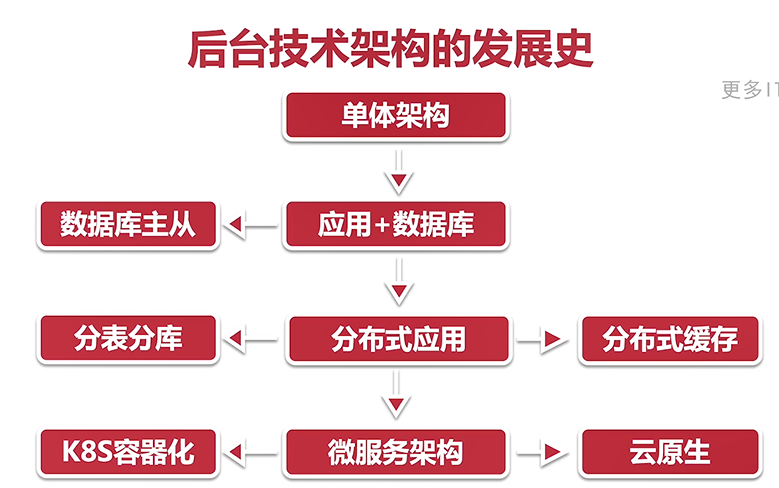

**单体架构**
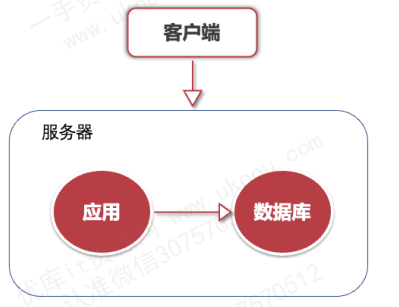

1. 使用一台服务器，程序和数据库都在一台服务器上

**应用+数据库**

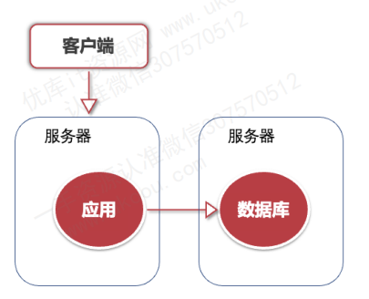

数据库瓶颈开始显现
1. 应用和数据库分别部署在两台机器上
   

**数据库主从**

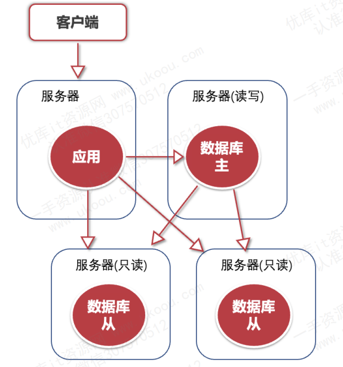
数据库瓶颈继续加重

当访问量上来后，进行读写库分离的情况，但需要考虑数据库同步的延时问题
1. 必须对从库的延时问题进行监控
2. 在程序方面也需要处理，把部分对时间不敏感的信息，改为读从库，当需要读取最新数据时还是走主库查询

首先，必须对从库延时进行监控，在从库上执行 `shows lave status`; 语句。查看从库的状态，Slave_IO_Running 和 lave_SQL_Running 都需要时Yes.Seconds_Behind_Master 延迟程度，数值越大说明延时越长

**分布式应用**

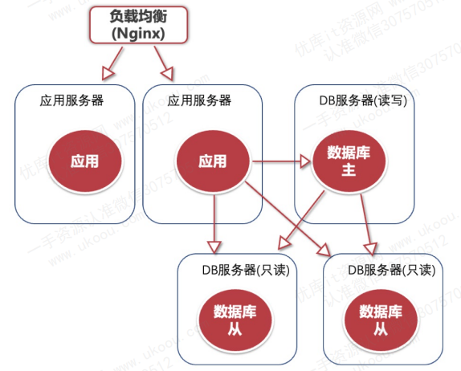
如果访问量继续加大，那么瓶颈来到了应用这边，此时可以将应用改写为分布式应用，对于流量大的系统，增加计算资源，对于流量小的应用则减少计算资源

**分布式缓存**
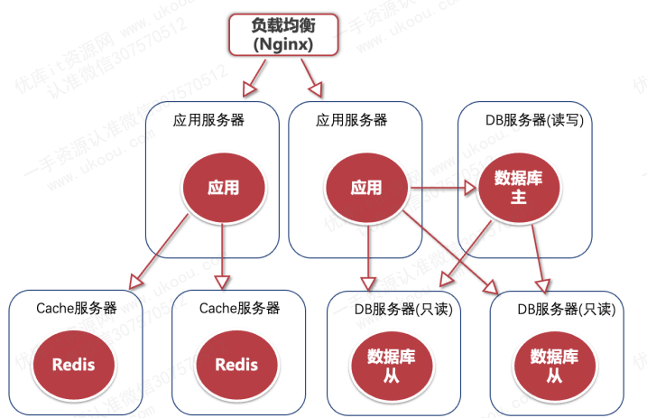
访问量继续增大，则将热点数据放入缓存，查询时从缓存查询即可

**分库分表**

**分表**

水平拆分
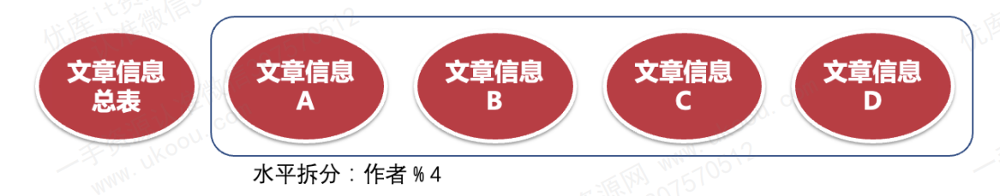
- 子表结构一致
- 按照时间段划分
- 按照ID/ID散列值划分
  
垂直拆分
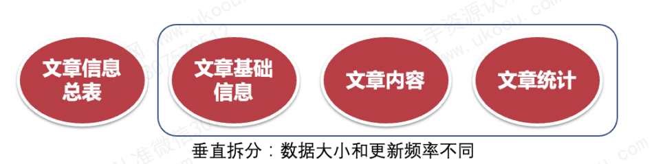
- 子表字段是大表的一部分
- 文章基本信息表
- 文章评论表
- 文章统计量
- 文章内容表

数据行太多，一般采用水平拆分。

字段太多，更新和读取差异大，一般采用垂直拆分

**分库**
分库的方法与分表方法差不多，也是采用水平拆分或垂直拆分

如果数据库采用垂直拆分，则可以考虑采用微服务架构

**微服务架构**

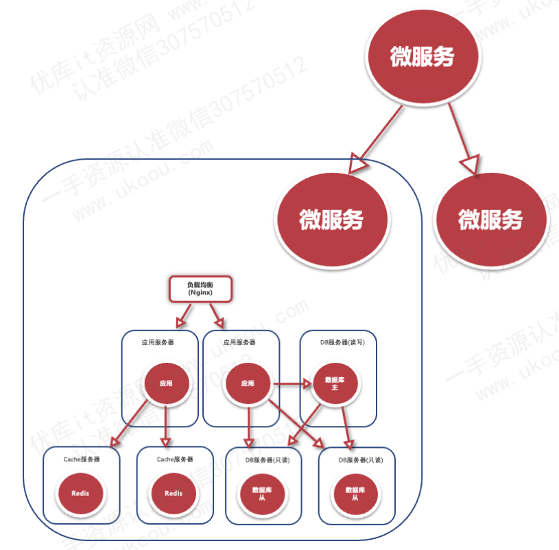

微服务的拆分就是让各个服务的数据尽可能的独立，一般有按照业务或者数据进行拆分。

例如博客：
一篇博客中有可能有图片、文字、视频等，要是按照业务差分这些数据则应该汇总到一个服务中，要是按照数据拆分则应该分属不同的服务，然后在使用一个稿件服务对其进行聚合。

**k8s容器化**

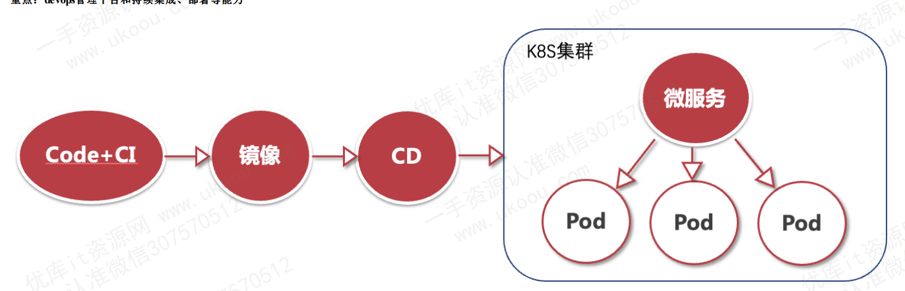

k8s减轻了运维的负担，使用很少的人即可运营庞大的计算机资源，同时可以让程序的测试开发，周期变得更短

**云原生**

# 服务发现&负载均衡

## 什么是服务发现
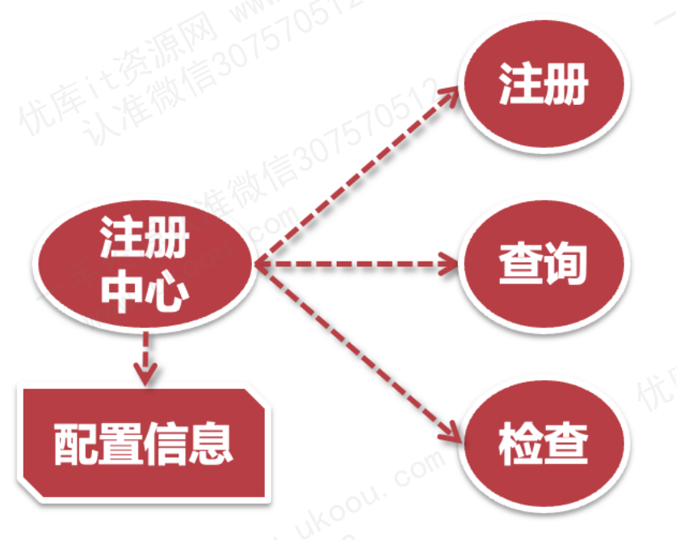
管理所有服务信息的**注册中心**

## 注册中心的功能

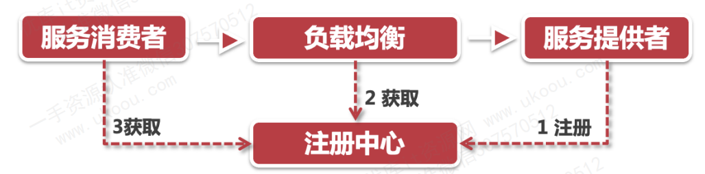

它的主要功能大致包含以下三个：
1. 服务注册，也就是服务启动的时候，把自己的服务信息注册到注册中心。
   - 这里的服务信息，主要是包括服务名称和服务的访问方法。
   - 服务名称是一个关键字。
   - 服务的访问方法，需要有调用协议，是http还是gRPC等。
   - 同时还会有一个访问地址，可能是一个域名，也可能是一个IP:端口的集合。
  
2. 服务查询，通过服务名称查找到调用服务的访问方式。
    调用方应用通过服务查询的功能，就可以知道如何来请求服务方了。

3. 服务的健康检查。
    - 健康检查的功能，可以让注册中心随时掌握服务的运行状况。
    
    - 当服务的实例出现异常时，也可以配置相应的处理策略，比如：告警、服务自动重启等。服务发现的整个过程很简单。

**注册中心的挑战**
对于注册中心来说，最大的挑战是系统的可靠性和数据的一致性。所以，所有的注册中心都是部署在多台服务器上。而且，每台机器上都会保存一份完整的配置信息。

## 服务发现的两种模式

### 服务端发现

在服务端发现模式中，服务消费者并不直接和服务提供者打交道，而是通过一个中介（通常是**负载均衡器或服务网关**）来实现服务发现和请求转发。流程如下：

1. 服务提供者在启动时向服务注册中心注册其信息（如主机地址和端口号）。
1. 服务消费者向负载均衡器或网关发出请求。
1. 负载均衡器/网关从服务注册中心查询到可用的服务提供者，并将请求路由到合适的服务实例。
   
**优点：**

- 抽象化：客户端无需关心服务发现的具体细节，负载均衡器或网关负责处理一切。
- 集中化控制：由负载均衡器或网关负责处理请求，可以加入更多的功能如限流、熔断等。
  
**缺点：**
- 单点故障风险：负载均衡器或网关作为中介，一旦出现问题，会影响整个系统的服务发现。
- 性能瓶颈：负载均衡器可能成为系统的性能瓶颈。

### 客户端发现

在客户端发现模式中，服务消费者自身负责服务发现，它直接与服务注册中心进行交互。流程如下：

1. 服务提供者在启动时向服务注册中心注册其信息。
1. 服务消费者从服务注册中心获取可用的服务实例列表，并自行选择一个合适的实例发出请求。
   
**优点：**
- 无中介：省去了中介层，减少了请求的额外跳转，降低了延迟。
- 灵活性：客户端可以自行决定使用哪种负载均衡策略以及如何路由请求。
  
**缺点：**
- 复杂性：客户端必须实现服务发现逻辑和负载均衡策略，增加了开发复杂度。
- 依赖客户端实现：如果不同的服务使用不同的客户端库，可能导致一致性问题。

### 两种模式的区别

- 控制位置：服务端发现将服务发现的控制逻辑集中在负载均衡器或网关中，而客户端发现将逻辑下放到各个客户端。

- 中介角色：服务端发现通过中介来实现，而客户端发现是直接与服务注册中心交互。
  
- 复杂性和灵活性：客户端发现提供了更多的灵活性，但也增加了客户端的复杂性；而服务端发现简化了客户端的逻辑，但牺牲了一定的灵活性。

## 服务发现的实现方案

## Apache Zookeeper 
首先是大名鼎鼎的 Apache Zookeeper ，它是JAVA技术栈中非常重要的服务了。

像Hadoop，Hbase，kafka，ElasticSearch等大型分布式系统都会内置Zookeeper。

- Zookeeper 提供一组高性能的、保证 FIFO的、基于事件驱动的非阻塞 API。
- 使用类似文件系统的目录树方式对数据进行组织
- 也是一个自洽的容错系统，使用 **Zab 原子广播协议**保证高可用和一致性。

## Etcd
Etcd 是受到 Zookeeper 启发而催生的项目。除了与之类似的功能外，更专注于以下四点

1. 简单：基于http+json的API；
2. 安全：可以支持SSL客户认证机制；
3. 快速：单机支持一千次写操作；
4. 可信：使用Raft算法实现了分布式的数据一致性；
   
当然，Etcd最被大家所关注的原因，还是因为，它是K8S集群中的核心组件

## 负载均衡

负载均衡最理想的状况，就是把所有请求合理的分配到每一个服务实例上

### 负载均衡算法

1. 轮询算法，加权轮询算法
   
   使用计数器挑选不同的服务进行调用

   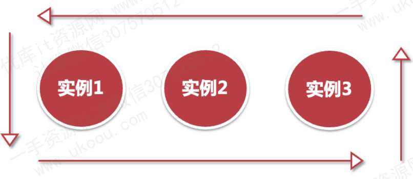

1. 随机算法，加权随机算法
   
   将计数器换成了随机数，使用随机数对实例数量取模，确定访问服务

   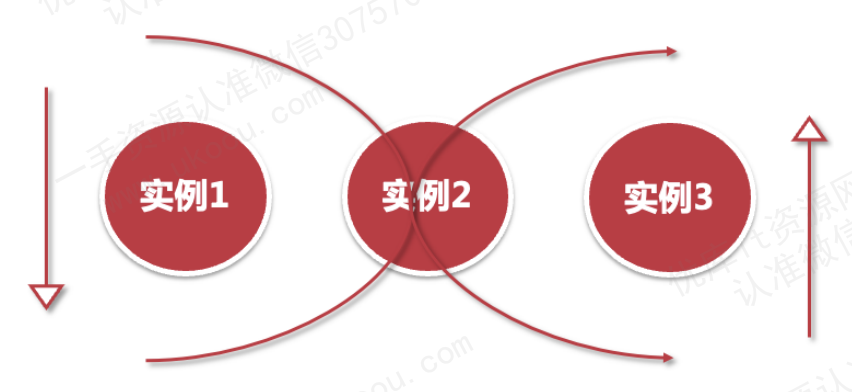

1. 最小连接算法：优先调用连接数最少的服务实例
   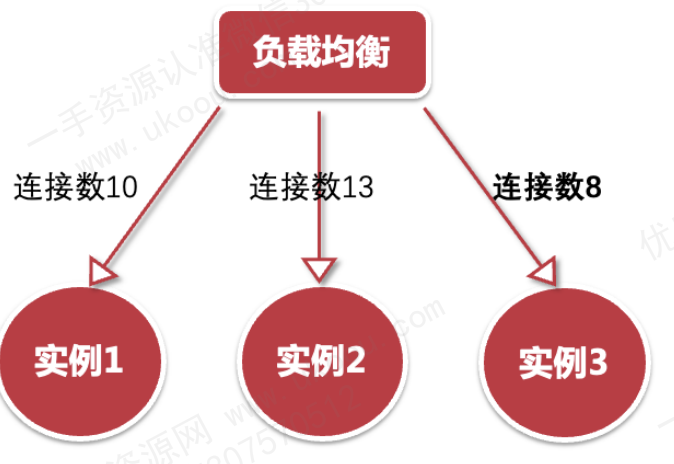
   
2. 散列算法，散列选定的特定值，进行服务访问

### 负载均衡方案

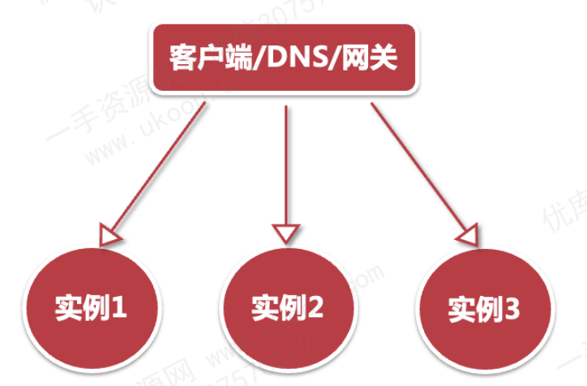

1. 服务端负载均衡

1. DNS负载均衡
   
   域名解析服务一般都会附带负载均衡服务，对于同一域名设置多个IP即可，如果是智能DNS，会返回一个最近的IP地址

1. 使用 Nginx 等网关接入服务：配置负载均衡策略

# 从设计模式理解API网关

## 代理模式

结构性模式

- 代理模式可以让调用方和服务方解耦
- 调用方只需要知道代理对象，而不需要关心代理对象后的东西
- 通过代理对象可以简化调用的访问方式
- 也可以通过代理对象对后端微服务的访问控制
  
## 外观模式

外观模式（Facade Pattern）是一种结构型设计模式，在计算机科学领域有着广泛的应用。该模式的主要目的是为子系统的一组接口提供一个统一的入口点（即外观类），从而简化客户端与子系统之间的交互，降低子系统内部的复杂性对客户端的影响。

在外观模式中，主要包含以下几个组成部分：

- Facade（外观类）：为子系统提供一个统一的接口，定义一组高层接口供客户端使用。外观类负责将客户端请求转发到适当的子系统对象，而不包含任何业务逻辑。它的职责是协调子系统的交互，但不应承担过多职责，以免变得庞大且难以维护。
  
- Subsystems（子系统）：包含一系列相关的类（接口和实现类），共同完成一个特定的业务功能。子系统内部的复杂性和实现细节被外观类所屏蔽，客户端只需通过外观类与子系统交互。

## 中介模式

中介者模式定义了一个中介对象来封装一系列对象之间的交互，使原有对象之间的耦合松散，且可以独立地改变它们之间的交互。中介者模式又叫调停模式，是迪米特法则（最少知识原则）的典型应用。

## 责任链模式

责任链模式通过创建一条处理请求的链，将请求的发送者和接收者解耦。链中的每个节点（或称为处理者）都包含对下一个节点的引用，如果一个对象不能处理该请求，则将其传递给链中的下一个节点。这样，请求会沿着链传递，直到被某个节点处理为止。

## 策略模式

策略模式是一种对象行为型模式，它通过对算法进行封装，把使用算法的责任和算法的实现分割开来，并委派给不同的对象对这些算法进行管理。

## 路由器和转发器，负载均衡能力

- 路由器：可以根据配置识别特定的请求
  
- 转发器：可以把一个请求二次包装后转发给特定的服务(转发器可以对请求和响应信息进行修改)，需要从注册中心获取注册表，然后通过负载均衡算法取出对应的服务进行转发

## 中间件能力

- 跨域
- 授权
- 监控
- 负载均衡
- 缓存
- 熔断
- 降级
- 限流
- 请求分片
- 静态响应

# 服务调用的限频、限流、降级和熔断

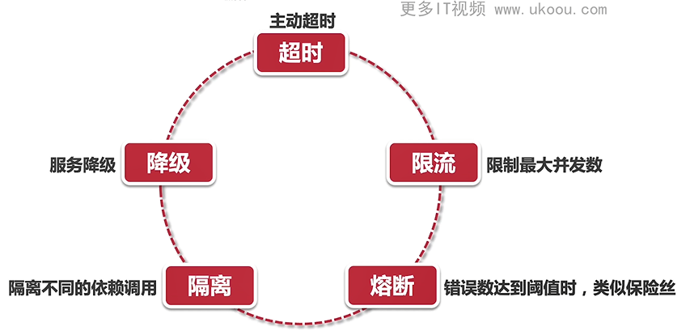

1. 超时：服务调用方超时后会主动结束请求
2. 限流：限制服务最大并发数
3. 熔断：当调用错误数达到阈值时，触发熔断，快速返回错误调用
4. 隔离：
5. 降级
   1. 服务降级：
    将某个服务切换到降级模式，返回预设的默认值或错误信息。这样可以保证系统的其他部分可以正常工作，而不会因为某个服务的故障而导致整个系统的不可用。
    例如，在电商系统中，当支付服务出现故障时，可以切换到降级模式，允许用户将商品加入购物车但暂时无法完成支付。
   2. 功能降级：
    暂时关闭某些不重要或耗资源较大的功能模块，以减轻系统负载。
    例如，在高峰期关闭一些不紧急的推荐功能，以保证核心的商品搜索和下单功能的可用性。
   3.数据降级：
    降低数据的精确度或实时性要求，以提高系统的性能。
    例如，将数据从实时更新改为定时更新，或者将数据的精确度从小数点后两位改为小数点后一位。
6. 隔离
   隔离的目的
   - 限制故障传播：通过隔离，可以确保单个服务的故障不会影响到其他服务，从而避免连锁反应导致的系统整体崩溃。
   - 提高系统稳定性：隔离有助于减少服务间的相互依赖，降低系统复杂性，从而提高系统的稳定性和可靠性。
   - 优化资源利用：通过合理的隔离策略，可以更好地分配和管理系统资源，确保关键服务得到足够的资源支持。
  
  微服务中的隔离可以从多个维度进行，包括服务隔离、数据隔离、资源隔离等。

  ## 限频和限流算法

  ### 计数器固定窗口算法

所谓固定窗口，就是只设置了一个时间段，给这个时间段加上一个计数器，在这一秒种内的所有请求，只要给这个计数器递增就可以得到当前的并发量了。

关于QPS计数器的设计
1. 可以直接使用系统的当前UNIX时间戳，精确到秒
2. 这个时间戳作为key，设置一个较短的过期时间，比如：10s。
3. 把这个key保存到redis中，对这个key进行 INCR 递增+1操作就可以了
4. 这是最简单最常用的限频算法，可以有效的保护后端接口不会被冲垮

### 计数器滑动窗口算法

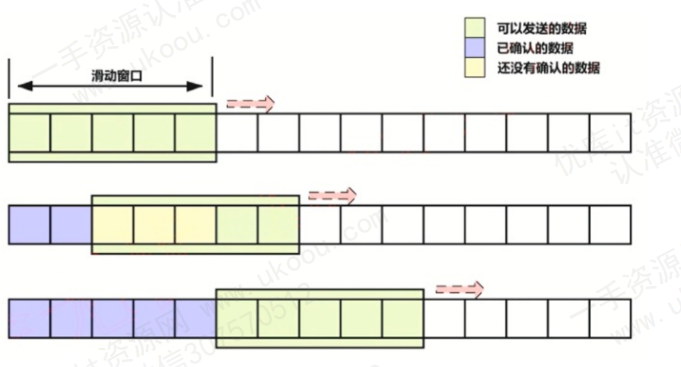

计数器滑动窗口算法将时间划分为多个固定大小的小窗口，每个小窗口都有一个独立的计数器来记录该窗口内的请求或数据包数量。这些小窗口组成了一个滑动的时间窗口，其大小和数量是预先设定的。随着时间的推移，最老的小窗口会被丢弃，并加入一个新的小窗口到时间窗口的末尾，从而实现窗口的滑动。

1. 初始化：设定时间窗口的大小（即包含的小窗口数量）和小窗口的时长。为每个小窗口分配一个计数器，并初始化为0。
1. 接收请求：每当有新的请求到达时，首先确定该请求属于哪个小窗口（根据请求到达的时间计算）。
1. 计数与判断：将该小窗口的计数器加1，并判断当前时间窗口内所有小窗口的计数器总和是否超过了设定的阈值。
1. 如果未超过阈值，则允许请求通过。
1. 如果超过阈值，则根据具体的限流策略（如丢弃请求、排队等待、返回错误等）处理该请求。
1. 窗口滑动：随着时间的推移，当最老的小窗口的时间已经过期时，将该小窗口的计数器清零，并将其从时间窗口中移除。同时，在时间窗口的末尾加入一个新的空小窗口。

**优点：**

- 平滑性：相比于固定窗口算法，计数器滑动窗口算法能够更平滑地处理流量，避免了在窗口边界处可能出现的流量突增。
- 准确性：通过细粒度的时间划分和窗口滑动，可以更准确地控制流量，减少误差。
  
**缺点：**

- 复杂性：算法实现相对复杂，需要维护多个小窗口的计数器和状态。
- 资源消耗：随着小窗口数量的增加，算法所需的内存和计算资源也会相应增加。
  
### 漏桶算法

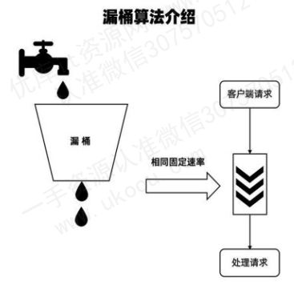

桶的容量与漏出速率：漏桶算法可以看作是一个带有常量**服务时间的单服务器队列**，即一个具有**固定容量的桶**，桶底部有一个漏洞，水（或请求）以固定的速率从桶中漏出。桶的容量代表了系统能够缓存的请求或数据包的最大数量，而漏出速率则代表了系统处理这些请求或数据包的速率。

突发流量的处理：**当突发流量到来时，这些请求或数据包会被放入桶中**。如果桶未满，新的请求会被允许进入并等待处理；如果桶已满，则新的请求可能会被丢弃或根据算法的具体实现进行排队等待。通过这种方式，漏桶算法能够平滑突发流量，使系统的处理速率保持在一个恒定的水平。

### 令牌桶算法

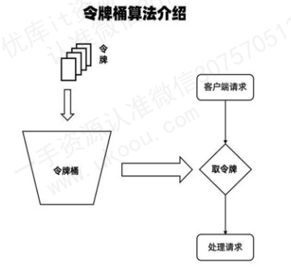

1. 令牌桶：令牌桶是一个虚拟的容器，用于存放令牌（Tokens）。每个令牌代表了一个单位的数据传输权限。
   
2. 令牌生成：系统以固定的速率（即令牌生成速率）向桶中添加令牌。这个速率通常由网络策略或API限制决定。
   
3. 桶的容量：令牌桶有一个最大容量限制，当桶满时，新生成的令牌会被丢弃。
   
4. 请求处理：当一个数据包或请求到达时，它需要从桶中取出一个令牌才能被处理。如果桶中有足够的令牌，请求可以立即被处理；如果桶空了，则请求必须等待，直到桶中再次有令牌可用。
## 降级

1. 服务降级：
   
    将某个服务切换到降级模式，返回预设的默认值或错误信息。这样可以保证系统的其他部分可以正常工作，而不会因为某个服务的故障而导致整个系统的不可用。

    例如，在电商系统中，当支付服务出现故障时，可以切换到降级模式，允许用户将商品加入购物车但暂时无法完成支付。

2. 功能降级：
    暂时关闭某些不重要或耗资源较大的功能模块，以减轻系统负载。

    例如，在高峰期关闭一些不紧急的推荐功能，以保证核心的商品搜索和下单功能的可用性。

1. 数据降级：
    降低数据的精确度或实时性要求，以提高系统的性能。
    例如，将数据从实时更新改为定时更新，或者将数据的精确度从小数点后两位改为小数点后一位。

1. 限流与熔断：
    限流：通过设置请求的最大并发数或每秒请求数来限制对服务的访问，避免系统被过多的请求压垮。
    熔断：通过引入熔断器来监控服务的状态，并在服务失败或超时达到一定阈值时快速失败，防止系统资源被无效请求持续占用。

1. 缓存：
    使用缓存来减少对后端服务的请求，将经常请求的数据缓存在内存或其他快速存储中，以降低对后端服务的压力并提高响应速度。

# 为什么选择kubernetes做微服务框架

1. k8s 使用 etcd 作为注册中心，并能够持久化保存
2. 服务调用和负载均衡可以通过内置的 Ingress 实现，也可以通过引入 其他组件实现
3. k8s 还支持服务的健康检查：启动检查、就绪检查、存活检查，如果程序出现异常也可以自动重启
4. 限流降级等功能，可以引入API网关或者在 Ingress 中实现
5. 是容器化的标准