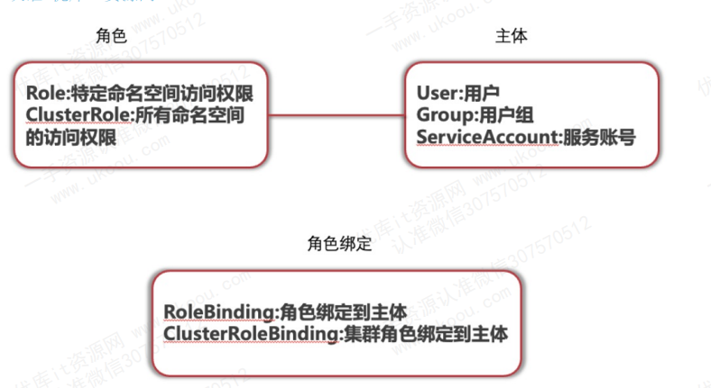

# K8S访问流程

访问k8s集群的时候，需要经过三个安全步骤完成具体操作

1. **认证**： 判断用户是否为能够访问集群的合法用户
2. **鉴权**： 通过鉴权策略决定一个API调用是否合法
3. **准入控制**： 就算通过了上面两步，客户端的调用请求还需要通过准入控制的层层考验，才能获得成功的响应。大致意思就是到了这步还有一个类似acl的列表，如果列表有请求内容，就通过，否则不通。它以插件的形式运行在API Server进程中，会在鉴权阶段之后，对象被持久化etcd之前，拦截执行自定义（校验、修改、拒绝等）操作

# 认证阶段

## 匿名认证-Anonymous requests

匿名认证一般是关闭的

## 白名单认证-BasicAuth认证

白名单认证一般是服务启动时，加载的basic用户配置文件，并且通常没有更多设置的话basic 只能访问，但是没有操作权限

## Token 认证-BasicAuth
token 认证涉及到堆集群和pod的操作

## X509证书认证-clientCA认证，TLS bootstrapping等

X509证书认证是kubernetes组件间内部默认使用的认证方式，同时也是kubectl客户端对应的kube-config中经常使用到的访问凭证，是一种比较安全的认证方式

# 鉴权阶段

当API Server内部通过用户认证后，就会执行用户鉴权流程，即通过鉴权策略决定一个API调用是否合法，API Server目前支持以下鉴权策略：

1. Always： 当集群不需要鉴权时选择 AlwaysAllow
2. ABAC： 基于属性的访问控制
   
3. RBAC： 基于角色的访问控制
   
   RBAC是目前k8s中最主要的鉴权方式。

4. Node：一种对kubelet进行授权的特殊模式
   
   Node鉴权策略主要是用于对kubelet发出的请求进行访问控制，限制每个Node只访问它自身运行的Pod及相关Service、Endpoints等信息。

5. Webhook： 通过调用外部REST服务对用户鉴权
   
   可自行编写鉴权逻辑并通过Webhook方式注册为kubernetes的授权服务，以实现更加复杂的授权规则

## RBAC-角色、账号、命名空间

在k8s中，只有对角色的权限控制，访问主体都必须通过角色绑定，绑定成k8s集群中对应的角色，然后根据绑定的角色去访问资源。而每种角色又只能访问它所对应的命名空间中的资源

k8s支持多个虚拟集群，它们底层依赖于同一个物理集群。这些虚拟集群被称为命名空间（namespace）。

每个k8s资源只能在一个命名空间中。命名空间是在多个用户之间划分集群资源的一种方法。

**系统默认4个命名空间，分别是：**

1. default： 没有指明使用其它名字空间的对象所使用的默认名字空间
2. kube-system： Kubernetes 系统创建对象所使用的名字空间
3. kube-public： Kubernetes 系统创建对象所使用的名字空间
4. kube-node-lease： 集群之间的心跳维护
   
我们关注的主要是default和kube-system

**角色分配**

RBAC中一直强调角色，这里角色也分为两种，一种是普通角色role，一种是集群角色clusterrole

普通角色role用于平常分配给运行的容器，而集群角色更多承担管理工作

**服务账号 service account**
访问主体中除了常用的用户，组以外，还有一类叫做服务账号，serviceaccount。serviceaccount是k8s为pod内部的进程访问apiserver创建的一种用户。因为是pod里面的，所以也会对应各自的命名空间

在k8s中设计了一种资源对象叫做Secret，分为两类，其中一类是用于记录ServiceAccount的service-account-token

# 准入阶段-todo