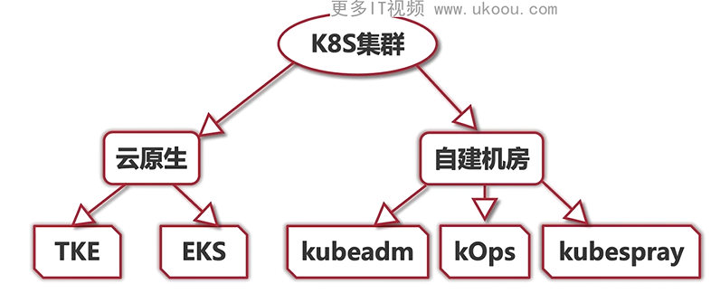

# K8S集群

## 云原生

腾讯云：
- TKE - 标准集群：完全由自己掌握，定制操作系统、修改运行时配置、设置更小规格的 pod
  
  1. 自己采购云主机
  2. master 组件控制面节点，至少需要三台服务器
     1. etcd
     2. api server
     3. Controller manager
     4. scheduler
  3. worker 节点可以是一台或者更多，用来运行应用程序
  
- EKS - 会更加简单，不需要维护节点，更不需要维护控制面

## 自建机房

kubeadmin

kOps

kubespray

## 概念

- 地域： 指的是一个地区
- 可用区： 指的是一个地域里面有多个机房，如香港地域的 一区 、二区、三区等
- VPC： 虚拟私有云，像是自建的机房，是一个局域网，一个地域的机房就是一个vpc
- 子网： 将一个 VPC ，将一个vpc 分为多个网段，可以更好的隔离网内的机器
- 安全组： 就像是一个机器的防火墙，可以过滤流量的入口和出口，还可以转发
- iptables： 安全组的具体实现方法，也是 kubeproxy 的默认实现方式，通过规则把请求service 的 网络包，转发到服务具体所在的 pod 机器
  - kubeproxy 还支持 ipvs 方式