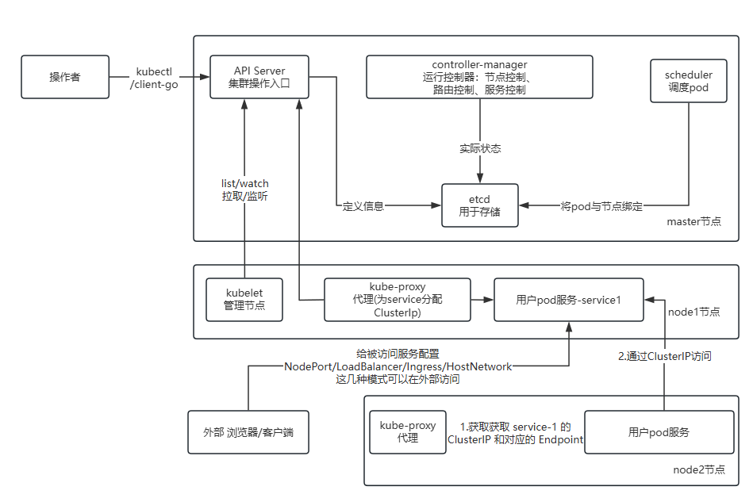

# k8s服务发现与负载均衡流程

1. 服务注册： 创建服务后，将信息注册到k8s。当服务变更也重新注册到k8s
2. 服务发现： 通过服务名找到找到服务信息
3. 负载均衡： 调用服务地址，请求到多个后端实例

## 服务注册

1. **用户定义 Service**
   
   - 用户通过 `YAML` 文件定义 `Service` 资源。 `Service` 定义了服务的名称、端口、协议以及标签选择器（用于匹配后端 `Pod` ）。
   
2. **`kube-apiserver` 接收请求**
   - kube-apiserver 将验证接收到的 YAML ,分配 `ClusterIP` ，并持久化到 etcd
3. **Endpoint Controller 创建 Endpoint** : 
   Endpoint Controller 当监听到 Service 和 pod 的变化时，会自动匹配 Service 和 Pod ，并记录下 Pod 的 IP 和端口信息

   **匹配过程**
   - `kube-controller-manager` 中的 `Endpoint-Controller` 监听 `Service` 和 `Pod` 的变化
   - 当 `Pod` 的标签与 `Service` 的 `spec.selector` 匹配时，`Endpoint Controller` 会创建或更新与 `Service` 同名的 `Endpoint` 对象。
   - `Endpoint` 对象记录了所有匹配 `Pod` 的 `IP` 和端口信息。
4. **`kube-proxy` 监听 `apiserver` 获取 Service 和 Endpoint 的变化**
   - 当 `Service` 和 `Endpoint` 发生变化时， `kub-proxy` 会更新本地的转发规则（如 `iptables` 或 `IPVS` ）

5. **`CoreDNS` 注册DNS记录**
   - `CoreDNS` 是 kubernets 的 DNS 服务
   - 它会监听 apiServer ，当 Service 和 pod 发生变化时，则将 Service 的名称 和 ClusterIP 注册到 DNS 记录中
   - 例如，Service my-service 在命名空间 default 中，会被注册为：
     - my-service.default.svc.cluster.local → ClusterIP
     - my-service.default.svc.cluster.local → ClusterIP。
     - my-service.default.svc.cluster.local → ClusterIP的。

## 服务发现流程

服务发现是指其他服务如何找到目标服务的网络地址。

1. **通过 `DNS` 发现服务**
   - `kubernetes` 中的 `pod` 可以通过 `DNS` 名称获取 `ClusterIP` 从而访问 `Service`
   - 例如，Pod 可以通过 `my-service.default.svc.cluster.local` 访问 `Service`
   - CoreDNS 会将 DNS 名称解析为 Service 的 ClusterIP。
2. **通过环境变量发现服务**
   - kubernetes 会自动为每个 pod 注入环境变量，记录集群中所有 Service 的 ClusterIp 和端口
  
3. 通过 API 发现服务
   
   - 应用程序可以通过 Kubernetes API 查询 Service 和 Endpoint 信息
   
## 负载均衡流程

负载均衡是指将流量分发到多个后端 Pod，以确保服务的高可用性和性能。

1. 流量到达 Service
   - 客户端（如另一个Pod），通过 DNS 或环境变量获取到 Service 的 ClusterIP 后，向该 IP 发送请求
   
2. kube-proxy 转发流量
   
   - 流量到达节点的 kube-proxy ，kube-proxy 根据配置的转发规则（如 iptables 或 IPVS ）将流量转发到后端的 Pod 的 IP 和端口
   - kube-proxy 支持多种负载均衡策略，如轮询（Round Robin）和会话保持（Session Affinity）

3. Endpoint 动态更新
   - 如果 Pod 被删除或新增， Endpoint Controller 会更新 Endpoint 对象
   - kube-proxy 会监听 Endpoint 的变化，并更新转发规则

## 用到的组件

- **kube-apiserver** ： 接收和处理 Server 的创建更新和删除的请求，并将数据存储到 ETCD
-  **etcd** ： 存储集群的状态数据，包括 Service 和 Endpoint 对象
-  **kube-controller-manager** ： 包含 **Endpoint Controller** ，负责创建和管理 **Service** 关联的 **Endpoint** 对象
-  **kuber-proxy** 在每个节点上运行，负责维护 Service 的 IP 和端口到后端 Pod 的转发规则
-  **CoreDNS** ： 集群的 DNS 服务，负责将 Service 名称解析为 ClusterIP
-  **Pod** ： 实际运行应用程序的容器，是 Service 的后端

## 总结

- **服务注册** ： 通过 kube-apiserver 、 Endpoint Controller 和 etcd 实现，将服务的网络地址注册到集群中
- **服务发现** ： 通过 CoreDNS 和环境变量实现，其他服务可以通过 DNS 名称或环境变量 找到目标服务
- **负载均衡** ： 通过 kube-proxy 实现，将流量分发到多个后端 Pod ,确保服务的高可用性和性能

