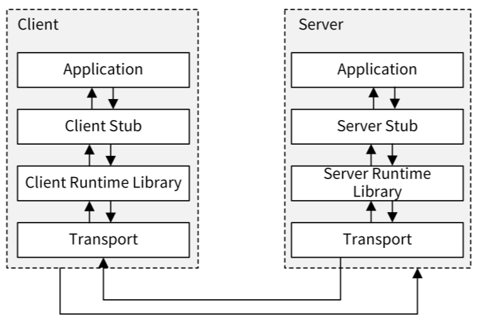
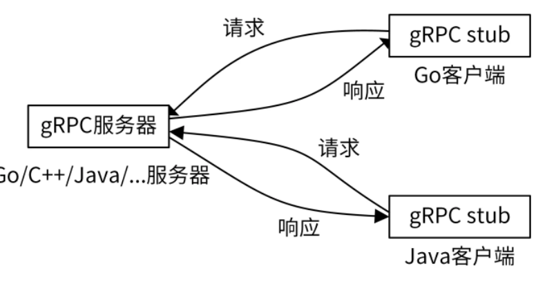
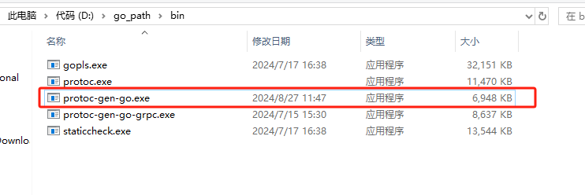
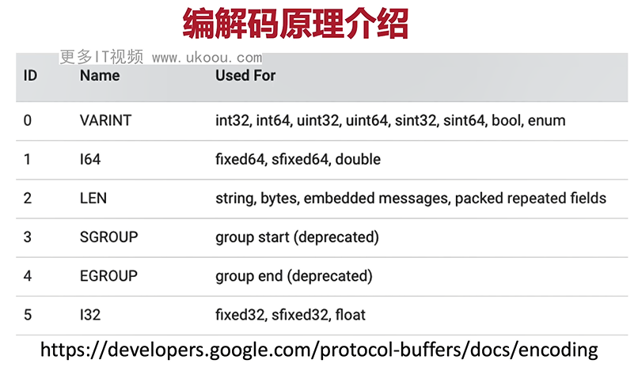

# 代理模式


- **定义：** 提供一个代理对象，并由**代理对象控制对原对象的引用**

- **作用：** 中介隔离(把 client 与 readSubject 对象解耦，client 只需要信任 proxy 对象即可) ，符合开闭原则（对扩展开放，对修改关闭，修改proxy 即可，不用修改 realSubject），可以实现切面在 proxy 层实现统一处理，

- **缺点：** 增加系统的复杂性


# RPC

根据维基百科的定义，RPC（Remote Procedure Call），即远程过程调用，是一个计算机通信协议。该协议允许运行于一台计算机的程序调用另一台计算机的子程序，而程序员不用额外地为这个交互作用编程。

RPC 的调用过程如下图所示：



RPC 调用具体流程如下：

1. Client 通过本地调用，调用 Client Stub。
   
2. Client Stub 将参数打包（也叫 Marshalling）成一个消息，然后发送这个消息。
   
3. Client 所在的 OS 将消息发送给 Server。
   
4. Server 端接收到消息后，将消息传递给 Server Stub。
   
5. Server Stub 将消息解包（也叫 Unmarshalling）得到参数。Server Stub 调用服务端的子程序（函数），处理完后，将最终结果按照相反的步骤返回给 Client。


这里需要注意，Stub 负责调用参数和返回值的流化（serialization）、参数的打包和解包，以及网络层的通信。Client 端一般叫 Stub，Server 端一般叫 Skeleton。

目前，业界有很多优秀的 RPC 协议，例如腾讯的 Tars、阿里的 Dubbo、微博的Motan、Facebook 的 Thrift、RPCX，等等。但使用最多的还是gRPC，这也是本专栏所采用的 RPC 框架，所以接下来我会重点介绍 gRPC 框架。


# gRPC 介绍

gRPC 是由 Google 开发的高性能、开源、跨多种编程语言的通用 RPC 框架，基于 HTTP2.0 协议开发，默认采用 Protocol Buffers 数据序列化协议。gRPC 具有如下特性：

支持多种语言，例如 Go、Java、C、C++、C#、Node.js、PHP、Python、Ruby 等。

基于 IDL（Interface Definition Language）文件定义服务，通过 proto3 工具生成指定语言的数据结构、服务端接口以及客户端 Stub。通过这种方式，也可以将服务端和客户端解耦，使客户端和服务端可以并行开发。通信协议基于标准的 HTTP/2 设计，支持双向流、消息头压缩、单 TCP 的多路复用、服务端推送等特性。

支持 `Protobuf` 和 `JSON` 序列化数据格式。Protobuf 是一种语言无关的高性能序列化框架，可以减少网络传输流量，提高通信效率。




像很多其他的 RPC 服务一样，gRPC 也是通过 IDL 语言，预先定义好接口（接口的名字、传入参数和返回参数等）。在服务端，gRPC 服务实现我们所定义的接口。在客户端，gRPC 存根提供了跟服务端相同的方法。

gRPC API 接口通常使用的数据传输格式是 Protocol Buffers。

# Protocol Buffers 介绍


Protocol Buffers（ProtocolBuffer/ protobuf）是 Google 开发的一套对数据结构进行序列化的方法，可用作（数据）通信协议、数据存储格式等，也是一种更加灵活、高效的数据格式，与 XML、JSON 类似。它的传输性能非常好，所以常被用在一些对数据传输性能要求比较高的系统中，作为数据传输格式。Protocol Buffers 的主要特性有下面这几个：

- 更快的数据传输速度：protobuf 在传输时，会将数据序列化为二进制数据，和 XML、JSON 的文本传输格式相比，这可以节省大量的 IO 操作，从而提高数据传输速度。

- 跨平台多语言：protobuf 自带的编译工具 protoc 可以基于 protobuf 定义文件，编译出不同语言的客户端或者服务端，供程序直接调用，因此可以满足多语言需求的场景。具有非常好的扩展性和兼容性，可以更新已有的数据结构，而不破坏和影响原有的程序。
  
- 基于 IDL 文件定义服务，通过 proto3 工具生成指定语言的数据结构、服务端和客户端接口。

## protobuf安装

1. 下载 `protoc` <https://github.com/protocolbuffers/protobuf/releases>
   
   根据不同的系统下载不同的包，在 windows 下解压后是 `protoc.exe`

1. 将 `protoc.exe` 所在路径配置到环境变量
2. 
   下载完成后，解压文件并将 `bin` 目录添加到你的系统环境变量中。在 `Linux` 或 `macOS` 上，可以通过修改 `.bashrc` 或 `.zshrc` 文件并运行 `source ~/.bashrc` 或 `source ~/.zshrc` 来实现。在 `Windows` 上，需要通过系统属性中的环境变量设置来添加 `protoc` 的路径。

3. 安装 go 语言专用的 `protoc` 的代码生成器
   ```bash
   go install google.golang.org/protobuf/cmd/protoc-gen-go@latest
   ```
   安装后会在 GOPATH 目录下生成可执行文件，
  


## proto 文件编写介绍
proto 文件定义如下：
```go
// 定义了 proto 的版本 ，目前最新版本为 3
syntax = "proto3";

//option 关键字用来对.proto 文件进行一些设置，

//其中go_package 是必需的设置，而且 go_package 的值必须是包导入的路径。package 关键字指定生成的.pb.go 文件所在的包名。
//"."表示生成的Go文件将与.proto文件位于同一目录下（或模块中）
//"service"则是包名。这意呀着所有生成的Go文件都将属于service包。
option go_package = ".;service";

//如果客户端不需要java则无需编写

////指定了Java代码中使用的包名。在这个例子中，生成的Java类将被放在io.grpc.examples.helloworld包中
//option java_package = "io.grpc.examples.helloworld";
////当使用protoc（Protocol Buffers编译器）为Java生成代码时，如果.proto文件中定义了多个消息或服务，它们通常会被放在一个外部类中。
//// 这个选项允许你为这个外部类指定一个自定义的名称，而不是默认的基于文件名生成的名称
//option java_outer_classname = "HelloWorldProto";
////这个选项控制是否应该为每个定义（如消息、枚举、服务等）在Java中生成单独的文件。当设置为true时，每个定义都将被放置在其自己的.java文件中，而不是全部放在一个文件中。这有助于减少单个文件的大小，提高代码的可读性和可维护性
//option java_multiple_files = true;

//定义 Protobuf 文件的包名
package helloworld;

// 服务定义：通过 service 关键字定义服务
service Greeter {
  //发送问候
  rpc SayHello (HelloRequest) returns (HelloReply) {}
}

// 定义一个枚举  
enum PhoneType {  
  MOBILE = 0;  
  HOME = 1;  
  WORK = 2;  
}  

// 消息体：通过 message 关键字定义
//        此处为请求
message HelloRequest {
  //消息字段，及字段在消息中的位置
  string                      name = 1;
  PhoneType                   mtype = 2;
  map<string, int32>          my_map_field = 3;
  repeated string             users = 4;  // 使用 repeated 关键字表示不定长数组
  // 使用Int32Value包装类型来模拟可选的int32字段  
  // 需要从google/protobuf/wrappers.proto导入包装类型
  google.protobuf.Int32Value  optional_int32 = 1;  
}

// 消息体：通过 message 关键字定义
//        此处为响应
message HelloReply {
  string                message = 1;
  PhoneType             mtype = 2;
  map<string, int32>    my_map_field = 3;
  repeated string       users = 4;  
}
```
## Protocol Bufffers中的数据类型

**基本标量类型：**
1. 整数类型
   - int32：有符号32位整数。范围从-231到231-1。
   - int64：有符号64位整数。范围从-263到263-1。
   - uint32：无符号32位整数。范围从0到2^32-1。
   - uint64：无符号64位整数。范围从0到2^64-1。
  
   - sint32：使用ZigZag编码的有符号32位整数。这有助于更有效地使用较小的整数。
   - sint64：使用ZigZag编码的有符号64位整数。
  
  
   - fixed32：无符号，总是4个字节，如果值需要少于4个字节，则高位补零。
   - fixed64：无符号，总是8个字节，如果值需要少于8个字节，则高位补零。
   - sfixed32：有符号的32位整数，总是4个字节。
   - sfixed64：有符号的64位整数，总是8个字节。
  
1. 浮点类型
   - float：IEEE 754标准下的32位浮点数。
   - double：IEEE 754标准下的64位浮点数。
  
    浮点类型的区别在于它们的精度和范围。double类型提供了比float类型更高的精度和更大的范围。

2. 布尔类型
   
   bool：布尔值，可以是true或false。

3. 字符串类型
   
    string：一个字符串必须是UTF-8编码或7位ASCII文本。
4. 字节类型
    bytes：字节序列，可能包含任意数据（包括0）。

**枚举类型（Enum）**：允许开发者定义一组命名的整型常量。
  
**复合类型：**
  - 消息（Message）：可以包含嵌套的消息和字段，用于定义复杂的数据结构。
  - 映射（Map）：键值对的集合，键和值可以是任何类型（除了另一个映射或嵌套的消息类型）。
  
**特殊类型**：如Any（可以包含任何类型的序列化消息，并附加类型信息）、Timestamp（表示时间点的具体值）、Duration（表示时间间隔）等，这些类型在google/protobuf/any.proto、google/protobuf/timestamp.proto和google/protobuf/duration.proto等文件中定义。

## 编解码原理



- Base 128 Varints ：可变字节长度编码，更小的数字占用更小的字节
- 
  括int32、int64、uint32、uint64、sint32、sint64等。这些整型数据在序列化时，如果其绝对值较小，则可以使用较少的字节进行编码，从而实现空间的有效利用。Base 128 Varints编码利用每个字节的最高位（msb）作为续行标志，如果最高位为1，则表示后续还有字节；如果最高位为0，则表示这是最后一个字节。剩余的7位用于存储数据的实际值。
  
  每个字节的第一位，表示后续是否还有数字，后面的 7 位表示实际的数据

- 消息编码 = key + value , key = 字段编号 + 字段类型
  
- 有符号整型，使用 ZigZag 算法编码
  
- Non-varint数字 - 无变化： key + 32/64位的字节
  
  double 、 float 、 fixed32 64 、 sfixed32 64

- 字符串编码， key + 长度 + 字符串
  
- 复合结构消息：内部的消息被当做字符串对待


**字段顺序**
无序（序列化之后也不保证有序，所以对于同一个消息进行两次序列化，得到的二进制可能会有差异），但是字段编号不能随便修改


**未知字段**
无法识别的字段，会被保留在序列化输出中

## 如何安全的更新字段

- 不能改变字段的编号
- int32、uint64、bool是可以互相兼容的，sint32 和 sint64也兼容
- string 、 bytes 、 message fields 、 optionnal 和 repeated 兼容
- fixed32/64 和 sfixed32/64 兼容
- bytes 是有效的 utf8 类型的时候， string 和 bytes 是兼容的
- 枚举和 int32，uint64 兼容，如果类型不匹配，会发生截断


# gRPC hello world

## 编写 hello.proto 文件

`hello.proto`

```go
//版本号
syntax = "proto3";
// ./service 表示在下 ./service 生成
// service 则表示生成的go 文件的包名
option go_package = "./service;service";

// 包名
package service;

// 消息
message HelloRequest {
    string msg = 1;
    //可选
    optional string msg2 = 2;
    //可重复 - 在go 中表现为切片
    repeated string address = 3;
}

// 消息 - 响应
message HelloReply {
    string msg = 1;
}

service Greeter {
    rpc SayHello (HelloRequest) returns (HelloReply) {}
}
```
生成 `pb.go` 文件
```bash
protoc --go_out=../ *.proto
```
- `--go_out` : 指定 `pd.go` 文件输出目录
- `*.proto` : 表示编译当前目录下所有以 `proto` 结尾的文件


生成 `xx_grpc.pb.go` 文件
```bash
protoc --go-grpc_out=../  *.proto
```
也可以将这两类文件同时生成
```bash
protoc --go_out=../ --go-grpc_out=../  *.proto
```

## 通过 `proto` 进行序列化和反序列化

```go
func main() {
	hello := &service.HelloRequest{
		Msg:     "hello world",
		Address: []string{"1", "2", "3"},
	}
	// 序列化
	marshal, err := proto.Marshal(hello)
	if err != nil {
		panic(err)
	}
	//反序列化
	newHello := &service.HelloRequest{}
	err = proto.Unmarshal(marshal, newHello)
	if err != nil {
		panic(err)
	}
	fmt.Printf("%+v\n", newHello)
}
```


# 安全传输


**认证**

1. 使用SSL/TLS 认证方式(HTTP2)
2. 基于 Token 的认证方式（基于安全连接）
3. 不采用任何措施的连接，这是不安全的连接（默认采用http1）
4. 自定义的身份认证


TLS 协议主要解决如下的三个安全问题：

1. 保密：基于密码学实现
2. 完整性：基于 HMAC 校验机制
3. 认证：双方认证，双方都可以配备证书，防止身份被冒充


**证书**

- key: 服务器上的私钥文件，用于对数据加密、解密

- crt：由CA 签名后的证书，或者是开发者自签名的证书，包含证书持有人的信息，持有人的公钥，以及签署者的签名信息
  
- csr：证书签名请求文件，用于提交给证书颁发机构(CA)对证书签名

- pem：基于Base64编码的证书格式，扩展名包括 pem 、crt 、cer


## SSL/TSL认证

1. 安装 openssl 
   
    官网: https://www.openssl.org/source/

    便捷安装包：https://slproweb.com/products/Win32OpenSSL.html

    安装后配置到环境变量

1. 生成证书
   
   生成自签名证书，作为CA
    ```bash
    # 1. 生成 server.key 并将生成的私钥写入
    openssl genrsa -out server.key 2048

    #2. 生成证书 全部回车即可，可以不填
    openssl req -new -x509 -key server.key -out server.crt -days 36500
    ...填入国家、省份等各种信息

    #3. 生成 csr
    openssl req -new -key server.key -out server.csr
    ```

    使用上面生成的证书，作为CA 签发下面的 test 证书
    ```bash
    # 生成私钥
    openssl genpkey -algorithm RSA -out test.key
    

    # 使用私钥与 openssl.cfg 配置生成  证书请求文件test.csr
    openssl req -new -nodes -key test.key -out test.csr -days 3650 -subj "/C=cn/OU=myorg/O=mycomp/CN=myname" -config ./openssl.cfg -extensions v3_req
    

    # 这个命令使用 OpenSSL 来根据证书签名请求（CSR）test.csr 签发一个新的证书 test.pem。
    # 证书的有效期被设置为 365 天。它使用 server.crt 作为 CA 证书，server.key 作为 CA 的私钥来签名新证书。
    # 如果尚未存在序列号文件，-CAcreateserial 选项将创建一个新的序列号文件（通常名为 serial 或 serial.txt），
    # 用于跟踪已签发的证书序列号。
    openssl x509 -req -days 365 -in test.csr -out test.pem -CA server.crt -CAkey server.key -CAcreateserial -extfile ./openssl.cfg -extensions v3_ca
    ```
