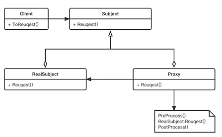

# 代理模式


- **定义：** 提供一个代理对象，并由**代理对象控制对原对象的引用**

- **作用：** 中介隔离(把 client 与 readSubject 对象解耦，client 只需要信任 proxy 对象即可) ，符合开闭原则（对扩展开放，对修改关闭，修改proxy 即可，不用修改 realSubject），可以实现切面在 proxy 层实现统一处理，

- **缺点：** 增加系统的复杂性




# RPC

根据维基百科的定义，RPC（Remote Procedure Call），即远程过程调用，是一个计算机通信协议。该协议允许运行于一台计算机的程序调用另一台计算机的子程序，而程序员不用额外地为这个交互作用编程。

RPC 的调用过程如下图所示：


RPC 调用具体流程如下：

1. Client 通过本地调用，调用 Client Stub。
   
2. Client Stub 将参数打包（也叫 Marshalling）成一个消息，然后发送这个消息。
   
3. Client 所在的 OS 将消息发送给 Server。
   
4. Server 端接收到消息后，将消息传递给 Server Stub。
   
5. Server Stub 将消息解包（也叫 Unmarshalling）得到参数。Server Stub 调用服务端的子程序（函数），处理完后，将最终结果按照相反的步骤返回给 Client。


这里需要注意，Stub 负责调用参数和返回值的流化（serialization）、参数的打包和解包，以及网络层的通信。Client 端一般叫 Stub，Server 端一般叫 Skeleton。

目前，业界有很多优秀的 RPC 协议，例如腾讯的 Tars、阿里的 Dubbo、微博的Motan、Facebook 的 Thrift、RPCX，等等。但使用最多的还是gRPC，这也是本专栏所采用的 RPC 框架，所以接下来我会重点介绍 gRPC 框架。


# gRPC 介绍

gRPC 是由 Google 开发的高性能、开源、跨多种编程语言的通用 RPC 框架，基于 HTTP2.0 协议开发，默认采用 Protocol Buffers 数据序列化协议。gRPC 具有如下特性：

支持多种语言，例如 Go、Java、C、C++、C#、Node.js、PHP、Python、Ruby 等。

基于 IDL（Interface Definition Language）文件定义服务，通过 proto3 工具生成指定语言的数据结构、服务端接口以及客户端 Stub。通过这种方式，也可以将服务端和客户端解耦，使客户端和服务端可以并行开发。通信协议基于标准的 HTTP/2 设计，支持双向流、消息头压缩、单 TCP 的多路复用、服务端推送等特性。

支持 `Protobuf` 和 `JSON` 序列化数据格式。Protobuf 是一种语言无关的高性能序列化框架，可以减少网络传输流量，提高通信效率。


像很多其他的 RPC 服务一样，gRPC 也是通过 IDL 语言，预先定义好接口（接口的名字、传入参数和返回参数等）。在服务端，gRPC 服务实现我们所定义的接口。在客户端，gRPC 存根提供了跟服务端相同的方法。

gRPC API 接口通常使用的数据传输格式是 Protocol Buffers。


# Protocol Buffers 介绍


Protocol Buffers（ProtocolBuffer/ protobuf）是 Google 开发的一套对数据结构进行序列化的方法，可用作（数据）通信协议、数据存储格式等，也是一种更加灵活、高效的数据格式，与 XML、JSON 类似。它的传输性能非常好，所以常被用在一些对数据传输性能要求比较高的系统中，作为数据传输格式。Protocol Buffers 的主要特性有下面这几个：

- 更快的数据传输速度：protobuf 在传输时，会将数据序列化为二进制数据，和 XML、JSON 的文本传输格式相比，这可以节省大量的 IO 操作，从而提高数据传输速度。

- 跨平台多语言：protobuf 自带的编译工具 protoc 可以基于 protobuf 定义文件，编译出不同语言的客户端或者服务端，供程序直接调用，因此可以满足多语言需求的场景。具有非常好的扩展性和兼容性，可以更新已有的数据结构，而不破坏和影响原有的程序。
  
- 基于 IDL 文件定义服务，通过 proto3 工具生成指定语言的数据结构、服务端和客户端接口。


## gRPC支持的认证方式

1. alts 认证
   
   alts 是谷歌开发的一种 **双向认证** 的认证方式，主要用于谷歌基础设施内的 `rpc` 通信设计

1. OAuth（Open Authorization）
2. STS - STS（Secure Token Service，安全令牌服务）
3. TLS（Transport Layer Security）
   TLS（及其前身SSL）是gRPC中最常用的认证和加密方式之一。它通过在客户端和服务器之间建立加密通道来保护数据的传输安全。

4. XDS（Extensible Discovery Service）
   XDS本身不是一种认证方式，而是Envoy代理等项目中用于动态发现和配置网络服务的协议。然而，在gRPC的部署和配置中，XDS可以与认证机制结合使用，以提供灵活的服务发现和配置能力。
5. Local（本地）认证
   在开发或测试环境中，gRPC可能使用本地认证方式，如基于IP地址的白名单、简单的用户名和密码验证等。这些方式通常不用于生产环境，因为它们不提供足够的安全性。

6. Insecure（不安全）认证
7. 
   在gRPC中，还可以选择不使用任何认证方式，即“不安全”模式。在这种模式下，客户端和服务器之间的通信不会加密，也不会进行身份验证。这种方式仅适用于测试或开发环境，不应在生产环境中使用。


## protobuf安装

1. 下载 `protoc` <https://github.com/protocolbuffers/protobuf/releases>
   
   根据不同的系统下载不同的包，在 windows 下解压后是 `protoc.exe`

1. 将 `protoc.exe` 所在路径配置到环境变量
2. 
   下载完成后，解压文件并将 `bin` 目录添加到你的系统环境变量中。在 `Linux` 或 `macOS` 上，可以通过修改 `.bashrc` 或 `.zshrc` 文件并运行 `source ~/.bashrc` 或 `source ~/.zshrc` 来实现。在 `Windows` 上，需要通过系统属性中的环境变量设置来添加 `protoc` 的路径。

3. 安装 go 语言专用的 `protoc` 的代码生成器
   ```bash
   go install google.golang.org/protobuf/cmd/protoc-gen-go@latest
   ```
   安装后会在 GOPATH 目录下生成可执行文件，
  


## proto 文件编写介绍
proto 文件定义如下：
```go
// 定义了 proto 的版本 ，目前最新版本为 3
syntax = "proto3";

//option 关键字用来对.proto 文件进行一些设置，

//其中go_package 是必需的设置，而且 go_package 的值必须是包导入的路径。package 关键字指定生成的.pb.go 文件所在的包名。
//"."表示生成的Go文件将与.proto文件位于同一目录下（或模块中）
//"service"则是包名。这意呀着所有生成的Go文件都将属于service包。
option go_package = ".;service";

//如果客户端不需要java则无需编写

////指定了Java代码中使用的包名。在这个例子中，生成的Java类将被放在io.grpc.examples.helloworld包中
//option java_package = "io.grpc.examples.helloworld";
////当使用protoc（Protocol Buffers编译器）为Java生成代码时，如果.proto文件中定义了多个消息或服务，它们通常会被放在一个外部类中。
//// 这个选项允许你为这个外部类指定一个自定义的名称，而不是默认的基于文件名生成的名称
//option java_outer_classname = "HelloWorldProto";
////这个选项控制是否应该为每个定义（如消息、枚举、服务等）在Java中生成单独的文件。当设置为true时，每个定义都将被放置在其自己的.java文件中，而不是全部放在一个文件中。这有助于减少单个文件的大小，提高代码的可读性和可维护性
//option java_multiple_files = true;

//定义 Protobuf 文件的包名
package helloworld;

// 服务定义：通过 service 关键字定义服务
service Greeter {
  //发送问候
  rpc SayHello (HelloRequest) returns (HelloReply) {}
}

// 定义一个枚举  
enum PhoneType {  
  MOBILE = 0;  
  HOME = 1;  
  WORK = 2;  
}  

// 消息体：通过 message 关键字定义
//        此处为请求
message HelloRequest {
  //消息字段，及字段在消息中的位置
  string                      name = 1;
  PhoneType                   mtype = 2;
  map<string, int32>          my_map_field = 3;
  repeated string             users = 4;  // 使用 repeated 关键字表示不定长数组
  // 使用Int32Value包装类型来模拟可选的int32字段  
  // 需要从google/protobuf/wrappers.proto导入包装类型
  google.protobuf.Int32Value  optional_int32 = 1;  
}

// 消息体：通过 message 关键字定义
//        此处为响应
message HelloReply {
  string                message = 1;
  PhoneType             mtype = 2;
  map<string, int32>    my_map_field = 3;
  repeated string       users = 4;  
}
```
## Protocol Bufffers中的数据类型

**基本标量类型：**
1. 整数类型
   - int32：有符号32位整数。范围从-231到231-1。
   - int64：有符号64位整数。范围从-263到263-1。
   - uint32：无符号32位整数。范围从0到2^32-1。
   - uint64：无符号64位整数。范围从0到2^64-1。
  
   - sint32：使用ZigZag编码的有符号32位整数。这有助于更有效地使用较小的整数。
   - sint64：使用ZigZag编码的有符号64位整数。
  
  
   - fixed32：无符号，总是4个字节，如果值需要少于4个字节，则高位补零。
   - fixed64：无符号，总是8个字节，如果值需要少于8个字节，则高位补零。
   - sfixed32：有符号的32位整数，总是4个字节。
   - sfixed64：有符号的64位整数，总是8个字节。
  
1. 浮点类型
   - float：IEEE 754标准下的32位浮点数。
   - double：IEEE 754标准下的64位浮点数。
  
    浮点类型的区别在于它们的精度和范围。double类型提供了比float类型更高的精度和更大的范围。

2. 布尔类型
   
   bool：布尔值，可以是true或false。

3. 字符串类型
   
    string：一个字符串必须是UTF-8编码或7位ASCII文本。
4. 字节类型
    bytes：字节序列，可能包含任意数据（包括0）。

**枚举类型（Enum）**：允许开发者定义一组命名的整型常量。
  
**复合类型：**
  - 消息（Message）：可以包含嵌套的消息和字段，用于定义复杂的数据结构。
  - 映射（Map）：键值对的集合，键和值可以是任何类型（除了另一个映射或嵌套的消息类型）。
  
**特殊类型**：如Any（可以包含任何类型的序列化消息，并附加类型信息）、Timestamp（表示时间点的具体值）、Duration（表示时间间隔）等，这些类型在google/protobuf/any.proto、google/protobuf/timestamp.proto和google/protobuf/duration.proto等文件中定义。

## 编解码原理


- Base 128 Varints ：可变字节长度编码，更小的数字占用更小的字节
- 
  括int32、int64、uint32、uint64、sint32、sint64等。这些整型数据在序列化时，如果其绝对值较小，则可以使用较少的字节进行编码，从而实现空间的有效利用。Base 128 Varints编码利用每个字节的最高位（msb）作为续行标志，如果最高位为1，则表示后续还有字节；如果最高位为0，则表示这是最后一个字节。剩余的7位用于存储数据的实际值。
  
  每个字节的第一位，表示后续是否还有数字，后面的 7 位表示实际的数据

- 消息编码 = key + value , key = 字段编号 + 字段类型
  
- 有符号整型，使用 ZigZag 算法编码
  
- Non-varint数字 - 无变化： key + 32/64位的字节
  
  double 、 float 、 fixed32 64 、 sfixed32 64

- 字符串编码， key + 长度 + 字符串
  
- 复合结构消息：内部的消息被当做字符串对待


**字段顺序**
无序（序列化之后也不保证有序，所以对于同一个消息进行两次序列化，得到的二进制可能会有差异），但是字段编号不能随便修改


**未知字段**
无法识别的字段，会被保留在序列化输出中

## 如何安全的更新字段

- 不能改变字段的编号
- int32、uint64、bool是可以互相兼容的，sint32 和 sint64也兼容
- string 、 bytes 、 message fields 、 optionnal 和 repeated 兼容
- fixed32/64 和 sfixed32/64 兼容
- bytes 是有效的 utf8 类型的时候， string 和 bytes 是兼容的
- 枚举和 int32，uint64 兼容，如果类型不匹配，会发生截断


# gRPC hello world

## 编写 proto 文件

`hello.proto`

```go
//版本号
syntax = "proto3";

// ./service 表示在下 ./service 生成
// service 则表示生成的go 文件的包名
option go_package = "./service;service";

// 引入当前目录下文件
import "user.proto";
// 引入标准库下文件
import "google/protobuf/any.proto";

// 包名
package service;

message DataMsg {
    string data = 1;
}


// 消息
message HelloRequest {
    string msg = 1;
    //可选 - 可选值会被编译为指针类型
    optional string msg2 = 2;
    //可重复 - 在go 中表现为切片
    repeated string address = 3;

    User user = 4;
}

// 消息 - 响应
message HelloReply {
    string msg = 1;
    google.protobuf.Any data = 2;
}

service Greeter {
    // 普通 RPC
    rpc SayHello (HelloRequest) returns (HelloReply) {}
    // 客户端流式 RPC
    rpc ClientStream (stream HelloRequest) returns (HelloReply) {}
    // 服务器端流式 RPC
    rpc ServerStream (HelloRequest) returns (stream HelloReply) {}
    // 双向流式 RPC
    rpc TwoStream (stream HelloRequest) returns (stream HelloReply) {}
}
```

user.prodo
```go
syntax = "proto3";

option go_package = "./service;service";

package service;

message User{
    string name = 1;
}
```


生成 `pb.go` 文件
```bash
protoc --go_out=../ *.proto
```
- `--go_out` : 指定 `pd.go` 文件输出目录
- `*.proto` : 表示编译当前目录下所有以 `proto` 结尾的文件


生成 `xx_grpc.pb.go` 文件
```bash
# --proto_path 指向 proto 文件的路径
# 在本命令中一个指向，当前目录，另一个指向proto标准库目录
protoc --proto_path=. --proto_path=C:\my\protoc-28.0-rc-1-win64\include  --go-grpc_out=../  *.proto
```
也可以将这两类文件同时生成
```bash
protoc --proto_path=. --proto_path=C:\my\protoc-28.0-rc-1-win64\include  --go_out=../ --go-grpc_out=../  *.proto
```

## 通过 `proto` 进行序列化和反序列化

```go
func main() {
    hello := &service.HelloRequest{
        Msg:     "hello world",
        Address: []string{"1", "2", "3"},
    }
    // 序列化
    marshal, err := proto.Marshal(hello)
    if err != nil {
        panic(err)
    }
    //反序列化
    newHello := &service.HelloRequest{}
    err = proto.Unmarshal(marshal, newHello)
    if err != nil {
        panic(err)
    }
    fmt.Printf("%+v\n", newHello)
}
```

## 使用无认证方式进行gRPC通信


我们前面已经生成好了 `pd.go` 和 `xxxgrpc_pd.go` 接下来直接编写，服务端和客户端文件：

**服务端**：服务端需要实现 `.proto` 定义的服务，然后将服务注册到 `gRPC` 。
```go
// 需要定义一个结构体继承 service.UnimplementedGreeterServer
type server struct {
    service.UnimplementedGreeterServer
}

// 然后实现 SayHello 方法
func (c *server) SayHello(ctx context.Context, req *service.HelloRequest) (*service.HelloReply, error) {
    log.Printf("请求值： %v", req)
  // 使用 protoc 的 any 类型
    a, _ := anypb.New(&service.DataMsg{Data: "data is me"})
    return &service.HelloReply{
        Msg:  "hello",
        Data: a,
    }, nil
}

// 服务端
func TestServer(t *testing.T) {
  // 监听端口
    listen, _ := net.Listen("tcp", ":9090")
  // 创建 grpc服务 - 此处没有增加任何通信验证
    rpcServer := grpc.NewServer()

  // 注册服务
    service.RegisterGreeterServer(rpcServer, &server{})

  // 启动服务 - 这里会阻塞住
    err := rpcServer.Serve(listen)
    if err != nil {
        fmt.Printf("failed to serve: %v", err)
        panic(err)
    } 
}
```

**客户端**：
1. 需要创建客户端，并设置认证方式
2. 调用生成服务

客户端代码-使用 `dial` 方式创建客户端，注意在最新版本中 `dial` 已经被打上废弃标签
```go
// 客户端-使用 Dial 方式创建 - 不验证
func TestInsecureClientDial(t *testing.T) {

    client, err := grpc.Dial("127.0.0.1:9090",
        grpc.WithInsecure(),           // 这个选项告诉 gRPC 客户端忽略 TLS 证书验证
        grpc.WithBlock(),              // 这个选项会让 Dial 阻塞，直到连接建立或发生错误
        grpc.WithTimeout(time.Second)) // 设置连接超时时间为 1 秒
    if err != nil {
        log.Fatalf("未连接： %v", err)
    }
    defer client.Close()

    greeterClient := service.NewGreeterClient(client)
    hello, err := greeterClient.SayHello(context.Background(), &service.HelloRequest{Msg: "01"})
    if err != nil {
        fmt.Println(err)
        return
    }

    fmt.Printf("返回值 %v", hello)
}
```

客户端代码-使用 `NewClient` 方式创建客户端
```go
func TestInsecureClient(t *testing.T) {
    // 创建一个不安全的客户端凭据，这通常用于测试环境，不建议在生产环境中使用
    cred := insecure.NewCredentials()
    // 使用上述凭据配置gRPC的传输凭据
    transportCredentials := grpc.WithTransportCredentials(cred)

    //尝试使用配置的凭据连接到gRPC服务器
    client, err := grpc.NewClient("127.0.0.1:9090", transportCredentials)

    if err != nil {
        log.Fatalf("未连接： %v", err) //如果错误则退出
    }
    defer client.Close() //最后关闭 连接

    //创建一个Greeter服务的客户端
    greeterClient := service.NewGreeterClient(client)

    // 调用Greeter服务的SayHello方法，发送请求并等待响应
    hello, err := greeterClient.SayHello(context.Background(), &service.HelloRequest{Msg: "01"})
    if err != nil {
        fmt.Println(err)
        return
    }

  //将 any 类型反序列化 为 service.DataMsg
  var dd service.DataMsg
    err = hello.Data.UnmarshalTo(&dd)

    fmt.Printf("返回值 %s , %s \n", hello.Msg, dd.Data)
}
```

## 使用拦截器进行验证

服务端代码
```go
func TestTokenServer(t *testing.T) {
    //拦截器
    var authInterceptor grpc.UnaryServerInterceptor
    authInterceptor = func(
        ctx context.Context,
        req interface{},
        info *grpc.UnaryServerInfo,
        handler grpc.UnaryHandler,
    ) (resp interface{}, err error) {
        //拦截普通方法请求，验证 Token
        err = Auth(ctx)
        if err != nil {
            return
        }
        // 继续处理请求
        return handler(ctx, req)
    }
    //启动服务时注册拦截器
    server := grpc.NewServer(grpc.UnaryInterceptor(authInterceptor))
    service.RegisterGreeterServer(server, &RpcServer{})

    listener, err := net.Listen("tcp", ":8002")
    if err != nil {
        log.Fatal("服务监听端口失败", err)
    }
    err = server.Serve(listener)
    if err != nil {
        log.Fatal("服务、启动失败", err)
    }
    fmt.Println("启动成功")
}
func Auth(ctx context.Context) error {
    //取出值
    md, ok := metadata.FromIncomingContext(ctx)
    if !ok {
        return fmt.Errorf("missing credentials")
    }
    var user string
    var password string

    if val, ok := md["user"]; ok {
        user = val[0]
    }
    if val, ok := md["password"]; ok {
        password = val[0]
    }

    if user != "admin" || password != "admin" {
        return status.Errorf(codes.Unauthenticated, "token不合法")
    }
    return nil
}
```

客户端代码
```go
// 客户端 实现 验证器 - PerRPCCredentials
type Authentication struct {
    User     string
    Password string
}

// 实现获取数据方法
func (a *Authentication) GetRequestMetadata(context.Context, ...string) (
    map[string]string, error,
) {
    return map[string]string{"user": a.User, "password": a.Password}, nil
}

// 是否需要 tls 的安全性
func (a *Authentication) RequireTransportSecurity() bool {
    return false
}

func TestTokenClient(t *testing.T) {
    user := &Authentication{
        User:     "admin",
        Password: "admin",
    }
    client, err := grpc.NewClient(":8002", grpc.WithTransportCredentials(insecure.NewCredentials()), grpc.WithPerRPCCredentials(user))

    if err != nil {
        log.Fatalf("未连接： %v", err) //如果错误则退出
    }
    defer client.Close() //最后关闭 连接

    //创建一个Greeter服务的客户端
    greeterClient := service.NewGreeterClient(client)
    background := context.Background()
    // 调用Greeter服务的SayHello方法，发送请求并等待响应
    hello, err := greeterClient.SayHello(background,
        &service.HelloRequest{
            Msg:  "01",
            User: &service.User{Name: "123"},
        },
    )
    if err != nil {
        fmt.Println(err)
        return
    }
    var dd service.DataMsg
    err = hello.Data.UnmarshalTo(&dd)

    fmt.Printf("返回值 %s , %s \n", hello.Msg, dd.Data)

}
```


## 生成自签证书


在 `openssl.cnf` 文件中指定域名
1. 打开 copy_extensions = copy
2. 打开 req_extensions = v3_req
3. 找到[ v3_req ],添加 subjectAltName = @alt_names
4. 添加新的标签 [ alt_names ] , 和标签字段
   ```
    [ alt_names ]
    DNS.1 = *.mszlu.com
   ```
生成 ca 证书、服务端、客户端证书，并使用 ca 证书对服务端、客户端证书签名
```bash
# 生成CA私钥和证书
openssl genrsa -out ca.key 4096
openssl req -x509 -new -nodes -key ca.key -sha256 -days 3650 -out ca.pem -subj "/CN=my-ca"

# 生成服务器私钥和CSR
openssl genrsa -out server.key 4096
openssl req -new -key server.key -out server.csr -config openssl.cnf

# 使用CA签署服务器证书
openssl x509 -req -in server.csr -CA ca.pem -CAkey ca.key -CAcreateserial -out server.pem -days 3650 -sha256 -extfile openssl.cnf -extensions req_ext

# 生成客户端私钥和CSR
openssl genrsa -out client.key 4096
openssl req -new -key client.key -out client.csr -config openssl.cnf

# 使用CA签署客户端证书
openssl x509 -req -in client.csr -CA ca.pem -CAkey ca.key -CAcreateserial -out client.pem -days 3650 -sha256 -extfile openssl.cnf -extensions req_ext
```

## 基于tls进行单向认证
服务实现-同上


服务端
```go
func TestTlsServer(t *testing.T) {
    //添加证书
    file, err2 := credentials.NewServerTLSFromFile("./keys/server.pem", "./keys/server.key")
    if err2 != nil {
        log.Fatal("证书生成错误", err2)
    }
    rpcServer := grpc.NewServer(grpc.Creds(file))

    service.RegisterGreeterServer(rpcServer, &RpcServer{})

    listener, err := net.Listen("tcp", ":8002")
    if err != nil {
        log.Fatal("启动监听出错", err)
    }
    err = rpcServer.Serve(listener)
    if err != nil {
        log.Fatal("启动服务出错", err)
    }
    fmt.Println("启动grpc服务端成功")
}
```

客户端
```go
func TestClient(t *testing.T) {
    file, err2 := credentials.NewClientTLSFromFile("./keys/server.pem", "*.mszlu.com")
    if err2 != nil {
        log.Fatal("证书错误", err2)
    }
    conn, err := grpc.NewClient(":8002", grpc.WithTransportCredentials(file))

    if err != nil {
        log.Fatal("服务端出错，连接不上", err)
    }
    defer conn.Close()

    prodClient := service.NewGreeterClient(conn)

    request := &service.HelloRequest{
        Msg: "123",
    }
    stockResponse, err := prodClient.SayHello(context.Background(), request)
    if err != nil {
        log.Fatal("查询出错", err)
    }
    fmt.Println("查询成功", stockResponse)
}
```

## 基于tls进行双向认证

服务实现-同上


服务端
```go
func TestTwo2TlsServer(t *testing.T) {
    // 加载CA证书
    caCert, err := os.ReadFile("./keys2/ca.pem")
    if err != nil {
        log.Fatalf("ca证书加载失败: %v", err)
    }

    caCertPool := x509.NewCertPool()
    caCertPool.AppendCertsFromPEM(caCert)

    // 加载服务器证书和密钥
    serverCert, err := tls.LoadX509KeyPair("./keys2/server.pem", "./keys2/server.key")
    if err != nil {
        log.Fatalf("服务端证书加载失败: %v", err)
    }

    // 配置TLS
    creds := credentials.NewTLS(&tls.Config{
        Certificates: []tls.Certificate{serverCert},
        ClientAuth:   tls.RequireAndVerifyClientCert,
        ClientCAs:    caCertPool,
    })

    rpcServer := grpc.NewServer(grpc.Creds(creds))
    service.RegisterGreeterServer(rpcServer, &RpcServer{})

    listener, err := net.Listen("tcp", ":50051")
    if err != nil {
        log.Fatal("启动监听出错", err)
    }
    err = rpcServer.Serve(listener)
    if err != nil {
        log.Fatal("启动服务出错", err)
    }
    fmt.Println("启动grpc服务端成功")
}
```
客户端
```go
func TestTwo2TlsClient(t *testing.T) {

    // 加载CA证书
    caCert, err := os.ReadFile("./keys2/ca.pem")
    if err != nil {
        log.Fatalf("ca证书加载失败: %v", err)
    }

    caCertPool := x509.NewCertPool()
    caCertPool.AppendCertsFromPEM(caCert)

    // 加载客户端证书和密钥
    clientCert, err := tls.LoadX509KeyPair("./keys2/client.pem", "./keys2/client.key")
    if err != nil {
        log.Fatalf("客户端证书加载失败: %v", err)
    }

    // 配置TLS
    creds := credentials.NewTLS(&tls.Config{
        Certificates: []tls.Certificate{clientCert},
        ServerName:   "*.mszlu.com",
        RootCAs:      caCertPool,
    })

    conn, err := grpc.NewClient(":50051", grpc.WithTransportCredentials(creds))
    if err != nil {
        log.Fatalf("连接失败: %v", err)
    }
    defer conn.Close()

    prodClient := service.NewGreeterClient(conn)

    request := &service.HelloRequest{
        Msg: "123",
    }
    stockResponse, err := prodClient.SayHello(context.Background(), request)
    if err != nil {
        log.Fatal("查询出错", err)
    }
    fmt.Println("查询成功", stockResponse)
}
```
通常来说，除了需要服务器、客户端自身的证书，还需要一个 ca 证书，ca证书必须是 服务端证书和客户端证书的上级。

## stream

在 HTTP/1.1 的时代，同一个时刻只能对一个请求进行处理或者响应，换句话说，下一个请求必须要等当前请求处理完才能继续进行。

> HTTP/1.1需要注意的是，在服务端没有response的时候，客户端是可以发起多个request的，但服务端依旧是顺序对请求进行处理, 并按照收到请求的次序予以返回。

HTTP/2 的时代，多路复用的特性让一次同时处理多个请求成为了现实，并且同一个 TCP 通道中的请求不分先后、不会阻塞，HTTP/2 中引入了流(Stream) 和 帧(Frame) 的概念，当 TCP 通道建立以后，后续的所有操作都是以流的方式发送的，而二进制帧则是组成流的最小单位，属于协议层上的流式传输。

> HTTP/2 在一个 TCP 连接的基础上虚拟出多个 Stream, Stream 之间可以并发的请求和处理, 并且 HTTP/2 以二进制帧 (frame) 的方式进行数据传送, 并引入了头部压缩 (HPACK), 大大提升了交互效率


proto 中 流的定义
```go
service Greeter {
    // 普通 RPC
    rpc SayHello (HelloRequest) returns (HelloReply) {}
    // 客户端流式 RPC
    rpc ClientStream (stream HelloRequest) returns (HelloReply) {}
    // 服务器端流式 RPC
    rpc ServerStream (HelloRequest) returns (stream HelloReply) {}
    // 双向流式 RPC
    rpc TwoStream (stream HelloRequest) returns (stream HelloReply) {}
}
```


### 客户端流

实现 `ClientStream` 服务
```go
func (c *RpcServer) ClientStream(stream service.Greeter_ClientStreamServer) error {
    count := 0
    for {
        //源源不断的去接收客户端发来的信息
        recv, err := stream.Recv()
        if err != nil {
            if err == io.EOF {
                return nil
            }
            return err
        }
        fmt.Println("服务端接收到的流", recv.Msg, count)

        // 接收10次后，主动返回
        count++
        if count > 10 {
            rsp := &service.HelloReply{Msg: "1"}
            err := stream.SendAndClose(rsp)
            if err != nil {
                return err
            }
            return nil
        }
    }
}
```

服务端实现 - 与其他实现无任何区别
```go
func TestStreamServer(t *testing.T) {
    listen, _ := net.Listen("tcp", ":9090")
    rpcServer := grpc.NewServer()
    service.RegisterGreeterServer(rpcServer, &RpcServer{})

    err := rpcServer.Serve(listen)
    if err != nil {
        fmt.Printf("failed to serve: %v", err)
        panic(err)
    } else {
        fmt.Println("RpcServer started")
    }
}
```
客户端
```go
func TestStreamInsecureClient(t *testing.T) {
    // 创建一个不安全的客户端凭据，这通常用于测试环境，不建议在生产环境中使用
    cred := insecure.NewCredentials()
    // 使用上述凭据配置gRPC的传输凭据
    transportCredentials := grpc.WithTransportCredentials(cred)

    //尝试使用配置的凭据连接到gRPC服务器
    client, err := grpc.NewClient("127.0.0.1:9090", transportCredentials)

    if err != nil {
        log.Fatalf("未连接： %v", err) //如果错误则退出
    }
    defer client.Close() //最后关闭 连接

    //创建一个Greeter服务的客户端
    greeterClient := service.NewGreeterClient(client)

    stream, err := greeterClient.ClientStream(context.Background())
    if err != nil {
        log.Fatal("获取流出错", err)
    }
    // 创建一个基于 struct 的 channel，容量为1
    rsp := make(chan struct{}, 1)
    // 10 发送消息
    go send10TimesRequest(stream, rsp)
    // 当发送10次后，等待返回值
    select {
    case <-rsp:
        //关闭并接收返回值
        recv, err := stream.CloseAndRecv()
        if err != nil {
            log.Fatal(err)
        }
        stock := recv.Msg
        fmt.Println("客户端收到响应：", stock)
    }
}
func send10TimesRequest(stream service.Greeter_ClientStreamClient, rsp chan struct{}) {
    count := 0
    var i int
    for {
        i++
        request := &service.HelloRequest{
            Msg: strconv.Itoa(i),
        }
        // 基于流发送消息
        err := stream.SendMsg(request)
        if err != nil {
            log.Fatal(err)
        }
        time.Sleep(time.Second)
        count++
        if count > 10 {
            rsp <- struct{}{}
            break
        }
    }
}
```


### 服务端流

`ServerStream` 服务实现
```go
func (c *RpcServer) ServerStream(req *service.HelloRequest, stream service.Greeter_ServerStreamServer) error {
	for i := 0; i < 10; i++ {
		err := stream.Send(&service.HelloReply{
			Msg: strconv.Itoa(i),
		})
		if err != nil {
			return err
		}
	}

	return nil

}
```
客户端实现
```go
stream, err := greeterClient.ServerStream(context.Background(), &service.HelloRequest{
    Msg: "Hello World",
})
if err != nil {
    log.Fatalf("获取服务端流失败 %v", err)
}
for i := 0; i < 10; i++ {

    recv, err := stream.Recv()
    if err != nil {
        if err == io.EOF {
            fmt.Println("客户端数据接收完成")
            err := stream.CloseSend()
            if err != nil {
                log.Fatal(err)
            }
            break
        }
        log.Fatal(err)
    }
    fmt.Println("服务端接收到的流", recv.Msg, i)

}
```

### 双向流

实现 `TwoStream` 服务
```go
func (c *RpcServer) TwoStream(stream service.Greeter_TwoStreamServer) error {
    var i int
    for {
        i++
        // 循环接收客户端发来的消息
        recv, err := stream.Recv()
        if err != nil {
            return nil
        }
        fmt.Println("服务端收到客户端的消息", recv.Msg)
        time.Sleep(time.Second)
        // 向客户端发送消息
        rsp := &service.HelloReply{Msg: strconv.Itoa(i)}
        err = stream.Send(rsp)
        if err != nil {
            return nil
        }
    }
}
```

客户端流实现
```go
func towSend(prodClient service.GreeterClient) {
    // 获取流
    stream, err := prodClient.TwoStream(context.Background())

    var i int
    for {
        i++
        // 想服务端发送消息
        request := &service.HelloRequest{
            Msg: strconv.Itoa(i),
        }
        err = stream.Send(request)
        if err != nil {
            log.Fatal(err)
        }
        time.Sleep(time.Second)

        // 从服务端接收消息
        recv, err := stream.Recv()
        if err != nil {
            log.Fatal(err)
        }
        
        fmt.Println("客户端收到的流信息", recv.Msg)
    }
}
```

# 拦截器


# metadata
在 `gRPC` `中，Metadata` 是一种机制，允许客户端和服务器在请求和响应中传递额外的键值对信息。它可以用于身份验证、追踪、上下文信息传递等。 `Metadata` 不属于请求或响应的主要数据，而是额外附加的信息。

## Metadata 的特点
1. **键值对结构**：`Metadata` 以键值对的形式存在，键通常是字符串，值可以是字符串或二进制数据。

2. **传递方式**：在 `gRPC` 请求中， `Metadata` 可以通过客户端在发起请求时附加在请求头中，服务器也可以在响应中返回 `Metadata` 。

3. 分类：

    - 请求 Metadata：由客户端发送给服务器的 Metadata，通常包含身份验证令牌、客户端信息等。
  
    - 响应 Metadata：服务器返回给客户端的 Metadata，可能包含服务器状态信息或其他附加数据。
  
    - 尾部 Metadata（Trailing Metadata）：在服务器完成响应后返回，通常用于返回额外的响应状态或追踪信息。
  
## 操作方式

- **在客户端**，可以通过拦截器或在调用方法时直接设置 `Metadata` 。
- **在服务器端**，可以在方法处理逻辑中读取或设置 `Metadata` 。

## 典型应用场景
- 身份验证：在请求中携带认证令牌，服务器通过 Metadata 验证客户端身份。
- 追踪和监控：传递追踪 ID，以便在分布式系统中进行请求追踪。
- 跨语言兼容性：Metadata 在 gRPC 的各个语言实现中都支持，适用于多语言系统之间的信息传递。

## matedata源码解释
`matedata` 存储
```go
type mdIncomingKey struct{} //站内传递: 只能在方法内传递，不能在服务间传递
type mdOutgoingKey struct{} //站外传递: 服务间传递
```
站内传递：
```go
// 创建一个站内 matedata ,调用该函数后不可修改 md
// NewIncomingContext creates a new context with incoming md attached. md must
// not be modified after calling this function.
func NewIncomingContext(ctx context.Context, md MD) context.Context 

// 从站内取出 metadata
// FromIncomingContext returns the incoming metadata in ctx if it exists.
//
// All keys in the returned MD are lowercase.
func FromIncomingContext(ctx context.Context) (MD, bool)
```

站外传递
```go

// NewOutgoingContext 创建一个附加了传出 md 的新上下文。如果与 AppendToOutgoingContext 一起使用，NewOutgoingContext 将覆盖任何先前附加的元数据。调用此函数后，不得修改 md。
func NewOutgoingContext(ctx context.Context, md MD) context.Context


//从站外取得 matedata，键 均为小写
// FromOutgoingContext returns the outgoing metadata in ctx if it exists.
//
// All keys in the returned MD are lowercase.
func FromOutgoingContext(ctx context.Context) (MD, bool)

// 添加键值对，并返回 context
// AppendToOutgoingContext returns a new context with the provided kv merged
// with any existing metadata in the context. Please refer to the documentation
// of Pairs for a description of kv.
func AppendToOutgoingContext(ctx context.Context, kv ...string) context.Context 
```


# 错误处理

# 对服务端/客户端的池化

我们在并发量较高时，可以建立多个 服务端/客户端，那么我们可以将其池化，使用时拿去一个即可


```go
type userClient struct {
	clients []RpcClient
	index   int64
}

// 轮询使用
func (r *userClient) Get() struct {
	//1. index + 1，相当于每轮询使用 池中的资源
	index := atomic.AddInt64(&r.index, 1)
	i := int(index) % len(r.clients)
	return r.clients[i]
}

// 在此处初始化 池 ，并初始化连接
func NewClientPool(size int) {
	var cs []struct
	for i := 0; i < size; i++ {
		server := struct{}
		cs = append(cs, server)
	}
}
```