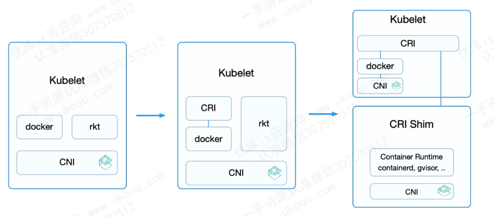
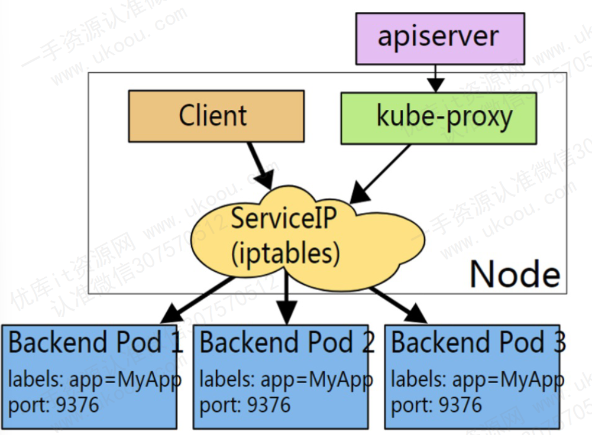
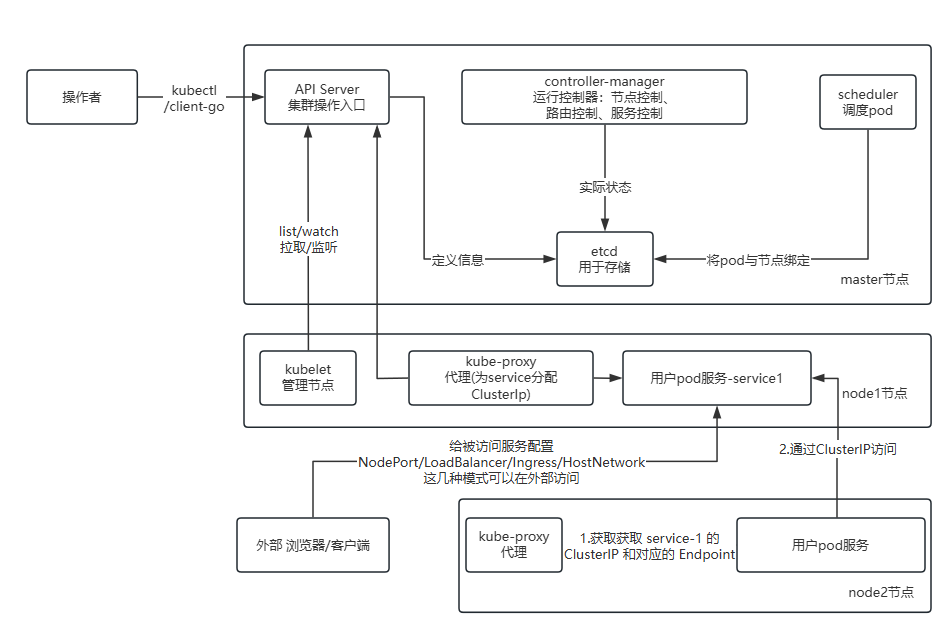

# k8s

K8S（Kubernetes）是一个**开源的容器编排平台**，由Google开发并贡献给云原生计算基金会（CNCF）。它**以容器为中心**，提供了**自动化部署**、扩展和管理容器化应用程序的能力。K8S旨在简化大规模容器化应用的部署、管理和维护过程，让部署容器化应用变得简单高效。

# 核心功能
1. **自动部署** ：一键部署应用，无需手动配置容器和依赖。
2. **自动扩展** ：根据应用负载自动增加或减少容器数量，确保资源高效利用。
3. **高可用性** ：通过多副本和故障恢复机制，确保应用持续可用。
4. **服务发现与负载均衡** ：提供内置的服务发现和负载均衡功能，简化容器间的通信。
5. **存储管理** ：支持多种存储后端，确保数据的持久性和可靠性。
6. **弹性伸缩** ：使用命令、UI或基于CPU使用情况自动快速扩容和缩容应用程序实例，保证应用业务高峰并发时的高可用性，业务低峰时回收资源，以最小成本运行服务。
7. **自我修复** ：在节点故障时重新启动失败的容器，替换和重新部署，保证预期的副本数量；杀死健康检查失败的容器，并且在未准备好之前不会处理客户端请求，确保线上服务不中断。
8. **自动发布和回滚** ：K8S采用滚动更新策略更新应用，一次更新一个Pod，而不是同时删除所有Pod，如果更新过程中出现问题，将回滚更改，确保升级不受影响业务。

# 核心概念

1. **Pod** ：K8S中最小的部署单元，可以包含一个或多个紧密相关的容器。
2. **Service** ：定义了一组Pod的访问策略，提供负载均衡和服务发现功能。
3. **Deployment** ：用于描述Pod的部署，支持滚动更新和回滚等功能。
4. **Namespace** ：将集群内部的资源逻辑上隔离，便于管理和分配。

# K8S的核心组件

K8S采用主从设备模型（Master-Slave 架构），包含以下主要组件：

## Master组件
### kube-apiserver
负责公开 k8s 的 api ，是 k8s 控制平面的前段，它在设计上考虑了水平扩缩。

### etcd

一致且高可用的 key-value 存储，用作 k8s 集群数据的后台数据库

注意：这里的 etcd 是作为 k8s 集群的数据库，并不是我们业务的数据库

### kune-scheduler

负责监控新创建的，未指定运行节点的 pods 并选择节点来让 pod 在上面运行

调度鞠策考虑的因素包括单个 pod 和 pods 集合的资源需求，软硬件和策略约束，亲和性 和 反亲和性规范，数据位置、工作负载间的干扰和最后时限

### kube-controller-manager

负责运行控制器进程

- 节点控制器：负责在节点出现故障时进行通知和响应
- 任务控制器：监测代表一次性任务的 Job 对象，然后创建 Pods 来运行这些任务直至完成
- 端点分片控制器：填充端点分片对象，提供Service 和 Pod 之间的链接
- 服务账号控制器：为新的命名空间创建默认的服务账号

K8S 控制平面还有一个 Cloud controller manager 组件，是可选的。嵌入了特定云平台的控制逻辑，允许你将集群连接到云提供商的API之上，可以与该云平台交互。类似于 kube-controller-manager 控制器都包含对云平台驱动的依赖，比如：
- 节点控制器：在节点终止后响应后检查云提供商以确定节点是否已被删除
- 路由控制器：在底层云基础架构中设置路由
- 服务控制器：创建、更新和删除云提供商负载均衡器

## Node 组件

节点组件只有两个

### kubelet

kubelet 会在集群中每个节点上运行

它保证容器都运行在 Pod 中。 kubelet 接收一组通过各类机制提供给它的 PodSpecs 确保这些 PodSpecs 中描述的容器处于运行状态，且健康，它不会管理不是由 K8S 创建的容器

### kube-proxy

它维护节点上的一些网络规则，这些网络规则会允许从集群内部或者外部的网络会话与pod进行网络通信

## 容器运行环境(Container Runtime)

容器运行环境是负责运行容器的软件。

Kubernetes 支持多个容器运行环境: Docker、 containerd、cri-o、 rktlet 以及任何实现 Kubernetes CRI (容器运行环境接口)。

## 插件(Addons)

插件使用 Kubernetes 资源 (DaemonSet确保 Pod 的副本在集群中的一组节点上运行。, Deployment等) 实现集群功能。因为这些提供集群级别的功能，所以插件的命名空间资源属于 kube-system 命名空间。

## DNS

- 尽管并非严格要求其他附加组件，但所有示例都依赖集群 DNS，因此所有 Kubernetes 集群都应具有 DNS。
- 除了您环境中的其他 DNS 服务器之外，集群 DNS 还是一个 DNS 服务器，它为 Kubernetes 服务提供 DNS 记录。
- Cluster DNS 是一个 DNS 服务器，和您部署环境中的其他 DNS 服务器一起工作，为 Kubernetes 服务提供DNS记录。
- Kubernetes 启动的容器自动将 DNS 服务器包含在 DNS 搜索中。

# 控制平面

在Kubernetes（K8S）中，控制平面（Control Plane）是集群的“大脑”，负责管理和控制集群中的各种资源和操作。它是集群管理和编排的核心部分，确保了集群的期望状态得以实现和维护。

## 控制平面的主要组件

1. API Server：作为集群的唯一入口，提供RESTful API供其他组件和客户端调用。
1. Scheduler：负责根据一定的调度策略，将Pod调度到合适的Node上运行。
1. Controller Manager：包含多个控制器，用于维护集群的期望状态，如ReplicaSet、Deployment等。
1. etcd：一个高可用的键值存储系统，用于存储集群的元数据。

## 控制平面的功能

决策和全局控制：控制平面负责集群的全局控制和决策，确保集群的期望状态得以实现和维护。
资源调度和管理：通过kube-scheduler和kube-controller-manager等组件，控制平面负责资源的调度和管理，确保资源的高效利用和负载均衡。
状态监控和恢复：控制平面通过etcd等组件监控集群的状态，并在发生故障时及时恢复集群的正常运行。
API提供和交互：API Server为集群内部和外部用户提供了统一的API接口，方便用户与集群进行交互和操作。

# 数据平面

在Kubernetes（K8S）中，数据平面（Data Plane）是负责运行容器化应用程序的实际工作节点集合，这些节点也被称为工作节点（Worker Nodes）。数据平面是Kubernetes集群中处理实际数据流转、应用运行和容器管理的部分

## 数据平面的主要组成

1. 工作节点（Worker Nodes）
   
   数据平面由多个工作节点组成，每个节点上运行着Kubernetes的容器编排引擎和其他必要的组件，如kubelet、kube-proxy等。

2. kubelet
   
3. kube-proxy

## 数据平面的功能

- 容器运行：数据平面负责在节点上运行容器化应用程序。它根据Pod的规范，通过容器运行时（如Docker、containerd等）来启动和管理容器。
  
- 资源管理：数据平面上的节点负责管理分配给它们的计算资源（如CPU、内存）、存储资源和网络资源。kubelet负责监控节点的资源使用情况，并根据需要进行调整。
  
- 网络通信：kube-proxy通过维护节点上的网络规则，实现Pod之间的网络通信以及Pod与外部网络的通信。它确保流量能够按照预期的方式在集群中路由。
  
- 状态报告：kubelet定期向控制平面报告节点的状态信息，包括节点的健康状况、资源使用情况等。这些信息对于控制平面的决策和调度非常重要。

# 数据平面与控制平面的关系

- 协作关系：数据平面和控制平面是Kubernetes集群中不可分割的两个部分，它们共同协作以实现对容器化应用程序的高效管理和运行。
  
- 接口通信：数据平面上的kubelet和kube-proxy等组件通过与控制平面上的API Server等组件进行通信，接收并执行来自控制平面的指令和决策。
  
- 功能互补：控制平面负责全局的决策和调度，而数据平面则负责具体的执行和资源管理。两者相互配合，确保了Kubernetes集群的稳定运行和高效扩展。

# K8S架构

# K8S与Docker的联系