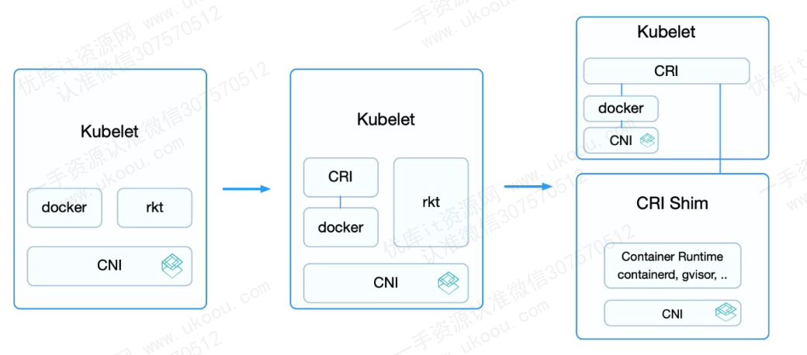
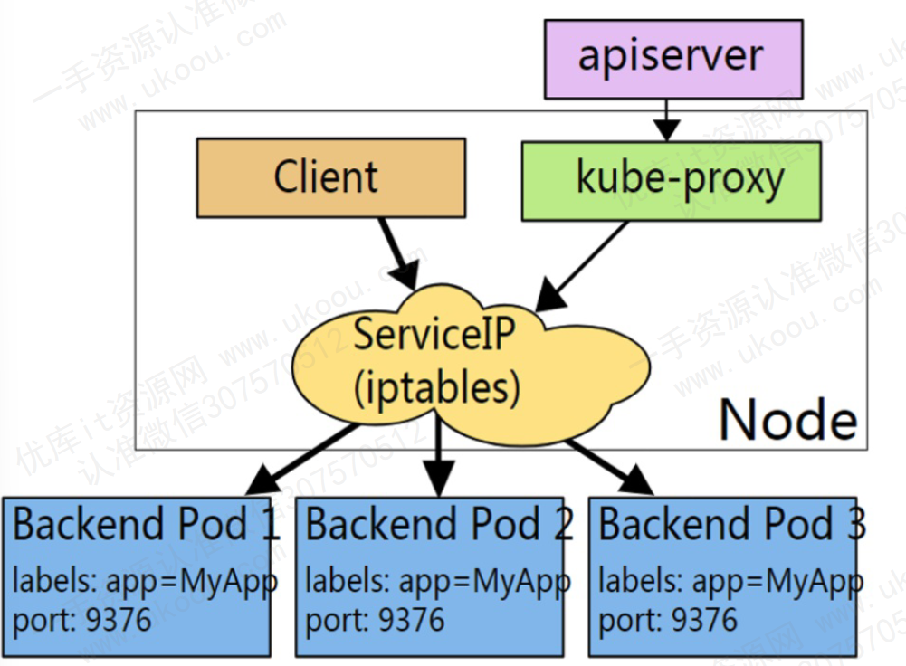

# k8s

# K8S的核心组件

## kube-apiserver
负责公开 k8s 的 api ，是 k8s 控制平面的前段，它在设计上考虑了水平扩缩。

## etcd

一致且高可用的 key-value 存储，用作 k8s 集群数据的后台数据库

注意：这里的 etcd 是作为 k8s 集群的数据库，并不是我们业务的数据库

## kune-scheduler

负责监控新创建的，未指定运行节点的 pods 并选择节点来让 pod 在上面运行

调度鞠策考虑的因素包括单个 pod 和 pods 集合的资源需求，软硬件和策略约束，亲和性 和 反亲和性规范，数据位置、工作负载间的干扰和最后时限

## kube-controller-manager

负责运行控制器进程

- 节点控制器：负责在节点出现故障时进行通知和响应
- 任务控制器：监测代表一次性任务的 Job 对象，然后创建 Pods 来运行这些任务直至完成
- 端点分片控制器：填充端点分片对象，提供Service 和 Pod 之间的链接
- 服务账号控制器：为新的命名空间创建默认的服务账号

K8S 控制平面还有一个 Cloud controller manager 组件，是可选的。嵌入了特定云平台的控制逻辑，允许你将集群连接到云提供商的API之上，可以与该云平台交互。类似于 kube-controller-manager 控制器都包含对云平台驱动的依赖，比如：
- 节点控制器：在节点终止后响应后检查云提供商以确定节点是否已被删除
- 路由控制器：在底层云基础架构中设置路由
- 服务控制器：创建、更新和删除云提供商负载均衡器

## 节点集群组件

节点组件只有两个

### kubelet

kubelet 会在集群中每个节点上运行

它保证容器都运行在 Pod 中。 kubelet 接收一组通过各类机制提供给它的 PodSpecs 确保这些 PodSpecs 中描述的容器处于运行状态，且健康，它不会管理不是由 K8S 创建的容器

### kube-proxy

它维护节点上的一些网络规则，这些网络规则会允许从集群内部或者外部的网络会话与pod进行网络通信

## 容器运行环境(Container Runtime)

容器运行环境是负责运行容器的软件。

Kubernetes 支持多个容器运行环境: Docker、 containerd、cri-o、 rktlet 以及任何实现 Kubernetes CRI (容器运行环境接口)。

## 插件(Addons)

插件使用 Kubernetes 资源 (DaemonSet确保 Pod 的副本在集群中的一组节点上运行。, Deployment等) 实现集群功能。因为这些提供集群级别的功能，所以插件的命名空间资源属于 kube-system 命名空间。

## DNS

- 尽管并非严格要求其他附加组件，但所有示例都依赖集群 DNS，因此所有 Kubernetes 集群都应具有 DNS。
- 除了您环境中的其他 DNS 服务器之外，集群 DNS 还是一个 DNS 服务器，它为 Kubernetes 服务提供 DNS 记录。
- Cluster DNS 是一个 DNS 服务器，和您部署环境中的其他 DNS 服务器一起工作，为 Kubernetes 服务提供DNS记录。
- Kubernetes 启动的容器自动将 DNS 服务器包含在 DNS 搜索中。

# k8s 的资源

## 工作负载资源