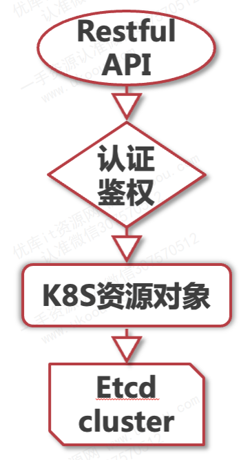

# APIServer

API Server 是 kubernetes 集群的入口，它提供了 `RESTful API ` 用于处理集群内外的各种客户端请求（这些客户端可以是用户、命令行工具(如kubectl)、其他组件或者第三方应用工具）。并完成对集群内资源的操作。

## 工作原理
API Server的工作原理可以分为以下几个关键步骤：

1. 请求接收
   
   API Server监听特定的端口（默认是8080端口用于非安全请求，6443端口用于HTTPS安全请求），接收来自客户端的HTTP请求。

1. 请求处理：
   
   - 对接收到的请求进行解析，确定请求的资源类型、操作类型等。
  
   - 执行认证和授权操作，确保请求者具有足够的权限进行请求的资源操作。
  
   - 调用相应的处理逻辑，如从etcd中读取或写入数据，执行资源对象的创建、删除、更新等操作。

1. 数据存储：

    Kubernetes使用etcd作为其后端存储系统，存储集群的元数据和配置信息。API Server通过etcd的API与etcd集群进行交互，实现数据的持久化存储和一致性保证。

1. 结果返回: 将处理结果封装成HTTP响应，返回给客户端。
   

# 网关功能

所有的数据的访问和更新，都需要经过 API Server ，这就需要它具有网关的功能。为了保证安全的对外暴露，它还具有 身份人认证、鉴权的功能。

对于消息转发功能，则是一个 Proxy 接口，可以通过代理方式将 API Server 收到的 REST 请求转发到某个 Node 上的 kubelet 上，由 kubelet 进行响应

# 资源对象管理

API Server 有很多接口，这些接口是都负责对 K8S 资源对象的管理功能，像是资源的注册和发现，这里比较常用的接口有：Node 相关接口、Pod 相关接口、Service 相关接口

最后所有资源对象的状态数据，都会保存到 etcd 这个 key-value 结构的数据库中。其它的组件需要查询某些资源可以通过API Service 提供的查询接口，如果需要掌握资源对象的变更，可以使用 API Server 的 watch 方法

# APIServer 的访问方式

比较常用的访问方式是通过kubectl客户端，使用这个命令行工具来管理k8s资源

另外就是对于微服务平台或者团队的devops系统，或者为了快速高效的对k8s集群进行管理还可以使用编程方式，也就是把管理功能与自己的程序结合起来。

k8s有开源的客户端代码 client-go 项目，直接拿过来也就可以快速上手使用了。

# K8S组件怎样与API Server通信

调用API Server接口，也就是把资源对象数据保存到etcd，或者从etcd查询到资源对象

那各个组件会关心哪些资源数据呢？

**kubelet**

kubelet 作为在集群节点上运行的重要组件，管理着节点上所有的pod信息和状态。

当本机的pod状态发生变更时，不论是新建成功了，还是出现异常或者销毁了，都要调用API Server的接口把这些数据上报。同时kubelet也需要通过API Server的watch接口，监听pod的变更，比如：要新建一个pod实例，需要删除一个pod对象，需要修改pod信息等。当监听到的这个pod变更是自己这个节点时，也就需要作出相应动作，以保证pod状态符合期待的结果。

同样的，controller-manager中有很多的控制器，它们也会使用API Server的watch方法，监听自己关注的资源对象，然后做出相应的处理。scheduler也是要通过API Server的watch方法，监听到新建pod的信息后，再查询节点列表，然后开始执行pod调度逻辑。调度成功将pod绑定到目标节点上。

如果集群的规模很大，几千个节点，那么对API Server的并发要求就很高，对etcd的读写压力也会很大。

k8s这方面也是利用缓存的方法，来缓解API Server的压力。

在各个组件本地都有一份缓存数据，不需要每次都实时从API Server中读取数据。
所以，这里提醒一下，当集群规模较大，而且pod数量也多了，那么就意味着node、pod这些资源的更新和查询也会很频繁。

这时候，需要特别注意API Server和etcd的负载情况，别因为这里的性能成为这个集群的瓶颈。