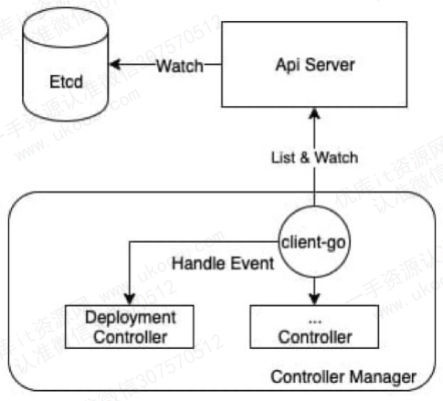
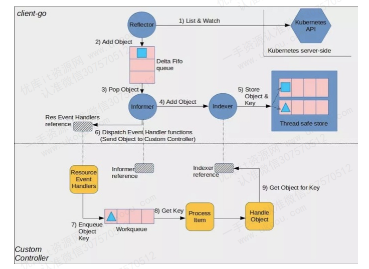

# Controller Manager

在 K8S 中管理资源的方式非常简单，通常是编写一个 YAML 配置文件，简单的可以通过 kubectl 命令完成。当集群中某个 pod 挂掉了，我们没有做任何操作， pod 又会自动重建，这就是 Controller Manager 的功劳。

Controller Manager 就是集群内部的管理控制中心，它负责自动化管理集群内的各种资源，由负责不同资源的多个 Controller 构成，这些 Controller 共同管理集群内的 Node Pod 等所有资源的管理。

比如：当通过 Deployment 创建的某个Pod发生异常退出时， ReplicaSet Controller 便会接受并处理该退出事件，并创建新的 pod 来维持预期副本数量。

几乎每种特定的资源都会有特定的 Controller 维护管理，以保持预期状态，而Controller Manager 的职责就是把所有的 Controller 聚合起来,这是为了：
1. 提供基础设置降低Controller 的实现复杂度
2. 启动和维持 Controller 的正常运行

Controller Manager 的作用简单来说，就是保证集群中的各种资源的**实际状态与用户定义的预期状态的一致**。 Controller 保证了集群内的资源保持预期状态， Controller Manager 则保证了 Controller 的预期状态。

# Controller 工作流程

1. **事件监听：**
   
   Controller Manager 中的每个控制器都会通过 Kubernetes API Server 监听集群中资源对象的变化。这些资源对象可能是 Pod、Service、ReplicaSet、Deployment 等。当用户创建、更新或删除这些资源时，Controller 会接收到通知。

2. **获取期望状态**

    每个控制器的职责是维护某种 Kubernetes 对象（如 Pod、Deployment）的期望状态。这个期望状态通常由用户通过 YAML 或 JSON 文件提交给 API Server。

    - 期望状态定义：期望状态是用户期望 Kubernetes 集群中某一资源应处于的状态。例如，用户可能定义了一个 Deployment 对象，期望在集群中始终运行 3 个副本的某个应用。

3. **比较实际状态和期望状态：**
   
   控制器从 API Server 中读取当前的集群状态，并将其与用户定义的期望状态进行比较。

    - **实际状态**：实际状态是当前在集群中运行的资源的状态。例如，当前运行的 Pod 数量、Pod 的健康状态等。
  
    - **比较逻辑**：控制器会判断实际状态是否符合期望状态。如果实际状态和期望状态一致，则无需进一步操作；如果不一致，控制器将采取行动。

4. **采取纠正措施**

    当控制器检测到实际状态与期望状态不一致时，它会采取相应的纠正措施，以将实际状态调整到期望状态。

    - 增删资源：控制器可能需要创建新的资源（如 Pod），删除多余的资源，或更新现有资源的配置。例如，ReplicaSet 控制器会在实际 Pod 数少于期望值时创建新的 Pod，在实际 Pod 数超过期望值时删除多余的 Pod。
  
    - 执行重试机制：有时，纠正操作可能会失败。控制器通常具有重试机制，会定期重新尝试纠正操作，直到实际状态与期望状态一致。

5. **更新状态**

    控制器会将其执行的操作及其结果反馈给 API Server。API Server 会更新集群的状态信息，并通知控制器是否需要进一步操作。

    - 状态同步：控制器不断与 API Server 保持同步，确保集群状态在持续变化的环境中能够及时更新。
  
    - 回调机制：某些控制器可能会注册回调函数，以便在特定事件发生时立即采取行动，而无需等待下一个同步周期。

6. **持续循环**
   
   控制器的工作流程是一个持续的循环。它们不断监听资源变化，比较状态，执行纠正操作，并更新状态。这个循环确保 Kubernetes 集群在面对变化时，能够自动调整并保持稳定。

# Controller manager 架构

帮助 Controller manager 完成事件分发的是 Client-go，目前Client-go 已经被抽取为一个单独的项目，在k8s的二次开发中经常会用到。比如可以通过 Client-go 自定义 Controller 。

在 Client-go 包中有一个人非常核心的工具就是 infomer ，它的主要功能可以概括为两点：
1. 资源数据缓存功能-用来缓解 kube-apiServer 的访问压力
2. 提供了事件机制，并会触发回调，Controller 可以基于回调处理具体的业务逻辑

Reflector 模块也很重要，有以下几个功能
1. 采用 list 、watch 两种机制与 apiserver 交互，List 是短连接获取全量数据， watch 是长链接获取增量数据
2. 可以watch 任何资源,包括CRD(自定义资源定义)
3. Watch 到的增量对象添加到队列，然后 infomer 取到数据后，会通过 Index 模块保存到本地缓存中，Controller 读取对象数据时，可以从本地换粗中读取，减少与 apiserver 的交互