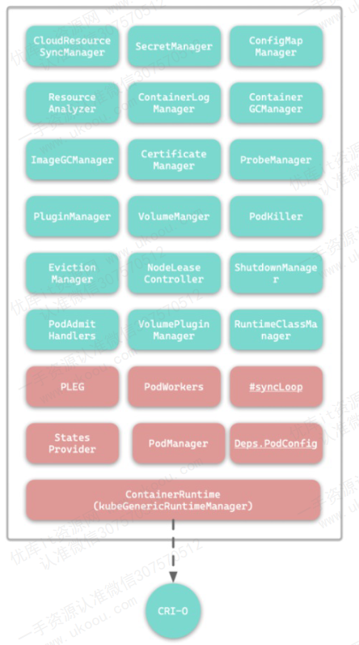
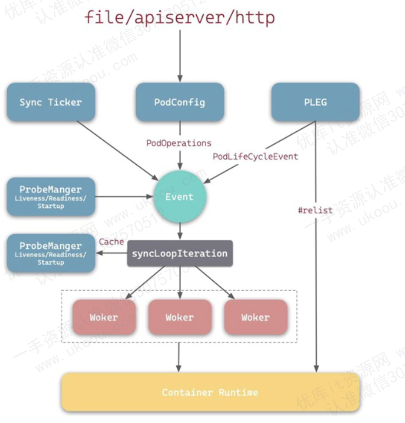

# kubelet

kubelet 是部署在每一个常规集群节点上的核心组件，它负责在每个节点上管理和运行容器。

kubelet 的主要任务是确保容器在节点上的正常运行，并接受来自控制平面（如apiserver）的指令

# kubelet的主要功能

## Pod和容器的生命周期管理

1. **pod的调度和创建**： kubelet 从 API Server 接收到调度器分配到本节点的 Pod 定义后，会与容器运行时(Docker / containerd)交互，启动 Pod 中的所有容器
   
2. **容器的启动和停止**： kubelet 负责根据 pod 的生命周期管理容器的启动、停止和删除。当容器因为各种原因崩溃或者退出时， kubelet 会根据 pod 的重启策略（如 Always 、 OnFailure 、Never）决定是否重启该容器
   
## 与容器运行时的接口（CRI）

   
**抽象和适配：** kubelet 通过容器运行时接口（Container Runtime Interface, CRI）与具体的容器进行通信。这个接口使得 kubelet 可以支持不同的容器运行时，如 Docker 、 containerd 、CRI-O等

**容器操作**： 通过 CRI ， kubelet 可以执行一系列容器管理操作，如启动、停止、检查容器状态、收集容器日志等

## 健康检查与自愈

**健康检查探针**： kubelet 通过探针 Probes 定期检查容器的健康状况，包括启动探针 Startup Probe 、存活探针 Liveness Probe 和 就绪探针 Readiness Probe。 这些探针帮助 kubelet 判断容器是否应该被重启或者准备好接收流量

**自动重启**： 如果探针监测到容器并不健康， kubelet 会根据 Pod 的配置自动重启容器，以确保服务的高可用性和稳定性

## 资源管理

**资源分配与监控**： kubelet 负责分配和管理容器的计算资源，如 CPU 和 内存。通过 cgroups(控制组) 和 namespaces(命名空间)集成，kubelet实现了容器的资源隔离和限制，确保不同容器之间的互不干扰

**资源报告**： kubelet 定期向 API Server 汇报节点的资源使用情况，这些数据会被控制平面用来进行调度决策，如将新的 Pod 调度到合适的节点上。

## 日志和监控

**日志管理**：Kubelet 收集容器的标准输出和标准错误日志，并将这些日志暴露给外部日志收集系统（如 Fluentd），以便进行日志聚合和分析。

**监控数据采集**：Kubelet 负责收集节点和容器的监控数据（如 CPU、内存使用情况），这些数据可以被 Prometheus 等监控系统采集，用于实时监控和告警。

## 存储管理

**卷的挂载与管理**：Kubelet 负责将 Pod 所需的存储卷（如 Persistent Volumes）挂载到容器的文件系统中，并在容器终止时卸载这些卷。它支持多种存储后端，如本地存储、NFS、云存储（如 AWS EBS、GCP Persistent Disks）等。

**持久化数据管理**：通过卷的挂载，Kubelet 确保容器间能够共享数据，或者在容器重启后仍能保留数据，支持持久化存储需求。

## 配置管理

**配置数据的分发**：Kubelet 负责将 ConfigMap 和 Secret 挂载到容器的文件系统中或注入为环境变量，使容器化应用能够动态获取和使用配置数据和敏感信息。

**动态更新支持**：Kubelet 支持在不重启容器的情况下动态更新 Pod 的配置，例如更新环境变量或文件配置。

## 节点健康监控与报告

**节点自我监控**：Kubelet 定期检查节点自身的健康状况，包括网络、存储、CPU、内存等资源的可用性。如果节点检测到自身存在问题（如磁盘满了、网络不可达），Kubelet 会将这些信息上报给控制平面。

**健康状态报告**：Kubelet 将节点和 Pod 的健康状态定期报告给 API Server。这些信息对于 Kubernetes 的调度器决定是否将新的工作负载分配到节点上非常关键。

## 安全与证书管理

**证书管理**：Kubelet 使用证书与 API Server 进行加密通信，确保数据传输的安全性。它负责管理这些证书的生成、续期和更新。

**Pod 安全策略执行**：Kubelet 可以强制执行 Pod 安全策略（如 PodSecurityPolicy），限制容器的权限级别，确保容器的运行环境符合安全要求。

## 与控制平面的通信

**执行控制命令**：Kubelet 从 API Server 接收指令（如调度、删除 Pod），并负责在节点上执行这些操作。它确保控制平面的指令能够准确无误地在节点上执行。

**状态同步**：Kubelet 会定期与 API Server 同步节点上 Pod 的状态，包括运行状态、资源使用情况、健康检查结果等。这些信息对于控制平面进行调度和管理至关重要。

# 容器重启策略

Kubelet 的容器重启策略与 Kubernetes 中的控制器（Controller Manager）策略在概念和作用范围上有所不同，通常它们是互补的，而不是冲突的。如果发生冲突，Kubernetes 的设计是让这两者协调工作，以确保 Pod 的高可用性和稳定性。

## Kubelet 的容器重启策略

Kubelet 负责管理单个节点上的容器生命周期，它的重启策略是在 Pod 规范（PodSpec）中定义的，适用于具体的容器。Kubelet 的重启策略有以下几种：

1. Always：

    - 无论容器的退出状态是什么，Kubelet 都会尝试重新启动该容器。
    - 适用于需要持续运行的服务，如 Web 服务器。
1. OnFailure：
    - 只有在容器非正常退出（退出码不为 0）时，Kubelet 才会重启该容器。
    - 适用于需要重试任务的场景，如批处理任务。
1. Never：

    - Kubelet 不会重启容器，无论容器是正常退出还是非正常退出。
    - 适用于一次性任务或不需要重启的进程。

## Controller Manager 的重启策略

Kubernetes 的控制器（如 Deployment、ReplicaSet、DaemonSet 等）在 Controller Manager 中运行，负责确保整个集群范围内的 Pod 的期望状态。这些控制器关注的是 Pod 的数量和状态，而不是具体的容器实例。

- Deployment：

    管理 Pod 的副本数。确保在集群中始终有指定数量的 Pod 运行。如果某个 Pod 被删除或失败，控制器会创建新的 Pod 来替代它。
- ReplicaSet：

    维持一组 Pod 的稳定副本数量，与 Deployment 类似。如果 Pod 失败或被删除，ReplicaSet 会启动新的 Pod。
- DaemonSet：

    确保在每个节点上都有一个特定的 Pod 运行。如果节点加入或离开集群，DaemonSet 会调整 Pod 的数量。

## 两者之间的关系

- 协调性：
    Kubelet 的容器重启策略是处理具体节点上容器故障的第一道防线，它在本地快速响应容器的退出和重启需求。而 Controller Manager 的重启策略关注的是集群范围内的整体健康状况，确保符合期望的 Pod 数量。

- 优先级：

    - 如果 Pod 中的容器因为某些原因退出且符合 Kubelet 的重启策略（如 Always 或 OnFailure），Kubelet 会尝试在本地节点上重新启动该容器。
    - 如果整个 Pod 失败（如 Pod 被删除或节点不可用），则 Controller Manager 会介入，创建新的 Pod 实例来满足副本数量的要求。

## 如果策略冲突会发生什么？
通常情况下，Kubelet 和 Controller Manager 的策略是设计为互补的，避免冲突。然而，在一些边界情况下，可能会有行为重叠或看似冲突的情况：

1. Pod 被 Kubelet 重启而非替换：
    如果 Kubelet 的容器重启策略触发了容器的重启（例如因为容器崩溃），而控制器发现 Pod 仍然存在且数量符合预期，它不会创建新的 Pod。这样，Kubelet 可以在节点级别处理临时故障，而 Controller Manager 则专注于确保全局的一致性。

1. Pod 被控制器删除：
    如果 Controller Manager 决定删除某个 Pod（例如在滚动更新过程中），即使 Kubelet 正在重启该 Pod 中的容器，Pod 最终也会被删除并由新的 Pod 替代。

1. 节点不可用时：
   
    如果节点由于故障或网络隔离变得不可用，Kubelet 无法重启容器。此时，控制器会在其他可用节点上重新调度并创建新的 Pod，确保集群整体的服务可用性。

# kubelet的工作流程

1. **节点启动**： 当节点启动时，kubelet 会首先向控制平面的 APIServer 注册自己，汇报节点的资源信息如 CPU、内存等
2. **Pod 的创建**： kubelet 从 APIServer 接收到调度本节点的 Pod 之后，解析 Pod 规范，并与容器运行时（如 Docker、containerd）进行交互，启动 Pod 中的容器
3. **生命周期管理**： kubelet 负责管理这些 Pod 的生命周期，包括容器的启动、健康检查、资源管理等。它会定期检查容器的健康状态，并根据需要重新启动不健康的容器
4. **资源和状态报告**： Kubelet 定期向 API Server 汇报节点和 Pod 的状态信息，包括资源使用、健康状态、日志等。这些数据用于全局调度和监控。
5. **执行控制命令**：当 API Server 下发新的命令（如删除 Pod），Kubelet 会立即执行这些命令，确保节点状态与控制平面同步。

# kubelet的架构

1. 主循环（Main Loop）：

    - Kubelet 的核心部分是一个主循环，它持续运行，定期与 Kubernetes API Server 通信以获取最新的 Pod 规范（PodSpec）。主循环还会收集节点的状态信息，并与集群控制平面保持同步。

    - 主循环的主要职责是：拉取 Pod 规范、协调容器的创建和删除、监控容器的健康状况，以及报告节点和 Pod 的状态。
  
2. Pod 管理器（Pod Manager）：

    - Pod 管理器负责管理和协调节点上的 Pod 生命周期。它根据 Pod 规范决定如何创建、启动、停止和删除 Pod 中的容器。
    - Pod 管理器还会处理 Kubernetes 中涉及到 Pod 的复杂场景，例如处理静态 Pod、镜像 Pod（Mirror Pods）等。
3. 容器运行时接口（CRI, Container Runtime Interface）：

    - Kubelet 使用 CRI 与底层的容器运行时（如 Docker、containerd、CRI-O）交互。通过 CRI，Kubelet 可以以统一的方式管理容器的生命周期，包括启动、停止、重启容器，以及获取容器的状态信息。
    - CRI 使得 Kubernetes 可以支持不同的容器运行时，而不需要 Kubelet 的核心逻辑针对每个运行时进行定制。
1. 节点状态管理器（Node Status Manager）：

    - 这个组件负责收集和维护节点的状态信息，例如 CPU、内存使用情况，磁盘容量，网络状态等。节点状态管理器会定期将这些信息汇报给 Kubernetes API Server，以便集群控制平面可以基于最新的节点状态做出调度决策。

    - 还包括健康检查功能，确保节点和 Pod 的健康状态。如果发现异常情况，节点状态管理器会将此信息传递给控制平面，触发相应的自愈或重新调度操作。
1. cAdvisor（Container Advisor）：

    - cAdvisor 是一个资源监控工具，集成在 Kubelet 中，用于收集容器的资源使用信息（如 CPU、内存、网络 I/O、磁盘 I/O）。cAdvisor 将这些数据暴露给 Kubelet，帮助其做出资源调度决策，并通过 Kubelet 将监控数据上传至集群的监控系统。
1. Volume 管理器（Volume Manager）：

    - Volume 管理器负责管理节点上的存储卷（Volume），包括挂载和卸载存储卷，确保 Pod 能够正确访问持久化存储。
    Kubelet 通过 Volume Manager 与 Kubernetes 中的存储系统（如 Persistent Volumes, PV）集成，确保数据的持久性和高可用性。

1. 网络插件管理器（CNI, Container Network Interface）：

    - Kubelet 使用 CNI 插件来配置和管理容器的网络设置。CNI 插件确保每个 Pod 在节点上的网络环境正确配置，包括 IP 地址分配、路由配置等。
    - 这使得 Kubernetes 能够支持多种网络方案（如 Calico, Flannel, Weave）并保证网络的可扩展性和灵活性。
1. 认证和授权（Authentication & Authorization）：

    - Kubelet 实现了节点级别的认证和授权机制，确保只有被授权的请求能够访问和管理节点上的资源。
    它通过客户端证书或服务账号与 API Server 通信，并遵循 Kubernetes 的 RBAC（基于角色的访问控制）策略，确保安全性。
1. 日志和事件管理器：

    - Kubelet 负责收集和管理节点上的日志和事件，并将这些信息发送给集群中的日志系统或事件监控系统。
    这部分功能确保管理员可以跟踪节点和 Pod 的运行状况，进行故障排查和性能调优。

# kubelet 的工作原理

kubelet 是按照**控制器模式** 来工作的，它的工作核心，就是一个控制循环，即事件和 SyncLoop：

事件的来源包括四种：
1. 来自PodConfig的更新事件
2. 来自PLEG-Pod的生命周期事件
3. 来自kubelet本身设置的执行周期，如Pod的健康检测等
4. 来自定时的清理事件

