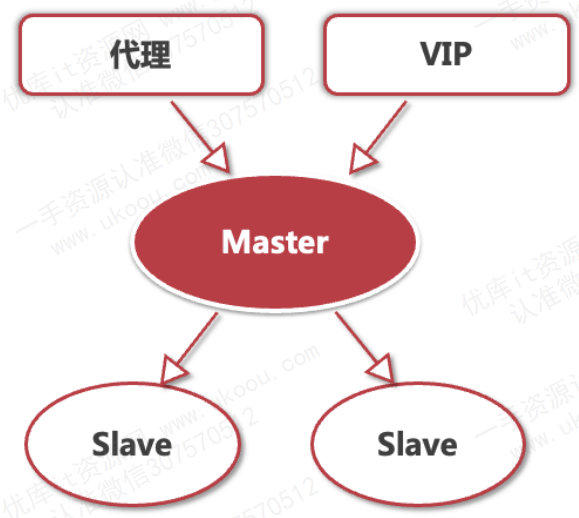

# kube-apiserver的高可用

1. 多实例部署：为了实现高可用性，通常会在集群中部署多个 kube-apiserver 实例。多个实例可以运行在不同的节点上，组成一个 kube-apiserver 集群。

1. 负载均衡：通过负载均衡器（如 HAProxy、Nginx 或云提供商的负载均衡服务）将流量分发到多个 kube-apiserver 实例，确保当一个实例故障时，流量可以自动切换到其他可用实例。
   
2. DNS 轮询：通过 DNS 轮询（Round-robin DNS），可以将域名解析到不同的 kube-apiserver 实例，从而实现简单的负载均衡和高可用性。

3. 故障转移机制
   - 主动健康检查：负载均衡器通常配置健康检查，以检测 kube-apiserver 实例的健康状态。一旦某个实例不可用，负载均衡器会自动停止向其发送流量，确保集群服务不受影响。
   - 自动恢复：结合 Kubernetes 自身的调度和恢复机制（如 Pod 的重启策略），当某个 kube-apiserver 实例失败时，系统可以自动重启或替换实例。
  
4. API Server 的静态 Pod 配置
   
   在每个节点上，可以配置 kube-apiserver 作为静态 Pod 运行，确保它们在节点启动时自动启动，并在失败时自动恢复。静态 Pod 配置文件通常位于 /etc/kubernetes/manifests 目录下。

1. 监控和告警

    通过监控系统（如 Prometheus、Grafana）监控 kube-apiserver 的性能和健康状态，并设置告警，及时发现和处理潜在问题。

1. etcd 的高可用
   
   kube-apiserver 依赖 etcd 存储集群状态信息，因此 etcd 的高可用性也至关重要

# etcd的高可用

etcd 是数据类型的服务，所以我们对比一下存储类型的高可用。

## mysql的高可用

mysql数据库服务最主要的高可用方法是主从同步。

一主多从的模式。从库如果发生异常，不会影响mysql服务的使用。主库如果发生异常，就需要把主库下线，然后把一个最新数据的Slave提升为主库。

这些高可用方案，因为主从同步的延时问题，都有可能出现数据不一致的情况。

如果改成实时同步，也会带来数据库性能的大幅度下降，基本很少采用。

## redis 的高可用

redis也有类似于mysql的主从模式，通过哨兵来监视所有的服务状态，如果主库出现异常，把一个从库切换为主库。数据不一致的问题类似上面的mysql方案。

而redis集群模式，可以把多个redis服务组成一个集群，每个redis服务维护一部分的数据，这样整个redis集群的高可用性就提高更多了，服务的并发能力和数据容量以及伸缩性也都有大幅的提高。

## etcd基于raft协议实现数据一致性

整个 etcd 集群需要奇数个服务器，比如3台、五台。这些 etcd 服务会自动投票选举，将一个 etcd 服务选择为 leader ，其他都是 follow。

leader 会接收全部的读写请求，然后会把写请求广播给所有follow 节点。 follow 对外是只读的，如果 leader 节点异常，其他的follow节点就要重新开始选举。

### etcd 选举的过程
1. 每个节点都会启动一个随机延时，推举自己成为leader
2. 节点拥有最近的数据，可以成为leader，得到一票
3. 如果多个节点的票数相同，它们会重复过程1，再来第二轮投票

由于这里增加了随机延时的投票，所以更早发起投票的节点会得到最多的票数，完成整个 etcd选举的过程，拥有超过半数的投票可以成为leader ，其他变为 follow .

在 etcd 的选举过程中，etcd 服务不可用

### etcd的高可用总结

1. etcd 更多的保证了强一致性
2. 通过集群的节点，以及异常时自动恢复，来保证高可用性
3. 性能方面，etcd 不如 redis 但是数据一致性则比mysql、redis更好

# kube-controller-manager和kube-scheduler的高可用

而kube-controller-manager和kube-scheduler都是通过kube-apiserver的接口来读写数据，本地并没有保存持久化数据，所以，也是可以部署多个实例，这些实例会通过向apiserver中的Endpoint加锁的方式来进行leaderelection， 当目前拿到leader的实例无法正常工作时，别的实例会拿到锁，变为新的leader。