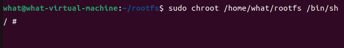
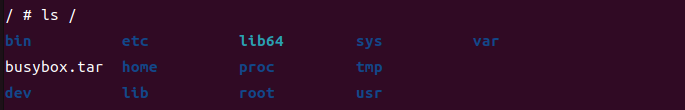
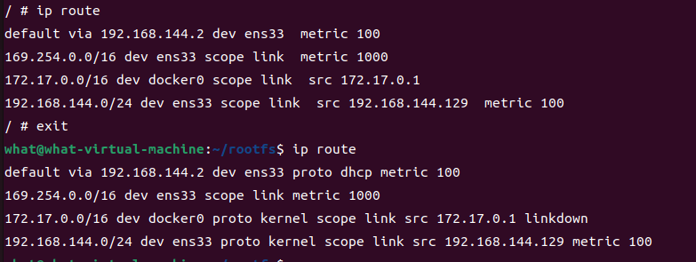

# 卸载已有 Docker

如果你已经安装过旧版的 Docker，可以先执行以下命令卸载旧版 Docker。

centos
```bash
sudo yum remove docker \
                  docker-client \
                  docker-client-latest \
                  docker-common \
                  docker-latest \
                  docker-latest-logrotate \
                  docker-logrotate \
                  docker-engine

```

ubuntu
```bash
sudo apt remove docker \
                  docker-client \
                  docker-client-latest \
                  docker-common \
                  docker-latest \
                  docker-latest-logrotate \
                  docker-logrotate \
                  docker-engine
```

# 安装 Docker

## 配置docker安装源

centos
```bash
sudo yum-config-manager \
    --add-repo \
    https://download.docker.com/linux/centos/docker-ce.repo
```

ubuntu
```bash
# 设置公钥证书
curl -fsSL https://download.docker.com/linux/ubuntu/gpg | sudo apt-key add -
# 设置仓库
sudo add-apt-repository "deb [arch=amd64] http://mirrors.aliyun.com/docker-ce/linux/ubuntu $(lsb_release -cs) stable"
```

## 安装docker

centos
```bash
sudo yum install docker-ce docker-ce-cli containerd.io
```
ubuntu
```bash
sudo apt install docker-ce docker-ce-cli containerd.io
```


启动 docker

```bash
sudo systemctl start docker
```

这里有一个国际惯例，安装完成后，我们需要使用以下命令启动一个 hello world 的容器。
```bash
sudo docker run hello-world
```


## 将当前用户添加到docker用户组

将用户添加到 docker 用户组
```bash
sudo usermod -aG docker $USER
```
- `sudo` ：这是一个命令行程序，允许授权的用户以另一个用户（通常是超级用户，即root）的安全权限来运行命令。在这里，它用于获取执行后续命令所需的权限。
- `usermod` ：这是一个用于修改用户账户设置的工具。它可以用来更改用户的登录名、家目录、用户组等。
  
- `-aG`：这是usermod命令的两个选项的组合。
  - `-a` 选项表示将用户追加到指定的附加组中，而不是替换掉用户原来的组。
  - `-G` 选项后面跟的是要添加到用户上的组名列表，多个组名之间用逗号分隔，但在这个命令中，我们只指定了一个组名 docker。
  
  注意，由于这里-a和-G是分开写的（-aG），并且紧跟在usermod后面，所以它们被当作一个组合选项来处理，专门用于追加用户到额外的组中。
  
- `docker` ：这是要添加用户到的目标用户组的名称。在这个上下文中，它指的是允许用户无需sudo即可执行Docker命令的组。
  
- `$USER` ：这是一个环境变量，它通常包含当前登录用户的用户名。在Shell脚本或命令行中，`$USER` 会被替换成实际登录的用户名。这样，无论哪个用户执行这个命令，它都会将那个用户添加到docker组中。


注意：执行此命令后，您需要注销并重新登录，或者重启您的计算机，以便更改生效。这是因为用户组信息是在用户登录时从 `/etc/passwd` 和 `/etc/group` 等文件中读取的，并且这些更改不会立即反映到已经打开的会话中。

可以尝试 `newgrp` 命令来更新当前会话的组信息，但这通常不如注销并重新登录来得可靠。
```bash
newgrp docker
```


# 容器技术原理

chroot 是最早的容器雏形.

chroot 意味着切换根目录，有了 chroot 就意味着我们**可以把任何目录更改为当前进程的根目录**，也就是创建了一个与当前系统隔离的环境，在该环境 中运行的程序只能访问到该环境内的文件和目录结构。


## chroot
什么是 chroot 呢？下面是 chroot 维基百科定义：

> chroot 是在 Unix 和 Linux 系统的一个操作，**针对正在运作的软件行程和它的子进程，改变它外显的根目录**。一个运行在这个环境下，经由 chroot 设置根目录的程序，它不能够对这个指定根目录之外的文件进行访问动作，不能读取，也不能更改它的内容。


以下演示使用 ubuntu 系统


1. 创建目录，作为 chroot 演示目录
    ```bash
    mkdir rootfs
    ```
2. 从 `docker` 导出一个基础镜像，并打包为 `tar` 格式,作为 演示

    ```bash
    cd rootfs 

    docker export $(docker create busybox) -o busybox.tar
    tar -xf busybox.tar
    ```
    命令解析
    1. docker create busybox：这个命令会创建一个新的Docker容器，但不会启动它。busybox是一个非常小的Linux镜像，通常用于测试或作为容器的基础镜像。docker create命令会基于busybox镜像创建一个容器实例，但立即停止它，不会运行其中的任何进程。
    2. $(...)：这是一个命令替换的语法，它会执行括号内的命令，并将输出替换到当前命令的相应位置。所以，$(docker create busybox)会被替换为docker create busybox命令的输出，即新创建的容器的ID。
    3. docker export <container_id> -o busybox.tar：这个命令的意图是将指定容器的文件系统导出为一个tar包。但是，在我们的命令中，<container_id>部分被替换成了$(docker create busybox)的输出，即容器的ID。理论上，如果直接使用容器ID，这个命令是有效的。

3. 使用 ls 查看 rootfs 目录下内容
    ```bash
    ls
    ```
    输出
    ```bash
    bin  busybox.tar  dev  etc  home  lib  lib64  proc  root  sys  tmp  usr  var
    ```
4. 使用 `chroot` 命令把 `/home/what/rootfs` 作为 sh 进程的根目录
   ```bash
   sudo chroot /home/what/rootfs /bin/sh
   ```
   

   使用 ls 查看 / 目录
   ```bash
   ls /
   ```
   
   这里可以看到当前进程的根目录已经变成了主机上的 `/home/what/rootfs` 目录。这样就实现了当前进程与主机的隔离。到此为止，一个目录隔离的容器就完成了。

1. 查看路由信息
   ```bash
   ip route
   ```
   
   退出
   ```bash
   exit
   ```
   继续查看路由信息
   ```bash
   ip route
   ```
   

   两相对比，网络信息并没有隔离，实际上进程等信息也并未隔离，要想实现一个完整的容器还需要 Linux 的其他三项技术： Namespace 、 Cgroups 和 联合文件系统

Docker 是利用 Linux 的 Namespace 、Cgroups 和联合文件系统三大机制来保证实现的， 所以它的原理是：
- Namespace 做主机名、网络、PID 等资源的隔离，
- Cgroups 对进程或者进程组做资源（例如：CPU、内存等）的限制，
- 联合文件系统用于镜像构建和容器运行环境。

## Namespace


Namespace 是 Linux 内核的一项功能，该功能对内核资源进行隔离，使得容器中的进程都可以在单独的命名空间中运行，并且只可以访问当前容器命名空间的资源。Namespace 可以隔离进程 ID、主机名、用户 ID、文件名、网络访问和进程间通信等相关资源。


Docker 主要用到以下五种命名空间。
- pid namespace ： 用于隔离进程ID
- net namespace ： 用于隔离网络接口，在虚拟的 net namespace 内用户可以拥有自己独立的IP、路由端口等
- mnt namespace ：文件系统挂载点隔离
- ipc namespace ：信号量、消息队列、和共享内存的隔离
- uts namespace ：主机名和域名的隔离

## Cgrpups
Cgroups 是linux 内核功能，可以限制隔离进程资源的使用情况（CPU、内存、磁盘、网络等）。在容器实现中，Cgrpups 通常用来限制容器的 CPU 和内存等资源的使用


## 联合文件系统

联合文件系统又叫 UnionFS ,是一种通过穿件文件层进程操作的文件系统，因此，联合文件系统非常轻快。 

Docker 使用联合文件系统作为容器构建层，使得容器可以实现写时复制以及镜像的分层构建和存储。常用的联合文件系统有 AUFS 、 Overlay 、 Devicemapper 等