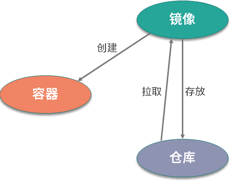
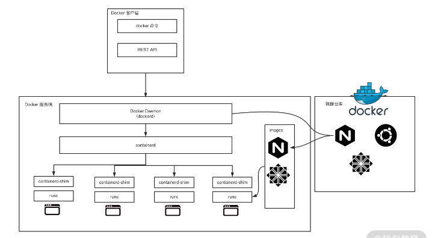
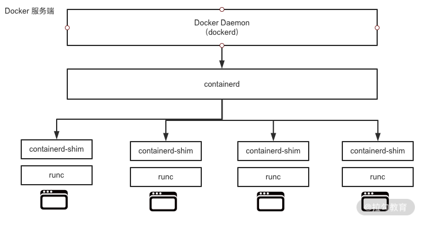

# Docker 核心概念


## 镜像


镜像是什么呢？通俗地讲，它是一个**只读的文件和文件夹组合**。它包含了容器运行时所需要的所有基础文件和配置信息，是容器启动的基础。所以你想启动一个容器，那首先必须要有一个镜像。镜像是 Docker 容器启动的先决条件。

如果想使用镜像可以通过这两种方式：

1. 可以制作镜像
2. 从仓库拉去镜像，例如 [docker hub](https://hub.docker.com/)

## 容器

容器是镜像的运行实体，镜像是静态的只读文件，而容器带有运行时需要的可写文件层，并且容器中的进程属于运行状态。即容器运行着真正的应用进程。容器有**初建、运行、停止、暂停和删除**五种状态。

虽然容器的本质是主机上运行的一个进程，但是容器有自己独立的**命名空间隔离和资源限制**。也就是说，在容器内部，**无法看到主机上的进程、环境变量、网络等信息**，这是容器与直接运行在主机上进程的本质区别。

## 仓库

Docker 的镜像仓库类似于代码仓库，用来存储和分发 Docker 镜像。镜像仓库分为公共镜像仓库和私有镜像仓库。


## 镜像、容器、仓库，三者之间的联系



# Docker 架构


在了解 Docker 架构前，我先说下相关的背景知识——容器的发展史。

容器技术随着 Docker 的出现变得炙手可热，所有公司都在积极拥抱容器技术。此时市场上除了有 Docker 容器，还有很多其他的容器技术，比如 CoreOS 的 rkt、lxc 等。容器技术百花齐放是好事，但也出现了很多问题。比如容器技术的标准到底是什么？容器标准应该由谁来制定？

也许你可能会说， Docker 已经成为了事实标准，把 Docker 作为容器技术的标准不就好了？事实并没有想象的那么简单。因为那时候不仅有容器标准之争，编排技术之争也十分激烈。当时的编排技术有三大主力，分别是 Docker Swarm、Kubernetes 和 Mesos 。Swarm 毋庸置疑，肯定愿意把 Docker 作为唯一的容器运行时，但是 Kubernetes 和 Mesos 就不同意了，因为它们不希望调度的形式过度单一。

在这样的背景下，最终爆发了容器大战， `OCI` 也正是在这样的背景下应运而生。

`OCI` 全称为开放容器标准（Open Container Initiative），它是一个轻量级、开放的治理结构。 `OCI` 组织在 Linux 基金会的大力支持下，于 2015 年 6 月份正式注册成立。基金会旨在为用户围绕工业化容器的格式和镜像运行时，制定一个开放的容器标准。目前主要有两个标准文档：**容器运行时标准 （runtime spec）**和 **容器镜像标准（image spec）**。

正是由于容器的战争，才导致 Docker 不得不在战争中改变一些技术架构。最终形成了下图所示的技术架构。




我们可以看到，Docker 整体架构采用 C/S（客户端 / 服务器）模式，主要由客户端和服务端两大部分组成。客户端负责发送操作指令，服务端负责接收和处理指令。客户端和服务端通信有多种方式，既可以在同一台机器上通过UNIX套接字通信，也可以通过网络连接远程通信。


## Docker客户端
Docker 客户端其实是一种泛称。其中 docker 命令是 Docker 用户与 Docker 服务端交互的主要方式。除了使用 docker 命令的方式，还可以使用直接请求 REST API 的方式与 Docker 服务端交互，甚至还可以使用各种语言的 SDK 与 Docker 服务端交互。目前社区维护着 Go、Java、Python、PHP 等数十种语言的 SDK，足以满足你的日常需求。

## Docker服务端

Docker 服务端是 Docker 所有后台服务的统称。其中 dockerd 是一个非常重要的后台管理进程，它负责响应和处理来自 Docker 客户端的请求，然后将客户端的请求转化为 Docker 的具体操作。例如镜像、容器、网络和挂载卷等具体对象的操作和管理。

Docker 从诞生到现在，服务端经历了多次架构重构。起初，服务端的组件是全部集成在 docker 二进制里。但是从 1.11 版本开始， dockerd 已经成了独立的二进制，此时的容器也不是直接由 dockerd 来启动了，而是集成了 containerd、runC 等多个组件。

虽然 Docker 的架构在不停重构，但是各个模块的基本功能和定位并没有变化。它和一般的 C/S 架构系统一样，Docker 服务端模块负责和 Docker 客户端交互，并管理 Docker 的容器、镜像、网络等资源。

## Docker 的重要组件

下面，我以 Docker 的 18.09.2 版本为例，看下 Docker 都有哪些工具和组件。在 Docker 安装路径下执行 ls 命令可以看到以下与 docker 有关的二进制文件。

```bash
-rwxr-xr-x 1 root root 27941976 Dec 12  2019 containerd
-rwxr-xr-x 1 root root  4964704 Dec 12  2019 containerd-shim
-rwxr-xr-x 1 root root 15678392 Dec 12  2019 ctr
-rwxr-xr-x 1 root root 50683148 Dec 12  2019 docker
-rwxr-xr-x 1 root root   764144 Dec 12  2019 docker-init
-rwxr-xr-x 1 root root  2837280 Dec 12  2019 docker-proxy
-rwxr-xr-x 1 root root 54320560 Dec 12  2019 dockerd
-rwxr-xr-x 1 root root  7522464 Dec 12  2019 runc
```


Dockerd是Docker的服务端后台常驻进程，负责管理Docker容器的生命周期和容器运行时环境。它接收来自Docker客户端的请求，执行具体的处理任务，并将结果返回给客户端。Dockerd还负责管理Docker镜像和Docker网络。

Docker 的两个至关重要的组件：runC和containerd。

- `runC` : 是 Docker 官方按照 OCI 容器运行时标准的一个实现。通俗地讲，runC 是一个**用来运行容器的轻量级工具**，是真正用来运行容器的。
  
- `containerd` : 是 Docker 服务端的一个核心组件，它是从dockerd中剥离出来的 ，它的诞生完全遵循 OCI 标准，是容器标准化后的产物。containerd通过 containerd-shim 启动并管理 runC，可以说containerd真正管理了容器的生命周期。



通过上图，可以看到， dockerd 通过 gRPC 与containerd通信，由于dockerd与真正的容器运行时，runC中间有了containerd这一 OCI 标准层，使得dockerd可以确保接口向下兼容。

了解了 dockerd、containerd 和 runC 之间的关系，下面可以通过启动一个 Docker 容器，来验证它们进程之间的关系。

## 验证 Docker 各组件之间的关系

1. 启动 busybox 容器：
    ```bash
    docker run -d busybox sleep 3600
    ```
1. 查看 dockerd 的 pid
    ```bash
    sudo ps aux |grep dockerd
    ```
    输出
    ```bash
    root        4802  0.0  2.0 2134136 81372 ?       Ssl  9月05   0:07 /usr/bin/dockerd -H fd:// --containerd=/run/containerd/containerd.sock
    what       52103  0.0  0.0  12324  2432 pts/0    S+   13:44   0:00 grep --color=auto dockerd
    ```
    docerd 的 pid 为 4802

    为了验证 Docker 各组件之间的调用关系，下面使用 pstree 命令查看一下进程父子关系：
    ```bash
    sudo pstree -l -a -A 4802
    ```
    输出
    ```bash
    dockerd -H fd:// --containerd=/run/containerd/containerd.sock
    `-9*[{dockerd}]
    ```
    只看到了 containerd 进程，并没有看到 runc 进程，我们还可以通过一下两种方式查看：
    - 检查 Docker 启动日志：docker info 或 dockerd 启动日志中可能会显示使用的运行时。
    - 使用 ps 或 top 命令在启动容器的瞬间捕获 runc 进程，但它的生命周期非常短。

    使用 docker info | grep -i runc  
    ```bash
    Runtimes: io.containerd.runc.v2 runc
    Default Runtime: runc
    runc version: v1.1.13-0-g58aa920
    ```
    在 Docker 启动容器时，runc 进程的生命周期非常短暂。runc 只负责启动容器中的进程，并配置命名空间、cgroups 等资源隔离。一旦容器进程启动，runc 进程会退出。