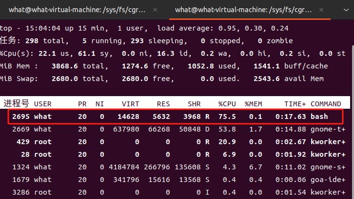

# cgroups

cgroups（全称：control groups）是 Linux 内核的一个功能，它可以实现限制进程或者进程组的资源（如 CPU、内存、磁盘 IO 等）。

> 在 2006 年，Google 的工程师（ Rohit Seth 和 Paul Menage 为主要发起人） 发起了这个项目，起初项目名称并不是cgroups，而被称为进程容器（process containers）。在 2007 年cgroups代码计划合入Linux 内核，但是当时在 Linux 内核中，容器（container）这个词被广泛使用，并且拥有不同的含义。为了避免命名混乱和歧义，进程容器被重名为cgroups，并在 2008 年成功合入 Linux 2.6.24 版本中。cgroups目前已经成为 systemd、Docker、Linux Containers（LXC） 等技术的基础。


# cgroups 功能及核心概念


cgroups 主要提供了如下功能。

- 资源限制： 限制资源的使用量，例如我们可以通过限制某个业务的内存上限，从而保护主机其他业务的安全运行。

- 优先级控制：不同的组可以有不同的资源（ CPU 、磁盘 IO 等）使用优先级。

- 审计：计算控制组的资源使用情况。

- 控制：控制进程的挂起或恢复。


cgroups功能的实现依赖于三个核心概念：子系统、控制组、层级树。

- **子系统（subsystem）**：是一个内核的组件，一个子系统代表一类**资源调度控制器**。例如内存子系统可以限制内存的使用量，CPU 子系统可以限制 CPU 的使用时间。
  
  可以使用 `lssubsys -a` 查看内核支持的 subsystem
    ```bash
    what@what-virtual-machine:~$ lssubsys -a
    cpuset
    cpu
    cpuacct
    blkio
    memory
    devices
    freezer
    net_cls
    perf_event
    net_prio
    hugetlb
    pids
    rdma
    misc
    ```

  常用的子系统如下
  - cpu：限制 CPU 使用时间。
  - memory：限制内存使用量。
  - blkio：限制块设备的 I/O。
  - cpuset：限制进程可使用的 CPU 和内存节点。
  - devices：控制进程对设备的访问。
  - freezer：冻结和恢复进程。

  在 Docker 中，主要使用的 cgroups 子系统包括 cpu、memory 和 blkio，用于管理容器的资源限制和性能优化。通过这些子系统，Docker 可以确保每个容器不会过度消耗主机资源，从而提高系统的稳定性和效率。


- **控制组（cgroup）**：cgroups 是 control groups 的缩写。
  
  表示一组进程和一组带有参数的子系统的关联关系。例如，一个进程使用了 CPU 子系统来限制 CPU 的使用时间，则这个进程和 CPU 子系统的关联关系称为控制组。
  
  一个进程可以加入某个 cgroup，也可以从某个 cgroup 迁移到另外一个 cgroup

- **层级树（hierarchy）**：是由一系列的控制组按照树状结构排列组成的。这种排列方式可以使得控制组拥有父子关系，子控制组默认拥有父控制组的属性，也就是子控制组会继承于父控制组。
  比如，系统中定义了一个控制组 c1，限制了 CPU 可以使用 1 核，然后另外一个控制组 c2 想实现既限制 CPU 使用 1 核，同时限制内存使用 2G，那么 c2 就可以直接继承 c1，无须重复定义 CPU 限制。
  
  可以使用 `mount | grep cgroup` 命令查看


cgroups 的三个核心概念中，子系统是最核心的概念，因为子系统是真正实现某类资源的限制的基础。


本地内存释义：

> 本地内存是指与特定处理器直接相连的内存。每个处理器在 NUMA（非统一内存访问）架构中通常有自己的本地内存节点，这些内存是为该处理器设计的，访问速度最快。当处理器访问其本地内存时，延迟最低，带宽最大。
> 与此相对的是“远程内存”，即一个处理器访问其他处理器的内存节点时所使用的内存。由于涉及跨节点的数据传输，这种访问通常会引入更高的延迟和更低的带宽。因此，在优化系统性能时，通常会尽量让处理器访问本地内存，以减少延迟和提高效率。

# 版本区别

1. 层次结构（Hierarchy）
    - cgroup v1：每个资源控制器（如CPU、内存等）都有独立的层次结构，意味着可以为不同的控制器定义不同的cgroup层次。不同资源控制器（subsystem）彼此独立，使用不同的cgroup树。
  
    - cgroup v2：所有资源控制器共享一个单一的统一层次结构。这样有助于简化管理，使资源控制和进程管理更加一致。
3. 资源分配和限制
    - cgroup v1：可以为每个资源控制器独立设置不同的资源限制，允许多个资源控制器并行工作。然而，这样容易导致层次结构之间的资源分配冲突，进而引发不一致的行为。
  
    - cgroup v2：通过统一的层次结构提供更精确和一致的资源分配。cgroup v2对资源调度更加智能，例如，内存和CPU资源之间可以更好地协调，避免资源调度冲突。
  
4. 支持的控制器
    - cgroup v1：每个控制器是独立实现的，不同控制器有各自的特性和功能，有时这些功能和控制方式会略有不同。所有控制器的行为并不统一。
  
    - cgroup v2：控制器的设计和功能在cgroup v2中更加统一，提供了更一致的行为，并且一些控制器只在cgroup v2中得到支持或优化。
5. 内存管理
    - cgroup v1：内存控制器的分层方式较复杂，在父子cgroup之间可能会产生不一致的问题，尤其是在处理缓存时。
  
    - cgroup v2：内存控制在v2中得到了简化和增强，改善了内存管理的一致性和隔离性。对内存压力的管理更加平滑，也更容易理解。
6. IO控制
    - cgroup v1：I/O限制和优先级的管理较为复杂，涉及多个控制器和机制。
    - cgroup v2：I/O控制得到了极大改进，简化了配置和管理，提供了更高效的I/O调度和更精确的限制。

## 如何查看当前系统使用的是cgroup v1还是v2

可以通过以下命令查看系统当前使用的 `cgroup` 版本：

```bash
what@what-virtual-machine:/sys/fs/cgroup/mygroup$ mount | grep cgroup
cgroup2 on /sys/fs/cgroup type cgroup2 (rw,nosuid,nodev,noexec,relatime,nsdelegate,memory_recursiveprot)
cgroup-test on /home/what/cgroup-test type cgroup (rw,relatime,name=cgroup-test)
```

或者

```bash
cat /sys/fs/cgroup/cgroup.controllers
```

如果有输出，说明正在使用 `cgroup v2`

```bash
cpuset cpu io memory hugetlb pids rdma misc
```


# CPU 子系统
`cpu子系统` 通过 `CFS` （Completely Fair Scheduler，完全公平调度器）和 `RT` （Real-Time，实时调度器）两个调度程序来实现对 `CPU` 使用的管理。

- **CFS调度器** ：根据进程优先级/权重或 `cgroup` 来分配 `CPU` 时间。它模拟了一个完全理想的多任务处理器，确保所有进程都能公平地获得 `CPU` 时间。 `CFS` 调度器使用红黑树来管理可运行状态的进程，根据进程的虚拟运行时间进行调度。
  
- **RT调度器** ：对实时进程使用 `CPU` 的时间进行限定，适用于需要实时响应的应用场景。


## cgroup1 


在 cgroup1 版本中，配置位于不同层级，但均位于 `/sys/fs/cgroup/` 目录下，子系统分别处于不同的文件夹，要新建 cgroup ，需要在不同的子系统(例如 cpu、memory)下创建文件夹,新建的文件夹中会自动生成相关配置文件,下面介绍以下文件重点文件已加粗：

1. cgroup.clone_children:

  - 用途: 控制是否让该控制组的子进程共享父进程的资源。
  - 格式: 0（不共享）或 1（共享）。
  ```bash
  echo 1 > cgroup.clone_children
  ```

1. **cgroup.procs:**
   
  - 用途: 用于将进程添加到该控制组或列出当前组内的进程。
  - 格式: 直接写入进程ID。
  ```bash
  echo <PID> > cgroup.procs
  ```
1. cpu.cfs_burst_us:
  - 用途: 设置在CFS调度器下，允许的CPU突发时间，影响短期负载能力。
  - 格式: 微秒数（整数）。
  ```bash
  echo 20000 > cpu.cfs_burst_us
  ```

1. cpu.cfs_period_us:
  - 用途: 定义CFS调度周期，决定分配CPU时间的基本周期。
  - 格式: 微秒数（整数）。
  ```bash
  echo 100000 > cpu.cfs_period_us
  ```
1. **cpu.cfs_quota_us:**
  - 用途: 在一个调度周期内，限制CPU可使用的最大时间。
  - 格式: 微秒数（整数）。
  ```bash
  echo 50000 > cpu.cfs_quota_us
  ```

1. cpu.idle:
   
  - 用途: 提供CPU闲置时间的统计信息，供监控使用。
  - 格式: 只读，不可修改。

1. cpu.rt_period_us:
  - 用途: 设置实时任务的调度周期，影响实时任务的调度频率。
  - 格式: 微秒数（整数）。
  ```bash
  echo 100000 > cpu.rt_period_us
  ```

1. cpu.rt_runtime_us:
  - 用途: 定义实时任务在一个周期内允许的最大运行时间。
  - 格式: 微秒数（整数）。
  ```bash
  echo 95000 > cpu.rt_runtime_us
  ```
1. cpu.shares:
  - 用途: 设置该控制组的CPU资源权重，相对其他控制组的使用权重。
  - 格式: 整数（默认1024）。
  ```bash
  echo 512 > cpu.shares
  ```
1. cpu.stat:

  - 用途: 显示CPU的使用统计信息，包括已分配的时间和使用的时间。
  - 格式: 只读，不可修改。

1. notify_on_release:

  - 用途: 控制当释放控制组时是否发出通知。
  - 格式: 0（不通知）或 1（通知）。
  ```bash
  echo 1 > notify_on_release
  ```
1. tasks:

  - 用途: 列出当前控制组中的所有进程ID，便于监控和管理。
  - 格式: 只读，输出进程ID。

## cgroup2 

在 cgroup2 版本中，所有的配置处于同一个层级，均位于 `/sys/fs/cgroup/` 目录下，要新建 cgroup ，在该目录下，创建文件夹即可，新建的文件夹中会自动生成相关配置文件,下面介绍以下文件重点文件已加粗：


1. **cpu.max**
  - 用途-设置：设置每个调度周期内允许使用的最大CPU时间。
  - 格式：`<max> <period>`，例如 50000 100000 表示在每100毫秒内最多使用50毫秒的CPU时间。
  ```bash
  echo "50000 100000" | sudo tee /sys/fs/cgroup/mygroup/cpu.max
  ```
  这条命令表示在每100毫秒的周期内，最多允许该cgroup使用50毫秒的CPU时间。

1. **cpu.max.burst**
   
  - 用途-设置：允许在短时间内超过cpu.max限制的额外CPU使用量。用于处理瞬时负载。
  - 设置：该值通常用于结合cpu.max使用，以提高短期性能。
  ```bash
  echo "10000" | sudo tee /sys/fs/cgroup/mygroup/cpu.max.burst
  ```
  此设置允许该cgroup在短期内额外使用10毫秒的CPU时间，以便应对瞬时负载。


2. cpu.pressure
  - 用途-读取：提供CPU压力的监控信息。它能反映在过去的一段时间内，CPU资源是否紧张。
  - 读取：可以读取该文件以获取当前的CPU压力状况。
  ```bash
  cat /sys/fs/cgroup/mygroup/cpu.pressure
  ```
  读取此文件可以查看CPU资源的压力状况，包括等待和被调度的时间。
  
3. **cpuset.cpus**
  - 用途-设置：定义允许该cgroup使用的CPU核心列表。
  - 示例：设置为0-3表示允许使用第0到第3个CPU核心。
  ```bash
  echo "0-3" | sudo tee /sys/fs/cgroup/mygroup/cpuset.cpus
  ```
  该命令允许mygroup使用第0到第3个CPU核心。

4. cpuset.cpus.effective
  - 用途-读取：显示当前cgroup实际能够使用的CPU核心列表。它考虑了父cgroup的限制。
  - 读取：只读文件，提供有效的CPU核心信息。
  ```bash
  cat /sys/fs/cgroup/mygroup/cpuset.cpus.effective
  ```
  此文件会显示mygroup当前有效的CPU核心，可能受到父cgroup限制的影响。

5. cpuset.cpus.exclusive
  - 用途：指示该cgroup是否在使用的CPU核心上独占运行。设置为1表示独占，0表示共享。
  - 设置：允许在负载较高时确保该cgroup的核心不会被其他进程干扰。
  ```bash
  echo "1" | sudo tee /sys/fs/cgroup/mygroup/cpuset.cpus.exclusive
  ```
  设置为1表示mygroup在指定的CPU核心上独占运行，不允许其他进程使用这些核心。

6. cpuset.cpus.exclusive.effective
  - 用途-读取：显示当前cgroup是否独占使用的CPU核心的有效状态。
  - 读取：只读文件，提供有效的独占信息。
  ```bash
  cat /sys/fs/cgroup/mygroup/cpuset.cpus.exclusive.effective
  ```
  提供当前mygroup的独占状态，表明该cgroup是否真正拥有其指定的CPU核心。
  
7. cpuset.cpus.partition
  - 用途：在分区模式下，定义此cgroup的CPU核心分区。
  - 设置：用于管理更复杂的CPU核心分配。
  ```bash
  echo "0-3" | sudo tee /sys/fs/cgroup/mygroup/cpuset.cpus.partition
  ```
  用于设置在复杂的CPU核心分配策略下，mygroup可使用的核心分区。
  
8. cpuset.mems
  - 用途：定义该cgroup可以使用的内存节点列表（NUMA节点）。
  - 示例：设置为0表示只使用内存节点0。
  ```bash
  echo "0" | sudo tee /sys/fs/cgroup/mygroup/cpuset.mems
  ```
  允许mygroup使用内存节点0，适用于多节点系统的资源管理。
  
9.  cpuset.mems.effective
  - 用途：显示当前cgroup实际能够使用的内存节点列表。
  - 读取：只读文件，提供有效的内存节点信息。
  ```bash
  cat /sys/fs/cgroup/mygroup/cpuset.mems.effective0
  ```
  输出当前mygroup能够有效使用的内存节点，可能受父cgroup限制影响。

10. cpu.stat
  - 用途：提供该cgroup的CPU使用统计信息，包括运行时间、调度次数等。
  - 读取：定期读取以监控资源使用情况。
  ```bash
  cat /sys/fs/cgroup/mygroup/cpu.stat
  ```
  显示mygroup的CPU运行时间、调度次数等统计数据。


11. cpu.stat.local
  - 用途：与cpu.stat类似，但只包括该cgroup内进程的统计信息。
  - 读取：用于更精细的资源监控。
  ```bash
  cat /sys/fs/cgroup/mygroup/cpu.stat.local
  ```
  提供更精确的统计，专注于该cgroup内部进程的CPU使用情况。

12.  cpu.uclamp.max
  - 用途：设置最大CPU调度优先级，控制高优先级的资源使用。
  - 设置：影响调度器如何调度高优先级任务。
  ```bash
  echo "100" | sudo tee /sys/fs/cgroup/mygroup/cpu.uclamp.max
  ```
  确保高优先级的任务能够获得足够的CPU资源。


13.  cpu.uclamp.min
  - 用途：设置最小CPU调度优先级，确保任务至少获得的资源。
  - 设置：影响调度器对低优先级任务的调度。
  ```bash
  echo "50" | sudo tee /sys/fs/cgroup/mygroup/cpu.uclamp.min
  ```
  可以用来保证低优先级任务在调度时至少获得一定的CPU资源。


14.  cpu.weight
  - 用途：设置cgroup的CPU权重值，影响调度器的资源分配。
  - 示例：值越高，获得的CPU资源越多，默认值为100。
  ```bash
  echo "200" | sudo tee /sys/fs/cgroup/mygroup/cpu.weight
  ```


15.  cpu.weight.nice
  - 用途：调整CPU权重的“nice”值，使其在调度时更具灵活性。
  - 设置：可以根据任务的优先级进行调整，影响调度器的选择。
  ```bash
  echo "10" | sudo tee /sys/fs/cgroup/mygroup/cpu.weight.nice
  ```
  通过调整nice值，可以在调度时影响任务的优先级，帮助管理高负载环境下的资源分配。


## 使用示例：以group2为例
1. 创建 cgroup
   
  首先，你需要创建一个新的cgroup目录。在cgroup v2中，所有的资源控制器（包括CPU）都是在统一的挂载点下管理的。

  ```bash
  sudo mkdir /sys/fs/cgroup/my_cgroup
  cd /sys/fs/cgroup/my_cgroup
  ```
  这条命令会在/sys/fs/cgroup下创建一个名为my_cgroup的目录,同时生成相应的配置文件。

1. 设置 CPU 使用限制
   
   使用cpu.max文件来设置CPU使用限制。格式为`<max> <period>`，其中：

   - `<max>` ：每个周期内允许使用的最大CPU时间（微秒）。
   - `<period>` ：周期的长度（微秒）。
  
  例如，如果你想限制该cgroup在每100毫秒内最多使用50毫秒的CPU时间，可以执行以下命令：
  ```bash
  echo "50000 100000" | sudo tee cpu.max
  ```
  `50000` 表示在每个 `100000` 微秒（`100`毫秒）的周期中，最多使用`50000`微秒（50毫秒）的CPU时间。

1. 将当前 `bash` 进程添加到 cgroup

   ```bash
   echo $$ | sudo tee cgroup.procs
   ```
2. 查看当前进程ID
   ```bash
   echo $$
   ```
3. 执行死循环跑满，当前进程
   ```bash
   while true; do echo; done;
   ```
4. 打开新的窗口，使用 top 查看该进程的CPU占用率
   


