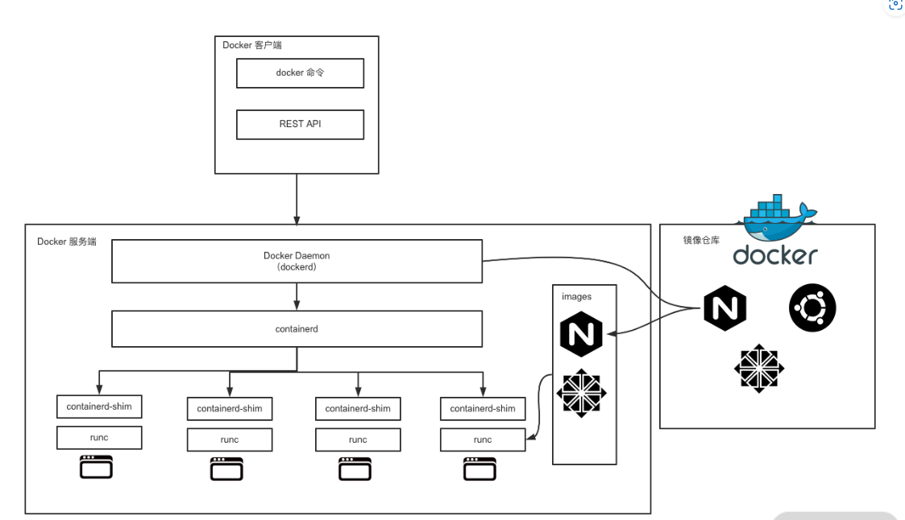
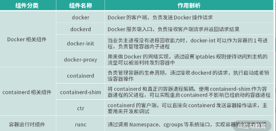

# Docker 组件构成

Docker 整体架构采用 C/S 模式。客户端负责发送操作指令，服务端负责接收和处理客户指令。



# Docker组件分类


docker 的组件可以分为三类

1. Docker 相关的组件 : docker 、 dockered 、 docker-init 和 docker-proxy
2. containerd 相关的组件 : containerd 、 containerd-shim 和 ctr
3. 容器运行时相关的组件 ： runc


# Docker 相关的组件

## docker 

docker 是 Docker 客户端的一个完整实现，是一个二进制文件，对用户的操作形式为 dcoker 命令，通过 docker 命令可以完成所有 Docker 客户端与服务端的通信。


Docker 客户端与服务端的交互过程：
1. docker 组件向服务端发送请求
2. 服务端根据请求执行具体操作，并将结果返回给 docker 组件
3. docker 组件接收到返回后，解析结果并通过命令行就进行标准输出给用户

这样一次完整的客户端服务端通信流程就完成了


## dockerd

dockerd 是 Docker服务端的，后台常驻进程，用来接收客户端发送的请求，处理完成后将结果返回给客户端。

docker 客户端可以通过多种方式向 dockerd 发送请求：

1. 通过 UNIX 套接字与服务端通信 ： 配置格式为unix://socket_path，默认 dockerd 生成的 socket 文件路径为 /var/run/docker.sock，该文件只有 root 用户或者 docker 用户组的用户才可以访问，这就是为什么 Docker 刚安装完成后只有 root 用户才能使用 docker 命令的原因。
   
2. 通过 TCP 与服务端通信 : 配置格式为tcp://host:port，通过这种方式可以实现客户端远程连接服务端，但是在方便的同时也带有安全隐患，因此在生产环境中如果你要使用 TCP 的方式与 Docker 服务端通信，推荐使用 TLS 认证，可以通过设置 Docker 的 TLS 相关参数，来保证数据传输的安全。
   
3. 通过文件描述符的方式与服务端通信：配置格式为：fd://这种格式一般用于 systemd 管理的系统中。


Docker 客户端和服务端的通信形式必须保持一致，否则将无法通信，只有当 dockerd 监听了 UNIX 套接字客户端才可以使用 UNIX 套接字的方式与服务端通信，UNIX 套接字也是 Docker 默认的通信方式，**如果你想要通过远程的方式访问 dockerd，可以在 dockerd 启动的时候添加 -H 参数指定监听的 HOST 和 PORT。**


## docker-init

init 进程
> init进程是Linux系统中所有进程的起点，是第一个用户级进程。它的进程标识符（PID）始终为1，可以视为所有其他进程的祖先进程。
> init 进程主要负责，初始化系统环境 、 加载设备驱动程序 、 管理其他进程（在其他进程出现问题后，可以回收这些进程）

docker-init 的主要作用

1. 初始化容器环境 ： 设置容器的环境变量 、 挂载文件系统 、 配置网络等
   
2. 管理容器进程 ： 在 Docker 中每个容器都有一个 init 进程，该进程在容器启动时负责执行初始化操作，并启动容器中其他进程。docker-init 可以作为这个init进程，它确保容器拥有独立的进程空间，不干扰宿主机或其他容器进程
   
3. 处理系统信号 ： docker-init 能够监听一些系统信号，如SIGTERM和SIGKILL等。当 Docker 接收到停止容器的命令时，会发送一个 SIGTERM 的信号给容器内的 PID 为 1 的进程。当 docker-init 接收到该信号时负责正确的终止容器中的其他进程，确保容器能够优雅的停止。
   
4. 增强容器的稳定性 ： docker-init 可以处理容器中的一些异常情况，例如当容器内某个进程崩溃时，它可以尝试重启进程或执行其他操作，还可以提供一些额外的功能，例如：日志记录，性能监控


在 `docker run` 命令中添加 `--init` 参数可以开启 `docker-init`,下面为示例：

```bash
root@what-virtual-machine:/var/lib/docker# docker run -it busybox sh
/ # ps
PID   USER     TIME  COMMAND
    1 root      0:00 sh
    8 root      0:00 ps
/ # 
```
当我们没有添加 --init 参数时，1号进程为 sh进程。
使用 Ctrl+D 退出当前容器，重新启动一个新的容器并添加 --init 参数：
```bash
root@what-virtual-machine:/var/lib/docker# docker run -it --init busybox sh
/ # ps
PID   USER     TIME  COMMAND
    1 root      0:00 /sbin/docker-init -- sh
    7 root      0:00 sh
    8 root      0:00 ps
/ # 
```
可以看到此时容器内的 1 号进程已经变为 /sbin/docker-init，而不再是 sh 了,说明该容器内的进程已经受到了 docker-init 的管理。


## docker-proxy

docker-proxy 主要是用来做端口映射的。当我们使用 docker run 命令启动容器时，如果使用了 -p 参数，docker-proxy 组件就会把容器内相应的端口映射到主机上来，底层是依赖于 iptables 实现的。


使用以下命令启动一个 nginx 容器并把容器的 80 端口映射到主机的 8080 端口。

```bash
docker run --name=nginx -d -p 8080:80 nginx
```

然后通过以下命令查看一下启动的容器 IP：

```bash
docker inspect --format '{{ .NetworkSettings.IPAddress }}' nginx
172.17.0.2
```
可以看到，我们启动的 nginx 容器 IP 为 172.17.0.2。

此时，我们使用 ps 命令查看一下主机上是否有 docker-proxy 进程：
```bash
root@what-virtual-machine:/var/lib/docker# sudo ps aux |grep docker-proxy
root       11002  0.0  0.0 1672136 3712 ?        Sl   10月09   0:00 /usr/bin/docker-proxy -proto tcp -host-ip 0.0.0.0 -host-port 8080 -container-ip 172.17.0.2 -container-port 80
root       11015  0.0  0.0 1598148 3712 ?        Sl   10月09   0:00 /usr/bin/docker-proxy -proto tcp -host-ip :: -host-port 8080 -container-ip 172.17.0.2 -container-port 80
root       14199  0.0  0.0  12324  2432 pts/1    S+   08:32   0:00 grep --color=auto docker-proxy
```
可以看到当我们启动一个容器时需要端口映射时， Docker 为我们创建了一个 docker-proxy 进程，并且通过参数把我们的容器 IP 和端口传递给 docker-proxy 进程，然后 docker-proxy 通过 iptables 实现了 nat 转发。


我们通过以下命令查看一下主机上 iptables nat 表的规则：

```bash
root@what-virtual-machine:/var/lib/docker# sudo iptables -L -nv -t nat
Chain PREROUTING (policy ACCEPT 0 packets, 0 bytes)
 pkts bytes target     prot opt in     out     source               destination         
    0     0 DOCKER     all  --  *      *       0.0.0.0/0            0.0.0.0/0            ADDRTYPE match dst-type LOCAL

Chain INPUT (policy ACCEPT 0 packets, 0 bytes)
 pkts bytes target     prot opt in     out     source               destination         

Chain OUTPUT (policy ACCEPT 0 packets, 0 bytes)
 pkts bytes target     prot opt in     out     source               destination         
    0     0 DOCKER     all  --  *      *       0.0.0.0/0           !127.0.0.0/8          ADDRTYPE match dst-type LOCAL

Chain POSTROUTING (policy ACCEPT 0 packets, 0 bytes)
 pkts bytes target     prot opt in     out     source               destination         
    0     0 MASQUERADE  all  --  *      !docker0  172.17.0.0/16        0.0.0.0/0           
    0     0 MASQUERADE  tcp  --  *      *       172.17.0.2           172.17.0.2           tcp dpt:80

Chain DOCKER (2 references)
 pkts bytes target     prot opt in     out     source               destination         
    0     0 RETURN     all  --  docker0 *       0.0.0.0/0            0.0.0.0/0           
    0     0 DNAT       tcp  --  !docker0 *       0.0.0.0/0            0.0.0.0/0            tcp dpt:8080 to:172.17.0.2:80

```

通过最后一行规则我们可以得知，当我们访问主机的 8080 端口时，iptables 会把流量转发到 172.17.0.2 的 80 端口，从而实现了我们从主机上可以直接访问到容器内的业务。

我们通过 curl 命令访问一下 nginx 容器：
```bash
root@what-virtual-machine:/var/lib/docker# curl http://localhost:8080
<!DOCTYPE html>
<html>
<head>
<title>Welcome to nginx!</title>
<style>
    body {
        width: 35em;
        margin: 0 auto;
        font-family: Tahoma, Verdana, Arial, sans-serif;
    }
</style>
</head>
<body>
......
......
......
......
```
通过上面的输出可以得知我们已经成功访问到了 nginx 容器。

总体来说，docker 是官方实现的标准客户端，dockerd 是 Docker 服务端的入口，负责接收客户端发送的指令并返回相应结果，而 docker-init 在业务主进程没有进程回收功能时则十分有用，docker-proxy 组件则是实现 Docker 网络访问的重要组件。


# containerd 相关的组件

## containerd


containerd 组件是从 Docker 1.11 版本正式从 dockerd 中剥离出来的，它的诞生完全遵循 OCI 标准，是容器标准化后的产物。containerd 完全遵循了 OCI 标准，并且是完全社区化运营的，因此被容器界广泛采用。


containerd 负责以下功能：

1. **容器的生命周期管理**
   containerd 负责从创建容器到销毁容器的整个生命周期的管理： 创建 、 运行 、 暂停 、 恢复 、 停止 、 销毁

2. **镜像管理**
   支持镜像的 拉取 、 推送 、 保存 、 加载 等操作。使用 OCI 规范定义容器镜像的格式

3. **网络和存储管理**
   
   提供网络和存储插件，支持多种网络模型和存储驱动

4. 接收 dockerd 的请求，通过适当的参数调用 runc 启动容器


containerd 包含一个后台常驻进程，默认的 socket 路径为 /run/containerd/containerd.sock，dockerd 通过 UNIX 套接字向 containerd 发送请求，containerd 接收到请求后负责执行相关的动作并把执行结果返回给 dockerd。

如果你不想使用 dockerd，也可以直接使用 containerd 来管理容器，由于 containerd 更加简单和轻量，生产环境中越来越多的人开始直接使用 containerd 来管理容器。

## containerd-shim


containerd-shim 的意思是垫片，类似于拧螺丝时夹在螺丝和螺母之间的垫片。containerd-shim 的主要作用是将 containerd 和真正的容器进程解耦，使用 containerd-shim 作为容器进程的父进程，从而实现重启 containerd 不影响已经启动的容器进程。


## containerd-ctr

 containerd-ctr 是 containerd 的客户端，主要用来开发和调试，在没有 dockerd 的环境中，ctr 可以充当 docker 客户端的部分角色，直接向 containerd 守护进程发送操作容器的请求。

# 容器运行时组件runc


runc 是一个标准的 OCI 容器运行时的实现，它是一个命令行工具，可以直接用来创建和运行容器。

1. 创建一个目录作为新容器的根目录
   ```bash
   mkdir runc_demo
   ```
2. 随后创建 runc 文件夹 ，并导入 镜像文件
   ```bash
    mkdir runc
    
    mkdir rootfs && docker export $(docker create busybox) | tar -C rootfs -xvf -
   ```
3. ，生成 runc config 文件。我们可以使用 runc spec 命令根据文件系统生成对应的 config.json 文件。命令如下：
   ```bash
    runc spec
   ```
   此时会在当前目录下生成 config.json 文件，我们可以使用 cat 命令查看一下 config.json 的内容：
   ```bash
   cat config.json

    {
        "ociVersion": "1.0.2-dev",
        "process": {
            "terminal": true,
            "user": {
                "uid": 0,
                "gid": 0
            },
            "args": [
                "sh"
            ],
            "env": [
                "PATH=/usr/local/sbin:/usr/local/bin:/usr/sbin:/usr/bin:/sbin:/bin",
                "TERM=xterm"
            ],
            "cwd": "/",
            "capabilities": {
                "bounding": [
                    "CAP_AUDIT_WRITE",
                    "CAP_KILL",
                    "CAP_NET_BIND_SERVICE"
                ],
                "effective": [
                    "CAP_AUDIT_WRITE",
                    "CAP_KILL",
                    "CAP_NET_BIND_SERVICE"
                ],
                "permitted": [
                    "CAP_AUDIT_WRITE",
                    "CAP_KILL",
                    "CAP_NET_BIND_SERVICE"
                ],
                "ambient": [
                    "CAP_AUDIT_WRITE",
                    "CAP_KILL",
                    "CAP_NET_BIND_SERVICE"
                ]
            },
            "rlimits": [
                {
                    "type": "RLIMIT_NOFILE",
                    "hard": 1024,
                    "soft": 1024
                }
            ],
            "noNewPrivileges": true
        },
        "root": {
            "path": "rootfs",
            "readonly": true
        },
        "hostname": "runc",
        "mounts": [
            {
                "destination": "/proc",
                "type": "proc",
                "source": "proc"
            },
            {
                "destination": "/dev",
                "type": "tmpfs",
                "source": "tmpfs",
                "options": [
                    "nosuid",
                    "strictatime",
                    "mode=755",
                    "size=65536k"
                ]
            },
            {
                "destination": "/dev/pts",
                "type": "devpts",
                "source": "devpts",
                "options": [
                    "nosuid",
                    "noexec",
                    "newinstance",
                    "ptmxmode=0666",
                    "mode=0620",
                    "gid=5"
                ]
            },
            {
                "destination": "/dev/shm",
                "type": "tmpfs",
                "source": "shm",
                "options": [
                    "nosuid",
                    "noexec",
                    "nodev",
                    "mode=1777",
                    "size=65536k"
                ]
            },
            {
                "destination": "/dev/mqueue",
                "type": "mqueue",
                "source": "mqueue",
                "options": [
                    "nosuid",
                    "noexec",
                    "nodev"
                ]
            },
            {
                "destination": "/sys",
                "type": "sysfs",
                "source": "sysfs",
                "options": [
                    "nosuid",
                    "noexec",
                    "nodev",
                    "ro"
                ]
            },
            {
                "destination": "/sys/fs/cgroup",
                "type": "cgroup",
                "source": "cgroup",
                "options": [
                    "nosuid",
                    "noexec",
                    "nodev",
                    "relatime",
                    "ro"
                ]
            }
        ],
        "linux": {
            "resources": {
                "devices": [
                    {
                        "allow": false,
                        "access": "rwm"
                    }
                ]
            },
            "namespaces": [
                {
                    "type": "pid"
                },
                {
                    "type": "network"
                },
                {
                    "type": "ipc"
                },
                {
                    "type": "uts"
                },
                {
                    "type": "mount"
                },
                {
                    "type": "cgroup"
                }
            ],
            "maskedPaths": [
                "/proc/acpi",
                "/proc/asound",
                "/proc/kcore",
                "/proc/keys",
                "/proc/latency_stats",
                "/proc/timer_list",
                "/proc/timer_stats",
                "/proc/sched_debug",
                "/sys/firmware",
                "/proc/scsi"
            ],
            "readonlyPaths": [
                "/proc/bus",
                "/proc/fs",
                "/proc/irq",
                "/proc/sys",
                "/proc/sysrq-trigger"
            ]
        }
    }
   ```
   config.json 文件定义了 runc 启动容器时的一些配置，如根目录的路径，文件挂载路径等配置。
4. 使用 runc 启动容器。我们可以使用 runc run 命令直接启动 demo 容器。
   ```bash
    runc run demo
    / #
   ```
5. 我们新打开一个命令行窗口 使用 sudo ls /run/runc 可以看到 demo 文件夹
   ```bash
   what@what-virtual-machine:~/runc_demo$ sudo ls /run/runc
    demo
   ```
通过上面的输出，我们可以看到，当前已经有一个 demo 容器处于运行状态。

总体来说，Docker 的组件虽然很多，但每个组件都有自己清晰的工作职责，Docker 相关的组件负责发送和接受 Docker 请求，contianerd 相关的组件负责管理容器的生命周期，而 runc 负责真正意义上创建和启动容器。这些组件相互配合，才使得 Docker 顺利完成了容器的管理工作。


# 总结

