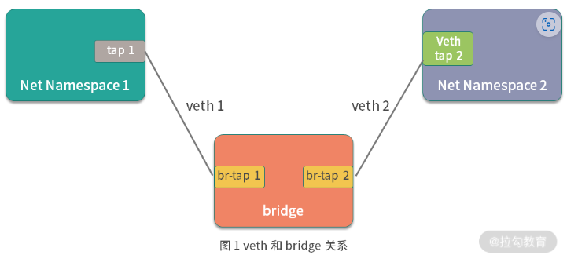

# 容器网络发展史

提起 Docker 网络，我们不得不从容器战争说起。Docker 从 2013 年诞生，到后来逐渐成为了容器的代名词，然而 Docker 的野心也不止于此，它还想在更多的领域独占鳌头，比如制定容器的网络和存储标准。

于是 Docker 从 1.7 版本开始，便把网络和存储从 Docker 中正式以插件的形式剥离开来，并且分别为其定义了标准，Docker 定义的网络模型标准称之为 CNM (Container Network Model) 。

> Docker 推出 CNM 的同时，CoreOS 推出了 CNI（Container Network Interfac）。起初，以 Kubernetes 为代表的容器编排阵营考虑过使用 CNM 作为容器的网络标准，但是后来由于很多技术和非技术原因（如果你对详细原因感兴趣，可以参考这篇博客），Kubernetes 决定支持 CoreOS 推出的容器网络标准 CNI。

从此，容器的网络标准便分为两大阵营，一个是以 Docker 公司为代表的 CNM，另一个便是以 Google、Kubernetes、CoreOS 为代表的 CNI 网络标准。

# CNM

CNM (Container Network Model) 是 Docker 发布的容器网络标准，意在规范和指定容器网络发展标准，CNM 抽象了容器的网络接口 ，使得只要满足 CNM 接口的网络方案都可以接入到 Docker 容器网络，更好地满足了用户网络模型多样化的需求。

CNM 只是定义了网络标准，对于底层的具体实现并不太关心，这样便解耦了容器和网络，使得容器的网络模型更加灵活。

CNM 定义的网络标准包含三个重要元素。

- **沙箱(Sandbox)** : 沙箱代表一系列的网络堆栈的配置，其中包含路由信息、网络接口等网络资源的管理、 沙箱的实现通常是 Linux 的 Net Namespace
- **接入点(Endpoint)** : 接入点将沙箱连接到网络中，代表容器的网络接口，接入点通常是 Linux 的 veth 设备对
- **网络(Netword)** : 网络时一组可以互相通信的接入点，它将多接入点组成一个子网，并且多个接入点之间可以互相通信

CNM 的三个要素基本抽象了所有网络模型，使得网络模型的开发更加规范。

为了更好地构建容器网络标准，Docker 团队把网络功能从 Docker 中剥离出来，成为独立的项目 libnetwork，它通过插件的形式为 Docker 提供网络功能。Libnetwork 是开源的，使用 Golang 编写，它完全遵循 CNM 网络规范，是 CNM 的官方实现。Libnetwork 的工作流程也是完全围绕 CNM 的三个要素进行的，下面我们来详细了解一下 Libnetwork 是如何围绕 CNM 的三要素工作的。

# Libnetword的工作流程

Libnetwork 是 Docker 启动容器时，用来为 Docker 容器提供网络接入功能的插件，它可以让 Docker 容器顺利接入网络，实现主机和容器网络的互通。下面，我们来详细了解一下 Libnetwork 是如何为 Docker 容器提供网络的。

1. Docker 通过调用  libnetwork.New 函数来创建 NetwordController 实例

   ```go
   type NetworkController interface {

        // 创建一个新的网络。 options 参数用于指定特性类型的网络选项。
        NewNetwork(networkType, name string, id string, options ...NetworkOption) (Network, error)
        // ... 此次省略部分接口
    }
   ```
2. 通过调用 NewNetwork 函数创建指定名称和类型的 Netword

   ```go
   type Network interface {

        // 为该网络创建一个具有唯一指定名称的接入点（Endpoint）
        CreateEndpoint(name string, options ...EndpointOption) (Endpoint, error)

        // 删除网络
        Delete() error
        // ... 此次省略部分接口
    }
   ```
3. 通过调用 CreateEndpoint 来创建接入点 (Endpoint) ，在 CreateEndpoint 函数中为容器分配了IP 和网卡接口

   ```go
   // Endpoint 表示网络和沙箱之间的逻辑连接。
    type Endpoint interface {

        // 将沙箱连接到接入点，并将为接入点分配的网络资源填充到沙箱中。
        // the network resources allocated for the endpoint.
        Join(sandbox Sandbox, options ...EndpointOption) error

        // 删除接入点
        Delete(force bool) error
        // ... 此次省略部分接口

    }
   ```
4. 调用 Newsandbox 来创建容器沙箱，主要是初始化 Namespace 相关的资源
5. 调用 Endpoint 的 join 函数将沙箱和网络接入点关联起来，此时容器就加入了 Docker 并具备了网络访问能力

# Libnetwork 常见网络模式

Libnetwork 比较典型的网络模式主要有四种，这四种网络模式基本满足了我们单机容器的所有场景。

- null 空网络模式：可以帮助我们构建一个没有网络接入的容器环境，以保障数据安全。
- bridge 桥接模式：可以打通容器与容器间网络通信的需求。
- host 主机网络模式：可以让容器内的进程共享主机网络，从而监听或修改主机网络。
- container 网络模式：可以将两个容器放在同一个网络命名空间内，让两个业务通过 localhost 即可实现访问。

## null空网络模式

有时候，我们需要处理一些保密数据，出于安全考虑，我们需要一个隔离的网络环境执行一些纯计算任务。这时候 null 网络模式就派上用场了，这时候我们的容器就像一个没有联网的电脑，处于一个相对较安全的环境，确保我们的数据不被他人从网络窃取。

使用 Docker 创建 null 空网络模式的容器时，容器拥有自己独立的 Net Namespace，但是此时的容器并没有任何网络配置。在这种模式下，Docker 除了为容器创建了 Net Namespace 外，没有创建任何网卡接口、IP 地址、路由等网络配置。我们可以一起来验证下。

我们使用 docker run 命令启动时，添加 --net=none 参数启动一个空网络模式的容器，命令如下：

```bash
docker run --net=none -it busybox
/ #
/ # ifconfig
lo        Link encap:Local Loopback  
          inet addr:127.0.0.1  Mask:255.0.0.0
          inet6 addr: ::1/128 Scope:Host
          UP LOOPBACK RUNNING  MTU:65536  Metric:1
          RX packets:0 errors:0 dropped:0 overruns:0 frame:0
          TX packets:0 errors:0 dropped:0 overruns:0 carrier:0
          collisions:0 txqueuelen:1000 
          RX bytes:0 (0.0 B)  TX bytes:0 (0.0 B)
```

可以看到容器内除了 Net Namespace 自带的 lo 网卡并没有创建任何虚拟网卡，然后我们在使用 route -n 命令查看容器内的路由信息

```bash
/ # route -n
Kernel IP routing table
Destination     Gateway         Genmask         Flags Metric Ref    Use Iface
```

可以看到容器内也没有配置任何路由信息

## brige 桥接模式

Docker 的 bridge 网络时启动容器时的默认网络模式，使用 bridge 网络可以实现容器间的互通，可以从一个容器通过容器IP访问到另一个容器。同时使用 bridge 也可以实现主机与容器的互通，我们在容器内启动的业务，可以在主机直接请求。

Docker 的 bridge 桥接模式是基于 Linux 的 veth 和 bridge 相关的技术实现的

Linux veth

> veth 是 Linux 中的虚拟设备接口， veth 是成对出现的，它在容器中，会充当一个桥梁， veth 可以用来连接虚拟网络设备。 例如： veth 可以用来联通两个 Net Namespace 从而使得两个 Net Namespace 之间可以互相访问。

Linux  bridge

> Linux brdge 是一个虚拟设备，是用来连接网络的设备，相当于 物理环境中的交换机。 Linux bridge 可以用来转发两个 Net Namespace 内的流量

veth 与 bridge 的关系

> 
> bridge 就像一台交换机，而 veth 就像一根网线，通过交换机和网线可以把两个不同的 Net Namespace 容器联通，使得他们可以互相通信。

Docker 中的 bridge 模式也是这种原理，Docker 启动时， libnetwork 会在主机上创建 docker0 网桥。所有 bridge 模式的容器都会连接在 docker0 网桥上，从而实现网络互通。

**bridge 桥接模式是 Docker 的默认网络模式，当我们创建容器不指定任何网络模式时，Docker 启动容器默认的网络模式为 bridge**

## host主机网络模式

有些业务需要容器和主机的网络环境一致，所以这就需要用到 Docker 的 host 模式。

使用 host 主机网络模式时：

- libnetwork 不会为容器创建新的网络配置和 Net Namespace
- Docker 容器中的进程直接共享主机的网络配置，可以直接使用主机的网络信息，此时在容器内监听的端口，也将直接占用主机的端口
- 除了网络共享主机的网络外，其他的包括 进程、文件、主机名都是与主机隔离的

host主机网络模式，适用于想要使用主机服务，但是又不想将运行环境安装到主机的场景上的：

```bash
docker run -it --net=host busybox
/ # 
```

使用 `ip a` 命令查看容器内的网路环境

```bash
/ # ip a
1: lo: <LOOPBACK,UP,LOWER_UP> mtu 65536 qdisc noqueue qlen 1000
    link/loopback 00:00:00:00:00:00 brd 00:00:00:00:00:00
    inet 127.0.0.1/8 scope host lo
       valid_lft forever preferred_lft forever
    inet6 ::1/128 scope host 
       valid_lft forever preferred_lft forever
2: ens33: <BROADCAST,MULTICAST,UP,LOWER_UP> mtu 1500 qdisc fq_codel qlen 1000
    link/ether 00:0c:29:45:2c:c7 brd ff:ff:ff:ff:ff:ff
    inet 192.168.144.129/24 brd 192.168.144.255 scope global dynamic noprefixroute ens33
       valid_lft 1139sec preferred_lft 1139sec
    inet6 fe80::5f8b:88fa:d30a:4b9a/64 scope link noprefixroute 
       valid_lft forever preferred_lft forever
3: docker0: <NO-CARRIER,BROADCAST,MULTICAST,UP> mtu 1500 qdisc noqueue 
    link/ether 02:42:83:9d:d7:8e brd ff:ff:ff:ff:ff:ff
    inet 172.17.0.1/16 brd 172.17.255.255 scope global docker0
       valid_lft forever preferred_lft forever
```

然后新开窗口查看主机网络配置

```bash
1: lo: <LOOPBACK,UP,LOWER_UP> mtu 65536 qdisc noqueue state UNKNOWN group default qlen 1000
    link/loopback 00:00:00:00:00:00 brd 00:00:00:00:00:00
    inet 127.0.0.1/8 scope host lo
       valid_lft forever preferred_lft forever
    inet6 ::1/128 scope host 
       valid_lft forever preferred_lft forever
2: ens33: <BROADCAST,MULTICAST,UP,LOWER_UP> mtu 1500 qdisc fq_codel state UP group default qlen 1000
    link/ether 00:0c:29:45:2c:c7 brd ff:ff:ff:ff:ff:ff
    altname enp2s1
    inet 192.168.144.129/24 brd 192.168.144.255 scope global dynamic noprefixroute ens33
       valid_lft 1101sec preferred_lft 1101sec
    inet6 fe80::5f8b:88fa:d30a:4b9a/64 scope link noprefixroute 
       valid_lft forever preferred_lft forever
3: docker0: <NO-CARRIER,BROADCAST,MULTICAST,UP> mtu 1500 qdisc noqueue state DOWN group default 
    link/ether 02:42:83:9d:d7:8e brd ff:ff:ff:ff:ff:ff
    inet 172.17.0.1/16 brd 172.17.255.255 scope global docker0
       valid_lft forever preferred_lft forever
```

可以看到容器内网络环境与主机完全一致

## container 网络模式

container 网络模式允许一个容器共享另一个容器的网络命令空间。当两个容器需要共享网络，但是其他资源要求隔离时就可以使用 container 网络模式。例如我们开发了一个 http 服务，但又想使用 nginx 的一些特性，让 nginx 代理外部的请求然后转发给自己的业务，这时我们使用 container 网络模式将自己开发的服务和 nginx 服务部署到同一个网络命名空间中。

```bash
docker run -d --name=busybox1 busybox sleep 3600
/ #
```

然后我们使用 docker exec 命令进入到 centos 容器中查看一下网络配置：

```bash
what@what-virtual-machine:~$  docker exec -it busybox1 sh
/ # ifconfig
eth0      Link encap:Ethernet  HWaddr 02:42:AC:11:00:02  
          inet addr:172.17.0.2  Bcast:172.17.255.255  Mask:255.255.0.0
          UP BROADCAST RUNNING MULTICAST  MTU:1500  Metric:1
          RX packets:44 errors:0 dropped:0 overruns:0 frame:0
          TX packets:0 errors:0 dropped:0 overruns:0 carrier:0
          collisions:0 txqueuelen:0 
          RX bytes:6400 (6.2 KiB)  TX bytes:0 (0.0 B)

lo        Link encap:Local Loopback  
          inet addr:127.0.0.1  Mask:255.0.0.0
          inet6 addr: ::1/128 Scope:Host
          UP LOOPBACK RUNNING  MTU:65536  Metric:1
          RX packets:0 errors:0 dropped:0 overruns:0 frame:0
          TX packets:0 errors:0 dropped:0 overruns:0 carrier:0
          collisions:0 txqueuelen:1000 
          RX bytes:0 (0.0 B)  TX bytes:0 (0.0 B)

```

可以看到 busybox1 的 IP 地址为 172.17.0.2。
然后我们新打开一个命令行窗口，再启动一个 busybox2 容器，通过 container 网络模式连接到 busybox1 的网络，命令如下：

```bash
$  
/ #
```

在 busybox2 容器内同样使用 ifconfig 命令查看一下容器内的网络配置：

```bash
/ # ifconfig
eth0      Link encap:Ethernet  HWaddr 02:42:AC:11:00:02  
          inet addr:172.17.0.2  Bcast:172.17.255.255  Mask:255.255.0.0
          UP BROADCAST RUNNING MULTICAST  MTU:1500  Metric:1
          RX packets:48 errors:0 dropped:0 overruns:0 frame:0
          TX packets:0 errors:0 dropped:0 overruns:0 carrier:0
          collisions:0 txqueuelen:0 
          RX bytes:6754 (6.5 KiB)  TX bytes:0 (0.0 B)

lo        Link encap:Local Loopback  
          inet addr:127.0.0.1  Mask:255.0.0.0
          inet6 addr: ::1/128 Scope:Host
          UP LOOPBACK RUNNING  MTU:65536  Metric:1
          RX packets:0 errors:0 dropped:0 overruns:0 frame:0
          TX packets:0 errors:0 dropped:0 overruns:0 carrier:0
          collisions:0 txqueuelen:1000 
          RX bytes:0 (0.0 B)  TX bytes:0 (0.0 B)
```

可以看到 busybox2 容器的网络 IP 也为 172.17.0.2，与 busybox1 的网络一致。

# Libnetwork网络模式总结

| Libnetwork常见的网络模式 | 作用                                                        | 业务场景                                                       |
| ------------------------ | ----------------------------------------------------------- | -------------------------------------------------------------- |
| null空网络模式           | 不提供任何容器网络                                          | 处理一些数据，需要在密闭的环境中执行纯计算任务                 |
| bridge桥接模式           | 使得容器和容器间网络可以互通                                | 容器需要通信或者提供网络服务                                   |
| host主机网络模式         | 让容器内程序可以使用主机的网络                              | 容器需要控制主机网络<br />或<br />容器需要使用主机网络提供服务 |
| container网路模式        | 将两个容器放到同一个网络空间中，<br />可以使用localhost访问 | 两个容器之间需要通过localhost通信                              |
