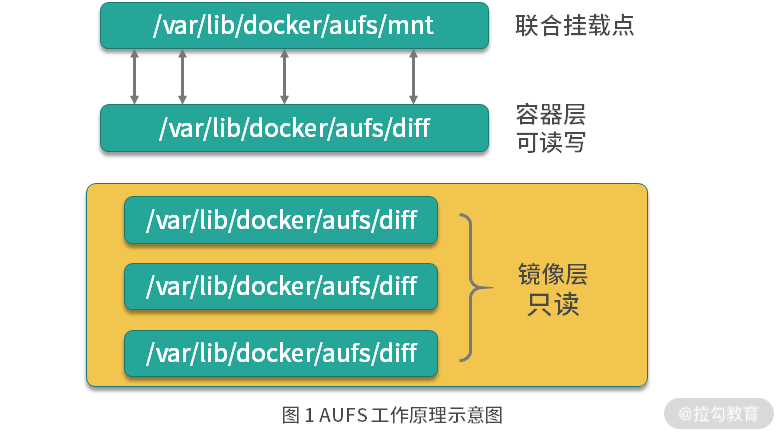

# Linux 中的文件系统

Linux 中目前主流的文件系统，主要有 EXT4 、 XFS 、 Btrfs 等

|                    | EXT4                               | XFS                                            | Btrfs                                                                                                     |
| :----------------: | ---------------------------------- | ---------------------------------------------- | --------------------------------------------------------------------------------------------------------- |
|   **全称**   | 第四代文件扩展系统                 | 高性能日志文件系统                             | B树文件系统                                                                                               |
|   **特点**   | - 成熟稳定<br />- 高效空间利用     | - 高性能<br />- 可伸缩                         | - 现代化<br />- 高级功能                                                                                  |
|  **兼容性**  | 与EXT2/EXT3兼容                    | 跨平台兼容性较好                               | Linux社区支持                                                                                             |
|   **功能**   | - 快速fsck<br />- 纳秒级时间戳     | 数据和元数据日志记录                           | - 快照<br />- 子卷<br />- 压缩                                                                            |
| **容量支持** | - 最大1EB文件系统<br />- 16TB文件  | - 最大16EB文件系统<br />- 8EB文件              | 取决于实现和硬件配置                                                                                      |
| **数据恢复** | 日志功能快速恢复                   | 日志功能快速恢复                               | 快照和子卷提高恢复灵活性                                                                                  |
|   **特性**   | 在线碎片整理                       | 高效元数据管理                                 | 写时复制（COW）、文件快速检查                                                                             |
| **使用场景** | - 日常桌面使用<br />- 中小型数据库 | - 大规模存储<br />- 高性能计算(高并发读写性能) | - 需要高级功能的大型存储系统<br />- 云存储和虚拟化环境<br />- 开发和测试环境,利用快照和回滚频繁变更和测试 |


# 联合文件系统
联合文件系统（Union System UnionFS） 是一种轻量级且高性能的文件系统。它支持将文件系统中的修改信息作为一次提交，并层层叠加。同时，它可以将不同目录挂载到同一个虚拟文件系统下，像是使用一个目录一样。


## 基本概念与原理


1. 分层结构：
   
   联合文件系统将多个文件系统层，以一种有效的方式组合在一起，形成了一个单一的可读写的文件系统。这些层可以是只读的，也可以是可读写的，但通常只有最顶层是可写的，而底层则提供基础数据和共享内容

2. 联合挂载
   
   联合文件系统使用联合挂载技术，将多个目录(或文件系统)，合并成一个统一的视图。这个统一的视图对于应用来说就像是一个普通的文件系统，但它实际上是由多个底层的文件系统层组成的。

3. 写时复制
   
   这是联合文件系统的一个重要特征。当对文件进行写操作时，系统不会在原文件上直接修改，而是在可写层创建一个文件的副本，然后在该副本上进行修改。这样只读层的文件就受到了保护，而修改则限制在最顶层的可写层中。

## 主要特点与优势

1. 提高存储效率
   
   通过分层结构，联合文件系统可以共享公共层，从而避免冗余数据的存储。这意味着只要安装一个程序或者镜像，其依赖的公共层就只需要被下载或安装一次，大大的节省了存储空间

2. 更好的依赖管理和隔离
   
   分层结构可以使得依赖管理变得容易。例如，在 Docker 中，可以通过继承基础镜像来复用其能力，并在此基础上进行扩展和定制。同时分层结构还确保了各层之间的隔离性，层与层之间的操作不受影响。

## 应用场景

1. Docker 镜像
   
   联合文件系统是实现 Docker 镜像的技术基础。 Docker 镜像通过分层的方式存储和管理文件和目录，使得镜像的创建，分发和管理变得更加高效和灵活。

2. 多磁盘分区合并
   
   联合文件系统还可以用于在多个磁盘分区上合并不同的文件系统的主目录，从而简化文件系统的管理

3. 数据备份与恢复，通过创建只读层可以对其进行备份，可以在需要时款速恢复数据到某个指定的状态

## 常见实现

- AUFS（Advanced Multi-Layered unified Filesystem）：AUFS是一种广泛使用的联合文件系统类型，它实现了对多层的高效管理。AUFS在Linux系统中得到了广泛的支持和应用。
  
- OverlayFS：OverlayFS是另一种常用的联合文件系统类型。与AUFS相比，它使用一种简化的方法来创建和管理覆盖目录。OverlayFS在Linux 3.18版本中被合并到内核中，并在后续的版本中得到了不断的改进和优化。


- Btrfs（B-Tree Filesystem）：Btrfs是一种现代文件系统，它除了提供快照和校验和等高级存储特性外，还支持与联合文件系统的兼容性。这使得Btrfs可以在某些场景下作为联合文件系统的底层存储使用。
- ZFS（Z文件系统）：ZFS是一个高容量和健壮的存储平台，它提供了联合文件系统特性以及数据保护、压缩和重复数据删除等功能。ZFS在某些特定的应用场景下具有独特的优势。


# 联合文件系统与Docker


Docker 中最常用的联合文件系统有三种：AUFS、Devicemapper 和 OverlayFS。

AUFS 是 Docker 最早使用的文件系统驱动，多用于 Ubuntu 和 Debian 系统中。在 Docker 早期，OverlayFS 和 Devicemapper 相对不够成熟，AUFS 是最早也是最稳定的文件系统驱动。

# 配置 Docker 的 AUFS 模式


AUFS 目前并未合并到 Linux 内核主线，因此只有 Ubuntu 和 Debian等少数操作系统支持 AUFS，可以使用以下命令查看是否支持 AUFS
```bash
$ grep aufs /proc/filesystems
# 如果看到以下输出则说明支持
nodev   aufs
```

配置docker 使用 aufs ：在 `/etc/docker` 下新建 `daemon.json` 文件，并写入以下内容
```json
{
  "storage-driver": "aufs"
}
```
重启Docker
```bash
sudo systemctl restart docker
```

Docker 重启以后使用docker info命令即可查看配置是否生效：
```bash
$ sudo docker info
Client:
 Debug Mode: false
Server:
 Containers: 0
  Running: 0
  Paused: 0
  Stopped: 0
 Images: 1
 Server Version: 19.03.12
 Storage Driver: aufs
  Root Dir: /var/lib/docker/aufs
  Backing Filesystem: extfs
  Dirs: 1
  Dirperm1 Supported: true
```

可以看到 Storage Driver 已经变为 aufs，证明配置已经生效，配置生效后就可以使用 AUFS 为 Docker 提供联合文件系统了。

# AUFS的工作原理


## AUFS是如何存储文件的

**AUFS 是联合文件系统，意味着它在主机上使用多层目录存储，每一个目录在 AUFS 中都叫做分支，在 Docker 中称作层(layer) ，但最终呈现给用户的是一个普通单层的文件系统（目录），我们把多层结构，但以单层方式呈现的过程叫做联合挂载**



每一层镜像层和容器层都是 `/var/lib/docker` 下的一个子目录，镜像层和容器层都在 `aufs/diff` 目录下，每一层的目录名称是镜像或容器的 ID 值，联合挂载点在 `aufs/mnt` 目录下， mnt 目录是真正的容器工作目录。


下面我们针对 aufs 文件夹下的各目录结构，在创建容器前后的变化做详细讲述。

当一个镜像未生成容器时， AUFS 的存储结构如下：05

- **diff文件夹** ： 存储镜像内容，每一层都存储在以镜像ID命名的子文件夹中
- **layers文件夹** ： 存储镜像层关系的元数据，在 diff 文加下的每个镜像层在这里都会有一个文件，文件内容为该层镜像的父级镜像的ID
- **mnt文件夹** ：联合文件挂载点，未生成容器时，该目录为空


当一个镜像已经生成容器时， AUFS 存储结构会发生如下变化：

- **diff文件夹** ： 当容器运行时，会在 diff 目录下生成容器层
- **layers文件夹** ： 增加容器层相关数据
- **mnt文件夹** ： 容器的联合挂载点，这和容器中看到的文件内容一致
  

## AUFS是如何工作的？

1. 读取文件
   - 文件在容器层中存在时： 当文件存在于容器层时，直接从容器层读取
   - 当文件在容器层中不存在时：当容器运行时需要读取某个文件，如果容器层中不存在，则从镜像层读取
   - 文件既存在于镜像层又存在于容器层：
   
2. 修改文件： AUFS 对文件的修改采用的是写时复制的工作机制，这种工作机制可以最大的节省存储空间，具体的操作机制如下：
   
   - 第一次修改文件：当我们第一次在容器中修改某个文件时，AUFS 会触发写时复制操作，AUFS 首先从镜像层复制文件到容器层，然后执行对应的修改操作
     > AUFS 写时复制的操作，会复制整个文件，如果文件过大，将会大大降低文件系统性能，因此当我们有大量文件需要被修改时，AUFS 可能会出现明显的延迟。好在，写时复制只在第一次修改文件时触发，对日常使用没有多大影响
   
   - 删除文件或目录：当文件或目录被删除时，AUFS 并不会真正的从镜像中删除它，因为镜像层是只读的，AUFS 会创建一个特殊的文件夹，这种特殊的文件夹会阻止容器的访问


## AUFS 演示

### 准备演示目录和文件
首先我们在 /tmp 目录下创建 aufs 目录：
```bash
$ cd /tmp
/tmp$ mkdir aufs
```
准备挂载点目录：
```bash
/tmp$ cd aufs
/tmp/aufs$ mkdir mnt
```
接下来准备容器层内容：
```bash
## 创建镜像层目录
/tmp/aufs$ mkdir container1
## 在镜像层目录下准备一个文件
/tmp/aufs$ echo Hello, Container layer! > container1/container1.txt
```
准备好的目录和文件结构如下：
```bash
/tmp/aufs$ tree .
.
|-- container1
|   `-- container1.txt
|-- image1
|   `-- image1.txt
|-- image2
|   `-- image2.txt
`-- mnt
4 directories, 3 files
```

### 创建 AUFS 联合文件系统

使用 mount 命令可以创建 AUFS 类型的文件系统，命令如下：
```bash
/tmp/aufs$ sudo mount -t aufs -o dirs=./container1:./image2:./image1  none ./mnt
```

mount 命令创建 AUFS 类型文件系统时，这里要注意，**dirs 参数第一个冒号默认为读写权限，后面的目录均为只读权限，与 Docker 容器使用 AUFS 的模式一致**。

执行完上述命令后，mnt 变成了 AUFS 的联合挂载目录，我们可以使用 mount 命令查看一下已经创建的 AUFS 文件系统：
```bash
/tmp/aufs$ mount -t aufs
none on /tmp/aufs/mnt type aufs (rw,relatime,si=4174b83d649ffb7c)
```

我们每创建一个 AUFS 文件系统，AUFS 都会为我们生成一个 ID，这个 ID 在 /sys/fs/aufs/ 会创建对应的目录，在这个 ID 的目录下可以查看文件挂载的权限。
```bash
tmp/aufs$ cat /sys/fs/aufs/si_4174b83d649ffb7c/*
/tmp/aufs/container1=rw
/tmp/aufs/image2=ro
/tmp/aufs/image1=ro
64
65
66
```
可以看到 container1 目录的权限为 rw（代表可读写），image1 和 image2 的权限为 ro（代表只读）。

为了验证 mnt 目录下可以看到 container1、image1 和 image2 目录下的所有内容，我们使用 ls 命令查看一下 mnt 目录：
```bash
/tmp/aufs$ ls -l mnt/
total 12
-rw-rw-r-- 1 ubuntu ubuntu 24 Sep  9 16:55 container1.txt
-rw-rw-r-- 1 ubuntu ubuntu 21 Sep  9 16:59 image1.txt
-rw-rw-r-- 1 ubuntu ubuntu 21 Sep  9 16:59 image2.txt
```
可以看到 mnt 目录下已经出现了我们准备的所有镜像层和容器层的文件。下面让我们来验证一下 AUFS 的写时复制。

## 验证 AUFS 的写时复制

AUFS 的写时复制是指在容器中，只有需要修改某个文件时，才会把文件从镜像层复制到容器层，下面我们通过修改联合挂载目录 mnt 下的内容来验证下这个过程。

我们使用以下命令修改 mnt 目录下的 image1.txt 文件：
```bash
/tmp/aufs$ echo Hello, Image layer1 changed! > mnt/image1.txt
```
然后我们查看下 image1/image1.txt 文件内容：
```bash
/tmp/aufs$ cat image1/image1.txt
Hello, Image layer1!
```
发现“镜像层”的 image1.txt 文件并未被修改。
然后我们查看一下"容器层"对应的 image1.txt 文件内容：
```bash
/tmp/aufs$ ls -l container1/
total 8
-rw-rw-r-- 1 ubuntu ubuntu 24 Sep  9 16:55 container1.txt
-rw-rw-r-- 1 ubuntu ubuntu 29 Sep  9 17:21 image1.txt
## 查看文件内容
/tmp/aufs$ cat container1/image1.txt
Hello, Image layer1 changed!
```

发现 AUFS 在“容器层”自动创建了 image1.txt 文件，并且内容为我们刚才写入的内容。

至此，我们完成了 AUFS 写时复制的验证。我们在第一次修改镜像内某个文件时，AUFS 会复制这个文件到容器层，然后在容器层对该文件进行修改操作，这就是 AUFS 最典型的特性写时复制。