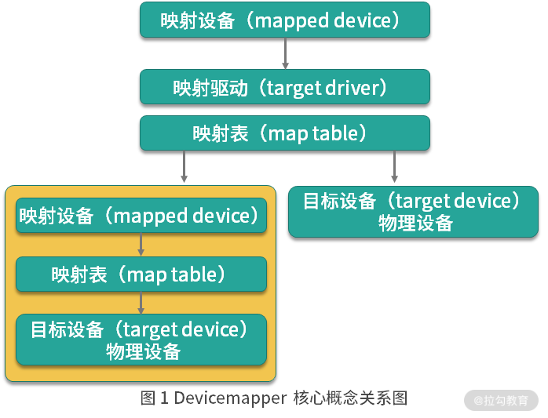
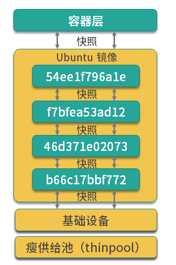

# 什么是 Devicemapper ？

Devicemapper 是 Linux 内核提供的框架， 从 Linux 内核 2.6.9 版本引入， Devicemapper 与 AUFS 不同，AUFS 是一种文件系统， **Devicemapper 是一种映射块设备的技术框架**

Devicemapper 提供了一种将物理设备映射到虚拟块设备的机制，目前 Linux 下比较流程的 LVM （Logical Volume Manager 是 Linux 下对磁盘分区进行管理的一种机制）和软件磁盘阵列（将多个较小的磁盘整合成为一个较大的磁盘设备用于扩大磁盘存储和提供数据可用性）都是基于 Devicemapper 机制实现的。


# 块设备

块设备是I/O设备中的一类，其主要特征是将信息存储在固定大小的块中，每个块都有自己的地址。以下是对块设备的详细解释：

## 一、定义与特性
定义：块设备是以块为单位进行数据传输（读写）的设备，这些块是固定大小的，并且可以在设备的任意位置读取或写入。
特性：
1. 固定块大小：块设备中的数据被划分为固定大小的块，这些块的大小通常在512字节到32768字节之间，且通常表示为2的幂。
2. 可寻址性：每个块都有自己的地址，因此可以随机访问设备中的任意块。
3. 存储类设备：块设备主要是存储类设备，如硬盘、U盘、SD卡、固态硬盘（SSD）等。


## 二、访问方式
块设备通常通过块设备驱动进行访问。这些驱动程序负责处理对块设备的读写请求，将它们转换为设备可以理解的指令。块设备的访问方式通常是随机的，即可以在访问设备时从一个位置跳转到另一个位置。

## 三、应用场景
块设备在计算机系统中有着广泛的应用，包括但不限于以下几个方面：

1. 数据存储：块设备是数据存储的主要方式之一，它们可以存储操作系统、应用程序、用户数据等。
   
2. 文件系统：块设备通常是文件系统的底层存储介质。文件系统将块设备划分为更小的单元（如扇区或簇），并在这些单元上存储文件和数据。
   
3. 虚拟化：在虚拟化环境中，块设备可以用于创建虚拟磁盘，为虚拟机提供存储空间。
   
4. 远程存储：块设备还可以通过网络进行远程访问，如使用网络附加存储（NAS）或存储区域网络（SAN）等技术。


# Devicemapper 的关键技术

Devicemapper 将主要的工作部分分为用户空间和内核空间。

- 用户空间负责配置具体的设备映射策略与相关的内核空间控制逻辑，例如逻辑设备 dm-a 如何与物理设备 sda 相关联，怎么建立逻辑设备和物理设备的映射关系等。

- 内核空间则负责用户空间配置的关联关系实现，例如当 IO 请求到达虚拟设备 dm-a 时，内核空间负责接管 IO 请求，然后处理和过滤这些 IO 请求并转发到具体的物理设备 sda 上。

这个架构类似于 C/S （客户端/服务区）架构的工作模式，客户端负责具体的规则定义和配置下发，服务端根据客户端配置的规则来执行具体的处理任务。


Devicemapper 的工作机制主要围绕三个核心概念。

- 映射设备（mapped device）： 即对外提供的逻辑设备，它是由 Devicemapper 模拟的一个虚拟设备，并不真正存在于宿主机上的物理设备
  
- 目标设备（mapped device）： 目标设备是映射设备对应的物理设备或者物理设备的一个逻辑部分，是真正存在于物理机上的设备。
  
- 映射表（map table）： 映射表记录了映射设备到目标设备的映射关系，它记录了映射设备在目标设备的起始地址、范围、目标设备的类型等变量



> 映射设备通过映射表关联到具体的物理设备/虚拟设备

Devicemapper 在内核中通过模块化的映射驱动（target drvice） 插件实现了对真正 IO 请求的拦截，过滤和转发工作，比如 raid 、软件加密 、 瘦供给等。 瘦供给模块是Docker 使用 Devicemapper 技术框架中

# 瘦供给

瘦供给的意思是动态分配，这与传统的固定分配不一样，传统的固定分配是无论我们用多少都会一次性的分配一个较大的空间，这样可能导致空间浪费。瘦供给则是需要多少磁盘空间就会分配多少磁盘空间。

Docker 使用了瘦供给提供的快照（snapshot）技术。

什么是快照（snapshot）技术？这是全球网络存储工业协会 SNIA（StorageNetworking Industry Association）对快照（Snapshot）的定义：

> 关于指定数据集合的一个完全可用拷贝，该拷贝包括相应数据在某个时间点（拷贝开始的时间点）的映像。快照可以是其所表示的数据的一个副本，也可以是数据的一个复制品。


简单来说，**快照是数据在某一个时间点的存储状态。快照的主要作用是对数据进行备份，当存储设备发生故障时，可以使用已经备份的快照将数据恢复到某一个时间点，而 Docker 中的数据分层存储也是基于快照实现的。**

# Devicemapper 是如何数据存储的？

**当 Docker 使用 Devicemapper 作为文件存储驱动时， Docker 将镜像和容器的文件存储在瘦供给池（thinpool）中，并将这些内容挂载到 /var/lib/docker/devicemapper/ 目录下**。该目录下存在其他目录，数据内容和功能如下：

- devicemapper 目录 (/var/lib/docker/devicemapper/devicemapper/) : 存储镜像和容器实际内容，该目录由一个或多个块设备构成
  
- metadata 目录(/var/lib/docker/devicemapper/metadata/) : 包含 Devicemapper 本身配置的元数据信息，以 json 的形式配置，这些元数据记录了镜像层和容器层之间的关联关系
  
- mnt目录（/var/lib/docker/devicemapper/mnt/）: 是容器的联合挂载点目录，还未生成容器时，该目录为空，而容器存在时，该目录下的内容与容器中一致


# Devicemapper 如何实现镜像分层与共享？


Devicemapper 使用专用的块设备实现镜像的存储，并且像 AUFS 一样使用了写时复制的技术来保障最大程度的节省控件，所以 Devicemapper 的镜像分层也是依赖快照实现的。


Devicemapper 的每一层镜像都是下一层镜像的快照，最底层的镜像时我们的瘦供给池，通过这种方式实现分层镜像有以下优点：

- 相同的镜像，仅在磁盘上存储一次
- 快照是写时复制策略的体现，也就是说，当我们需要对文件进行修改时，文件才会被复制到读写层。
- 相对文件系统的加锁机制，Devicemapper 工作在块级别，因此可以实现同时修改和读写层中的多个块设备，比文件系统效率更高


当我们需要读取数据时，如果数据存在于底层快照中，则向底层快照查询数据并读取。当我们需要写数据时，则向瘦供给池动态申请存储空间生成读写层，然后把数据复制到读写层进行修改。 Devicemapper 默认每次申请的大小是 64k 或者 64k的倍数，因此每次新生成的读写层的大小都是64K或64K的倍数。




这个 Ubuntu 镜像一共有四层，每一层镜像都是下一层的快照，镜像的最底层是基础设备的快照。当容器运行时，容器是基于镜像的快照。综上，Devicemapper 实现镜像分层的根本原理就是快照。

# 在Docker 中配置 Devicemapper

Docker 的 Devicemapper 模式有两种：第一种是 loop-lvm 模式，该模式主要用来开发和测试使用；第二种是 direct-lvm 模式，该模式推荐在生产环境中使用。


## loop-lvm模式
1. 定义与原理：
   - loop-lvm是devicemapper的默认配置模式。
   - 它使用操作系统层面的离散文件来构建精简池（thin pool），这些文件通常被挂载为loop设备，并作为块设备来使用。
2. 特点：
   - 设计简单，无需额外的配置，使得Docker可以“开箱即用”。

   - 由于使用了loop设备，性能可能受到限制，特别是在挂载多个容器时，性能可能会急剧下降。
3. 应用场景：
   - 主要用于测试环境或临时部署，不推荐在生产环境中使用。
## direct-lvm模式
1. 定义与原理：
   - direct-lvm模式使用块设备来构建精简池，用于存放镜像和容器的数据。
   - 它直接利用逻辑卷管理（LVM）来管理存储资源，提供了更高的性能和灵活性。
1. 特点：
   - 相比loop-lvm模式，direct-lvm模式在中等负载和高密度环境下具有更好的性能优势。
   - 需要手动配置，包括创建物理卷（PV）、卷组（VG）和逻辑卷（LV），以及将逻辑卷转换为thin pool。
1. 应用场景：
   - 推荐用于生产环境，以提供更高的性能和稳定性。


## 配置 loop-lvm 模式


1. 使用以下命令停止已经运行的 Docker：
   ```bash
   $ sudo systemctl stop docker
   ```
2. 编辑 /etc/docker/daemon.json 文件，如果该文件不存在，则创建该文件，并添加以下配置：
   ```json
   {
    "storage-driver": "devicemapper"
   }
   ```
3. 启动 Docker：
   ```bash
   $ sudo systemctl start docker
   ```
4. 验证 Docker 的文件驱动模式：
   ```bash
   $ docker info

    Client:
    Debug Mode: false
    Server:
    Containers: 1
    Running: 0
    Paused: 0
    Stopped: 1
    Images: 1
    Server Version: 19.03.12
    Storage Driver: devicemapper
    Pool Name: docker-253:1-423624832-pool
    Pool Blocksize: 65.54kB
    Base Device Size: 10.74GB
    Backing Filesystem: xfs
    Udev Sync Supported: true
    Data file: /dev/loop0
    Metadata file: /dev/loop1
    Data loop file: /var/lib/docker/devicemapper/devicemapper/data
    Metadata loop file: /var/lib/docker/devicemapper/devicemapper/metadata
    Data Space Used: 22.61MB
    Data Space Total: 107.4GB
    Data Space Available: 107.4GB
    Metadata Space Used: 17.37MB
    Metadata Space Total: 2.147GB
    Metadata Space Available: 2.13GB
    Thin Pool Minimum Free Space: 10.74GB
    Deferred Removal Enabled: true
    Deferred Deletion Enabled: true
    Deferred Deleted Device Count: 0
    Library Version: 1.02.164-RHEL7 (2019-08-27)
    ... 省略部分输出
   ```

可以看到 Storage Driver 为 devicemapper，这表示 Docker 已经被配置为 Devicemapper 模式。

但是这里输出的 Data file 为 /dev/loop0，这表示我们目前在使用的模式为 loop-lvm。但是由于 loop-lvm 性能比较差，因此不推荐在生产环境中使用 loop-lvm 模式。下面我们看下生产环境中应该如何配置 Devicemapper 的 direct-lvm 模式。

## 配置 direct-lvm 模式

1. 使用以下命令停止已经运行的 Docker：
   ```bash
   $ sudo systemctl stop docker
   ```
2. 编辑 /etc/docker/daemon.json 文件，如果该文件不存在，则创建该文件，并添加以下配置：
   ```json
   {
    "storage-driver": "devicemapper",
    "storage-opts": [
        "dm.directlvm_device=/dev/xdf",
        "dm.thinp_percent=95",
        "dm.thinp_metapercent=1",
        "dm.thinp_autoextend_threshold=80",
        "dm.thinp_autoextend_percent=20",
        "dm.directlvm_device_force=false"
        ]
    }
   ```
   其中 directlvm_device 指定需要用作 Docker 存储的磁盘路径，Docker 会动态为我们创建对应的存储池。例如这里我想把 /dev/xdf 设备作为我的 Docker 存储盘，directlvm_device 则配置为 /dev/xdf。
3. 启动 Docker：
   ```bash
   $ sudo systemctl start docker
   ```
4. 验证 Docker 的文件驱动模式：
   ```bash
   $ docker info

    Client:
    Debug Mode: false
    Server:
    Containers: 1
    Running: 0
    Paused: 0
    Stopped: 1
    Images: 1
    Server Version: 19.03.12
    Storage Driver: devicemapper
    Pool Name: docker-thinpool
    Pool Blocksize: 65.54kB
    Base Device Size: 10.74GB
    Backing Filesystem: xfs
    Udev Sync Supported: true
    Data file:
    Metadata file:
    Data loop file: /var/lib/docker/devicemapper/devicemapper/data
    Metadata loop file: /var/lib/docker/devicemapper/devicemapper/metadata
    Data Space Used: 22.61MB
    Data Space Total: 107.4GB
    Data Space Available: 107.4GB
    Metadata Space Used: 17.37MB
    Metadata Space Total: 2.147GB
    Metadata Space Available: 2.13GB
    Thin Pool Minimum Free Space: 10.74GB
    Deferred Removal Enabled: true
    Deferred Deletion Enabled: true
    Deferred Deleted Device Count: 0
    Library Version: 1.02.164-RHEL7 (2019-08-27)
    ... 省略部分输出
   ```
当我们看到 Storage Driver 为 devicemapper，并且 Pool Name 为 docker-thinpool 时，这表示 Devicemapper 的 direct-lvm 模式已经配置成功。


## 结语

Devicemapper 使用块设备来存储文件，运行速度会比直接操作文件系统更快，因此很长一段时间内在 Red Hat 或 CentOS 系统中，Devicemapper 一直作为 Docker 默认的联合文件系统驱动，为 Docker 在 Red Hat 或 CentOS 稳定运行提供强有力的保障。