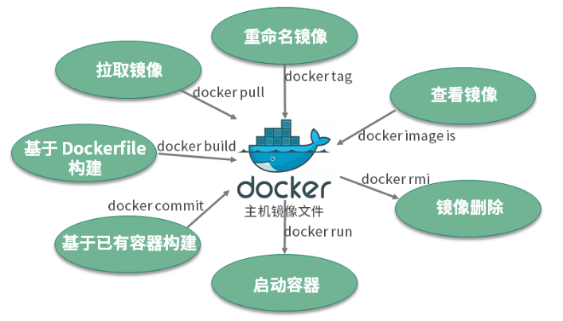
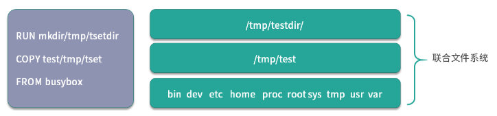

镜像是一个只读的 Docker 容器模板，包含启动容器所需要的所有文件系统结构和内容。简单来讲，镜像是一个特殊的文件系统，它提供了容器运行时所需的程序、软件库、资源、配置等静态数据。即镜像不包含任何动态数据，镜像内容在构建后不会被改变。


# 镜像操作




- 拉取镜像，使用docker pull命令拉取远程仓库的镜像到本地 ；

- 重命名镜像，使用docker tag命令“重命名”镜像 ；

- 查看镜像，使用docker image ls或docker images命令查看本地已经存在的镜像 ；

- 删除镜像，使用docker rmi命令删除无用镜像 ；

- 构建镜像，构建镜像有两种方式。
  - 第一种方式是使用docker build命令基于 Dockerfile 构建镜像 **推荐**
  - 第二种方式是使用docker commit命令基于已经运行的容器提交为镜像


## 拉取镜像

docker pull [Registry]/[Repository]/[Image]:[Tag]

- Registry 为注册服务器，Docker 默认会从 docker.io 拉取镜像，如果你有自己的镜像仓库，可以把 Registry 替换为自己的注册服务器。

- Repository 为镜像仓库，通常把一组相关联的镜像归为一个镜像仓库，library为 Docker 默认的镜像仓库。

- Image 为镜像名称。

- Tag 为镜像的标签，如果你不指定拉取镜像的标签，默认为latest。


例如，我们需要获取一个 busybox 镜像，可以执行以下命令：
> busybox 是一个集成了数百个 Linux 命令（例如 curl、grep、mount、telnet 等）的精简工具箱，只有几兆大小，被誉为 Linux 系统的瑞士军刀。我经常会使用 busybox 做调试来查找生产环境中遇到的问题。

```bash
$ docker pull busybox
Using default tag: latest
latest: Pulling from library/busybox
61c5ed1cbdf8: Pull complete
Digest: sha256:4f47c01fa91355af2865ac10fef5bf6ec9c7f42ad2321377c21e844427972977
Status: Downloaded newer image for busybox:latest
docker.io/library/busybox:latest
```

实际上执行docker pull busybox命令，都是先从本地搜索，如果本地搜索不到busybox镜像则从 Docker Hub 下载镜像。

## 查看镜像

Docker 镜像查看使用docker images或者docker image ls命令。
```bash
$ docker images

REPOSITORY          TAG                 IMAGE ID            CREATED             SIZE
nginx               latest              4bb46517cac3        9 days ago          133MB
nginx               1.15                53f3fd8007f7        15 months ago       109MB
busybox             latest              018c9d7b792b        3 weeks ago         1.22MB
```

如果我们想要查询指定的镜像，可以使用docker image ls命令来查询。
```bash
$ docker image ls busybox

REPOSITORY          TAG                 IMAGE ID            CREATED             SIZE
busybox             latest              018c9d7b792b        3 weeks ago         1.22MB
```
当然你也可以使用docker images命令列出所有镜像，然后使用grep命令进行过滤。使用方法如下：
```bash
$ docker images |grep busybox

busybox             latest              018c9d7b792b        3 weeks ago         1.22MB
```
## 重命名镜像

`docker tag` 的命令格式为 `docker tag [SOURCE_IMAGE][:TAG] [TARGET_IMAGE][:TAG]`

```bash
docker tag busybox:latest mybusybox:latest
```

执行完docker tag命令后，可以使用查询镜像命令查看一下镜像列表：
```bash
docker images

REPOSITORY          TAG                 IMAGE ID            CREATED             SIZE
busybox             latest              018c9d7b792b        3 weeks ago         1.22MB
mybusybox           latest              018c9d7b792b        3 weeks ago         1.22MB
```

## 删除镜像

你可以使用docker rmi或者docker image rm命令删除镜像。

```bash
$ docker rmi mybusybox

Untagged: mybusybox:latest
```

## 构建镜像

1. 使用docker commit命令从运行中的容器提交为镜像；

1. 使用docker build命令从 Dockerfile 构建镜像。

<!-- FROM java:8
VOLUME /tmp
ADD DockerDemo-0.0.1-SNAPSHOTjar app.jar
EXPOSE 8080
ENTRYPOINT ["java","-jar","/app.jar"] -->

### 使用docker commit命令从运行中的容器提交为镜像
创建一个容器并并进入容器
```bash
$ docker run --rm --name=busybox -it busybox sh
/ #
```
在根目录下写入一个 hello.txt 文件
```bash
/# touch hello.txt && echo "I love Docker. " > hello.txt
/ #
```
此时在容器的根目录下，已经创建了一个 hello.txt 文件，并写入了 "I love Docker. "。下面，我们**新打开另一个命令行窗口**，运行以下命令提交镜像：
```bash
$ docker commit busybox busybox:hello
sha256:cbc6406aaef080d1dd3087d4ea1e6c6c9915ee0ee0f5dd9e0a90b03e2215e81c
```
然后使用上面讲到的docker image ls命令查看镜像：
```bash
$ docker image ls busybox

REPOSITORY          TAG                 IMAGE ID            CREATED             SIZE
busybox             hello               cbc6406aaef0        2 minutes ago       1.22MB
busybox             latest              018c9d7b792b        4 weeks ago         1.22MB
```

### 使用Dockerfile构建容器

使用 Dockerfile 构建镜像具有以下特性：

- Dockerfile 的每一行命令都会生成一个独立的镜像层，并且拥有唯一的 ID；
- Dockerfile 的命令是完全透明的，通过查看 Dockerfile 的内容，就可以知道镜像是如何一步步构建的；
- Dockerfile 是纯文本的，方便跟随代码一起存放在代码仓库并做版本管理。

| Dockerfile 指令 | 指令简介                                                     |
| --------------- | ------------------------------------------------------------ |
| FROM            | Dockerfile 除了注释第一行必须是 FROM ，FROM 后面跟镜像名称，代表我们要基于哪个基础镜像构建我们的容器。 |
| RUN             | RUN 后面跟一个具体的命令，类似于 Linux 命令行执行命令。      |
| ADD             | 拷贝本机文件或者远程文件到镜像内                             |
| COPY            | 拷贝本机文件到镜像内                                         |
| USER            | 指定容器启动的用户                                           |
| ENTRYPOINT      | 容器的启动命令                                               |
| CMD             | CMD 为 ENTRYPOINT 指令提供默认参数，也可以单独使用 CMD 指定容器启动参数 |
| ENV             | 指定容器运行时的环境变量，格式为 key=value                   |
| ARG             | 定义外部变量，构建镜像时可以使用 build-arg = 的格式传递参数用于构建 |
| EXPOSE          | 指定容器监听的端口，格式为 [port]/tcp 或者 [port]/udp        |
| WORKDIR         | 为 Dockerfile 中跟在其后的所有 RUN、CMD、ENTRYPOINT、COPY 和 ADD 命令设置工作目录。 |

看了这么多指令，感觉有点懵？别担心，我通过一个实例让你来熟悉它们。这是一个 Dockerfile：
```Dockerfile
# 基于 centos:7 镜像构建
FROM centos:7
# 拷贝本地文件 nginx.repo 文件到容器内的 /etc/yum.repos.d 目录下。这里拷贝 nginx.repo 文件是为了添加 nginx 的安装源
COPY nginx.repo /etc/yum.repos.d/nginx.repo
# 在容器内运行yum install -y nginx命令，安装 nginx 服务到容器内，执行完第三行命令，容器内的 nginx 已经安装完成
RUN yum install -y nginx
# 声明容器内业务（nginx）使用 80 端口对外提供服务
EXPOSE 80
# 定义容器启动时的环境变量 HOST=mynginx，容器启动后可以获取到环境变量 HOST 的值为 mynginx
ENV HOST=mynginx
# 容器的启动命令，命令格式为 json 数组。这里设置了容器的启动命令为 nginx ，并且添加了 nginx 的启动参数 -g 'daemon off;' ，使得 nginx 以前台的方式启动
CMD ["nginx","-g","daemon off;"]
```

# 镜像的实现原理

其实 Docker 镜像是由一系列镜像层（layer）组成的，每一层代表了镜像构建过程中的一次提交。下面以一个镜像构建的 Dockerfile 来说明镜像是如何分层的。
```Dockerfile
FROM busybox
COPY test /tmp/test
RUN mkdir /tmp/testdir
```
1. 第一行基于 `busybox` 创建一个镜像层
2. 第二行拷贝本机 test 文件到镜像内
3. 第三行在 /tmp 文件夹下创建一个目录 testdir。

为了验证镜像的存储结构，我们使用docker build命令在上面 Dockerfile 所在目录构建一个镜像：
```bash
docker build -t mybusybox .
```

使用 `docker history <image_id_or_name:tag>` 查看镜像的分层结构

```bash
docker history 23b7934c76d7
```

```bash
IMAGE          CREATED         CREATED BY                                     SIZE      COMMENT
23b7934c76d7   4 days ago      RUN /bin/sh -c mkdir /tmp/testdir # buildkit   0B        buildkit.dockerfile.v0
<missing>      4 days ago      COPY test /tmp/test # buildkit                 4B        buildkit.dockerfile.v0
<missing>      16 months ago   BusyBox 1.36.1 (glibc), Debian 12              4.26MB    
```
分层的结构使得 Docker 镜像非常轻量，每一层根据镜像的内容都有一个唯一的 ID 值，当不同的镜像之间有相同的镜像层时，便可以实现不同的镜像之间共享镜像层的效果。



分层的结构使得 Docker 镜像非常轻量，每一层根据镜像的内容都有一个唯一的 ID 值，当不同的镜像之间有相同的镜像层时，便可以实现不同的镜像之间共享镜像层的效果。

总结一下， Docker 镜像是静态的分层管理的文件组合，镜像底层的实现依赖于联合文件系统（UnionFS）。充分掌握镜像的原理，可以帮助我们在生产实践中构建出最优的镜像，同时也可以帮助我们更好地理解容器和镜像的关系。


# 镜像清理

删除所有无标签的镜像
```bash
docker image prune
```
如果想删除所有未使用的镜像（包括有标签但未被引用的），可以加上-a参数：
```bash
docker image prune -a
```

# 清理Docker占用的其他空间

除了容器和镜像外，Docker还可能占用一些其他的空间，如构建缓存、容器卷等。为了彻底清理Docker占用的空间，可以使用docker system prune命令。
```bash
docker system prune
```

这个命令会删除所有已经停止的容器、无标签的镜像以及构建缓存。如果想删除所有未使用的资源（包括有标签但未被引用的镜像和容器卷），可以加上-a参数：