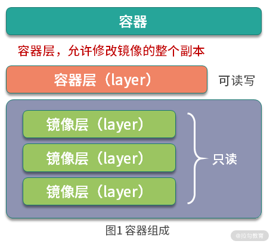
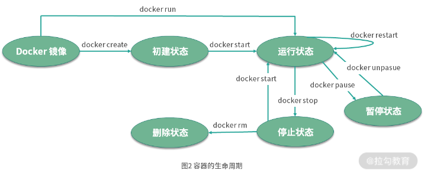
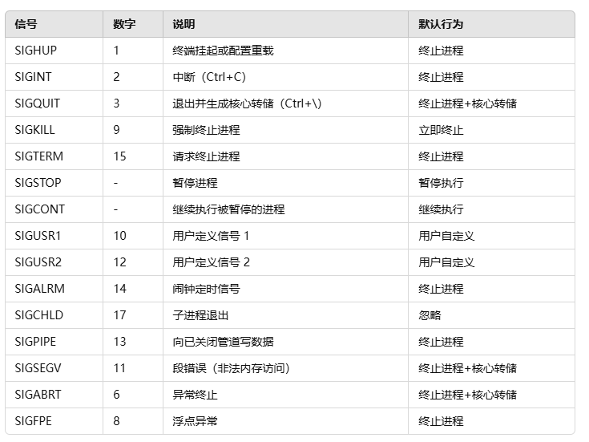

# 容器是什么

容器是基于镜像创建的可执行实例，并且单独存在。一个镜像可以创建出多个容器。运行容器化环境是，实际上是在容器内部创建该文件的读写副本。这将添加一个容器层，该层允许修改镜像的整个副本


# 容器的生命周期

容器的生命周期是容器可能处于的状态，容器的生命周期分为 5 种。

1. `created` : 创建状态
2. `running` : 运行状态
3. `stopped` : 停止状态
4. `paused`  : 暂停状态
5. `deleted` : 删除状态
   



1. 通过 `docker create` 命令创建容器为 `created` 状态
2. 通过 `docker start`  命令可以转化为 `running` 状态
3. 通过 `docker stop`   命令可以转发为 `stopped` 状态
4. 通过 `docker pause`  命令可以转化为 `paused`  状态
5. 处于以上四种状态的容器都可以直接删除

# 容器的操作

## 创建并启动容器

**第一种方式**
1. 使用 docker create 创建容器，使用 docker start 启动容器
```bash
docker create -it --name=busybox busybox
07d155aba3b8fbbdb80d6a41de6b4e84496b5f80b7aab5ac25f3e7d05fada10a
```
查看容器状态
```bash
docker ps -a
# 如果容器较多可以加入筛选 docker ps -a| grep busybox
CONTAINER ID   IMAGE     COMMAND   CREATED              STATUS    PORTS     NAMES
07d155aba3b8   busybox   "sh"      About a minute ago   Created             busybox
```
容器此时为 `Created` 状态，使用 `docker start` 启动容器

```bash
docker start  07d155aba3b8
07d155aba3b8
```
继续查看状态
```bash
docker ps 
CONTAINER ID   IMAGE     COMMAND   CREATED         STATUS          PORTS     NAMES
07d155aba3b8   busybox   "sh"      5 minutes ago   Up 11 seconds             busybox
```


**第二种方式** 使用 docker run 创建并启动容器

```bash
$ docker run -it --name=busybox2 busybox
```
当使用 docker run 创建并启动容器时，会执行以下流程

1. docker 会检查本地是否存在镜像，如果不存在则从 Docker Hub 拉取
2. 使用镜像创建并启动一个容器
3. 分配文件系统，并在在镜像只读层外创建一个读写层
4. 从 Docker IP 池分配一个 IP 给容器
5. 执行用户的启动命令，运行程序

上述命令中， -t 参数的作用是分配一个伪终端，-i 参数则保持容器的标准输入（STDIN）开放，同时使用 -it 参数可以让我们进入交互模式。 在交互模式下，用户可以通过所创建的终端来输入命令，例如：
```bash
$ ps aux
PID   USER     TIME  COMMAND
    1 root      0:00 sh
    6 root      0:00 ps aux
```

我们可以看到容器的 1 号进程为 sh 命令，在容器内部并不能看到主机上的进程信息，因为容器内部和主机是完全隔离的。同时由于 sh 是 1 号进程，意味着如果通过 `exit PID` 退出 sh，那么容器也会退出。所以对于容器来说，**杀死容器中的主进程，则容器也会被杀死**。


### docker create

基本语法
```bash
docker create [OPTIONS] IMAGE [COMMAND] [ARG...]
```

- [OPTIONS]：可选参数，用于指定容器的配置选项。
- IMAGE：要创建的容器的基础镜像。
- [COMMAND] [ARG...]：容器启动时要执行的命令及其参数（这些命令在容器创建时不会执行，只有在容器启动后才会执行）。
  
  
**常见的选项和参数**
1. `--name`: 指定容器的名称。
   ```bash
   docker create --name my_container ubuntu
   ```
2. `-v`: 挂载卷，将主机的目录挂载到容器中。（较旧的方式）
    ```bash
   docker create -v /host/path:/container/path ubuntu
   # 指定卷名称
   # -v my-volume:/app/data
   ```
3. `--mount`: 挂载卷
   ```bash
   --mount source=my-volume,target=/app/data
   ```
   这里，source=my-volume指定了卷的名称，target=/app/data指定了容器内的挂载点。

4. `-e`: 设置环境变量。
   ```bash
   docker create -e MY_ENV_VAR=value ubuntu
   ```
5. `--network`: 指定容器要连接的 Docker 网络。
   ```bash
   docker create --network my_network ubuntu
   ```
6. `-p`: 暴露端口，将主机的端口映射到容器的端口
   ```bash
   # docker create -p <主机端口>:<容器端口> IMAGE
   docker create -p 8080:80 nginx
   ```
7. `--restart`: 设置容器的重启策略（如 no, on-failure, always）
   ```bash
   docker create --restart always nginx
   ```

### docker start

docker start 是一个用于启动已经停止的容器的命令。与 docker run 不同，docker start 只用于重新启动已经创建并且之前被停止的容器，而不会创建新的容器。
```bash
docker start [OPTIONS] CONTAINER [CONTAINER...]
```
- CONTAINER: 容器的名称或 ID，可以指定一个或多个容器。

常用选项
- -a 或 --attach：启动容器后附加到容器的标准输入输出，可以实时看到容器的输出，就像使用 docker run 启动容器一样。
  ```bash
  docker start -a my_container
  ```

- -i 或 --interactive：在启动容器时使其处于交互模式，并保持标准输入打开（通常与 -a 选项一起使用）
  ```bash
  docker start -ai my_container
  ```

### docker run

基本语法
```bash
docker run [OPTIONS] IMAGE [COMMAND] [ARG...]
```
大部分参数同 `docker create` 相同，少数不同如下：

1. -d: 后台运行容器（分离模式）。
   ```bash
   docker run -d nginx
   ```
   会让容器在后台运行，且不会锁定终端。
1. -it: 交互模式（-i 保持标准输入打开，-t 分配伪终端）。
   ```bash
   docker run -it ubuntu bash
   ```
   进入交互模式并运行 bash，你可以通过终端与容器进行交互。
1. --rm: 容器停止后自动删除
   ```bash
   docker run --rm ubuntu
   ```
   这会在容器退出时自动删除它，适用于一次性任务。

1. --cpus 和 --memory: 限制容器的 CPU 和内存使用。
   ```bash
   docker run --cpus="2.0" --memory="512m" ubuntu
   ```
   限制容器最多使用 2 个 CPU 和 512 MB 内存。

1. 运行带命令的容器
   ```bash
   docker run ubuntu echo "Hello Docker"
   ```

## 停止容器

容器启动后，如果我们想停止运行中的容器，
1. docker stop
2. docker kill


### docker stop

`docker stop` 会首先发送一个 SIGTERM 信号给容器中的主进程，给它时间来完成清理工作。默认情况下，Docker 会等待 10 秒，如果容器在这段时间内没有停止，Docker 将发送 `SIGKILL` 信号，强制终止容器。

命令格式：
```bash
docker stop [OPTIONS] CONTAINER [CONTAINER...]
```
常用选项： 
1. -t 或 --time: 设置等待容器停止的超时时间（秒）。

    - 默认等待时间是 10 秒。如果你希望容器有更多时间来优雅地停止，你可以通过 -t 参数进行调整。
  
    ```bash
    docker stop -t 20 my_container
    ```
### docker kill

docker kill 默认会发送 SIGKILL 信号给容器，这个信号会立即终止容器的进程，不允许它进行任何清理工作。因此，这种方式用于紧急停止或不需要优雅关闭的情况。

基本语法
```bash
docker kill [OPTIONS] CONTAINER [CONTAINER...]
```
常见选项
- -s 或 --signal: 发送指定的信号，而不是默认的 SIGKILL。

    你可以发送其他信号，如 SIGTERM、SIGINT 等。
    ```bash
    docker kill -s SIGTERM my_container
    ```

常见信号


## 进入容器

处于运行状态的容器可以通过docker attach、docker exec、nsenter等多种方式进入容器。


### docker attach

docker attach 命令连接到容器的主进程，适用于需要直接控制容器主进程的情况。

注意：当我们同时使用docker attach命令同时在多个终端运行时，所有的终端窗口将同步显示相同内容，当某个命令行窗口的命令阻塞时，其他命令行窗口同样也无法操作。

```bash
docker attach [OPTIONS] CONTAINER
```
- CONTAINER: 容器的名称或 ID。

注意
- docker attach 会附加到容器的主进程。如果你停止了主进程，容器会随之停止。
  
- 不同于 docker exec，docker attach 是直接控制容器的主要流程，适用于需要实时监控输出的场景，但在与多个终端操作时，它的灵活性不如 docker exec。

### docker exec

docker exec 命令可以在已经运行的容器内启动一个新的进程。它是最常用的进入容器的方法，特别适合在容器内启动新的终端或运行其他命令。
```bash
docker exec [OPTIONS] CONTAINER COMMAND [ARG...]
```
- -it: 交互式终端，-i 保持输入流打开，-t 分配一个伪终端。
- CONTAINER: 容器的名称或 ID。
- COMMAND: 要在容器中运行的命令，通常使用 bash 或 sh 来打开 Shell。
  
**示例：**
1. 进入容器的 Bash Shell
   ```bash
   docker exec -it my_container bash
   ```
   这会启动 bash Shell，进入容器 my_container。

1. 如果容器没有 Bash，可以尝试用 sh
   ```bash
   docker exec -it my_container sh
   ```
1. 在容器内运行特定命令
   ```bash
   docker exec -it my_container ls /var/log
   ```
   这会列出容器内 /var/log 目录的内容，而不进入 Shell。

### nsenter (进阶方法)

nsenter 常用于 Docker 容器的调试。虽然 Docker 自身提供了 docker exec 等命令来进入容器，但 nsenter 是一种更底层的方式，适合于直接进入某个进程的命名空间，而不依赖 Docker 提供的 API。

```bash
nsenter --target PID --mount --uts --ipc --net --pid
```
PID: 容器中某个进程的 ID，可以通过 docker inspect 获取容器的主进程 ID。

1. 获取容器ID
    ```bash
    docker inspect --format "{{.State.Pid}}" my_container
    ```
1. 使用 `nsenter` 进入容器
   ```bash
   nsenter --target 12345 --mount --uts --ipc --net --pid
   ```

如果不存在 bash 

1. 尝试 sh Shell
   如果容器中没有 bash，你可以尝试使用 sh，它是许多轻量级 Linux 系统的默认 shell。
   ```bash
   sudo nsenter --target 4192 --mount --uts --ipc --net --pid -- /bin/sh
   ```

**`nsenter` 命令介绍**

```shell
nsenter [OPTIONS] --target PID
```
- --target PID: 指定目标进程的 PID（进程 ID），表示你希望进入该进程的命名空间。
- OPTIONS: 指定哪些命名空间需要进入，例如网络、挂载、UTS、IPC 等。
  
**常用选项**
- `--mount`: 进入目标进程的挂载命名空间，使得你能访问目标进程所挂载的文件系统。
- `--net`: 进入目标进程的网络命名空间，与它共享网络接口、路由等。
- `--ipc`: 进入目标进程的进程间通信 (IPC) 命名空间。
- `--pid`: 进入目标进程的 PID 命名空间，使你能查看目标进程的 PID 树。
- `--uts`: 进入目标进程的 UTS 命名空间，可以共享主机名和域名。
- `--user`: 进入目标进程的用户命名空间，使得你能访问该进程的用户和权限环境。
- `--time`: 进入目标进程的时间命名空间，使得你能访问它的时间设定。

## 删除容器

删除容器命令的使用方式如下：
```shell
docker rm [OPTIONS] CONTAINER [CONTAINER...]
```

如果要删除一个停止状态的容器，可以使用docker rm命令删除。
```shell
docker rm busybox
```

如果要删除正在运行中的容器，必须添加 -f (或 --force) 参数， Docker 会发送 SIGKILL 信号强制终止正在运行的容器。
```shell
docker rm -f busybox
```


## 导出容器

```shell
docker export [OPTIONS] CONTAINER
```
- CONTAINER: 要导出的容器的名称或 ID。
- OPTIONS:
   -o：输出文件。

示例：
1. 导出容器为 tar 文件
   ```bash
   docker export -o my_container_backup.tar my_container
   ```
   - 这会将容器 my_container 的文件系统导出为 my_container_backup.tar 文件。
   - 该文件不包含镜像历史或容器配置，只是容器的文件系统。

1. 直接重定向输出
   ```bash
   docker export my_container > my_container_backup.tar
   ```
   这与使用 -o 选项的效果相同，将导出结果保存为 my_container_backup.tar 文件。

## 导入容器

docker import 命令用于从一个 tar 文件导入容器快照，并生成一个新的镜像。你可以从 docker export 导出的 tar 文件中重新创建一个容器镜像。
```BASH
docker import [OPTIONS] file|URL|- [REPOSITORY[:TAG]]
```
- file|URL|-: 输入的 tar 文件，可以是本地文件路径、URL 或标准输入（-）。
- REPOSITORY[:TAG]: 可选，导入的镜像名称和标签。

**示例**：
1. 从 tar 文件导入容器镜像
   ```bash
   docker import my_container_backup.tar my_new_image
   ```
   这会从 my_container_backup.tar 导入容器文件系统，并将其保存为名为 my_new_image 的新镜像。

1. 从 URL 导入
   ```bash
   docker import http://example.com/my_container_backup.tar my_new_image
   ```
   你也可以从 URL 直接导入 tar 文件，创建新的 Docker 镜像。

1. 使用标准输入导入
   ```bash
   cat my_container_backup.tar | docker import - my_new_image
   ```
   如果你不想通过文件系统保存 tar 文件，可以通过管道直接导入。


## 容器配置

在 Docker 中，容器配置指的是与容器的运行、网络、存储、环境变量等相关的所有设置和参数。容器配置是在容器创建时定义的，并影响容器的行为，但并不会包含在容器的文件系统快照中。因此，当你导出一个容器时，容器配置并不会包含在导出的 tar 文件中，仅导出了容器的文件系统。

下面列出了一些常见的容器配置项：

1. 环境变量
2. 端口映射
3. 挂载卷（Volumes）
4. 网络配置
5. 重启策略
6. CPU 和内存限制
7. 主机名和域名
8. 工作目录
9. 命令（Entrypoint 和 CMD）
10. 用户权限
11. 挂载其他命名空间

### 导出导入容器配置

**导出容器配置**

```bash
docker inspect my_container > my_container_config.json
```
手动创建容器,并通过 docker run 命令手动添加配置新的信息，创建新的容器
```bash
docker run -d \
  -e MY_ENV_VAR=value \
  -v /host/path:/container/path \
  -p 8080:80 \
  --name new_container my_image
```
或者通过编写脚本实现自动化

```shell
#!/bin/bash

# 定义容器配置文件路径
CONFIG_FILE="my_container_config.json"

# 解析环境变量
env_vars=$(jq -r '.[0].Config.Env[]' $CONFIG_FILE)

# 解析卷挂载
volumes=$(jq -r '.[0].Mounts[] | "\(.Source):\(.Destination)"' $CONFIG_FILE)

# 解析端口映射
ports=$(jq -r '.[0].NetworkSettings.Ports | to_entries[] | "\(.value[0].HostPort):\(.key | split("/")[0])"' $CONFIG_FILE)

# 创建 docker run 命令
cmd="docker run -d "

# 添加环境变量
for env in $env_vars; do
    cmd+="-e \"$env\" "
done

# 添加卷挂载
for volume in $volumes; do
    cmd+="-v $volume "
done

# 添加端口映射
for port in $ports; do
    cmd+="-p $port "
done

# 添加镜像名（这里需要手动指定）
cmd+="my_image"

# 输出生成的命令
echo $cmd
```
需要安装 jq 工具来解析 JSON 文件。如果没有安装，可以通过以下命令安装：
```bash
sudo apt-get install jq
```

### 卷的迁移

1. 备份卷中的数据
   ```bash
   tar -czvf my_volume_backup.tar.gz -C /var/lib/docker/volumes/my_volume/_data .
   ```
1. 还原卷数据
   
   重新创建挂载卷，假设你使用的是名为 my_volume 的卷：
   ```bash
   docker volume create my_volume
   ```
   然后将之前备份的卷数据还原到该卷：
   ```bash
   tar -xzvf my_volume_backup.tar.gz -C /var/lib/docker/volumes/my_volume/_data
   ```
1. 运行容器并挂载卷
   
   最后，使用恢复的数据和新的镜像创建容器，并挂载卷
   ```bash
   docker run -d --name my_new_container -v my_volume:/data my_new_image
   ```
   这个命令会启动一个新的容器，并将之前的卷挂载到 /data 目录。


## 导出与导入的使用场景


- 容器迁移：在不同的服务器之间迁移容器时，docker export 和 docker import 是很有用的工具。你可以在一台机器上导出容器，然后在另一台机器上导入该容器。
- 备份：可以通过导出容器来备份容器的当前状态。如果需要恢复，你可以使用 docker import 创建新的镜像并启动一个新的容器。
- 简化容器发布：你可以在开发环境中构建和导出容器，然后在生产环境中导入并运行。
