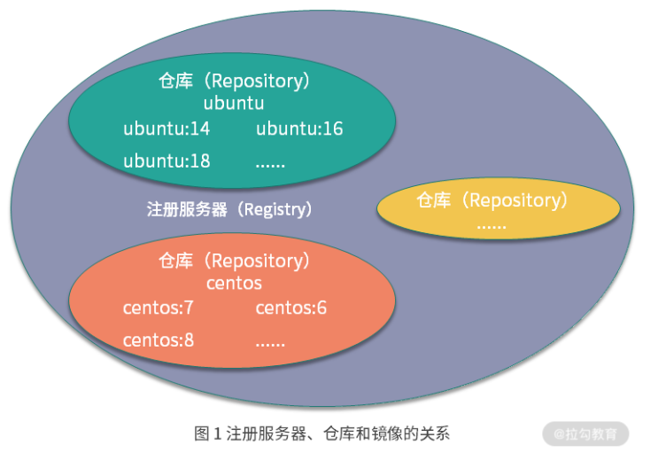
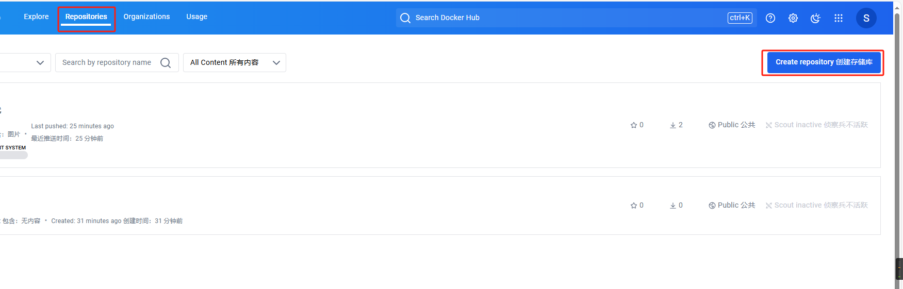
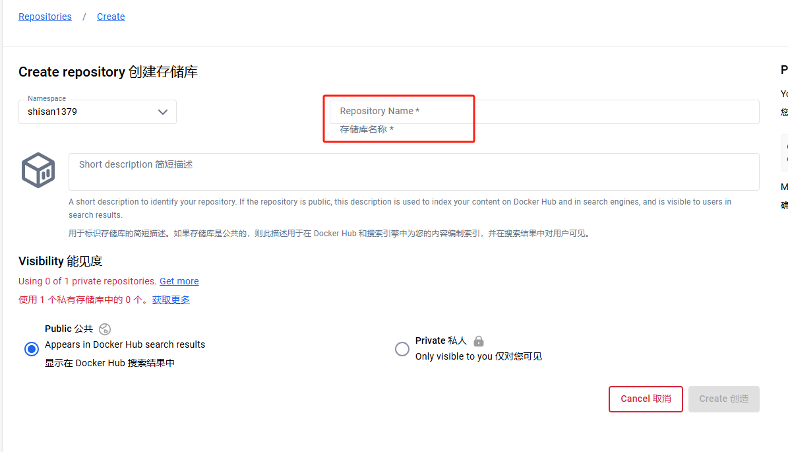
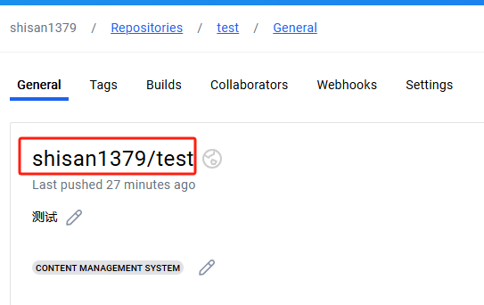

# 仓库

- **仓库(Repository)**： 是存储和分发镜像的地方类似于代码仓库

- **注册服务器(Registry)** : 是存放仓库的服务器



# 使用 Docker Hub 存储镜像


Docker  Hub 官网 <https://hub.docker.com/>

注册后创建仓库

输入仓库名称


其中 `Namespace/RepositoryName` 就是完整的镜像名称，我们在创建镜像时，应使用该名称




## 推送镜像

1. 使用 `docker login` 登录镜像服务器，默认会登录 Docker Hub.
   
   如果要登录其他仓库加上注册服务器地址 `docker login registry.cn-beijing.aliyuncs.com` .
   随后输入用户名，密码，看到`Login Succeeded`表示登录成功
2. 使用 `docker tag` 命令将镜像 **重命名**：
   ```bash
   # 设置 tag 
   docker tag busybox:latest lagoudocker/busybox:1.0
   ```

1. 使用 `docker push` 推送到仓库，`:latest` 代表设置 tag ，当 tag 与仓库中存在的tag 相同时会进行覆盖
   ```bash
   docker push lagoudocker/busybox:latest
   ```

# 搭建私有仓库
Docker 官方提供了开源的镜像仓库 Distribution，并且镜像存放在 Docker Hub 的 Registry 仓库下供我们下载。

```bash
docker run -v /var/lib/registry/data:/var/lib/registry -d -p 5000:5000 --name registry registry
```
## 构建外部可访问的镜像仓库

Docker 官方开源的镜像仓库Distribution仅满足了镜像存储和管理的功能，用户权限管理相对较弱，并且没有管理界面。

如果你想要构建一个企业的镜像仓库，Harbor 是一个非常不错的解决方案。Harbor 是一个基于Distribution项目开发的一款企业级镜像管理软件，拥有 RBAC （基于角色的访问控制）、管理用户界面以及审计等非常完善的功能。目前已经从 CNCF 毕业，这代表它已经有了非常高的软件成熟度。
官网<https://goharbor.io/>