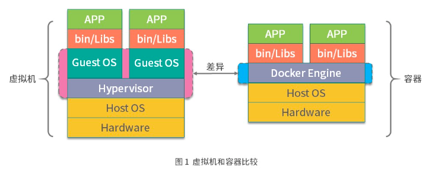

# Docker与虚拟机的区别

**虚拟机：**
虚拟机是通过管理系统(Hypervisor) 模拟出 CPU 、内存、网络等硬件，然后在此基础上创建客户内核和操作系统。

这样的好处就是虚拟机拥有自己的内核和操作系统，并且硬件是虚拟机通过虚拟机管理系统模拟出来的，用户程序无法直接使用宿主机的操作系统和硬件资源，因此对隔离性安全性有很好得保证。

**Docker 容器**：
Docker 容器，则是通过 linux 的 namespace 技术，实现了 文件系统 、 进程 、 设备、 网络资源的隔离， 在通过 Cgroups 对 CPU 、 内存等资源进行限制。最终实现了容器之间相互不影响。由于容器的隔离性仅仅依赖于内核，因此容器的隔离性远弱于虚拟机。

容器与虚拟机相比
1. 隔离性较弱
2. 容器的性能损耗小
3. 容器启动速度快

# Docker容器的安全问题

## Docker 自身安全

Docker 作为一款容器引擎，本身也会存在一些安全漏洞，CVE 目前已经记录了多项与 Docker 相关的安全漏洞，主要有权限提升、信息泄露等几类安全问题。具体 Docker 官方记录的安全问题可以参考这里<https://docs.docker.com/engine/security/non-events/>。

## 镜像安全

影响镜像安全总结如下
1. 镜像使用到的软件存在安全漏洞
2. 仓库漏洞：仓库可能受到攻击，导致镜像本篡改
3. 用户的程序漏洞

## Linux内核隔离性不够

尽管目前 Namespace 已经提供了非常多的资源隔离类型，但是仍有部分关键内容没有被完全隔离，其中包括一些系统的关键性目录（如 /sys、/proc 等），这些关键性的目录可能会泄露主机上一些关键性的信息，让攻击者利用这些信息对整个主机甚至云计算中心发起攻击。

而且仅仅依靠 Namespace 的隔离是远远不够的，因为一旦内核的 Namespace 被突破，使用者就有可能直接提权获取到主机的超级权限，从而影响主机安全。

## 所有容器共享主机内核
由于同一宿主机上的所有容器，都共享内核，所以攻击者可以利用一些特殊手段导致内核崩溃，进而导致主机宕机影响主机上的其他服务

# 如何解决容器的安全问题

## Docker 自身安全性改进

事实上，Docker 从 2013 年诞生到现在，在安全性上面已经做了非常多的努力。目前 Docker 在默认配置和默认行为下是足够安全的。

Docker 自身是基于 Linux 的多种 Namespace 实现的，其中有一个很重要的 Namespace 叫作 User Namespace，User Namespace 主要是用来做容器内用户和主机的用户隔离的。在过去容器里的 root 用户就是主机上的 root 用户，如果容器受到攻击，或者容器本身含有恶意程序，在容器内就可以直接获取到主机 root 权限。Docker 从 1.10 版本开始，使用 User Namespace 做用户隔离，实现了容器中的 root 用户映射到主机上的非 root 用户，从而大大减轻了容器被突破的风险。

因此，我们尽可能地使用 Docker 最新版本就可以得到更好的安全保障。

## 保障镜像安全

1. 与镜像仓库使用HTTPS 通信
2. 在私有仓库中安装镜像扫描组件，对上传的镜像进行检查，通过与CVE数据库对比，发现漏洞
3. 确保仓库是受信任的

## 加强内核安全和管理

1. 宿主机即使升级，安装最新补丁
2. 使用 Capabilities 划分权限