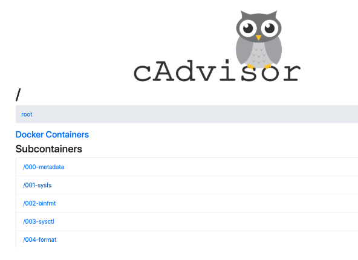
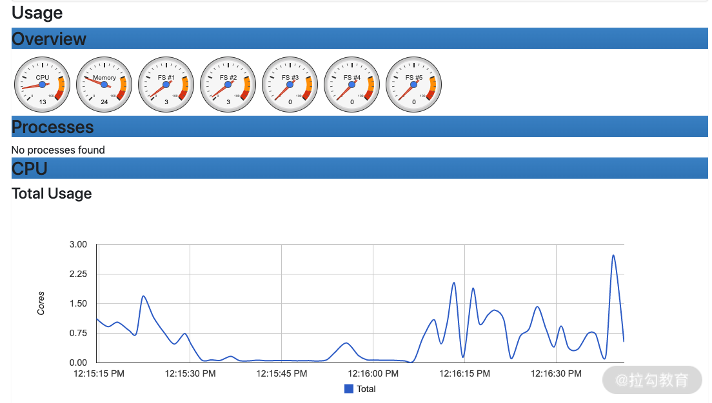
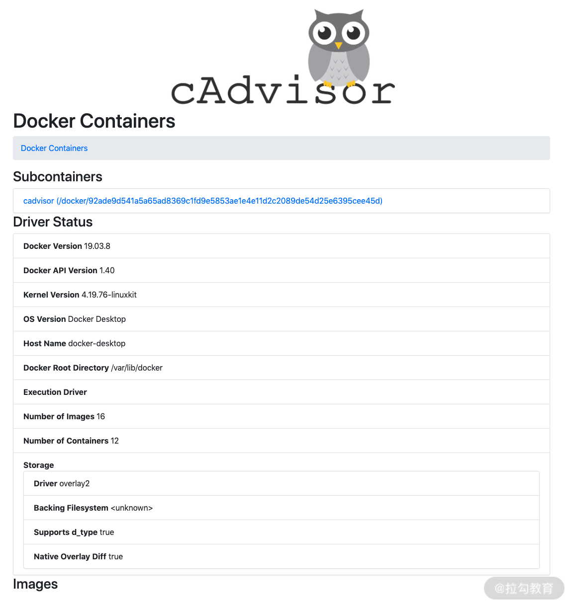

# 使用 docker stats 命令

使用 Docker 自带的docker stats命令可以很方便地看到主机上所有容器的 CPU、内存、网络 IO、磁盘 IO、PID 等资源的使用情况。下面我们可以具体操作看看。


首先在主机上使用以下命令启动一个资源限制为 1 核 2G 的 nginx 容器：


```bash
docker run --cpus=1 -m=2g --name=nginx  -d nginx
```
容器启动后，可以使用docker stats命令查看容器的资源使用状态:

```bash
docker stats nginx

CONTAINER           CPU %               MEM USAGE / LIMIT   MEM %               NET I/O             BLOCK I/O           PIDS

f742a467b6d8        0.00%               1.387 MiB / 2 GiB   0.07%               656 B / 656 B       0 B / 9.22 kB       2

```

从容器的运行状态可以看出，docker stats命令确实可以获取并显示 Docker 容器运行状态。但是它的缺点也很明显，因为它只能获取本机数据，无法查看历史监控数据，没有可视化展示面板。

因此，生产环境中我们通常使用另一种容器监控解决方案 cAdvisor。

# cAdvisor

cAdvisor 是谷歌开源的一款通用的容器监控解决方案。cAdvisor 不仅可以采集机器上所有运行的容器信息，还提供了基础的查询界面和 HTTP 接口，更方便与外部系统结合。所以，cAdvisor很快成了容器指标监控最常用组件，并且 Kubernetes 也集成了 cAdvisor 作为容器监控指标的默认工具。
安装
```bash
docker run \
  --volume=/:/rootfs:ro \
  --volume=/var/run:/var/run:ro \
  --volume=/sys:/sys:ro \
  --volume=/var/lib/docker/:/var/lib/docker:ro \
  --volume=/dev/disk/:/dev/disk:ro \
  --publish=8080:8080 \
  --detach=true \
  --name=cadvisor \
  --privileged \
  --device=/dev/kmsg \
  google/cadvisor
```
此时，cAdvisor 已经成功启动，我们可以通过访问 http://localhost:8080 访问到 cAdvisor 的 Web 界面。



## 使用 cAdvisor 查看主机监控

访问 http://localhost:8080/containers/ 地址，在首页可以看到主机的资源使用情况，包含 CPU、内存、文件系统、网络等资源，如下图所示。



## 使用 cAdvisor 查看容器监控

如果你想要查看主机上运行的容器资源使用情况，可以访问 http://localhost:8080/docker/，这个页面会列出 Docker 的基本信息和运行的容器情况，如下图所示。



# 监控原理

我们知道 Docker 是基于 Namespace、Cgroups 和联合文件系统实现的。其中 Cgroups 不仅可以用于容器资源的限制，还可以提供容器的资源使用率。无论何种监控方案的实现，底层数据都来源于 Cgroups。


`Cgroups` 的工作目录为 `/sys/fs/cgroup` ，`/sys/fs/cgroup` 目录下包含了 `Cgroups` 的所有内容。 `Cgroups` 包含很多子系统，可以用来对不同的资源进行限制。例如对CPU、内存、PID、磁盘 IO等资源进行限制和监控。


为了更详细的了解 Cgroups 的子系统，我们通过 ls -l 命令查看/sys/fs/cgroup文件夹，可以看到很多目录：

```bash
what@localhost:/sys/fs/cgroup$ ll
total 0
drwxr-xr-x 20 root root 400 Sep 18 15:55 ./
drwxr-xr-x 10 root root   0 Sep 18 15:54 ../
dr-xr-xr-x  4 root root   0 Sep 18 15:55 blkio/
dr-xr-xr-x  4 root root   0 Sep 18 15:55 cpu/
drwxr-xr-x  2 root root  40 Sep 18 15:55 cpu,cpuacct/
dr-xr-xr-x  7 root root   0 Sep 18 15:55 cpuacct/
dr-xr-xr-x  7 root root   0 Sep 18 15:55 cpuset/
dr-xr-xr-x 14 root root   0 Sep 18 15:55 devices/
dr-xr-xr-x  7 root root   0 Sep 18 15:55 freezer/
dr-xr-xr-x  7 root root   0 Sep 18 15:55 hugetlb/
dr-xr-xr-x 14 root root   0 Sep 18 15:55 memory/
dr-xr-xr-x  7 root root   0 Sep 18 15:55 misc/
dr-xr-xr-x  7 root root   0 Sep 18 15:55 net_cls/
drwxr-xr-x  2 root root  40 Sep 18 15:55 net_cls,net_prio/
dr-xr-xr-x  7 root root   0 Sep 18 15:55 net_prio/
dr-xr-xr-x  7 root root   0 Sep 18 15:55 perf_event/
dr-xr-xr-x 14 root root   0 Sep 18 15:55 pids/
dr-xr-xr-x  7 root root   0 Sep 18 15:55 rdma/
dr-xr-xr-x 15 root root   0 Sep 18 15:55 systemd/
dr-xr-xr-x 16 root root   0 Sep 18 15:55 unified/
```


这些目录代表了 Cgroups 的子系统，D**ocker 会在每一个 Cgroups 子系统下创建 docker 文件夹.** 例如我们进入 cpu 文件夹

```bash
what@localhost:/sys/fs/cgroup$ cd cpu
what@localhost:/sys/fs/cgroup/cpu$ ll
total 0
dr-xr-xr-x  4 root root   0 Sep 18 15:55 ./
drwxr-xr-x 20 root root 400 Sep 18 15:55 ../
drwxr-xr-x  2 root root   0 Sep 18 15:55 01-docker/
-rw-r--r--  1 root root   0 Sep 18 15:55 cgroup.clone_children
-rw-r--r--  1 root root   0 Sep 18 15:55 cgroup.procs
-r--r--r--  1 root root   0 Sep 18 15:55 cgroup.sane_behavior
-rw-r--r--  1 root root   0 Sep 18 15:55 cpu.cfs_burst_us
-rw-r--r--  1 root root   0 Sep 18 15:55 cpu.cfs_period_us
-rw-r--r--  1 root root   0 Sep 18 15:55 cpu.cfs_quota_us
-rw-r--r--  1 root root   0 Sep 18 15:55 cpu.idle
-rw-r--r--  1 root root   0 Sep 18 15:55 cpu.rt_period_us
-rw-r--r--  1 root root   0 Sep 18 15:55 cpu.rt_runtime_us
-rw-r--r--  1 root root   0 Sep 18 15:55 cpu.shares
-r--r--r--  1 root root   0 Sep 18 15:55 cpu.stat
drwxr-xr-x  3 root root   0 Sep 18 16:03 docker/
-rw-r--r--  1 root root   0 Sep 18 15:55 notify_on_release
-rw-r--r--  1 root root   0 Sep 18 15:55 release_agent
-rw-r--r--  1 root root   0 Sep 18 15:55 tasks
```
会发现里面存在 `docker`  文件夹


## 监控系统是如何获取容器的内存限制的


我们首先在主机上使用以下命令启动一个资源限制为 1 核 2G 的 nginx 容器
```bash
$ docker run --name=nginx --cpus=1 -m=2g --name=nginx  -d nginx

## 这里输出的是容器 ID
51041a74070e9260e82876974762b8c61c5ed0a51832d74fba6711175f89ede1
```

容器启动后，我们通过命令行的输出可以得到容器的 ID，同时 Docker 会在 `/sys/fs/cgroup/memory/docker` 目录下以容器 ID 为名称创建对应的文件夹。

```bash
$ sudo ls -l /sys/fs/cgroup/memory/docker
total 0
drwxr-xr-x 2 root root 0 Sep  2 15:12 51041a74070e9260e82876974762b8c61c5ed0a51832d74fba6711175f89ede1
-rw-r--r-- 1 root root 0 Sep  2 14:57 cgroup.clone_children
--w--w--w- 1 root root 0 Sep  2 14:57 cgroup.event_control
-rw-r--r-- 1 root root 0 Sep  2 14:57 cgroup.procs
-rw-r--r-- 1 root root 0 Sep  2 14:57 memory.failcnt
--w------- 1 root root 0 Sep  2 14:57 memory.force_empty
-rw-r--r-- 1 root root 0 Sep  2 14:57 memory.kmem.failcnt
-rw-r--r-- 1 root root 0 Sep  2 14:57 memory.kmem.limit_in_bytes
-rw-r--r-- 1 root root 0 Sep  2 14:57 memory.kmem.max_usage_in_bytes
-r--r--r-- 1 root root 0 Sep  2 14:57 memory.kmem.slabinfo
-rw-r--r-- 1 root root 0 Sep  2 14:57 memory.kmem.tcp.failcnt
-rw-r--r-- 1 root root 0 Sep  2 14:57 memory.kmem.tcp.limit_in_bytes
-rw-r--r-- 1 root root 0 Sep  2 14:57 memory.kmem.tcp.max_usage_in_bytes
-r--r--r-- 1 root root 0 Sep  2 14:57 memory.kmem.tcp.usage_in_bytes
-r--r--r-- 1 root root 0 Sep  2 14:57 memory.kmem.usage_in_bytes
-rw-r--r-- 1 root root 0 Sep  2 14:57 memory.limit_in_bytes
-rw-r--r-- 1 root root 0 Sep  2 14:57 memory.max_usage_in_bytes
-rw-r--r-- 1 root root 0 Sep  2 14:57 memory.memsw.failcnt
-rw-r--r-- 1 root root 0 Sep  2 14:57 memory.memsw.limit_in_bytes
-rw-r--r-- 1 root root 0 Sep  2 14:57 memory.memsw.max_usage_in_bytes
-r--r--r-- 1 root root 0 Sep  2 14:57 memory.memsw.usage_in_bytes
-rw-r--r-- 1 root root 0 Sep  2 14:57 memory.move_charge_at_immigrate
-r--r--r-- 1 root root 0 Sep  2 14:57 memory.numa_stat
-rw-r--r-- 1 root root 0 Sep  2 14:57 memory.oom_control
---------- 1 root root 0 Sep  2 14:57 memory.pressure_level
-rw-r--r-- 1 root root 0 Sep  2 14:57 memory.soft_limit_in_bytes
-r--r--r-- 1 root root 0 Sep  2 14:57 memory.stat
-rw-r--r-- 1 root root 0 Sep  2 14:57 memory.swappiness
-r--r--r-- 1 root root 0 Sep  2 14:57 memory.usage_in_bytes
-rw-r--r-- 1 root root 0 Sep  2 14:57 memory.use_hierarchy
-rw-r--r-- 1 root root 0 Sep  2 14:57 notify_on_release
-rw-r--r-- 1 root root 0 Sep  2 14:57 tasks
```
可以看到 Docker 已经创建了以容器 ID 为名称的目录，我们再使用 ls 命令查看一下该目录的内容：

```bash
$ sudo ls -l /sys/fs/cgroup/memory/docker/51041a74070e9260e82876974762b8c61c5ed0a51832d74fba6711175f89ede1
total 0
-rw-r--r-- 1 root root 0 Sep  2 15:21 cgroup.clone_children
--w--w--w- 1 root root 0 Sep  2 15:13 cgroup.event_control
-rw-r--r-- 1 root root 0 Sep  2 15:12 cgroup.procs
-rw-r--r-- 1 root root 0 Sep  2 15:12 memory.failcnt
--w------- 1 root root 0 Sep  2 15:21 memory.force_empty
-rw-r--r-- 1 root root 0 Sep  2 15:21 memory.kmem.failcnt
-rw-r--r-- 1 root root 0 Sep  2 15:12 memory.kmem.limit_in_bytes
-rw-r--r-- 1 root root 0 Sep  2 15:21 memory.kmem.max_usage_in_bytes
-r--r--r-- 1 root root 0 Sep  2 15:21 memory.kmem.slabinfo
-rw-r--r-- 1 root root 0 Sep  2 15:21 memory.kmem.tcp.failcnt
-rw-r--r-- 1 root root 0 Sep  2 15:21 memory.kmem.tcp.limit_in_bytes
-rw-r--r-- 1 root root 0 Sep  2 15:21 memory.kmem.tcp.max_usage_in_bytes
-r--r--r-- 1 root root 0 Sep  2 15:21 memory.kmem.tcp.usage_in_bytes
-r--r--r-- 1 root root 0 Sep  2 15:21 memory.kmem.usage_in_bytes
-rw-r--r-- 1 root root 0 Sep  2 15:12 memory.limit_in_bytes
-rw-r--r-- 1 root root 0 Sep  2 15:12 memory.max_usage_in_bytes
-rw-r--r-- 1 root root 0 Sep  2 15:21 memory.memsw.failcnt
-rw-r--r-- 1 root root 0 Sep  2 15:12 memory.memsw.limit_in_bytes
-rw-r--r-- 1 root root 0 Sep  2 15:21 memory.memsw.max_usage_in_bytes
-r--r--r-- 1 root root 0 Sep  2 15:21 memory.memsw.usage_in_bytes
-rw-r--r-- 1 root root 0 Sep  2 15:21 memory.move_charge_at_immigrate
-r--r--r-- 1 root root 0 Sep  2 15:21 memory.numa_stat
-rw-r--r-- 1 root root 0 Sep  2 15:13 memory.oom_control
---------- 1 root root 0 Sep  2 15:21 memory.pressure_level
-rw-r--r-- 1 root root 0 Sep  2 15:21 memory.soft_limit_in_bytes
-r--r--r-- 1 root root 0 Sep  2 15:21 memory.stat
-rw-r--r-- 1 root root 0 Sep  2 15:21 memory.swappiness
-r--r--r-- 1 root root 0 Sep  2 15:12 memory.usage_in_bytes
-rw-r--r-- 1 root root 0 Sep  2 15:21 memory.use_hierarchy
-rw-r--r-- 1 root root 0 Sep  2 15:21 notify_on_release
-rw-r--r-- 1 root root 0 Sep  2 15:21 tasks
```

由上可以看到，容器 ID 的目录下有很多文件，其中 memory.limit_in_bytes 文件代表该容器内存限制大小，单位为 byte，我们使用 cat 命令（cat 命令可以查看文件内容）查看一下文件内容：


```bash
$ sudo cat /sys/fs/cgroup/memory/docker/51041a74070e9260e82876974762b8c61c5ed0a51832d74fba6711175f89ede1/memory.limit_in_bytes

2147483648
```

这里可以看到memory.limit_in_bytes 的值为2147483648，转换单位后正好为 2G，符合我们启动容器时的内存限制 2G。

## 监控系统是如何获取容器的内存使用状态的？

内存使用情况存放在 memory.usage_in_bytes 文件里，同样我们也使用 cat 命令查看一下文件内容:
```bash
$ sudo cat /sys/fs/cgroup/memory/docker/51041a74070e9260e82876974762b8c61c5ed0a51832d74fba6711175f89ede1/memory.usage_in_bytes

4259840
```

## 网络的监控数据来源
网络的监控数据来源是从 /proc/{PID}/net/dev 目录下读取的，其中 PID 为容器在主机上的进程 ID。下面我们首先使用 docker inspect 命令查看一下上面启动的 nginx 容器的 PID，命令如下：
```bash
$ docker inspect nginx |grep Pid

            "Pid": 27348,
            "PidMode": "",
            "PidsLimit": 0,
```

可以看到容器的 PID 为 27348，使用 cat 命令查看一下 /proc/27348/net/dev 的内容：

```bash
$ sudo cat /proc/27348/net/dev

Inter-|   Receive                                                |  Transmit

 face |bytes    packets errs drop fifo frame compressed multicast|bytes    packets errs drop fifo colls carrier compressed

    lo:       0       0    0    0    0     0          0         0        0       0    0    0    0     0       0          0

  eth0:       0       0    0    0    0     0          0         0        0       0    0    0    0     0       0          0
```

/proc/27348/net/dev 文件记录了该容器里每一个网卡的流量接收和发送情况，以及错误数、丢包数等信息。可见容器的网络监控数据都是定时从这里读取并展示的。

总结一下，容器的监控原理其实就是定时读取 Linux 主机上相关的文件并展示给用户。