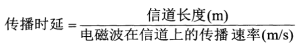

# 一个简单的网络

网络(Network) 由若干节点(Node) 和 链路组成。网络中的节点可以是计算机、集线器、交换机或者路由器等。

多个小的网络，通过 **路由器** 互联起来，就构成了一个覆盖范围更大的网络。称之为 **互联网（internetwork 或 internet）**

**因特网（Internet）** 是世界上最大的互联网络

# 因特网发展的三个阶段

因特网的基础结构大致经历了如下三个阶段的演进：

**第一阶段**：1969年出现了美国军用计算机网ARPANET(“阿帕网”)，也就是今天互联网的雏形。数据集中式处理，数据处理和通信处理都是通过主机完成。

当时的阿帕网仅连接四个结点，传输速率低，因为当时的计算机图形界面没有发展起来，信息的只能通过文字终端进行展示，没应用场景。

1969年四个节点的分布位置。分别是：

- 加州大学洛杉矶分校 --- UCLA
- 加州大学圣巴巴拉分校 --- UCSB
- 斯坦福研究所 ---SRI
- 犹他大学 --- Utah

**1983年，TCP/IP协议**成为ARPANET的标准协议，因此人们将1983年认为是Internet的诞生时间。

**第二阶段：建成了三级结构的互联网**。从1985 年起，美国国家科学基金会NSF(National Science Foundation)就围绕六个大型计算机中心建设计算机网络，即国家科学基金网NSFNET，它是一个三级计算机网络，分为主干网、地区网和校园网(或企业网)。这种三级计算机网络覆盖了全美国主要的大学和研究所，并且成为互联网中的主要组成部分。1991年，NSF和美国的其他政府机构开始认识到，互联网必将扩大其使用范围，不应仅限于大学和研究机构。世界上的许多公司纷纷接入到互联网，网络上的通信量急剧增大，使互联网的容量已满足不了需要。于是美国政府决定将互联网的主干网转交给私人公司来经营,并开始对接入互联网的单位收费。1992 年互联网上的主机超过100 万台。1993 年互联网主干网的速率提高到45 Mbit/s (T3 速率)。

**第三阶段：逐渐形成了多层次ISP结构的互联网**。从1993 年开始，由美国政府资助的NSFNET逐渐被若千个商用的互联网主干网替代，而政府机构不再负责互联网的运营。这样就出现了-一个新的名词：**互联网服务提供者ISP (Internet Service Provider)**。在许多情况下，ISP 就是一个进行商业活动的公司，因此ISP又常译为互联网服务提供商。例如，中国电信、中国联通和中国移动等公司都是我国最有名的ISP。

**互联网服务提供者ISP (Internet Service Provider)**：
ISP可以**从互联网管理机构申请到很多IP 地址**（互联网上的主机都必须有IP地址才能上网），同时拥有通信线路(大ISP自己建造通信线路，小ISP则向电信公司租用通信线路)以及路由器等连网设备，因此任何机构和个人只要向某个ISP交纳规定的费用，就可从该ISP获取所需IP地址的使用权，并可通过该ISP接入到互联网。

根据提供服务的覆盖面积大小以及所拥有的IP地址数目的不同，ISP也分为不同层次
的ISP：**主干ISP、地区ISP和本地ISP**（从层次关系上我们也称为第一层ISP、第二层ISP、本地ISP）。
- **主干ISP**由几个专门的公司创建和维持，服务面积最大(一般都能够覆盖国家范围),并且还拥有高速主干网(例如10 Gbit/s 或更高)。有一些地区ISP网络也可直接与主干ISP相连。
- **地区ISP**是一些较小的ISP。这些地区ISP通过-一个或多个主干ISP连接起来。它们位于等级中的第二层，数据率也低一些。
- **本地ISP** 给用户提供直接的服务(这些用户有时也称为端用户，强调是末端的用户)。本地ISP可以连接到地区ISP，也可直接连接到主干ISP。 绝大多数的用户都是连接到本地ISP的。本地ISP可以是一个仅仅提供互联网服务的公司，也可以是一个拥有网络并向自己的雇员提供服务的企业，或者是一个运行自己的网络的非营利机构(如学院或大学)。本地ISP可以与地区ISP或主干ISP连接。

# 因特网的组成

## 功能划分

因特网的拓扑结构虽然非常复杂，并且在地理上覆盖了全球，但从功能上看。可以划分为以下两部分。

- **边缘部分**： 是由所有连接在互联网上的**主机**主城的，用来进行通信
  - 电脑
  - 手机
  - 服务器
  - 摄像头

- **核心部分**： 由大量的路由器构成，为边缘部分提供服务

### 边缘部分

1. 处在因特网边缘的部分就是连接在因特网上的所有的主机。这些主机又称为端系统(end system)。

2. “主机 A 和主机 B 进行通信”，实际上是指：“运行在主机 A 上的某个程序和运行在主机 B 上的另一个程序进行通信”。

3. 即“主机 A 的某个进程和主机 B 上的另一个进程进行通信”。或简称为“计算机之间通信”

4. 在网络边缘的端系统中运行的程序之间的通信方式通常可划分为两大类：
   - 客户端服务器方式（CS） ： 一个作为服务器，提供服务、一个作为客户端请求服务
  
   - 对等方式（P2P）： 这种方式每一端都是服务请求方又是服务提供方，双方都可以交换自己的资源
   - P2P 网络技术体现在以下几个方面
     - **去中心化**： 网络中的所有资源都分散在所有节点上，信息的传输和服务的实现直接在节点之间进行。
     - **健壮性**： ：P2P架构天生具有耐攻击、高容错的优点。由于服务是分散在各个节点之间进行的，部分节点或网络遭到破坏对其它部分的影响很小。
     - 高性价比：性能优势是P2P被广泛关注的一个重要原因。采用P2P架构可以有效地利用互联网中散布的大量普通结点，将计算任务或存储资料分布到所有节点上。利用其中闲置的计算能力或存储空间，达到高性能计算和海量存储的目的。
     - 隐私保护：在P2P网络中，由于信息的传输分散在各节点之间进行而无需经过某个集中环节，用户的隐私信息被窃听和泄漏的可能性大大缩小。

### 核心部分

1. 在网络核心部分其特殊作用的是路由器
   

2. 三种交换方式
   - 电路交换（Circuit Switching） : 电话交换机接通电话线的方式称为电路交换
    
        

        电话交换机：可以把电话交换机简单地看成是一个有多个开关的开关器，可以将需要通信的任意两部电话的电话线路按需接通，从而大大减少了连接的电话线数量

        从通信资源的分配角度来看，交换(Switching)就是按照某种方式动态地分配传输线路的资源;

        电路交换的三个步骤

        - 建立连接（分配通信资源）
        - 通话（占用资源）
        - 释放连接
        
        

        电路交换的缺点：当用户正在输入和编辑一份待传输的文件时，用户所与用的通信资源暂时未被利用，该通信资源也不能被其他用户利用，宝贵的线路资源就被白白浪费掉了，**因此电路交换的传输效率非常低，不适用于计算机和计算机之间的通信**。
   - 报文交换
   - 分组交换（Packet Switching）: 路由器是实现分区交换的关键构件，任务是转发收到的分组，这是网络核心最重要的功能。
     - 分组交换采用**存储转发技术**，即将一个报文划分为几个分组后在进行传送，这些分组可能通过的不是同样的路径，当接收端收到后在进行组合，并且进行差错校验，保证报文的完整性和准确性。
     

三种方式对比

- 电路交换：
  

  - 优点： 
    - 通信延时小
    - 有序传播
    - 没有冲突
    - 实时性强
    - 控制简单
  - 缺点
    - 建立连接时间长
    - 独占线路，使用效率低
    - 灵活性差
    - 难以规格化
    

- 报文交换：
    

  - 优点
    - 无需建立连接
    - 动态分配线路
    - 提高线路利用率
    - 提供多目标服务
  - 缺点
    - 引起了转发时延
    - 需要较大的缓存空间
    - 需要传输额外的信息

- 分区交换
  
  - 优点
    - 无需建立连接
    - 线路利用效率高
    - 简化了存储管理
    - 加速传输
    - 减少了出错概率和重发数据量
  - 缺点
    - 引起了转发延时
    - 需要额外传输信息

# 计算机网络的分类

## 按照网络的作用范围进行分类

1. 广域网（Wide Area Network） ： 广域网的作用范围通常为几十到几千公里。广域网是互联网的核心组成部分，其任务是通过长距离，运送主机所发送的数据。连接广域网各节点交换机的链路一般都是高速链路，具有较大的通信容量。
   
2. 城域网（Metropolitan Area Network） ： 城域网的作用范围一般是一个城市，可跨越几个街区甚至整个城市，作用距离约为 5 ~ 50km。

3. 局域网（Local Area Network） 
4. 个人局域网（Personal Area Network）

## 按照网络的线路结构进行分类

### 星型

星型拓扑结构是目前局域网普遍采用的一种拓扑结构

星型拓扑结构是用一个节点作为中心节点，其他节点直接与中心节点相连接构成的网络。中心节点一般是连接设备，常见的中心节点为路由器。

星型拓扑结构属于集中型控制网络，各个节点通信都要经过中心节点，到达目的节点。

优点
- 控制简单，任何单一站点只和中心节点相连接，易于网络监控和管理
- 故障诊断和隔离容易，中央节点对连接线路可以逐一隔离和故障定位，单个连接点故障只影响一个设备
- 方便服务，中央节点可以方便的对各个节点提供服务和网络配置

缺点
- 需要耗费大量的线缆，安装维护的工作量也骤增
- 中央节点负担重，容易形成瓶颈，一旦发生故障，则全网收到影响
- 各个站点的分布处理能力较低

### 总线型

总线型网络拓扑结构中所有设备都直接与总线相连接，它所采用的介质一般也是同轴电缆或光缆

总线结构是指各个设备都挂在一条总线上，各设备地位平等，无中心节点控制，公用总线上的信息多以基带形式串行传递，其传递方向是从发送信息的节点开始向两端扩散，如同广播电视台发射的信息一样，因此又称作是广播式计算机网络。各设备在接收信息时进行地址检查，如果与自己的地址相符则接收数据。

总线型网络特点如下：
- **结构简单**： 各网络通过简单的搭线器即可联通
- 走线量小
- 成本低： 无需路由设备
- 扩充灵活： 增加搭线器即可
- 故障诊断和隔离比较困难
- 易于发生数据碰撞

### 环型

环型结构，中的链路首尾相连形成一个闭合的环。数据在环路中沿着一个方向在各个节点中传输，信息从一个节点传递到另一个节点。

这种结构的网络形式主要用于令牌网中，在这种网络结构中各设备是直接通过电缆来串接的，最后形成一个闭环，整个网络发送的信息就是在这个环中传递，通常把这类网络称之为"令牌环网"。

**什么是令牌环？**

令牌环网的媒体接入控制采用的是分布式控制模式的循环方法，**在令牌网中有一个令牌（Token）沿着环型总线以逆时针方向在入网节点计算机间依次传递**。
令牌实际上是一个特殊格式的帧，本身不包含信息，仅控制信道的使用，确保在同一时刻只有一个节点能够独占信道。
当环上节点都空闲时，令牌绕环行进。节点计算机在取得令牌后才能发送数据帧，因此不会发生碰撞。
由于令牌在网环上是按照顺序传递的因此对于所有入网计算机而言，访问权是公平的。

令牌在工作中有 闲 和 忙 两种状态。 希望传送数据的计算机，必须首先监测到闲状态的令牌，然后将它置为忙，然后在该令牌后面传送数据，当数据被接收后，数据从网中除去，令牌重新置为闲

### 网状型

网状拓扑结构，这种拓扑结构主要指各节点通过传输线互联连接起来，并且每一个节点至少与其他两个节点相连，网状拓扑结构具有较高的可靠性，但其结构复杂，实现起来费用较高，不易管理和维护，不常用于局域网

**优点**
- 网络可靠性高，一般通信子网中任意两个节点交换机之间，存在着两条以上的通信路径，这样当一条路径发生故障时，还可以通过另一条把信息送至节点交换机
- 网络可组建成各种形状，采用多种通信信道，多种传输速率
- 可选择最佳路径，传输延迟小

**缺点**
- 控制复杂，软件复杂
- 线路费用高，不宜扩充
- 在以太网中，如果设置不当，会造成广播风暴，严重时可以使得网络完全瘫痪

# 计算机网络的性能指标

常用的计算机网络的性能指标有7个： 速率 、 带宽 、 吞吐量 、 时延 、 往返时间、 利用率 、 丢包率

## 速率

计算机发送的信号是以二进制数字形式的。
一个二进制数字就是一个比特（bit， binary digit）
字节：Byte， 1Byte = 8bit (1B = 8b)
字节：字节，1Byte = 8bit （1B = 8b）

速率：连接在计算机网络上的主机在数字信道上传送比特数据的速率，也称为比特率或数据率。就是每秒发送数据的量

## 带宽

在计算机网络中，带宽用来表示网络中某通道传送数据的能力，因此网络带宽表示在单位时间内网络中的某信道所能通过的“最高数据率”
单位：b/s (kbs, Mb/s, Gb/s, Tb/s)
单位：b/s （kbs， Mb/s， Gb/s， Tb/s）
宽带的带宽是100兆：出口网速最高100Mb/s

## 吞吐量

吞吐量表示在单位时间内通过某个网络(或信道、接口)的数据量

吞吐量被经常用于对现实世界中的网络的一种测量，以便知道实际上到底有多少数据量能够通过网络。

吞吐量受网络的带宽或额定速率的限制

注意吞吐量和带宽的区别：带宽指的是最大的传输速度，而吞吐量指的是实际传输速度

## 时延

时延(delay或latency)是指数据（一个报文或分组，甚至比特）从网络（或链路）的一端传送到另一端所需的时间。时延是个很重要的性能指标，它有时也称为延迟或迟延。

网络中的时延是由以下几个不同的部分组成的

**发送时延**

主机或路由器发送数据帧所需要的时间，也就是从发送数据帧的第一个比特算起，到该帧的最后一个比特发送完毕所需的时间。
发送时延的计算公式为：

**传播时延**
电磁波在信道中传播一定的距离需要花费的时间
传播时延的计算公式：

各介质的传播速度：

**处理时延**

处理时延指的是主机或者路由器在收到分组信息时花费的时间。例如分析分组的首部、从分组中提取数据部分、查找适当的路由等。

## 往返时间

RTT(Round-Trip Time)往返时间在计算机网络中它是一个重要的性能指标。表示从发送端将数据发送到传输媒介开始，到发送端收到来自接收端的确认总共经历的时间（不包含发送时延）。
RTT由三个部分决定：链路的传播时间、末端系统的处理时间、路由器的缓存中的排队和处理时间。其中前两个部分的值作为一个TCP连接相对固定，路由器的缓存中的排队和处理时间会随着整个网络拥塞程度的变化而变化。所以RTT的变化在一定程度上反映了网络拥塞程度的变化。

## 利用率

利用率有信道利用率和网络利用率两种。

根据排队论，当某信道的利用率增大时，该信道引起的时延也会迅速增加。
如果令Do表示网络空闲时的时延，D表示网络当前的时延，那么在适当的假定条件下，可以用下面的简单公式来表示D、Do和利

用率U之间的关系为：

- 这里U是网络的利用率，数值在0到1之间；
- 当网络的利用率达到50%时，时延就要加倍;当网络的利用率超过50%时，时延急剧增大；
- 当网络的利用率接近100%时，时延就趋于无穷大；
- 因此，一些拥有较大主干网的ISP通常会控制它们的信道利用率不超过50%。如果超过了，就要准备扩容，增大线路的带宽；

因此，信道利用率并非越高越好

## 丢包率

丢包率即分组丢失率，是指在一定的时间范围内，传输过程中丢失的分组数量与总分组数量的比率。
丢包率是网络运维人员非常关心的一个网络性能指标，但对于普通用户来说往往并不关心这个指标，因为他们通常意识不到网络丢包。
分组丢失主要有两种情况:
分组在传输过程中出现误码，被结点丢弃

- 分组在传输过程中出现误码，被结点丢弃
- 分组到达一台队列已满的分组交换机时被丢弃;在通信量较大时就可能造成网络拥塞