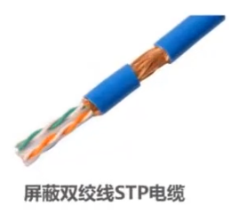
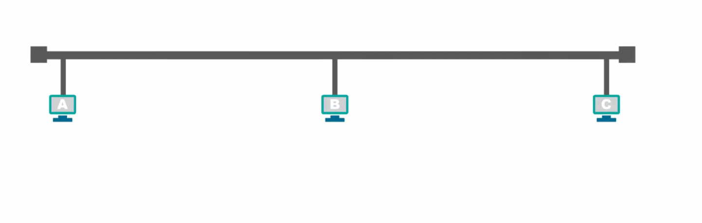

# 常用的计算机网络体系结构

## OSI体系结构

为了使不同体系结构的计算机网络都能够互联，国际标准化组织于1977年成立了专门机构研究该问题，不久他们就提出了一个试图使各种计算机在世界范围内都能够互连成网的标准框架，也就是著名的“开放系统互连参考模型”，简称为OSI，OSI体系结构有时候我们也称之为OSI模型。

OSI是一个七层协议的体系结构：从下往上依次是物理层、数据链路层、网络层、运输层、会话层、表示层、应用层。

OSI试图达到一种理想境界，即全球计算机网络都遵循这个统一标准，因而全球的计算机将能够很方便地进行互连和交换数据。在20世纪80年代，许多大公司甚至一些国家的政府机构纷纷表示支持OSI。当时看来似乎在不久的将来全世界一定会按照OSI制定的标准来构造自己的计算机网络。

然而到了20世纪90年代初期，虽然整套的OSI国际标准都已经制定出来了，但由于基于TCP/IP 的互联网已抢先在全球相当大的范围成功地运行了，而与此同时却几乎找不到有什么厂家生产出符合OSI标准的商用产品。因此人们得出这样的结论：OSI 只获得了一些理论研究的成果，但在市场化方面则事与愿违地失败了。

现今规模最大的、覆盖全球的、基于TCP/IP的互联网并未使用OSI标准。

## 具有五层协议的体系结构

TCP/IP是一个四层的体系结构，它包含**应用层、运输层、网际层和网络接口层**（用网际层这个名字是强调这一层是为了解决不同网络的互连问题）。

OSI的七层协议体系结构概念清楚，理论也比较完整，但是太过于复杂不实用。TCP/IP体系结构不同，但是现在却得到了非常广泛的应用。

在学习计算机网络的原理时往往采取折中的办法，即综合OSI和TCP/IP 的优点，采用一种只有五层协议的体系结构，这样既简洁又能将概念阐述清楚。有时为了方便，也可把最底下两层称为网络接口层。

**应用层（application layer）**
> 应用层是体系结构中的最高层。应用层的任务时通过应用程序间的交互来完成特定的网络应用。**应用层协议**是应用进程间的通信的规则。对于不同的网络应用需要不同的协议。在互联网上应用层协议非常多，如： 系统域名DNS 、 HTTP协议 、 电子邮件的SMTP协议 等。 我们把应用层中交换的数据单元叫做 **报文(Message)**

**运输层（transport layer）**
> 运输层的任务就是负责向 **两台主机中进程之间的通信提供通用的数据传输服务**
运输层主要有以下两种协议
    1. **传输控制协议TCP（Transmission Control Protocol）**： 提供面向连接的、可靠的数据传输服务
    2. **用户数据协议UDP（User Datagram Protocol）**：提供无连接的，尽最大努力的数据传输服务（不保证数据的可靠性）

**网络层（network layer）**
> 主要作用是，**实现两个网络系统之间数据透明传输**，具体包括**路由选择。拥塞控制盒网际互联等**
> 在发送数据时，网络层把运输层产生的报文或用户数据分组并封包后进行传送。在 TCP/IP 体系中，由于网络层使用IP协议，因此分组也叫做 IP数据报 ，简称数据报
> 数据在经过网络层时会加上IP协议的头部

**数据链路层（data  link layer）**
> 两台主机之间的数据，总是在一段一段的链路上传送的，这就需要使用专门的链路层协议。在两个相邻的节点之间传送数据时，数据链路层将网络层交下来的 IP 数据组装成 **帧（framing）** ，在两个相邻节点的链路上传送帧

**物理层（physical layer）**
> 利用传输介质为数据链路层提供物理连接，实现比特流的透明传输
> **物理层上所传输的数据单位是 比特 bit**

1. 发送方-应用层 - 用户A发送报文
2. 发送方-传输层 - 在头部增加 TCP/UDP 包首部分
3. 发送方-网络层 - 在头部增加 IP包 部分
4. 发送方-数据链路层 - 在头部增加以太网网包首部（用于两个网络间的数据传送、路由选择、网际互联等）
5. 发送方-物理层 - 通过以太网电/光缆发送
6. 接收方-物理层 - 通过以太网电/光缆接收
7. 接收方-数据链路层 - 解析以太网首部
8. 接收方-网络层 - 解析 IP 包首部，并识别上一层为TCP
9. 接收方-传输层 - 解析 TCP 包首部
10. 接收方-应用层 - 用户B接收报文

# 物理层

物理层主要解决在**各种传输媒体上传输比特0和1的问题**，进而给数据链路层提供透明传输比特流的服务

由于传输媒体的种类太多（例如同轴电缆、光纤、无线电波等），物理连接方式也有很多例如点对点连接、广播连接等，因此物理层协议种类也比较多。但是物理层为了解决在各种传输媒体上传输比特0和1的问题，无论是那种物理层协议都需要满足主以下四个任务：

1. 机械特性： 指明接口所用接线器的**形状** 和尺寸，引脚数目和排列、固定和锁定装置
2. 电气特性：指明在接口电缆的各条线上出现的电压范围
3. 功能特性：指明某条线上出现的不同电平表示何种意义
4. 过程特性：指明对于不同功能的各种事件的出现顺序

### 传输媒体

#### 导引型传输媒体

**同轴电缆**

可以从上图看出同轴电缆的各层都是共圆心的，也就是同轴心的
同轴电缆有两种：
- 基带同轴电缆：数字传输，过去用于局域网
- 宽带同轴电缆：模拟传输，目前主要用于有线电视

同轴电缆价格较贵且布线不够灵活和方便，随着集线器的出现，在局域网领域基本上都是采用双绞线作为传输媒体

**双绞线**

双绞线是最常用的传输媒体，把两根互相绝缘的铜导线放在一起，然后按照一定规则绞合起来就构成了双绞线。

常用的双绞线包含八根铜导线，每两根绞合成一条双绞线，绞合组合如下：
- 蓝色线和蓝白双色线绞合
- 橙色线和橙白双色线绞合
- 绿色线和绿白双色线绞合
- 棕色先和棕白双色线绞合

绞合的作用：
- 抵御部分来自外界的电磁干扰
- 减少相邻导线的电磁干扰

根据有无屏蔽层，双绞线分为：无屏蔽双绞线和屏蔽双绞线

- 无屏蔽
  
- 屏蔽双绞线：在双绞线与外层绝缘封套之间有一个金属屏蔽层
  

常用的绞合线类别、带宽及典型应用

光纤

光纤的优点
- 通信容量大(25000~30000GHz的带宽)
- 传输损耗小，远距离传输时更加经济。
- 抗雷电和电磁干扰性能好。这在大电流脉冲干扰的环境下尤为重要。
- 无串音干扰，保密性好，不易被窃听。
- 体积小，重量轻。

#### 非导引型传输媒体：非导引型传输媒体是指自由空间

- 无线电波
- 微波
- 红外线
- 可见光

# 数据链路层

## 数据链路层在网络体系结构中所处的地位

主机H1给主机H2发送数据，中间要经过三个路由器、电话网、局域网、广域网等多种网络。

详细过程如下

要发送的数据按照逐层进行传递。

当我们研究数据链路层时，我们可以只关心数据链路层，而不考虑其他各层。我们可以想象，数据只在数据链路层从左至右沿水平方向传送。从数据链路层来看，主机H1到主机H2 的通信可以看作是在4段不同的链路上的通信所组成的。

所谓的**链路(Link)就是从一个结点到相邻结点的一段物理线路，而中间没有任何其他的交换结点。要在链路上传输数据，仅有链路还不够，还需要一些通信协议来控制这些数据的传输，如果把实现这些协议的硬件和软件加到链路上就构成了数据链路（Data Link）**

在数据链路上传输的数据包，又称为帧。（数据链路层是以帧作为单位传输和处理的）

> 注意：结点就是网络中的一台主机。

数据链路层的协议有很多种，但是有三个基本问题是共同的。这三个基本问题就是：封装成帧、透明传输和差错检测。

## 封装成帧

封装成帧是指数据链路层给上层交付的协议数据单元添加帧头和帧尾使之成为帧。

**帧头和帧尾中包含有重要的控制信息**

帧头和帧尾的作用之一就是帧定界，例如：PPP帧的第一个字节和最后一个字节就是帧定界，通过这两个字节就能够从物理层交付的比特流中提取出一个一个的帧。

**并不是每种数据链路层协议的帧都包含有帧定界标志**，例如MAC帧在帧头和帧尾中是没有包含帧定界的标志的， 那么接收方是如何从物理层交付的比特流中提取出一个个的以太网帧的呢？

- 第一步：数据链路层封装好MAC帧，将其交付给物理层
- 第二步：物理层在MAC帧的前面添加8字节的前导码，前导码的前7个字节为前同步码，其作用是使接收方的时钟同步，之后的1个字节为帧开始定界符，表明其后紧跟着的就是MAC帧。

## 透明传输

透明传输是指数据链路层对上层交付的传输数据没有任何限制，就好像数据链路层不存在一样。

当使用透明传输时，数据帧中的数据是帧定界标志时，发送端的数据链路层如何处理？

**情况一：当物理链路提供的是面向字符流的传输服务时（物理链路以字符为单位传输数据）**

解决方式：数据链路层在交付给物理层时，会对帧进行扫描，首先扫描到 `SOH` ，然后将每扫描到一个 `SOH` 和 `EOT` 就在前面加上转义字符 `ESC` ，直到扫描到最后一个 `EOT`。这种方式称之为 ： `字节填充（byte stuffing）` 或 `字符填充（character stuffing）`

**情况二：当物理链路提供的是面向比特的传输服务时（物理链路以比特为单位传输数据）**

在数据发送钱采用 **比特填充法** ：对数据进行扫描，每五个连续的比特1后面就插入一个 比特0.

为了提高帧的传输效率，应当使帧的数据部分的长度尽可能大些。

考虑到差错控制等多种因素。每一种数据链路层协议都规定了帧的数据部分的长度上限，即最大传送单元 **MTU（Maximum Transfer Unit）**

## 差错校验

实际的通信链路都不是理想的，比特流在传输过程中由于受到各种干扰可能会产生差错: 1可能会变成0,而0也可能变成1。这称为比特差错，或者称为误码。

一段时间内，传输错误的比特占所传输比特总数的比率称为**误码率（Bit Error Rate）**

、在封装好的帧中利用若干个字节表示帧校验序列FCS字段。FCS :Frame Check Sequence(帧校验序列)。FCS字段由一些差错校验算法计算得出，常用的校验算法为：循环冗余校验CRC(Cyclic Redundancy Check)。

接收方在接收到数据后计算出一个FCS，然后将计算得出的FCS与接收到的数据帧中的FCS进行比较。

由于判断FCS是否正确只能检测出帧在传输过程中出现了差错，但并不能定位错误，因此无法纠正错误。接收方可以通过检错重传方式来纠正传输中的差错,或者仅仅是丢弃检测到差错的帧，这取决于数据链路层向其上层提供的是可靠传输服务还是不可靠传输服务。

## 以太网

**以太网是一种计算机局域网技术**。IEEE（电气与电子工程师协会：Institute of Electrical and Electronics Engineers）组织的**IEEE 802.3标准**制定了以太网的技术标准，它规定了包括物理层的连线、电子信号和介质访问层协议的内容。**以太网是应用最普遍的局域网技术**，取代了其他局域网技术如令牌环、FDDI和ARCNET。

以太网是一种有线系统，最初使用**同轴电缆**进行数据传输，后来发展到使用**双绞线**和**光纤**并延续至今。

### 以太网的两个标准

- 1980年9月，DEC公司、英特尔(Intel)公司和施乐公司联合提出了10 Mbit/s 以太网规约的第一个版本DIX V1(DIX是这三个公司名称的缩写)。
- 1982年又修改为第二版规约（实际上也就是最后的版本)，即DIX Ethernet V2，成为世界上第一个局域网产品的规约。
- 1983年，IEEE 802委员会的802.3工作组制定了第一个IEEE的以太网标准IEEE 802.3[W-IEEE802.3]，数据率为10 Mbit/s。以太网的两个标准 DIX Ethernet V2与IEEE的802.3标准只有很小的差别，因此很多人也常把802.3局域网简称为"以太网"。IEEE 802委员会的介绍（引用自《计算机网络-谢希仁》）
  

- **IEEE 802.3 定义了以太网的物理层和数据链路层的介质访问控制部分**，其中物理层由两个组件组成：**线缆**和**设备**，数据链路层可以分为两部分：**逻辑链路控制（LLC）**、**介质访问控制（MAC）**。
  

### 物理层

线缆： 以太网的通信线缆由同轴电缆，发展到今天的双绞线和光纤

双绞线两端配有 **RJ45** 八针连接器，这种八针连接器用于在半双工和全双工模式下进行数据的发送和接收。

**半双工模式**： 数据一次沿一个方向传输

**全双工模式**： 两组数据沿两个方向进行传输，以太网的全双工模式可以通过一对双绞线实现。

光纤线缆，使用的是 **玻璃光纤** 或 **塑料光纤** ，作为光脉冲的传输通道来传输数据

光纤电缆可以根据实际需求使用不同类型的连接器：SFP连接器、SC连接器

以太网设备
> 以太网设备由计算机、打印机等具有网络接口卡的设备所组成，常用的以太网设备有，路由器 、 交换机 、 网桥 ，而工作在数据链路层的设备有 交换机 、 网桥 ，路由器工作在五层体系结构中的网络层

### 数据链路层

**逻辑链路控制LLC**： 为网络层提供统一的接口，以便数据在设备间传输，很多厂商生产的适配器上就仅仅有 MAC 协议，而没有LLC 协议

**介质访问控制MAC**： 使用分配给网络接口卡的硬件地址来标识特定的计算机或设备接口，通过这种方式来表示数据传输的源地址和目的地址。

## 以太网的MAC层

### MAC 层的硬件地址

**MAC地址（Media Access Control Address）**： 直译为**媒体存取控制地址**，也称之为 **局域网地址（LAN Address）** 、 MAC位址 、以太网地址（Ethernet）或物理地址（Physical Address）， 它是一个用来确认网络设备位置的地址。

IEEE 802标准为局域网规定了一种48位（6字节）的全球地址（一般简称为“地址”），这个地址会固化在适配器的ROM中。

IEEE 的注册管理机构 RA 负责向厂家分配地址字段的前三个字节(即高位 24 位)。地址字段中的后三个字节(即低位 24 位)由厂家自行指派，称为扩展标识符，必须保证生产出的适配器没有重复地址。世界上凡要生产局域网适配器的厂家都必须向IEEE购买由这三个字节构成的这个号（即地址块)，这个号的正式名称是组织唯一标识符。

> 例如，3Com公司生产的适配器的MAC地址的前三个字节是 02-60-8C。地址字段中的后三个字节（即低位24位）则由厂家自行指派，只要保证生产出的适配器没有重复地址即可

一个地址块可以生成2^24个（二百八十多万亿个）不同的地址。这种 48 位地址称为MAC-48，它的通用名称是EUI-48。

一般情况下，用户主机会包含两个网络适配器：有线局域网适配器（有线网卡）和无线局域网适配器（无线网卡)。每个网络适配器都有一个全球唯一的MAC地址。而交换机和路由器往往拥有更多的网络接口，所以会拥有更多的MAC地址。综上所述，严格来说，MAC地址是对网络上各接口的唯一标识，而不是对网络上各设备的唯一标识。

我们可以在DOS窗口输入命令：ipconfig /all ， 查看本机网卡的MAC地址。

### MAC地址的格式

**MAC地址的表示方法**

标准表示法(Windows)： xx-xx-xx-xx-xx-xx  例如： 00-0C-CF-93-8C-92
其他表示法(Linux、苹果、安卓)： xx:xx:xx:xx:xx:xx  例如：00:0C:CF:93:8C:92
其他表示法： xxxx.xxxx.xxxx  例如：000C.CF93.8C92

**MAC地址的含义**

### MAC 帧的格式

数据链路层在网络层交付的IP数据包前面加上“目的地址”、“源地址”、“类型”字段，并且在最后加入4字节的FCS字段，组成一个以太网MAC帧，然后再交付给物理层

- 目的地址： 接收主机的MAC地址
- 源地址： 发送主机的MAC地址
- 类型： 标识上一层使用的是什么协议，以便把收到的MAC帧的数据交给上一层的该协议

> 注意：当数据字段的长度小于 46 字节时，应在数据字段的后面加入整数字节的填充字段，以保证以太网的 MAC 帧长不小于 64 字节。

### MAC地址的识别

当多个主机连接到同一个广播信道时，要实现两个主机之间的通信，每个主机发送的帧中包含了目标地址和源地址，广播信道上的每一台主机都能接收到该帧，接收到帧的主机将帧中的目的地址与保存在网络适配器中的MAC地址（保存在电可擦除的只读存储器EEPROOM）进行比较，如果匹配成功则接受该帧，否则丢弃该帧。

MAC 地址还根据发送对象，分为 **单播（unicast）帧（一对一）**、 **广播（broadcast）帧 （一对全体）**、 **组/多播（multicast）帧 （一对多）**

单播MAC地址
> 
> - 前24位（即前3个字节）通常用于表示制造商的组织唯一标识符（OUI），由IEEE分配给各个网络设备厂商。
> - 后24位（即后3个字节）则由设备制造商自行分配，以确保每个设备的MAC地址都是唯一的。
> - 单播MAC地址的第一个字节的最低有效位（即最后一位二进制数字）通常为0。

广播MAC地址

> 
> 广播MAC地址是一个特殊的地址，其所有位都是1。在十六进制表示中，广播MAC地址为“FF-FF-FF-FF-FF-FF”。当数据帧的目的地址是广播地址时，数据帧将被发送到网络中的所有设备。

多播MAC地址
> 
> A发送多播帧给多播地址，随后收到该真的设备，会与自己的多播组列表进行对比，如果存在则接收该帧

> 多播地址（Multicast Address）并不需要直接对应到物理设备。多播地址是用于在网络中同时向多个接收者发送数据的特殊IP地址范围。当数据包被发送到多播地址时，网络中的路由器和交换机会根据其配置和路由表来决定哪些设备（或子网）应该接收这个数据包。
> 
> 在IPv4中，多播地址的范围是从224.0.0.0到239.255.255.255。这些地址不是为特定的物理设备预留的，而是用于标识一组可能分布在网络不同部分的设备。例如，一个视频会议应用可能会使用多播来向所有参加会议的设备发送视频流。
> 
> 当一台设备想要接收发送到多播地址的数据包时，它会加入相应的多播组。这通常是通过向网络发送一个IGMP（Internet Group Management Protocol）报告消息来完成的，告诉路由器它想要接收发送到特定多播地址的数据包。
> 
> 
> 因此，多播地址是与网络中的一组设备相关联的逻辑地址，而不是与特定的物理设备相对应。要成功使用多播，你的网络环境（包括路由器、交换机和防火墙）需要支持多播，并且需要正确配置以允许多播流量的传输。
> 
> 
> 请注意，由于多播数据包通常不会被路由器转发到不同的网络（除非有特定的路由配置来允许这样做），因此多播通常用于局域网（LAN）或具有特定路由配置的私有网络环境中。在公网上使用多播可能会受到许多限制和挑战，包括防火墙、ISP限制和网络配置等问题。

多播的发送方流程：

1. 应用层
   1. 生成数据：应用程序生成需要发送的数据
   2. 指定多播组：应用程序指定多播组的IP地址（D类地址）（如224.0.0.0到239.255.255.255范围内的地址）和端口
2. 传输层
   1. 封装数据：使用UDP协议将数据封装成报文
   2. 设置目标地址：将多播组的Ip地址和端口号设置为 UDP 报文的目标地址

3. 网络层
   1. 封装IP数据包：将UDP数据包封装成IP数据包，目标地址为多播组地址
   2. 路由选择：路由器根据多播路由协议（如PIM、DVMRP）决定如何转发多播数据包
4. 数据链路层
   1. 封装以太网帧：将IP数据包封装成以太网帧，目标MAC地址为对应的多播MAC地址
   2. 发送帧：通过网络接口卡（NIC）将帧发送到网络中

多播的接收方流程：
1. 加入多播组：
   1. 应用程序通过IGMP协议加入多播组，通知网络它希望接收该多播组的数据
   
2. 数据链路层
   1. 接收帧：网络接口卡（NIC）监听网络中的帧，检查目标MAC地址是否匹配多播组的MAC地址
   2. 过滤帧：如果真的目标MAC地址匹配，NIC将帧传递给上层协议栈处理
3. 网络层：
   1. 接收IP数据包，检查接收到的IP数据包，是否与多播组的IP地址相匹配
   2. 过滤数据包：如果匹配传递给传输层
4. 传输层
   1. 接收UDP数据包: UDP数据包会匹配目标端口和应用程序监听的端口
   2. 过滤数据包：如果端口匹配，将数据包传递给应用层
5. 应用层
   1. 接收数据并进行处理

随机MAC地址：据斯诺登介绍，美国国家安全局有一套系统通过监视电子设备的MAC地址来跟踪城市中每个人的行动，因此苹果率先在ios系列设备扫描网络时采用随机MAC地址技术，随后Windows10，安卓6.0以及内核版本3.18的Linux系统也提供随机MAC地址功能。 目前大多数移动设备都采用了随机MAC地址技术。

## 以太网交换机

### 以太网交换机的基本功能

以太网交换机是基于**以太网传输数据**的交换机，以太网交换机通常有多个接口，每个接口都可以与另一个以太网交换机相连，一般都工作在**全双工方式**。

以太网交换机具有并行性，能同时联通多对接口，使多对主机能同时通信。

以太网交换机工作在数据链路层和物理层，当它收到帧时，在帧交换表中查找帧的目的MAC地址对应的接口号，然后通过该接口转发该帧

帧的转发方式
1. 存储转发：
   
   交换机在转发钱必须存储该帧，并进行错误校验，如果无误后再将该帧发往目的地址。帧通过交换机的转发时延随帧的长度变化

1. 直接交换：

    采用基于硬件的交叉矩阵（交换机只要检查到帧头所包含的目的地之就立即转发该帧，而无需等待帧的全部被接收，也不进行错误校验。由于以太网的帧头长度总是固定的，因此帧通过交换机的转发延时也保持不变）

以太网交换机是一种即插即用设备，其内部的**帧交换表**是通过**自学习算法**自动的逐渐建立起来的

### 以太网交换机自学习和转发帧流程

刚上电时以太网交换机的帧交换表示空的，随着网络中各个主机间的通信，通过自学习算法，自动的逐渐建立了帧交换表

