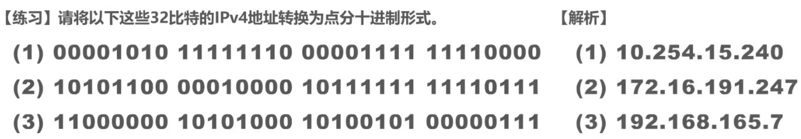
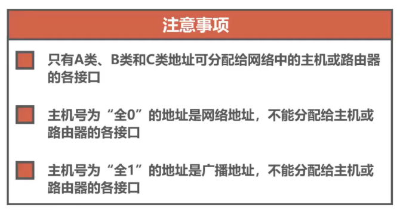
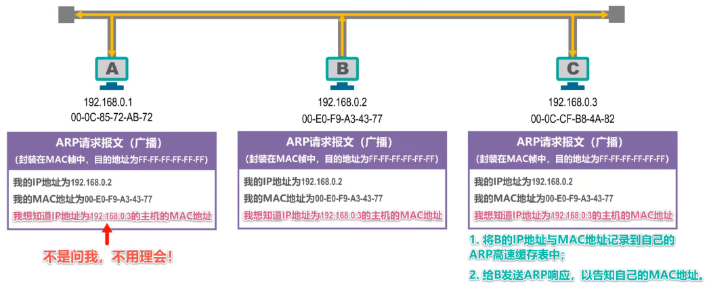

# 常用的计算机网络体系结构

## OSI体系结构

为了使不同体系结构的计算机网络都能够互联，国际标准化组织于1977年成立了专门机构研究该问题，不久他们就提出了一个试图使各种计算机在世界范围内都能够互连成网的标准框架，也就是著名的“开放系统互连参考模型”，简称为OSI，OSI体系结构有时候我们也称之为OSI模型。

OSI是一个七层协议的体系结构：从下往上依次是物理层、数据链路层、网络层、运输层、会话层、表示层、应用层。

OSI试图达到一种理想境界，即全球计算机网络都遵循这个统一标准，因而全球的计算机将能够很方便地进行互连和交换数据。在20世纪80年代，许多大公司甚至一些国家的政府机构纷纷表示支持OSI。当时看来似乎在不久的将来全世界一定会按照OSI制定的标准来构造自己的计算机网络。

然而到了20世纪90年代初期，虽然整套的OSI国际标准都已经制定出来了，但由于基于TCP/IP 的互联网已抢先在全球相当大的范围成功地运行了，而与此同时却几乎找不到有什么厂家生产出符合OSI标准的商用产品。因此人们得出这样的结论：OSI 只获得了一些理论研究的成果，但在市场化方面则事与愿违地失败了。

现今规模最大的、覆盖全球的、基于TCP/IP的互联网并未使用OSI标准。

## 具有五层协议的体系结构

TCP/IP是一个四层的体系结构，它包含**应用层、运输层、网际层和网络接口层**（用网际层这个名字是强调这一层是为了解决不同网络的互连问题）。

OSI的七层协议体系结构概念清楚，理论也比较完整，但是太过于复杂不实用。TCP/IP体系结构不同，但是现在却得到了非常广泛的应用。

在学习计算机网络的原理时往往采取折中的办法，即综合OSI和TCP/IP 的优点，采用一种只有五层协议的体系结构，这样既简洁又能将概念阐述清楚。有时为了方便，也可把最底下两层称为网络接口层。

**应用层（application layer）**
> 应用层是体系结构中的最高层。应用层的任务时通过应用程序间的交互来完成特定的网络应用。**应用层协议**是应用进程间的通信的规则。对于不同的网络应用需要不同的协议。在互联网上应用层协议非常多，如： 系统域名DNS 、 HTTP协议 、 电子邮件的SMTP协议 等。 我们把应用层中交换的数据单元叫做 **报文(Message)**

**运输层（transport layer）**
> 运输层的任务就是负责向 **两台主机中进程之间的通信提供通用的数据传输服务**
运输层主要有以下两种协议
    1. **传输控制协议TCP（Transmission Control Protocol）**： 提供面向连接的、可靠的数据传输服务
    2. **用户数据协议UDP（User Datagram Protocol）**：提供无连接的，尽最大努力的数据传输服务（不保证数据的可靠性）

**网络层（network layer）**
> 主要作用是，**实现两个网络系统之间数据透明传输**，具体包括**路由选择。拥塞控制盒网际互联等**
> 在发送数据时，网络层把运输层产生的报文或用户数据分组并封包后进行传送。在 TCP/IP 体系中，由于网络层使用IP协议，因此分组也叫做 IP数据报 ，简称数据报
> 数据在经过网络层时会加上IP协议的头部

**数据链路层（data  link layer）**
> 两台主机之间的数据，总是在一段一段的链路上传送的，这就需要使用专门的链路层协议。在两个相邻的节点之间传送数据时，数据链路层将网络层交下来的 IP 数据组装成 **帧（framing）** ，在两个相邻节点的链路上传送帧

**物理层（physical layer）**
> 利用传输介质为数据链路层提供物理连接，实现比特流的透明传输
> **物理层上所传输的数据单位是 比特 bit**

1. 发送方-应用层 - 用户A发送报文
2. 发送方-传输层 - 在头部增加 TCP/UDP 包首部分
3. 发送方-网络层 - 在头部增加 IP包 部分
4. 发送方-数据链路层 - 在头部增加以太网网包首部（用于两个网络间的数据传送、路由选择、网际互联等）
5. 发送方-物理层 - 通过以太网电/光缆发送
6. 接收方-物理层 - 通过以太网电/光缆接收
7. 接收方-数据链路层 - 解析以太网首部
8. 接收方-网络层 - 解析 IP 包首部，并识别上一层为TCP
9. 接收方-传输层 - 解析 TCP 包首部
10. 接收方-应用层 - 用户B接收报文

# 物理层

物理层主要解决在**各种传输媒体上传输比特0和1的问题**，进而给数据链路层提供透明传输比特流的服务

由于传输媒体的种类太多（例如同轴电缆、光纤、无线电波等），物理连接方式也有很多例如点对点连接、广播连接等，因此物理层协议种类也比较多。但是物理层为了解决在各种传输媒体上传输比特0和1的问题，无论是那种物理层协议都需要满足主以下四个任务：

1. 机械特性： 指明接口所用接线器的**形状** 和尺寸，引脚数目和排列、固定和锁定装置
2. 电气特性：指明在接口电缆的各条线上出现的电压范围
3. 功能特性：指明某条线上出现的不同电平表示何种意义
4. 过程特性：指明对于不同功能的各种事件的出现顺序

### 传输媒体

#### 导引型传输媒体

**同轴电缆**

可以从上图看出同轴电缆的各层都是共圆心的，也就是同轴心的
同轴电缆有两种：
- 基带同轴电缆：数字传输，过去用于局域网
- 宽带同轴电缆：模拟传输，目前主要用于有线电视

同轴电缆价格较贵且布线不够灵活和方便，随着集线器的出现，在局域网领域基本上都是采用双绞线作为传输媒体

**双绞线**

双绞线是最常用的传输媒体，把两根互相绝缘的铜导线放在一起，然后按照一定规则绞合起来就构成了双绞线。

常用的双绞线包含八根铜导线，每两根绞合成一条双绞线，绞合组合如下：
- 蓝色线和蓝白双色线绞合
- 橙色线和橙白双色线绞合
- 绿色线和绿白双色线绞合
- 棕色先和棕白双色线绞合

绞合的作用：
- 抵御部分来自外界的电磁干扰
- 减少相邻导线的电磁干扰

根据有无屏蔽层，双绞线分为：无屏蔽双绞线和屏蔽双绞线

- 无屏蔽
  
- 屏蔽双绞线：在双绞线与外层绝缘封套之间有一个金属屏蔽层
  

常用的绞合线类别、带宽及典型应用

光纤

光纤的优点
- 通信容量大(25000~30000GHz的带宽)
- 传输损耗小，远距离传输时更加经济。
- 抗雷电和电磁干扰性能好。这在大电流脉冲干扰的环境下尤为重要。
- 无串音干扰，保密性好，不易被窃听。
- 体积小，重量轻。

#### 非导引型传输媒体：非导引型传输媒体是指自由空间

- 无线电波
- 微波
- 红外线
- 可见光

# 数据链路层

## 数据链路层在网络体系结构中所处的地位

主机H1给主机H2发送数据，中间要经过三个路由器、电话网、局域网、广域网等多种网络。

详细过程如下

要发送的数据按照逐层进行传递。

当我们研究数据链路层时，我们可以只关心数据链路层，而不考虑其他各层。我们可以想象，数据只在数据链路层从左至右沿水平方向传送。从数据链路层来看，主机H1到主机H2 的通信可以看作是在4段不同的链路上的通信所组成的。

所谓的**链路(Link)就是从一个结点到相邻结点的一段物理线路，而中间没有任何其他的交换结点。要在链路上传输数据，仅有链路还不够，还需要一些通信协议来控制这些数据的传输，如果把实现这些协议的硬件和软件加到链路上就构成了数据链路（Data Link）**

在数据链路上传输的数据包，又称为帧。（数据链路层是以帧作为单位传输和处理的）

> 注意：结点就是网络中的一台主机。

数据链路层的协议有很多种，但是有三个基本问题是共同的。这三个基本问题就是：封装成帧、透明传输和差错检测。

## 封装成帧

封装成帧是指数据链路层给上层交付的协议数据单元添加帧头和帧尾使之成为帧。

**帧头和帧尾中包含有重要的控制信息**

帧头和帧尾的作用之一就是帧定界，例如：PPP帧的第一个字节和最后一个字节就是帧定界，通过这两个字节就能够从物理层交付的比特流中提取出一个一个的帧。

**并不是每种数据链路层协议的帧都包含有帧定界标志**，例如MAC帧在帧头和帧尾中是没有包含帧定界的标志的， 那么接收方是如何从物理层交付的比特流中提取出一个个的以太网帧的呢？

- 第一步：数据链路层封装好MAC帧，将其交付给物理层
- 第二步：物理层在MAC帧的前面添加8字节的前导码，前导码的前7个字节为前同步码，其作用是使接收方的时钟同步，之后的1个字节为帧开始定界符，表明其后紧跟着的就是MAC帧。

## 透明传输

透明传输是指数据链路层对上层交付的传输数据没有任何限制，就好像数据链路层不存在一样。

当使用透明传输时，数据帧中的数据是帧定界标志时，发送端的数据链路层如何处理？

**情况一：当物理链路提供的是面向字符流的传输服务时（物理链路以字符为单位传输数据）**

解决方式：数据链路层在交付给物理层时，会对帧进行扫描，首先扫描到 `SOH` ，然后将每扫描到一个 `SOH` 和 `EOT` 就在前面加上转义字符 `ESC` ，直到扫描到最后一个 `EOT`。这种方式称之为 ： `字节填充（byte stuffing）` 或 `字符填充（character stuffing）`

**情况二：当物理链路提供的是面向比特的传输服务时（物理链路以比特为单位传输数据）**

在数据发送钱采用 **比特填充法** ：对数据进行扫描，每五个连续的比特1后面就插入一个 比特0.

为了提高帧的传输效率，应当使帧的数据部分的长度尽可能大些。

考虑到差错控制等多种因素。每一种数据链路层协议都规定了帧的数据部分的长度上限，即最大传送单元 **MTU（Maximum Transfer Unit）**

## 差错校验

实际的通信链路都不是理想的，比特流在传输过程中由于受到各种干扰可能会产生差错: 1可能会变成0,而0也可能变成1。这称为比特差错，或者称为误码。

一段时间内，传输错误的比特占所传输比特总数的比率称为**误码率（Bit Error Rate）**

、在封装好的帧中利用若干个字节表示帧校验序列FCS字段。FCS :Frame Check Sequence(帧校验序列)。FCS字段由一些差错校验算法计算得出，常用的校验算法为：循环冗余校验CRC(Cyclic Redundancy Check)。

接收方在接收到数据后计算出一个FCS，然后将计算得出的FCS与接收到的数据帧中的FCS进行比较。

由于判断FCS是否正确只能检测出帧在传输过程中出现了差错，但并不能定位错误，因此无法纠正错误。接收方可以通过检错重传方式来纠正传输中的差错,或者仅仅是丢弃检测到差错的帧，这取决于数据链路层向其上层提供的是可靠传输服务还是不可靠传输服务。

## 以太网

**以太网是一种计算机局域网技术**。IEEE（电气与电子工程师协会：Institute of Electrical and Electronics Engineers）组织的**IEEE 802.3标准**制定了以太网的技术标准，它规定了包括物理层的连线、电子信号和介质访问层协议的内容。**以太网是应用最普遍的局域网技术**，取代了其他局域网技术如令牌环、FDDI和ARCNET。

以太网是一种有线系统，最初使用**同轴电缆**进行数据传输，后来发展到使用**双绞线**和**光纤**并延续至今。

### 以太网的两个标准

- 1980年9月，DEC公司、英特尔(Intel)公司和施乐公司联合提出了10 Mbit/s 以太网规约的第一个版本DIX V1(DIX是这三个公司名称的缩写)。
- 1982年又修改为第二版规约（实际上也就是最后的版本)，即DIX Ethernet V2，成为世界上第一个局域网产品的规约。
- 1983年，IEEE 802委员会的802.3工作组制定了第一个IEEE的以太网标准IEEE 802.3[W-IEEE802.3]，数据率为10 Mbit/s。以太网的两个标准 DIX Ethernet V2与IEEE的802.3标准只有很小的差别，因此很多人也常把802.3局域网简称为"以太网"。IEEE 802委员会的介绍（引用自《计算机网络-谢希仁》）
  

- **IEEE 802.3 定义了以太网的物理层和数据链路层的介质访问控制部分**，其中物理层由两个组件组成：**线缆**和**设备**，数据链路层可以分为两部分：**逻辑链路控制（LLC）**、**介质访问控制（MAC）**。
  

### 物理层

线缆： 以太网的通信线缆由同轴电缆，发展到今天的双绞线和光纤

双绞线两端配有 **RJ45** 八针连接器，这种八针连接器用于在半双工和全双工模式下进行数据的发送和接收。

**半双工模式**： 数据一次沿一个方向传输

**全双工模式**： 两组数据沿两个方向进行传输，以太网的全双工模式可以通过一对双绞线实现。

光纤线缆，使用的是 **玻璃光纤** 或 **塑料光纤** ，作为光脉冲的传输通道来传输数据

光纤电缆可以根据实际需求使用不同类型的连接器：SFP连接器、SC连接器

以太网设备
> 以太网设备由计算机、打印机等具有网络接口卡的设备所组成，常用的以太网设备有，路由器 、 交换机 、 网桥 ，而工作在数据链路层的设备有 交换机 、 网桥 ，路由器工作在五层体系结构中的网络层

### 数据链路层

**逻辑链路控制LLC**： 为网络层提供统一的接口，以便数据在设备间传输，很多厂商生产的适配器上就仅仅有 MAC 协议，而没有LLC 协议

**介质访问控制MAC**： 使用分配给网络接口卡的硬件地址来标识特定的计算机或设备接口，通过这种方式来表示数据传输的源地址和目的地址。

## 以太网的MAC层

### MAC 层的硬件地址

**MAC地址（Media Access Control Address）**： 直译为**媒体存取控制地址**，也称之为 **局域网地址（LAN Address）** 、 MAC位址 、以太网地址（Ethernet）或物理地址（Physical Address）， 它是一个用来确认网络设备位置的地址。

IEEE 802标准为局域网规定了一种48位（6字节）的全球地址（一般简称为“地址”），这个地址会固化在适配器的ROM中。

IEEE 的注册管理机构 RA 负责向厂家分配地址字段的前三个字节(即高位 24 位)。地址字段中的后三个字节(即低位 24 位)由厂家自行指派，称为扩展标识符，必须保证生产出的适配器没有重复地址。世界上凡要生产局域网适配器的厂家都必须向IEEE购买由这三个字节构成的这个号（即地址块)，这个号的正式名称是组织唯一标识符。

> 例如，3Com公司生产的适配器的MAC地址的前三个字节是 02-60-8C。地址字段中的后三个字节（即低位24位）则由厂家自行指派，只要保证生产出的适配器没有重复地址即可

一个地址块可以生成2^24个（二百八十多万亿个）不同的地址。这种 48 位地址称为MAC-48，它的通用名称是EUI-48。

一般情况下，用户主机会包含两个网络适配器：有线局域网适配器（有线网卡）和无线局域网适配器（无线网卡)。每个网络适配器都有一个全球唯一的MAC地址。而交换机和路由器往往拥有更多的网络接口，所以会拥有更多的MAC地址。综上所述，严格来说，MAC地址是对网络上各接口的唯一标识，而不是对网络上各设备的唯一标识。

我们可以在DOS窗口输入命令：ipconfig /all ， 查看本机网卡的MAC地址。

### MAC地址的格式

**MAC地址的表示方法**

标准表示法(Windows)： xx-xx-xx-xx-xx-xx  例如： 00-0C-CF-93-8C-92
其他表示法(Linux、苹果、安卓)： xx:xx:xx:xx:xx:xx  例如：00:0C:CF:93:8C:92
其他表示法： xxxx.xxxx.xxxx  例如：000C.CF93.8C92

**MAC地址的含义**

### MAC 帧的格式

数据链路层在网络层交付的IP数据包前面加上“目的地址”、“源地址”、“类型”字段，并且在最后加入4字节的FCS字段，组成一个以太网MAC帧，然后再交付给物理层

- 目的地址： 接收主机的MAC地址
- 源地址： 发送主机的MAC地址
- 类型： 标识上一层使用的是什么协议，以便把收到的MAC帧的数据交给上一层的该协议

> 注意：当数据字段的长度小于 46 字节时，应在数据字段的后面加入整数字节的填充字段，以保证以太网的 MAC 帧长不小于 64 字节。

### MAC地址的识别

当多个主机连接到同一个广播信道时，要实现两个主机之间的通信，每个主机发送的帧中包含了目标地址和源地址，广播信道上的每一台主机都能接收到该帧，接收到帧的主机将帧中的目的地址与保存在网络适配器中的MAC地址（保存在电可擦除的只读存储器EEPROOM）进行比较，如果匹配成功则接受该帧，否则丢弃该帧。

MAC 地址还根据发送对象，分为 **单播（unicast）帧（一对一）**、 **广播（broadcast）帧 （一对全体）**、 **组/多播（multicast）帧 （一对多）**

单播MAC地址
> 
> - 前24位（即前3个字节）通常用于表示制造商的组织唯一标识符（OUI），由IEEE分配给各个网络设备厂商。
> - 后24位（即后3个字节）则由设备制造商自行分配，以确保每个设备的MAC地址都是唯一的。
> - 单播MAC地址的第一个字节的最低有效位（即最后一位二进制数字）通常为0。

广播MAC地址

> 
> 广播MAC地址是一个特殊的地址，其所有位都是1。在十六进制表示中，广播MAC地址为“FF-FF-FF-FF-FF-FF”。当数据帧的目的地址是广播地址时，数据帧将被发送到网络中的所有设备。

多播MAC地址
> 
> A发送多播帧给多播地址，随后收到该真的设备，会与自己的多播组列表进行对比，如果存在则接收该帧

> 多播地址（Multicast Address）并不需要直接对应到物理设备。多播地址是用于在网络中同时向多个接收者发送数据的特殊IP地址范围。当数据包被发送到多播地址时，网络中的路由器和交换机会根据其配置和路由表来决定哪些设备（或子网）应该接收这个数据包。
> 
> 在IPv4中，多播地址的范围是从224.0.0.0到239.255.255.255。这些地址不是为特定的物理设备预留的，而是用于标识一组可能分布在网络不同部分的设备。例如，一个视频会议应用可能会使用多播来向所有参加会议的设备发送视频流。
> 
> 当一台设备想要接收发送到多播地址的数据包时，它会加入相应的多播组。这通常是通过向网络发送一个IGMP（Internet Group Management Protocol）报告消息来完成的，告诉路由器它想要接收发送到特定多播地址的数据包。
> 
> 
> 因此，多播地址是与网络中的一组设备相关联的逻辑地址，而不是与特定的物理设备相对应。要成功使用多播，你的网络环境（包括路由器、交换机和防火墙）需要支持多播，并且需要正确配置以允许多播流量的传输。
> 
> 
> 请注意，由于多播数据包通常不会被路由器转发到不同的网络（除非有特定的路由配置来允许这样做），因此多播通常用于局域网（LAN）或具有特定路由配置的私有网络环境中。在公网上使用多播可能会受到许多限制和挑战，包括防火墙、ISP限制和网络配置等问题。

多播的发送方流程：

1. 应用层
   1. 生成数据：应用程序生成需要发送的数据
   2. 指定多播组：应用程序指定多播组的IP地址（D类地址）（如224.0.0.0到239.255.255.255范围内的地址）和端口
2. 传输层
   1. 封装数据：使用UDP协议将数据封装成报文
   2. 设置目标地址：将多播组的Ip地址和端口号设置为 UDP 报文的目标地址

3. 网络层
   1. 封装IP数据包：将UDP数据包封装成IP数据包，目标地址为多播组地址
   2. 路由选择：路由器根据多播路由协议（如PIM、DVMRP）决定如何转发多播数据包
4. 数据链路层
   1. 封装以太网帧：将IP数据包封装成以太网帧，目标MAC地址为对应的多播MAC地址
   2. 发送帧：通过网络接口卡（NIC）将帧发送到网络中

多播的接收方流程：
1. 加入多播组：
   1. 应用程序通过IGMP协议加入多播组，通知网络它希望接收该多播组的数据
   
2. 数据链路层
   1. 接收帧：网络接口卡（NIC）监听网络中的帧，检查目标MAC地址是否匹配多播组的MAC地址
   2. 过滤帧：如果真的目标MAC地址匹配，NIC将帧传递给上层协议栈处理
3. 网络层：
   1. 接收IP数据包，检查接收到的IP数据包，是否与多播组的IP地址相匹配
   2. 过滤数据包：如果匹配传递给传输层
4. 传输层
   1. 接收UDP数据包: UDP数据包会匹配目标端口和应用程序监听的端口
   2. 过滤数据包：如果端口匹配，将数据包传递给应用层
5. 应用层
   1. 接收数据并进行处理

随机MAC地址：据斯诺登介绍，美国国家安全局有一套系统通过监视电子设备的MAC地址来跟踪城市中每个人的行动，因此苹果率先在ios系列设备扫描网络时采用随机MAC地址技术，随后Windows10，安卓6.0以及内核版本3.18的Linux系统也提供随机MAC地址功能。 目前大多数移动设备都采用了随机MAC地址技术。

## 以太网交换机

### 以太网交换机的基本功能

以太网交换机是基于**以太网传输数据**的交换机，以太网交换机通常有多个接口，每个接口都可以与另一个以太网交换机相连，一般都工作在**全双工方式**。

以太网交换机具有并行性，能同时联通多对接口，使多对主机能同时通信。

以太网交换机工作在数据链路层和物理层，当它收到帧时，在帧交换表中查找帧的目的MAC地址对应的接口号，然后通过该接口转发该帧

帧的转发方式
1. 存储转发：
   
   交换机在转发钱必须存储该帧，并进行错误校验，如果无误后再将该帧发往目的地址。帧通过交换机的转发时延随帧的长度变化

1. 直接交换：

    采用基于硬件的交叉矩阵（交换机只要检查到帧头所包含的目的地之就立即转发该帧，而无需等待帧的全部被接收，也不进行错误校验。由于以太网的帧头长度总是固定的，因此帧通过交换机的转发延时也保持不变）

以太网交换机是一种即插即用设备，其内部的**帧交换表**是通过**自学习算法**自动的逐渐建立起来的

### 以太网交换机自学习和转发帧流程

刚上电时以太网交换机的帧交换表示空的，随着网络中各个主机间的通信，通过自学习算法，自动的逐渐建立了帧交换表

自学习算法原理：

1. **源地址检查：**： 将接收到的帧的源地址，与交换表进行匹配
   1. **找到匹配项** ： 更新该项的时间戳
   
   2. **没找到匹配项**： 
      1. 在 MAC 地址表中增加一个新的项目，记录源 MAC 地址、数据帧进入的接口和当前的时间戳。

2. **转发**： 在交换表中查找目的地址

   1. **找到匹配项**： 并且匹配项不是帧进入的接口，交换机将帧进行转发
   2. **未找到匹配项**： 
      1. 情况1： 匹配项的接口就是帧进入的接口：这意味着数据是回环，或者目的地址不存在于网络中
      2. 情况2： 匹配项的接口不是帧进入的接口： 那么就需要进行泛洪处理.

          泛洪： 将帧转发到，除源接口外的所有接口
   

按照该自主学习原理，，如上图，当有两个交换机互联时，两个交换机都会记录（自主学习），网络内的所有设备和帧进入的端口，这样连接不同交换机的主机，就会通过端口转发而快速找到对方。

> 交换机的交换表并不是永久的，当重启、超时发生时就会被丢弃

### 以太网的生成树协议 STP

思考：如何提高以太网的可靠性？假如在网络中有三台交换机A、B、C，他们之间的连接方式如下图所示，假如他们之间的链路出现了故障则会影响各个交换机之间的通信

添加冗余链路可以提高以太网的可靠性：在交换机B和C之间添加冗余链路。但是冗余链路也会带来负面效应----形成**网络环路**。

网络环路带来的问题

1. 广播风暴： 广播帧会在各个交换机之间反复转发，分别按照顺时针和逆时针兜圈，会大量消耗网路资源，使得网络无法转发其他数据
   

2. 主机反复收到广播帧：大量消耗主机的资源
   
3. 交换机的帧交换表震荡：同一个MAC地址在其他错误记录之间反复震荡
   

以太网交换机使用**生成树协议STP（Spanning Tree Protocol）** 可以在增加冗余链路来提高网络可靠性的同时，又避免网络环路带来的各种问题。

不论交换机之间采用何种物理连接，交换机都能够自动计算并构建一个逻辑上没有环路的网络，其逻辑拓扑结构必须是树形的（无逻辑环路）。最终的树形逻辑拓扑要确保联通整个网络

当首次连接交换机或网络物理拓扑发生变化时(有可能是人为改变或故障)，交换机都将进行生成树的重新计算。
## 广播域

广播域是指在一个网络中，广播帧可以到达的所有节点所组成的范围。当一个设备发送广播帧时，该帧会被转发到同一个广播域内的所有其他设备。这些设备能够监听并接收送往该广播域的所有广播信息。

但是巨大的广播域会带来很多的弊端：
- 广播风暴
- 难以管理和维护
- 潜在的安全问题

例如，网络中的某台主机A需要向另外一台主机B发送数据，此时主机A只有主机B的IP地址，但是没有主机B的MAC地址，主机A需要发送ARP（ARP属于体系结构的网络层，在后续的课程中我们会介绍）广播请求来获取主机B的MAC地址，该ARP请求会传遍整个网络，网络中的其他所有主机都能够收到广播。

广播风暴会浪费网络资源和各个主机的CPU资源，但是在实际应用中网络中会频繁出现广播信息，TCP/IP协议栈中的很多协议都会使用广播：
- 地址解析协议ARP（已知IP地址，找出对应的MAC地址）
- 动态主机配置协议DHCP（用于自动配置IP地址）
我们可以使用分割广播域的方法对广播域进行隔离：

- 使用路由器隔离广播域：但是路由器的成本较高，局域网中如果全部用路由器隔离广播域不大现实
  
- 使用虚拟局域网VLAN

## 虚拟局域网 VLAN

虚拟局域网VLAN(Virtual Local Area Network)是一种将局域网内的设备划分成与物理位置无关的逻辑组的技术，这些逻辑组具有某些共同的需求。

假如在网络中有三个局域网，分别叫做局域网1、局域网2、局域网3，我们可以使用一个交换机S4将三个局域网互连成一个更大的局域网。原来每个局域网就成为新的大的局域网中的各个网段。我们可以在S4上将整个局域网划分成两个VLAN：VLAN1和VLAN2，这样两个不同的VLAN之间的广播数据包不会互相传输，当然如果是在同一个VLAN中的主机依然可以进行广播通信。

注意：不是所有的交换机都能够进行VLAN划分，一般需要企业级交换机才可以。

# 网络层

网络层的主要任务时实现 **网络互联** ， 进而实现**数据包在各网络之间的传输**。

要实现网络层任务，要解决以下问题：

1. 网络层向运输层要提供怎样的服务（可靠传输还是不可靠传输）
   1. TCP/IP 协议体系结构的网际层提供的是无连接的、不可靠的数据包服务
   2. ATm、帧中继和X.25的网际层提供的事面向连接的，可靠的虚电路服务
      

2. 网络层寻址问题
   
3. 路由选择问题
   
   
   
因特网(Internet)是目前全世界用户数量最多的互联网，它使用TCP/IP协议栈。由于TCP/IP协议栈的网络层使用网际协议IP，它是整个协议栈的核心协议，因此在TCP/IP协议栈中网络层常称为网际层。本章节我们通过学习TCP/IP协议栈的网际层来学习网络层的理论知识和实践技术。

## IPV4 地址概述
在因特网中，为了实现计算机之间的相互通信，通常需要为每台计算机分配一个IP地址。在互联网的发展过程中主要有两个版本的互联网协议，分别是IPv4（Internet Protocol version 4）和 IPv6（Internet Protocol version 6）。

IPv4 的IP地址就是给因特网(Internet)上的每一台主机(或路由器)）的每一个接口分配一个在全世界范围内是唯一的32比特的标识符，地址总数为2^32个。

IPv6 的 IP地址采用128比特地址长度，地址总数为2^128个。

IP地址由因特网名字和数字分配机构ICANN(Internet Corporation for Assigned Names and Numbers)进行分配。我国用户可向亚太网络信息中心APNIC(Asia Pacific Network Information Center)申请IP地址，需要缴费。

由于32比特的IPv4地址不方便阅读、记录以及输入等，因此IPv4地址采用点分十进制表示方法以方便用户使用，例如：192.168.1.100

## IPv4 地址的组成和分类

IPv4 的IP地址由网络号（指定主机所属的网络）和 主机号（指定被寻址的子网中的某个节点）组成，IP地址可以分为A、B、C、D、E五类。

- 只有 A、B、C 三类地址能够分配给，主机和路由器
- 主机号为0的地址是网络地址，不能分配给主机或路由器
- 主机号全为1 的地址是广播地址，不能分配给主机或路由器

**网络号**

1. 定义：网络号是IP地址中用于识别设备所属网络的那一部分。它就像是现实生活中的邮政编码，标识着设备所在的网络区域。

1. 功能：
   - 唯一标识一个网络，使得网络中的设备能够相互识别和通信。
   - 帮助数据包找到目标网络，确保数据能够准确无误地传输到目的地。

1. 确定方式：通过子网掩码与IP地址的按位与运算，可以得到网络地址，即网络号所对应的IP地址。

**主机地址**
1. 定义：主机地址是指除网络地址和广播地址之外的IP地址部分。它用于标识一个特定的主机或设备。
1. 特点：
   - 主机地址可以是网络中的任意一个有效地址。
   - 连接到同一网络的主机必须拥有相同的网络编号（即网络号），但主机地址（即主机号）必须是不同的。

1. 范围：在一个特定的子网中，主机地址的范围是从网络地址加1开始，到广播地址减1结束。例如，在IP地址为192.168.0.0，子网掩码为255.255.255.0的情况下，主机地址的范围是从192.168.0.1到192.168.0.254。

IP地址根据其范围和用途被分为不同的类别，主要分为 **A类**、**B类**、**C类**、**D类** 和 **E类**。这些类别通过IP地址的第一个字节（前8位）来区分。以下是详细的分类说明：

### **1. A类地址**

- **范围**：`1.0.0.0` 到 `126.255.255.255`
- **网络号**：
  - 最小网络号为0，保留不指派
  - 第一个可指派的网络号为1 ，网络地址为1.0.0.0
  - 最大网络号为127 ， 作为本地环回地址，不指派
  - 最大的本地环回测试地址为： 127.255.255.254
  - 最后一个可指派的网络号为126，网络地址为126.0.0.0
- **特点**：
  - 第一个字节（前8位）表示网络号，后三个字节（24位）表示主机号。
  - 用于大型网络，每个A类网络可以容纳约1677万台主机。
  - 默认子网掩码：`255.0.0.0`。
- **示例**：`10.0.0.1`

A类地址可指派的网络数量：因为网络号占8个bit，并且最高位固定为0，网络号有2^7=128中组合，但是因为最小网络号0和最大网络号127不能指派，所以最终A类IP地址能够指派的网络数量为：

A类地址每个网络中可以分配的地址数量：因为主机号站24个bit，主机号有2^24种组合，因为全0的网络号和全1的广播地址不能指派，所以需要减2

---

### **2. B类地址**
- **范围**：`128.0.0.0` 到 `191.255.255.255`
- **网络号**：
  - 最小网络号为：`128`
  - 最大网络号为：`191.255`
- **特点**：
  - 最高位为 `10`
  - 前两个字节（16位）表示网络号，后两个字节（16位）表示主机号。
  - 用于中型网络，每个B类网络可以容纳约6.5万台主机。
  - 默认子网掩码：`255.255.0.0`。
- **示例**：`172.16.0.1`

类地址可指派的网络数量：因为网络号占16个bit，并且最高位固定为10，网络号有2^(16-2)种组合

B类地址每个网络中可以分配的地址数量：因为主机号站16个bit，主机号有2^16种组合，因为全0的网络号和全1的广播地址不能指派，所以需要减2

---

### **3. C类地址**
- **范围**：`192.0.0.0` 到 `223.255.255.255`
- **网络号**：
  - 最小网络号： 192.0.0 ，网络地址为 192.0.0.0
  - 最大网络号：223.255.255 ，网络地址为 2235.255.255.0
- **特点**：

  - 前三个字节（24位）表示网络号，最后一个字节（8位）表示主机号。
  - 用于小型网络，每个C类网络可以容纳254台主机。
  - 默认子网掩码：`255.255.255.0`。
- **示例**：`192.168.1.1`

C类地址可指派的网络数量：因为网络号占24个bit，并且最高位固定为110，网络号有2^(24-3)

C类地址每个网络中可以分配的地址数量：因为主机号站8个bit，主机号有2^8种组合，因为全0的网络号和全1的广播地址不能指派，所以需要减2

### **4. D类地址**

- **范围**：`224.0.0.0` 到 `239.255.255.255`
- **特点**：

  - 用于多播（Multicast）通信。
  - 不区分网络号和主机号，专门用于将数据包发送到一组设备。
  - 常见的多播地址：
    - `224.0.0.1`：所有主机。
    - `224.0.0.2`：所有路由器。
- **示例**：`224.0.0.1`

### **5. E类地址**
- **范围**：`240.0.0.0` 到 `255.255.255.255`
- **特点**：
  - 保留用于实验和研究，不用于常规通信。
  - 其中 `255.255.255.255` 是受限广播地址，用于向本地网络中的所有设备发送数据。

### **6. 特殊地址**
除了上述分类，还有一些特殊的IP地址范围：

1. **私有地址**：
   - 用于局域网内部，不能在公网上路由。
   - 范围：
     - A类：`10.0.0.0` 到 `10.255.255.255`
     - B类：`172.16.0.0` 到 `172.31.255.255`
     - C类：`192.168.0.0` 到 `192.168.255.255`

2. **回环地址**：
   - 用于本地测试，数据不会发送到网络。
   - 范围：`127.0.0.0` 到 `127.255.255.255`（常用的是 `127.0.0.1`）。

3. **自动配置地址（APIPA）**：
   - 当设备无法从DHCP服务器获取IP地址时，自动分配的地址。
   - 范围：`169.254.0.0` 到 `169.254.255.255`。

4. **广播地址**：
   - 用于向网络中的所有设备发送数据。
   - 示例：`192.168.1.255`（向 `192.168.1.0/24` 网络中的所有设备广播）。
  
5. 0.0.0.0 是一个特殊的IP地址，它被称为不定地址（Indeterminate Address）或默认路由地址
   1. 默认路由：在配置路由器时，0.0.0.0 常被用作默认路由的目的地址。这意味着，当路由器无法根据路由表匹配到更具体的路由时，它会将数据包转发到配置为默认网关的下一跳地址。这确保了无法直接路由的数据包能够有一个“最后的出口”，以便被发送到其他网络。
   2. 源地址：在某些情况下，0.0.0.0 可以作为源地址使用，特别是在配置服务器监听所有可用IP地址时。例如，在绑定套接字（socket）时，将源地址设置为 0.0.0.0 表示服务器将接受发送到该机器上任何IP地址的连接请求。
   3. 测试地址：虽然 0.0.0.0 通常不作为测试目标地址使用（因为它不指向任何实际设备），但在某些上下文中，它可能被用来表示“无特定目标”或“所有目标”的概念。然而，在实际的网络通信中，数据包的目标地址必须是一个有效的、可路由的IP地址。
   4. 禁用地址：在某些配置或编程环境中，将IP地址设置为 0.0.0.0 可能表示禁用与该地址相关的网络功能或服务。

---

### **7. 分类总结**

| 类别 | 范围                            | 网络号长度 | 主机号长度 | 用途       |
| ---- | ------------------------------- | ---------- | ---------- | ---------- |
| A类  | `1.0.0.0` - `126.255.255.255`   | 8位        | 24位       | 大型网络   |
| B类  | `128.0.0.0` - `191.255.255.255` | 16位       | 16位       | 中型网络   |
| C类  | `192.0.0.0` - `223.255.255.255` | 24位       | 8位        | 小型网络   |
| D类  | `224.0.0.0` - `239.255.255.255` | 无         | 无         | 多播通信   |
| E类  | `240.0.0.0` - `255.255.255.255` | 无         | 无         | 实验和研究 |

---

### **8. 现代网络中的变化**
- **CIDR（无类别域间路由）**：现代网络不再严格遵循A、B、C类的划分，而是使用CIDR表示法（如 `192.168.1.0/24`）来灵活分配IP地址。
- **IPv6**：IPv6采用128位地址，不再有类别的概念，地址分配更加灵活。

通过理解IP地址的分类，可以更好地规划网络和分配IP地址资源。

## IPV4子网的划分

子网掩码(subnet mask)是一个32位地址，又叫网络掩码、地址掩码，它用来**指明一个IP地址的哪些位标识的是主机所在的子网，以及哪些位标识的是主机**。子网掩码不能单独存在，它必须结合IP地址一起使用。**子网掩码将某个IP地址划分成网络地址和主机地址两部分。**

子网掩码的两个功能：
- 屏蔽IP地址的一部分以区别网络标识和主机标识
- 将一个大的IP网络划分为若干小的子网络

子网掩码左边是网络位，用二进制数字“1”表示，1的数目等于网络位的长度；右边是主机位，用二进制数字“0”表示，0的数目等于主机位的长度。这样做的目的是为了让掩码与IP地址做按位与运算时用0遮住原主机数，而不改变原网络段数字，而且很容易通过0的位数确定子网的主机数。

子网掩码的工作流程：将32位的子网掩码与IP地址进行二进制形式的按位逻辑“与”运算，得到该IPv4地址所在的网络地址

子网的划分
> 子网掩码是在IPv4地址资源紧缺的背景下为了解决lP地址分配而产生的**虚拟IP技术**，通过子网掩码将A、B、C三类地址划分为**若干子网**，从而显著提高了IP地址的**分配效率**，有效解决了IP地址资源紧张的局面。另一方面，在企业内网中为了更好地管理网络，网管人员也利用子网掩码的作用，人为地将一个较大的企业内部网络划分为更多个**小规模的子网**，再利用**三层交换机的路由功能实现子网互联**，从而有效解决了网络**广播风暴**和**网络病毒**等诸多网络管理方面的问题。
>

子网掩码的CIDR斜线记法
> **格式：IP地址/n**
> 说明：n表示子网掩码所使用的bit数，表示子网掩码中网络号的长度，通过n的个数确定子网的主机数=2^(32-n)-2
>
> 例1：192.168.1.100/24，其子网掩码表示为255.255.255.0
> 例2：172.16.198.12/20，其子网掩码表示为255.255.240.0

## IP协议

**用户数据**在网络层(网际层)中使用**IP协议**进行封装，然后交付给数据链路层。 IP协议提供不可靠无连接的数据传输服务

使用IP协议封装的数据称之为，**IP数据报**。

IP数据报的首部：IP数据报的首部由20个字节组成，IP数据报的首部常以32个比特为单位进行描述，下图中的每一行都由32个比特（也就是4个字节）构成，每个小格子称为字段或者域。

| 字段名称        | 长度（位） | 描述                     |
| --------------- | ---------- | ------------------------ |
| 版本            | 4          | IP协议版本（IPv4为4）    |
| 首部长度        | 4          | 首部长度，以32位字为单位 |
| 服务类型        | 8          | 服务质量（通常为0）      |
| 总长度          | 16         | 整个IP数据包的长度       |
| 标识            | 16         | 数据包标识               |
| 标志            | 3          | 分片标志                 |
| 片偏移          | 13         | 片偏移量                 |
| 生存时间（TTL） | 8          | 数据包最大跳数           |
| 协议            | 8          | 上层协议类型（TCP为6）   |
| 首部校验和      | 16         | 首部校验和               |
| 源IP地址        | 32         | 源主机的IP地址           |
| 目标IP地址      | 32         | 目标主机的IP地址         |
| 选项            | 可变       | 可选字段（通常为空）     |
| 填充            | 可变       | 确保首部长度为32位倍数   |

- **版本**： 占4比特 ， 表示IP协议的版本（IPv4为4）
- **首部长度**： 占4比特，表示IP数据报首部的长度。该字段的取值以4字节为单位。最小十进制取值为5，表示lP数据报首部只有20字节固定部分，最大十进制取值为15，表示IP数据报首部包含20字节固定部分和最大40字节可变部分
- **区分服务**： 8比特，一般不使用，通常为0
- **总长度**： 占16比特，表示IP数据报的总长度（首部+数据载荷)。最大取值为十进制的65535，以字节为单位（实际使用中不会传输这么长的IP数据报）。
- **标识、标志、片偏移**：这三个字段共同用于IP数据报分片，以太网中数据链路层规定MTU的值为1500字节，如果某个IP数据报总长度超过MTU，需要将原IP数据报分片成多个小的数据报，再将每个小的数据报封装成帧。
  - **标识**： 占16比特，属于同一个数据报的各分片数据报应该具有相同的标识。IP软件维持一个计数器，每产生一个数据报，计数器值加1，并将此值赋给标识字段。
  - **标志**：占 3 比特，
    - DF位： 0：允许分片 1：不允许分片
    - MF位： 1：后面还有分片  0：这是最后一个分片
    - 保留位： 必须为0
    
- **片偏移**： 占13比特，指出分辨数据报的数据载荷部分，偏移原数据报多少个单位，片偏移以8字节为单位
  

- **生存时间**： 占8比特，最初以秒为单位，最大生存周期为255秒，路由器转发时，将该字段的值减去当前路由器的处理时间，如果不为0就转发。否则丢弃。现在以 **跳数** 为单位，路由器转发IP数据报时，将IP数据报中的该字段减1，不为0则转发，为0则丢弃
  - TTL作用可以防止IP数据报再网络中永久兜圈
   

- **协议**：占8比特，指明IPV4数据报的数据部分是何种数据单元。
  - 常用的一些协议和相应的协议字段值如下
    
  - ICMP：
    - Internet控制消息协议（ICMP）主要用于在IP主机、路由器之间传递控制消息。例如，当数据包无法到达目的地时，路由器会发送ICMP消息告知源主机。
    - 常见的应用场景包括Ping命令，它利用ICMP的回显请求和回显应答消息来测试网络连接性。
  - IGMP
    - Internet组管理协议（IGMP）用于管理主机加入和离开多播组的过程。
    - 在多播通信中，路由器通过IGMP消息了解哪些主机对特定的多播组感兴趣，以便正确地转发多播数据包。
  - OSPF
    - 开放最短路径优先（OSPF）是一种内部网关协议（IGP）。
    - 它用于在单一自治系统（AS）内的路由器之间交换路由信息，采用链路状态算法来计算最短路径树，从而确定网络中的最佳路由。
  - IPv6
    - IPv6是IP协议的下一代版本，旨在解决IPv4地址耗尽等问题，它具有更大的地址空间、改进的路由功能、更好的安全性等特性。

- **首部校验和**： 占16比特，用来检测首部在传输过程中是否出现差错。比CRC检验码简单，称为因特网校验和。IP数据报每经过一个路由器
- **源IP地址**： 占32比特，表示发送主机的IP地址
- **目的IP地址**： 占32比特，表示接收主机的IP地址

## IP数据报的发送和转发过程 

同一个网络中的主机是可以直接通信的，这叫做 **直接交付** ，不同的网络中的主机是不能直接通信的，只需要通过路由器进行中转，这叫做 **间接交付**。

我们上面学习过，在同一网络中是通过以太网进行发送的，发送方标识接收方的 MAC 地址，接收方收到后比对MAC地址，正确后则接收。在不同网络中我们则先需要判断，目标主机与自身是否处于同一个网络中，如果不处于，则需要将消息发送给路由器，由路由器进行转发。但是该流程有两个问题，1如何判断目标主机与自身在同一个网络，2如何将数据发送给路由器，然后委托它进行转发。

如何判断目标主机与自身是否处于同一个网络？
> 我们知道IP地址，分为网络号和主机号，当网络号相同时，则判定为处于同一个网络中，否则不处于同一个网络。判断流程如下：
> 1. 将 `自身IP` 和 `自身子网掩码` 进行 `与` 运算，得出网络号
> 2. 将 `目标IP` 和 `自身的子网掩码` 进行 `与` 运算，得出网络号
> 3. 将两个网络号进行比对，得出两台主机是否处于同一个网络的结论

如何将数据发送给路由器？
> 路由器的每个LAN口(局域网接口)都可以独立配置IP地址，用以连接不同的子网。
> 
> 发送主机需要配置网关的地址（连接该主机路由的LAN口的地址）。发送主机在检查目标主机与自己不处于同一个网路时，将IP数据报封装为MAC包，发送给路由器。
>

上面的流程又引申出一个新的问题，主机并不知道路由器的MAC地址？
> 实际上发送主机是通过 `ARP 协议` 获取的,这后续再讲。

路由器是如何对数据进行转发的？
> 1. 检查 IP数据报首部是否出错，如果出错，则丢弃该IP数据报，并通知源主机，如果没有出错进行转发
> 2. 根据IP数据报的目的地址在路由表中查找匹配的条目，如果找到则转发给条目指示中的下一跳，否则丢弃并通知源主机

## 路由表

### 什么是路由

**路由就是报文从源端到目的端的路径**，当报文从路由器到目的网段有多条路由可达时，路由器可以根据路由表中最佳路由进行转发

### 什么是路由表

在计算机网络中，路由表（routing table）是一个存储在路由器或者联网计算机中的电子表格（文件）或类数据库。路由表存储着指向特定网络地址的路径。路由表建立的主要目标是为了实现路由协议和静态路由选择。路由表就相当于一张地图告诉数据报该如何去往目的地。

路由器会根据路由表进行数据包的转发：

在ubuntu系统下我们可以使用route -n 命令查看系统的路由表：

在windows下可以使用 route print 命令查看系统的路由表：

### 路由表的类型

1. 直连路由
   - 自动生成
     - 当路由器的一个接口配置了IP地址并启用后，路由器就会自动生成一条直连路由
     - 例如： 如果接口eth0的IP地址为192.168.1.1/24，路由器会自动添加一条路由：192.168.1.0/24通过eth0转发。
   - 特点
     - 直连路由优先级最高

2. 静态路由
   - 手动配置
     - 网络管理员手动配置路由表中的条目
     - 例如，在路由器上添加一条静态路由：192.168.2.0/24通过192.168.1.1转发。
   - 优点
     - 简单、稳定、适用于小型网络或特定路由需求
   - 缺点
     - 不适用于大型网络，因为手工配置工作量大且难以适应网络变化

3. 动态路由
   - 自动学习
     - 路由器通过动态路由协议（RIP、OSPF、IS-IS、BGP、IGRP/EIGRP）自动学习和更新路由表
     - 路由器之间交换路由信息，根据网络拓扑变化动态调整路由表
   - 优点
     - 自动适应网络变化，适用于大型复杂网络
   - 缺点
     - 配置复杂，可能占用更多的网络资源和算力
4. 默认路由
   - 兜底路由
     - 默认路由用于转发目标网络不在路由表中的数据包
     - 例如： 配置默认路由：0.0.0.0/0通过192.168.1.1转发。
   - 应用场景
     - 通常用于连接互联网，将所有未知目标的数据包发送到默认网关。

## ARP高速缓存

当源主机只知道IP而不知道目标/路由的MAC地址，会通过 ARP 协议，获取目标的MAC地址。

ARP 请求报文封装在MAC帧中，目的MAC地址为 FF-FF-FF-FF，以广播形式发送

### ARP协议工作流程

当设备A需要向设备B发送数据时，设备A知道设备B的IP地址，但不知道其MAC地址。

1. 设备A检查自己的ARP缓存表，查找是否有设备B的IP地址对应的MAC地址。
2. 如果有则正常发送
3. 如果ARP缓存表中没有对应的条目，设备A会构建一个ARP请求包，包含以下信息
   - 源IP地址：设备A的IP地址。
   - 源MAC地址：设备A的MAC地址。
   - 目标IP地址：设备B的IP地址。
   - 目标MAC地址：FF:FF:FF:FF

4. 局域网中的设备收到ARP请求包后，会检查目标IP地址是否与自己的IP地址相匹配
5. 如果匹配，则会构建一个 ARP 响应包
   - 源IP地址：设备B的IP地址。
   - 源MAC地址：设备B的MAC地址。
   - 目标IP地址：设备A的IP地址。
   - 目标MAC地址：设备A的MAC地址。

6. 设备B将ARP响应包通过单播的方式发送给设备A。
7. 更新ARP缓存表
   1. 设备A收到ARP响应包后，会从中提取设备B的IP地址和MAC地址。
8. 发送正式数据
   1. 设备A使用设备B的MAC地址，将数据包封装成以太网帧，发送给设备B。

### ARP高速缓存表

ARP高速缓存(ARP cache)，由最近的ARP项组成的一张临时表，用于存储IP地址与MAC地址的映射关系，避免每次通信都需要发送ARP请求

ARP缓存表中的条目通常有一定的生存时间（TTL），过期后会被删除。如果需要再次通信，设备会重新发起ARP请求。

在Windows系统中，可以使用arp -a命令查看ARP缓存表。
在Linux系统中，可以使用arp -n命令查看ARP缓存表。

### ARP协议的局限性

ARP协议只能在局域网中使用，无法跨网络解析MAC地址。

ARP协议没有身份验证机制，容易受到ARP欺骗（ARP Spoofing）攻击。

如果网络中有大量ARP请求，可能会导致广播风暴，影响网络性能

### ARP欺骗

ARP 欺骗是一种以 ARP 地址解析协议为基础的一种网络攻击方式。

ARP欺骗的原理：利用ARP协议没有安全认证机制，攻击者发送假的ARP数据包到网上，尤其是送到网关上。其目的是要让送至特定的IP地址的流量被错误送到攻击者所取代的地方。因此攻击者可将这些流量另行转送到真正的网关（被动式数据包嗅探，passive sniffing）或是篡改后再转送（中间人攻击，man-in-the-middle attack）。

ARP欺骗分为两种：

- 主机型欺骗：攻击者向其他主机发送ARP响应包，攻击者在响应包中填入网关的IP地址和自己MAC地址，这样主机A应该发送给网关的数据包会被网关转发给主机B

- 网关型欺骗：攻击者向网关发送ARP响应包，攻击者在响应包中填入被攻击主机的IP地址和自己MAC地址，这样网关接收到互联网中发给主机A的数据时也会转发给主机B

ARP欺骗的危害：

- 信息安全收到威胁
- 网络延迟增加
- 网络通信中断

ARP欺骗防范方法：

- 安装补丁
- 静态绑定：网内的主机与网关做IP和MAC绑定
- 使用ARP防火墙
- 不要点开通讯工具中的一些可疑链接、图片、文件等。

## 特殊IP地址

### 127.0.0.1

回环地址，该地址还有 一个别名叫 “localhost”，无论是哪个程序，一旦使用该地址发送数据，协议软件会立即返回，不进行任何网络传输，除非出错，包含该网络号的分组是不能够出现 在任何网络上的。

### 10.*.*.*，172.16.*.*――172.31.*.*，192.168.*.*

上面三个网段是私有地址，可以用于自己组网使用，这些地址主要用于企业内部网络中，但不能够在Internet网上使用，Internet网没有这些地址 的路由，而使用这三个网段的计算机要上网必须要通过网络地址转换(NAT)，将私有地址翻译成公用合法的IP地址。

### 255.255.255.255

受限制的广播地址，对本机来说，这个地址指本网段内(同一个广播域)的所有主机，该地址用于主机配置过程中IP数据包的目的地址，这时主机可能还不知道它 所在网络的网络掩码，甚至连它的IP地址也还不知道。在任何情况下，路由器都会禁止转发目的地址为受限的广播地址的数据包，这样的数据包仅会出现在本地网络中。

### 224.0.0.0—239.255.255.255

组播地址

### 169.254.*.*

如果你的主机使用了DHCP功能自动获得一个ip地址，那么当你的DHCP服务器发生故障或响应时间太长而超出系统规定的一个时间，windows系统会为你分配这样一个地址。如果你发现你的主机ip地址是个诸如此类的地址，很不幸，十有八九是你的网络不能正常运行了。

### 114.114.114.114

中国电信DNS

### 8.8.8.8

谷歌DNS

# 运输层

为不同主机上的应用进程提供直接的通信服务是运输层的任务。

运输层提供的是应用进程间的逻辑通信，“逻辑通信”的意思是：运输层之间的通信好像是沿水平方向传送数据。但事实上这两个运输层之间并没有一条水平方向的物理连接。

根据应用需求的不同，因特网的运输层为应用层提供了两种不同的运输协议，即面向连接的TCP和无连接的UDP。

## 端口号

TCP/IP体系的运输层使用端口号来区分应用层的不同应用进程。

端口号
- 采用16比特表示 取值范围 0 ~ 65535
- 熟知端口号：0~1023，IANA把这些端口号指派给了TCP/IP体系中最重要的一些应用协议，例如：FTP使用21/20，HTTP使用80，DNS使用53。
- 登记端口号:1024~49151，为没有熟知端口号的应用程序使用。使用这类端口号必须在IANA按照规定的手续登记，以防止重复。例如：Microsoft RDP微软远程桌面使用的端口是3389。
- 短暂端口号:49152~65535，留给客户进程选择暂时使用。当服务器进程收到客户进程的报文时，就知道了客户进程所使用的动态端口号。通信结束后，这个端口号可供其他客户进程以后使用。
- 常用端口号及对应的网络应用程序表格如下：
  

- 在Linux中/etc/service文件中保存了知名的服务器端口号
  

端口号只具有本地意义，即端口号只是为了标识本计算机应用层中的各进程，在因特网中,不同计算机中的相同端口号是没有联系的。

## 传输控制协议TCP

传输控制协议 TCP (Transmission Control Protocol)一种基于连接的可靠的稳定的无重复的传输协议。

### TCP头部信息

- **16位源端口号（Source Port）**：发送主机进程的端口号
- **16位目的端口号（Destination Port）**：接收主机进程的端口号
- **32位序列号（Sequnce Number）**：每个包中都包含序列号
  - 序列号初始化为 ISN
  - 后续包的序列号为， ISN + 数据字节长度 
  - 例如：某个TCP报文段传输的字节流是第1025~2048字节，那么该段报文的序列号值就是 ISN+1025
  
- **32位确认号（Acknowledgment Number）**：目的主机返回的确认号，使得源主机知道某个或几个报文段已经被接收
- **数据偏移（Data Offset）/四位首部长度（Header Length）**：
  - 表示TCP头部的长度，以4字节为单位。
  - 用于指示TCP头部结束和TCP数据部分开始的位置
  - 由于4位最大能表示15，所以TCP头部最长是60字节（15×4字节）
- **保留位（Reserved，3位）​**
   - 保留字段，必须设置为0。
   - 未来可能用于扩展协议功能。
- **控制标志（Control Flags）**
  - **URG标志**：当URG=1时，表示紧急指针字段有效。此时，紧急指针指向的数据应被优先处理。
  - **ACK标志**：当ACK=1时，表示确认号字段有效。此时，确认号用于确认收到的数据。
  - **PSH标志**：当PSH=1时，提示接收端应用程序应该立即从TCP接收缓冲区中读走数据，以便为接收后续数据腾出空间。
  - **RST标志**：当RST=1时，表示要求对方重新建立连接。通常用于异常情况下终止连接。
  - **SYN标志**：当SYN=1时，表示请求建立一个连接。在TCP三次握手过程中，SYN用于发起连接请求。
  - **FIN标志**：当FIN=1时，表示通知对方本端要关闭连接。在TCP四次挥手过程中，FIN用于发起连接释放请求。
- **16位窗口大小（window size）**：
  - 表示接收方的接收缓冲区大小，用于流量控制。
  - 发送方根据该字段调整发送数据的速度，它告诉对方本端的TCP接收缓冲区还能容纳多少字节的数据，这样对方就可以控制发送数据的速度。
- **16位校验和（TCP check sum）**
  - 用于检测TCP头部和数据部分的错误。
  - 计算方法：对TCP头部、数据和伪头部（包括源IP、目的IP、协议号和TCP长度）进行校验和计算。
- **16位紧急指针（urgent pointer）**： 是一个正的偏移量。它和序号字段的值相加表示最后一个紧急数据的下一字节的序号。因此，确切地说，这个字段是紧急指针相对当前序号的偏移，不妨称之为紧急偏移。TCP的紧急指针是发送端向接收端发送紧急数据的方法。
- **TCP头部选项（可选）**： TCP头部的最后一个选项字段（options）是可变长的可选信息。这部分最多包含40字节
  - 常见的选项包括：
  - ​MSS（Maximum Segment Size）​：协商最大分段大小。
  - ​窗口缩放因子（Window Scaling）​：支持更大的窗口大小。
  - ​时间戳（Timestamp）​：用于计算往返时间（RTT）和防止序列号回绕。

### TCP运输流程

1. 建立TCP连接
2. 数据传输
3. 释放TCP连接

### TCP连接的建立

TCP连接的建立需要解决以下三个问题：

1. 使TCP双方能够确知对方的存在
1. 使TCP双方能够协商一些参数（如最大窗口值、是否使用窗口扩大选项和时间戳选项以及服务质量等)
1. 使TCP双方能够对运输实体资源（如缓存大小、连接表中的项目等)进行分配

三次握手过程

1. **第一次握手： SYN**
   - 客户端向服务端发送一个TCP数据包
      - 设置 **SYN标志位** 为 1 - 表示请求建立连接
      - 选择一个 **初始序列号ISN**  , 并填充到确认号字段中
      - 例如：`SYN=1, Seq=X`（X为客户端选择的ISN）。

   - **状态变化**
     - 客户端进入 **SYN_SENT(同步已发送状态)** 状态

2. **第二次握手： SYN+ACK**
   - 服务端收到SYN包后，向客户端发送一个TCP数据包：
     - 设置 **SYN标志位** 为1，表示同意建立连接
     - 设置 **ACK标志位** 为1，表示确认客户端的SYN包
     - 选择一个 **初始序列号ISN**，并填充到确认号字段中
     - 例如： `SYN=1, ACK=1, Seq=Y, Ack=X+1`（Y为服务器选择的ISN）。
   - **状态变化**
     - 服务器进入 **SYN_RECEIVED(同步已接收状态)** 状态。
3. **第三次握手：ACK**
   - 客户端收到 SYN+ACK 包后， 向服务端发送一个TCP数据包
     - 设置 **ACK标志位** 为1，表示确认服务器的SYN包
     - 将服务器的序列号+1，填充到确认号字段中
     - 例如： `ACK=1, Seq=X+1, Ack=Y+1`
   - **状态变化**
     - 客户端进入 **ESTABLISHED(连接已建立状态)** 状态。
     - 服务器收到ACK包后，也进入 **ESTABLISHED(连接已建立状态)** 状态。

**问题1：为什么TCP使用三次握手，而不是两次握手？**

1. 同步双方的初始序列号 ：
   - TCP协议必须使用序列号来标识数据流，确保数据按照正确顺序传输
   - 在三次握手中，**双方都需要交换自己的初始序列号（ISN）**，并确认对方的序列号
     - 第一次握手：客户端发送自己的ISN（Seq=X）。
     - 第二次握手：服务器发送自己的ISN（Seq=Y）并确认客户端的ISN（Ack=X+1）。
     - 第三次握手：客户端确认服务器的ISN（Ack=Y+1）。
   - 如果是两次握手，服务端无法确认客户端是否受到了自己的ISN，可能导致序列号不同步
  
2. 防止旧的重复连接请求
   - 在网络中，数据包可能因为网络延迟或重传而滞留
   - 如果使用两次握手，旧的连接请求，可能会在某个时刻到达服务端，导致服务端认为这是一个新的连接请求，从而建立无效的连接
   - 三次握手通过客户端的第三次确认ACK，可以避免这种情况：
     - 当服务端收到客户端的ACK后，才确认这是一个新的连接请求，而不是旧的重复请求

3. 确保双方都具备发送和接收数据的能力
   - 第一次握手：客户端向服务器发送SYN，证明客户端拥有发送能力
   - 第二次握手：服务端向客户端发送SYN+ACK，证明服务端有接收和发送能力
   - 第三次握手：客户端向服务端发送ACK，证明客户端有接收能力
   
   - 如果是两次握手，服务端无法确认客户端是否有接收能力

4. 防止资源浪费
   - 如果使用两次握手，服务端在回复客户端的包后（SYN+ACK），会立即分配资源（缓冲区、连接表等）
      - 如果客户端的SYN是伪造的或者无效的，服务器的资源就会被浪费
   - 三次握手通过客户端的ACK被确认，确保连接是有效的，避免浪费资源

5. 防止 SYN Flood攻击
   - SYN Flood 是一种常见的DDOS攻击，攻击者大量发送伪造的SYN包，耗尽服务的资源
   - 三次握手通过，**半开连接机制**（服务器在收到SYN后进入SYN_RECEIVED-同步已接收状态状态，等待客户端的ACK），可以缓解SYN Flood攻击：
   - 如果是两次握手，服务器会立即分配资源更容易被攻击
 
6. 参数协商
   - 在三次握手过程中，双方可以协商一些关键参数，如最大分段大小（MSS）​和窗口大小。这些参数对数据传输的性能至关重要。
   - 如果是两次握手，参数协商的完整性和可靠性无法保证。

### TCP连接的断开