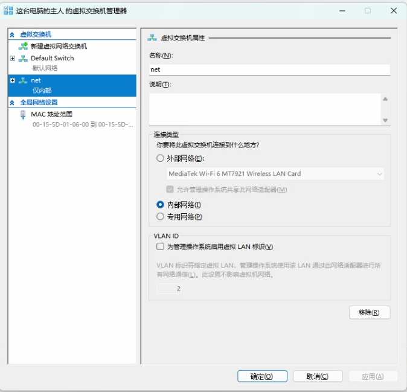
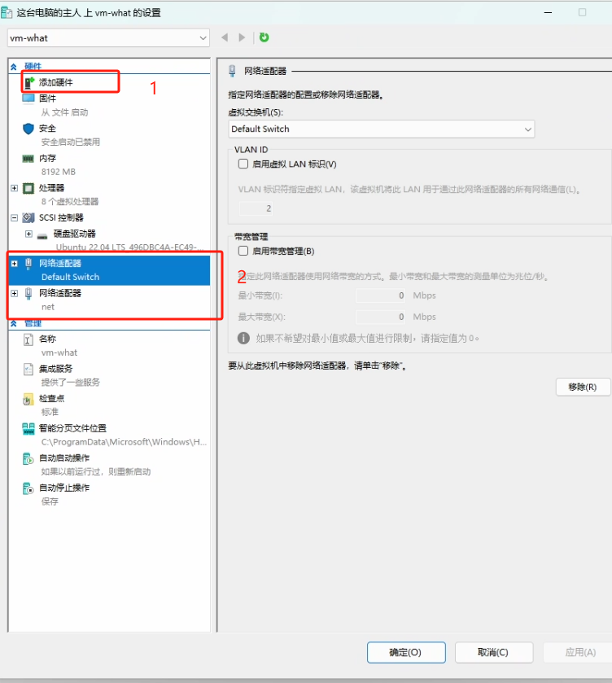
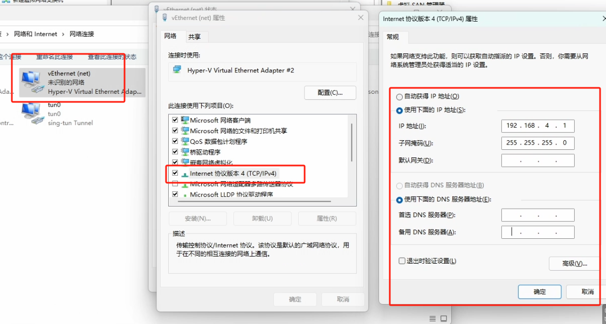
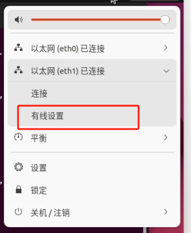
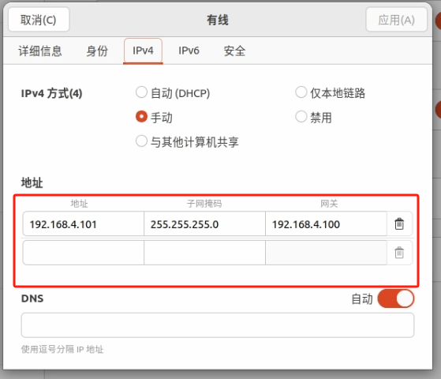
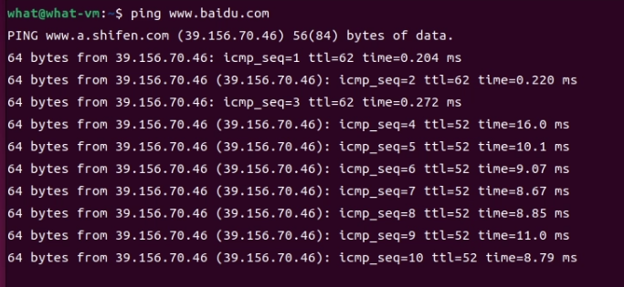
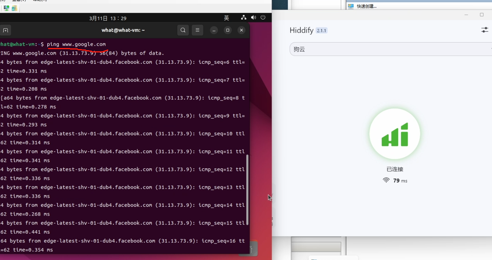
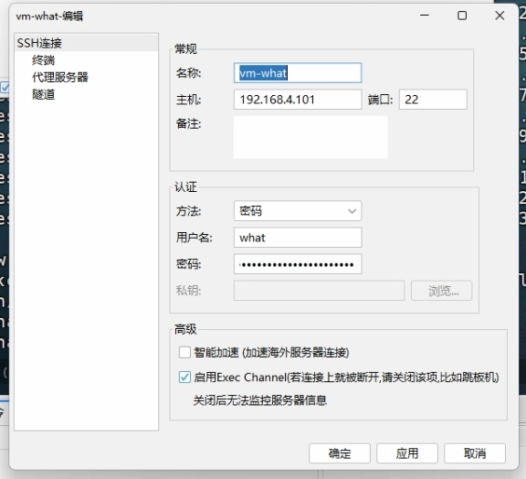

# 要求

1. 能够访问外网
2. 宿主机开启VPN时能够影响到，虚拟机
3. 虚拟机能够固定IP


# 实现


1. `虚拟交换机` 设置如下

    

    1. 首选有一个默认的 `Default Switch`
    2. 然后创建一个内部虚拟机 `net`
    
2. 设置虚拟机的网络适配器

   

   按照顺序设置/添加网络适配器， 
   1. `Default Switch`  
   2. `net`


2. 在主机端设置虚拟网卡 `net` 的IP地址
    `192.168.4.1`
    
3. 在主机端设置 nat
 
    
    ```bash
    New-NetNat -Name HyperVNat -InternalIPInterfaceAddressPrefix 192.168.4.0/24
    ```
    获取当前机器 NAT
    ```bash
    GET-NETNAT
    ```

4. 虚拟机端设置 `静态IP`
    因为我们是按照上面的顺序设置的网络适配器，所以 eth1 对应的是 `net` 适配器
   

   上面的 nat 的网络号为 `192.168.4.0/24` 所以ip按照其进行分配，网关因为上面的虚拟网卡设置的为 `192.168.4.1`，所以网关也设置为 `192.168.4.1`
    
6. 验证-宿主机不使用VPN
   
7. 验证-宿主机使用VPN
   
8. 宿主机连接虚拟机ssh
   


# hyper-v linux 扩展硬盘

1. 在 hyper-v 扩展硬盘
2. 登录vm-linux
   ```bash
   sudo parted /dev/sda
   ```
   输入 print  命令获取当前硬盘信息

   输入 `resizepart 1` 调整分区大小，随后按照提示输入

   最后 输入`quit` 退出

3. ext4 文件系统：使用 resize2fs 命令，使得分区生效
   ```bash
   sudo resize2fs /dev/sda1
   ```
4. XFS 文件系统：使用 xfs_growfs 命令，例如：
   ```bash
   sudo xfs_growfs /dev/sda1
   ```
5. 使用 df -h 或 lsblk 命令查看分区大小是否已成功调整：
   ```bash
    df -h /dev/sda1
    lsblk /dev/sda
   ```