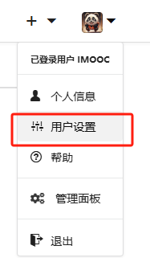
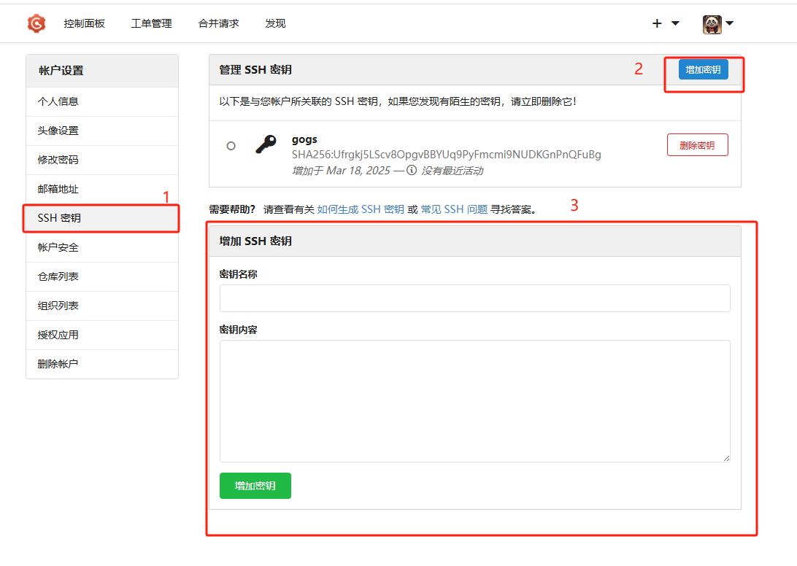
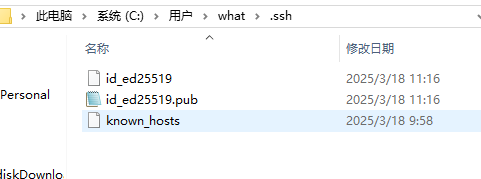
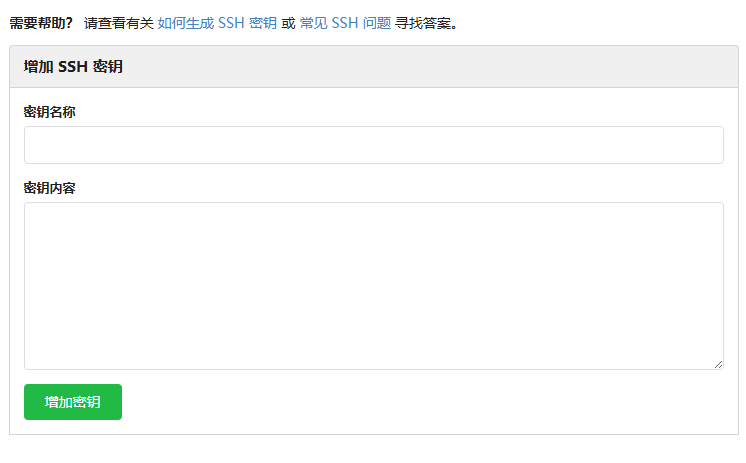

# 官网

https://github.com/gogs/gogs


# 使用docker-compose安装


拉取
```bash
docker pull gogs/gogs
```

简化搭建的流程，课程这里直接采用DockerCompose的方式搭建。docker-compose.yaml如下:
```yaml
version: "3"
volumes:
  gogsdata:
services:
  gogs:
    image: gogs/gogs
    container_name: gogs
    volumes:
      - gogsdata: /data
    restart: always
    ports:
      - "10022:22"
      - "10880:3000"
```

启动 Gogs 
```bash
docker-compose up -d
```
查看启动状态

# 为仓库添加SSH


选择用户设置



添加ssh



生成SSH密钥,打开 `Git Bash`

```bash
what@DESKTOP-I6NTO1D MINGW64 ~/Desktop
# 现在一般推荐使用安全性更高的Ed25519算法生成
$ ssh-keygen -t ed25519 -C "1084716575@qq.com"
# 确认文件保存位置
Generating public/private ed25519 key pair.
Enter file in which to save the key (/c/Users/what/.ssh/id_ed25519):
# 设置密码， 直接按 enter 不设置密码
Enter passphrase (empty for no passphrase):
```
会生成如下文件
- id_ed25519
- id_ed25519.pub


将 id_ed25519.pub 内容设置为SSH密钥即可



# 使用仓库


## 从命令行创建新的仓库
```bash
# 初始化一个新的 Git 仓库
# git init 命令会在当前目录下创建一个新的 .git 子目录，用于存储 Git 仓库的元数据和对象数据库
git init

# 将 README.md 文件添加到 Git 的暂存区
# git add 命令用于将文件的修改添加到暂存区，等待后续的提交操作
# 这里指定了 README.md 文件，意味着将该文件的当前版本添加到暂存区
git add README.md

# 将暂存区的内容提交到本地 Git 仓库
# git commit 命令用于将暂存区的文件修改永久保存到本地仓库的历史记录中
# -m 选项用于指定本次提交的简短描述信息，这里的描述是 "first commit"，表示这是第一次提交
git commit -m "first commit"

# 将本地仓库与远程仓库建立关联
# git remote add 命令用于添加一个远程仓库的引用
# origin 是远程仓库的默认别名，可用于后续操作中方便地引用该远程仓库
# ssh://git@192.168.144.143:10022/imooc/kubeimooc.git 是远程仓库的 SSH 地址，通过 SSH 协议进行连接
git remote add origin ssh://git@192.168.144.143:10022/imooc/kubeimooc.git

# 将本地仓库的 master 分支推送到远程仓库的 master 分支
# git push 命令用于将本地仓库的提交推送到远程仓库
# -u 选项（即 --set-upstream）用于在推送的同时，将本地的 master 分支与远程的 master 分支建立跟踪关系
# 后续再执行 git push 时，如果不指定分支，Git 会默认推送到已跟踪的远程分支
# origin 是之前添加的远程仓库别名，master 是要推送的分支名
git push -u origin **master**
```

## 从命令行推送到仓库
```bash
# 将本地 Git 仓库与指定的远程仓库建立关联
# git remote add 是 Git 命令，用于添加一个远程仓库的引用
# origin 是给远程仓库指定的别名，后续操作中可通过这个别名来引用该远程仓库，这是一个约定俗成的名称，代表默认的远程仓库
# ssh://git@192.168.144.143:10022/imooc/kubeimooc.git 是远程仓库的 SSH 地址
# 这里使用 SSH 协议进行连接，git 是用户名，192.168.144.143 是远程服务器的 IP 地址，10022 是 SSH 服务使用的端口号
# /imooc/kubeimooc.git 是远程仓库在服务器上的路径
git remote add origin ssh://git@192.168.144.143:10022/imooc/kubeimooc.git

# 将本地仓库的 master 分支推送到关联的远程仓库的 master 分支，并建立跟踪关系
# git push 是 Git 命令，用于将本地仓库的提交推送到远程仓库
# -u 选项（完整形式是 --set-upstream）的作用是在推送时，为本地分支和远程分支建立跟踪关系
# 这样在后续操作中，当你执行不带参数的 git push 或 git pull 命令时，Git 就知道默认要操作的远程分支
# origin 是之前添加的远程仓库别名，代表要推送的目标远程仓库
# master 是要推送的本地分支名，同时也是远程仓库对应的分支名
git push -u origin master
```